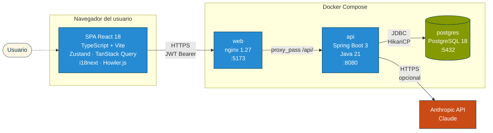
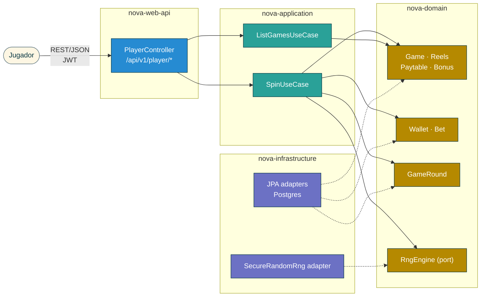
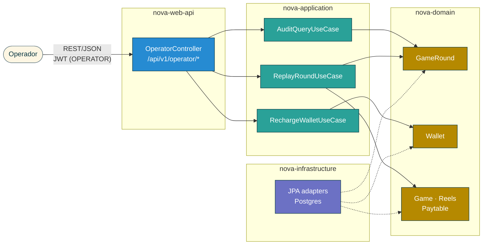
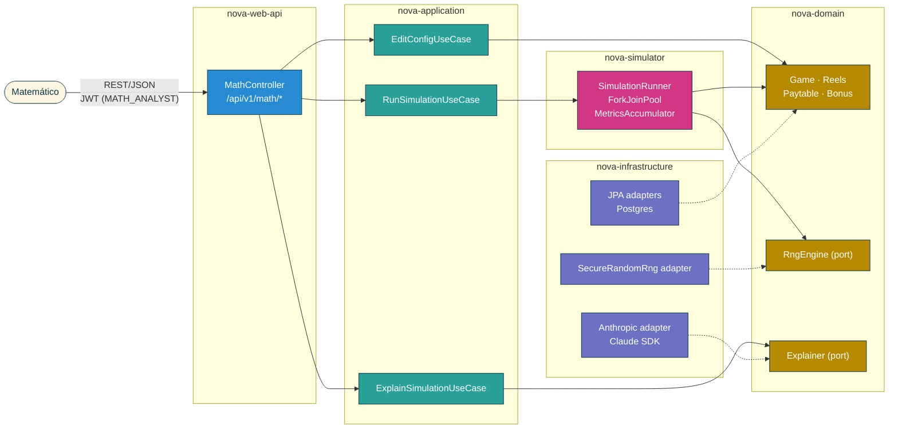
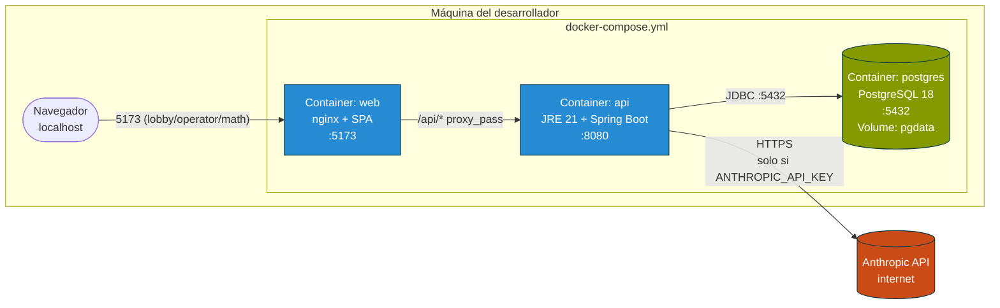
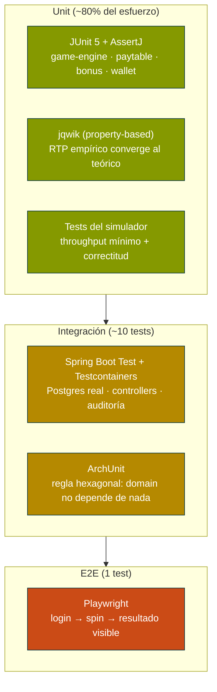
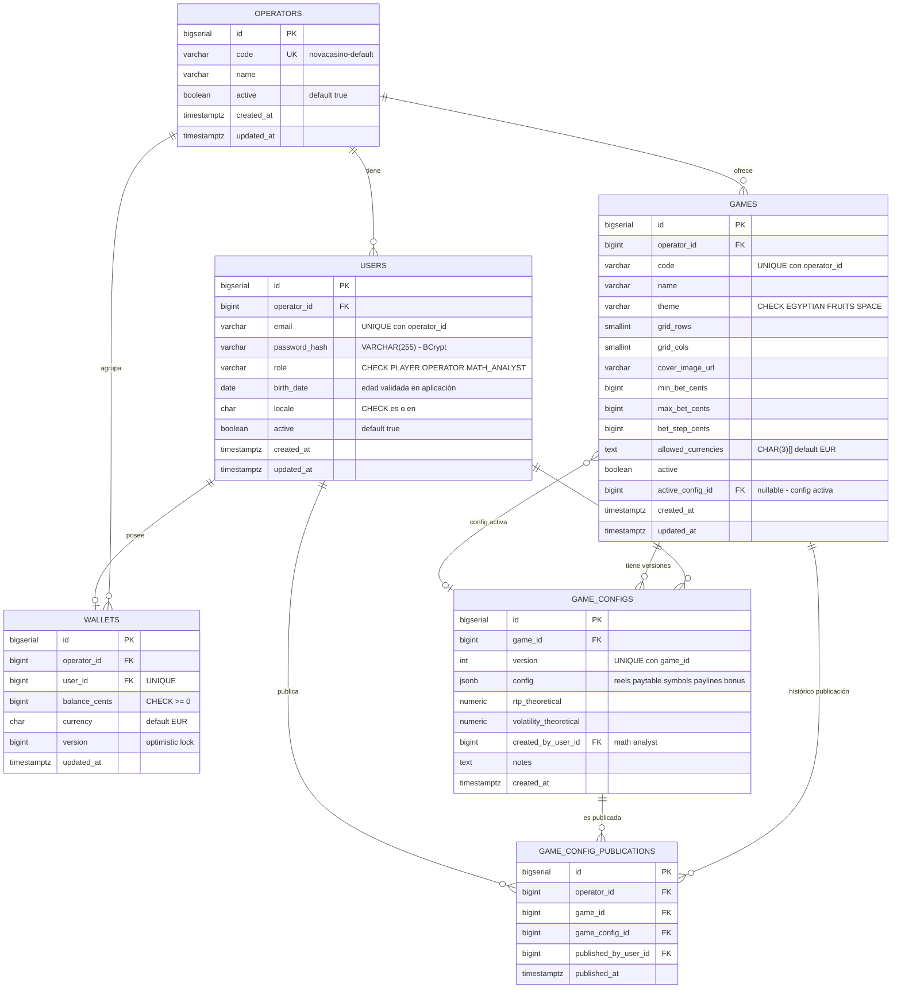
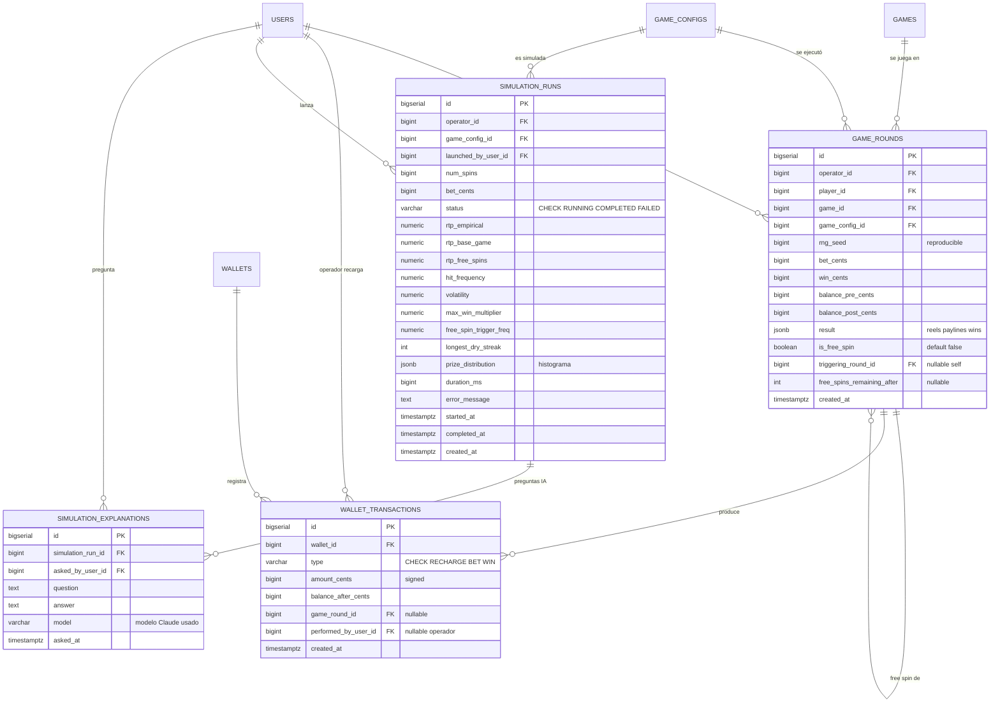

## Índice

0. [Ficha del proyecto](#0-ficha-del-proyecto)
1. [Descripción general del producto](#1-descripción-general-del-producto)
2. [Arquitectura del sistema](#2-arquitectura-del-sistema)
3. [Modelo de datos](#3-modelo-de-datos)
4. [Especificación de la API](#4-especificación-de-la-api)
5. [Historias de usuario](#5-historias-de-usuario)
6. [Tickets de trabajo](#6-tickets-de-trabajo)
7. [Pull requests](#7-pull-requests)

---

## 0. Ficha del proyecto

### **0.1. Tu nombre completo:**

Jordi Poch

### **0.2. Nombre del proyecto:**

**NovaCasino Studio**

### **0.3. Descripción breve del proyecto:**

NovaCasino Studio es una plataforma B2B de slots online compuesta por un cliente de juego para el jugador final (lobby + pantalla de juego), un backoffice operativo para el operador (configuración de juegos, gestión de jugadores y auditoría de partidas) y un backoffice matemático (edición de matemáticas y simulador masivo de hasta 10M de partidas en menos de 10 minutos). Está alineada con la regulación de la DGOJ (Dirección General de Ordenación del Juego, España) desde el primer día y se apoya en un motor de juego *data-driven* y en capacidades de IA (Claude) para asistir al equipo matemático en el análisis de resultados.

El alcance de esta primera versión cubre 3 video slots jugables (dos 5x3 con bonus completo y un 3x3 clásico), saldo virtual ("fun money") gestionado por el operador, registro auditable inmutable de cada giro y *replay* visual determinista de partidas. Quedan **fuera de esta versión** la integración con pasarelas de pago/cobro, los jackpots progresivos y la generación de informes oficiales RFJ para la DGOJ.

### **0.4. URL del proyecto:**

Pendiente de despliegue público. Esta primera fase contempla únicamente ejecución local mediante Docker Compose (ver sección [1.4](#14-instrucciones-de-instalación)). El despliegue en cloud se valorará en fases posteriores.

> Puede ser pública o privada, en cuyo caso deberás compartir los accesos de manera segura. Puedes enviarlos a [alvaro@lidr.co](mailto:alvaro@lidr.co) usando algún servicio como [onetimesecret](https://onetimesecret.com/).

### 0.5. URL o archivo comprimido del repositorio

Repositorio público de GitHub: `https://github.com/<owner>/AI4Devs-finalproject` (sustituir `<owner>` por el usuario/organización propietaria del fork).

> Puedes tenerlo alojado en público o en privado, en cuyo caso deberás compartir los accesos de manera segura. Puedes enviarlos a [alvaro@lidr.co](mailto:alvaro@lidr.co) usando algún servicio como [onetimesecret](https://onetimesecret.com/). También puedes compartir por correo un archivo zip con el contenido


---

## 1. Descripción general del producto

> Describe en detalle los siguientes aspectos del producto:

### Glosario de términos

NovaCasino Studio pertenece al dominio del *gambling*; este glosario fija el significado de los términos usados a lo largo del documento, para lectores (desarrolladores, product managers o asistentes de IA) no familiarizados con el sector.

| Término | Definición |
|---|---|
| **Slot / video slot** | Máquina tragaperras digital: una rejilla de símbolos que giran; el jugador apuesta y gana según las combinaciones resultantes. |
| **Rejilla (*grid*)** | Disposición de celdas visibles, expresada `columnas x filas`. Los juegos del MVP son `5x3` (5 columnas, 3 filas) y `3x3`. |
| **Reel (rodillo) / *reel strip*** | Cada columna de la rejilla. La *reel strip* es la tira ordenada de símbolos de ese rodillo; el motor elige una posición aleatoria de la tira y muestra una ventana de tantos símbolos como filas. La composición de las tiras determina las probabilidades. |
| **Símbolo** | Cada icono que puede aparecer en una celda. Puede ser *regular*, *wild* o *scatter*. |
| **Payline (línea de pago)** | Patrón de celdas (una por columna) sobre el que se evalúan combinaciones ganadoras. Un juego tiene varias paylines. |
| **Paytable (tabla de pagos)** | Tabla que indica cuánto paga cada símbolo según cuántos aparecen alineados en una payline (multiplicador sobre la apuesta). |
| **Wild** | Símbolo comodín: sustituye a símbolos regulares para completar combinaciones. |
| **Scatter** | Símbolo especial que paga o dispara bonus por aparecer en cualquier posición (no necesita estar en una payline). En NovaCasino dispara los *free spins*. |
| **Free spins (giros gratis)** | Bonus de tiradas sin coste para el jugador, disparado por *scatters*. Puede incluir mecánicas extra (multiplicadores, reels especiales). |
| **Base game** | Modo de juego normal, en contraposición a la ronda de *free spins*. |
| **Spin / giro** | Una jugada individual: el jugador apuesta, los reels giran y se evalúa el resultado. |
| **RTP (*Return To Player*)** | Porcentaje de lo apostado que, a largo plazo, el juego devuelve en premios (p. ej. 96 %). |
| **Volatilidad** | Medida de la dispersión de los premios: alta volatilidad = premios grandes pero infrecuentes; baja = premios pequeños y frecuentes. |
| **Hit frequency** | Proporción de spins que resultan en algún premio. |
| **Multiplicador** | Factor que multiplica un premio (p. ej. x2 durante free spins). |
| **RNG (*Random Number Generator*)** | Generador de números aleatorios que decide los resultados. Su calidad es requisito regulatorio. |
| **Seed (semilla)** | Valor que inicializa el RNG. Registrar el seed de cada giro permite reproducirlo de forma determinista (*replay*). |
| **GGR (*Gross Gaming Revenue*)** | Ingreso bruto del operador: total apostado − total pagado en premios. |
| **DGOJ** | Dirección General de Ordenación del Juego — regulador del juego online en España. |
| **RFJ** | Registro/informe oficial de la actividad de juego que la DGOJ exige a los operadores. Fuera del alcance de esta versión. |

### **1.1. Objetivo:**

**Propósito.** NovaCasino Studio es una plataforma de slots online concebida como un *game studio* B2B: cubre toda la cadena de valor desde la creación matemática del juego hasta su consumo por el jugador final, con foco en el rigor matemático, la trazabilidad regulatoria y el time-to-market.

**Problema que resuelve.** Los estudios pequeños y medianos que diseñan juegos de slots se enfrentan a tres dolores recurrentes:

1. **Coste y lentitud del ciclo matemático**: simular millones de partidas para validar RTP, volatilidad y *hit frequency* requiere herramientas pesadas y poco interactivas. El equipo matemático pierde días iterando.
2. **Trazabilidad para regulación y soporte**: cuando un jugador reclama un giro, los operadores rara vez pueden reproducir la partida exacta. Las certificaciones (DGOJ, MGA, UKGC) exigen registros auditables y RNG demostrablemente justo.
3. **Acoplamiento entre matemática, motor y presentación**: cada juego nuevo se desarrolla casi desde cero, lo que multiplica el coste por título.

**Valor diferencial.** NovaCasino Studio aborda estos tres dolores con cuatro pilares:

- **Motor de juego *data-driven***. Un único *Slot Engine* en Java parametrizado por JSON. Añadir un juego nuevo es una operación de configuración, no de programación.
- **Simulador masivo de alto rendimiento**: 10 millones de partidas en menos de 10 minutos sobre el mismo motor de producción (no un modelo paralelo), garantizando que lo simulado es lo que se juega.
- **Auditoría inmutable + *replay* determinista**: cada giro se registra con su *seed* RNG, apuesta, balance pre/post y resultado. El operador puede reproducir visualmente la partida exacta para resolver conflictos en segundos.
- **AI-powered explainability**: el matemático pregunta en lenguaje natural sobre los resultados de una simulación ("¿por qué la volatilidad sube en el slot espacial?") y un asistente basado en Claude (Anthropic) interpreta los datos y responde.

**A quién sirve.** Tres perfiles principales, cada uno con su superficie:

| Perfil | Necesidad principal | Superficie en NovaCasino |
|---|---|---|
| **Jugador final** | Experiencia de juego entretenida, fluida y de confianza | Lobby web + pantalla de juego con audio inmersivo, i18n ES/EN, mensajes de juego responsable |
| **Operador** | Configurar juegos, gestionar jugadores y resolver incidencias | Backoffice operativo: configuración (monedas, apuestas), gestión de jugadores y saldo virtual, auditoría con *replay* |
| **Equipo matemático** | Diseñar y validar la matemática de cada juego | Backoffice matemático: editor de paytables/reels, simulador masivo, dashboards de métricas y asistente IA |

**Cumplimiento DGOJ desde el día 0.** Aunque esta versión no genera informes RFJ ni gestiona pagos reales, todas las decisiones arquitectónicas se han tomado para no bloquear una futura certificación: registro inmutable, *seeds* reproducibles, separación motor/RNG, verificación de mayoría de edad en el registro y sello DGOJ visible.

---

### **1.2. Características y funcionalidades principales:**

#### A. Cliente del jugador (web)

| # | Funcionalidad | Descripción |
|---|---|---|
| A1 | **Registro y login** | Registro por email + password aportando la fecha de nacimiento; la mayoría de edad (≥18) se valida **en el registro** (cumplimiento DGOJ). El login posterior es por email + password. |
| A2 | **Lobby de juegos** | Muestra el catálogo con la carátula de cada juego (3 juegos en MVP). Click → pantalla del juego. |
| A3 | **Pantalla de juego (Slot Game)** | Único componente React `<SlotGame>` data-driven. Renderiza cualquier juego según JSON: rejilla, símbolos, líneas de pago, animaciones de giro y de premio. |
| A4 | **Apuesta configurable** | Selector de moneda y cuantía de apuesta dentro del rango definido por el operador para cada juego. |
| A5 | **Auto-spin con *safeguards*** | Permite N giros automáticos. Se detiene si el saldo cae por debajo de un umbral o tras un número máximo de giros, mostrando un mensaje de pausa (alineado con el espíritu DGOJ). |
| A6 | **Free Spins (5x3)** | Trigger por *Scatter* (≥3). Otorga N giros gratis con mecánica adicional (multiplicadores o reels especiales según cada juego). La ronda completa de free spins se computa y persiste de forma **atómica** junto al spin que la dispara (ver nota en 3.2.8); el cliente la reproduce visualmente giro a giro. No hay estado de sesión intermedio: si el jugador refresca, la ronda ya está resuelta y en su historial. |
| A7 | **Wallet virtual persistente** | Saldo en *fun money* almacenado por jugador. Recargado por el operador desde su backoffice. Histórico de movimientos. |
| A8 | **Audio inmersivo** | Música ambiente por temática (egipcia, frutas clásico, espacial), SFX comunes (spin, win, big win, free spin trigger) y voz de locutor en eventos especiales. Mute toggle persistente. |
| A9 | **Internacionalización ES/EN** | Toda la UI (incluida la voz del locutor) disponible en castellano e inglés con cambio en caliente. |
| A10 | **Mensajes de juego responsable y sello DGOJ** | Banner permanente con el sello DGOJ, enlace a "juego responsable" y avisos contextuales. |

#### B. Backoffice operativo (operador)

| # | Funcionalidad | Descripción |
|---|---|---|
| B1 | **Gestión de jugadores** | Listado, búsqueda, alta/baja, recarga manual del saldo virtual. |
| B2 | **Configuración de juegos** | Para cada juego: monedas habilitadas, apuestas mínima/máxima, escalones de apuesta, estado activo/inactivo. |
| B3 | **Auditoría de partidas** | Listado paginado y filtrable de todos los giros: jugador, juego, *seed*, apuesta, balance pre/post, resultado, timestamp. |
| B4 | **Replay visual determinista** | A partir de cualquier giro auditado, el operador reproduce la animación exacta del giro en una pantalla idéntica a la del jugador. *Killer feature* para resolver disputas y demostrar transparencia ante la DGOJ. |
| B5 | **Dashboard de actividad** | Métricas básicas en tiempo real: jugadores activos, GGR (saldo apostado − saldo ganado), juegos más jugados. |

#### C. Backoffice matemático

| # | Funcionalidad | Descripción |
|---|---|---|
| C1 | **Editor de matemáticas** | Edición de la configuración JSON de cada juego: símbolos y sus pesos por reel, paytable (combinaciones y multiplicadores), líneas de pago, reglas de bonus (free spins, wilds, scatters). |
| C2 | **Simulador masivo** | Ejecuta hasta **10M de partidas en <10 min** sobre el mismo motor que producción. Configurable: nº de spins (hasta 10M) y apuesta fija. |
| C3 | **Dashboard de métricas de simulación** | RTP empírico (global, base game, free spins), *hit frequency*, volatilidad (desv. estándar), distribución de premios (histograma), max win, frecuencia de trigger de free spins, racha más larga sin premio. |
| C4 | **AI-powered explainability** | Caja de texto donde el matemático pregunta en lenguaje natural ("¿por qué la volatilidad de Espacial es 12.4 cuando esperábamos 10?"). El backend envía las métricas a Claude (Anthropic API) y devuelve una explicación interpretable. |
| C5 | **Validación previa al despliegue** | El sistema compara el RTP empírico de la simulación con el `rtp_theoretical` de la versión y avisa si la desviación supera un umbral configurable (parámetro de aplicación, p. ej. ±0,5 %) o si hay otros indicadores anómalos. |

#### D. Plataforma y compliance (transversal)

| # | Funcionalidad | Descripción |
|---|---|---|
| D1 | **Motor de juego *data-driven*** | Único en Java, parametrizado por JSON. 3 juegos = 3 ficheros de configuración + 3 packs de assets. |
| D2 | **RNG certificable** | RNG criptográficamente fuerte (`SecureRandom`), aislado en módulo propio, con *seeds* reproducibles y documentación matemática para futura certificación. |
| D3 | **Registro auditable inmutable** | Tabla `game_rounds` con todos los datos del giro. Inserción *append-only*, sin update/delete por contrato y por *trigger* en BBDD. |
| D4 | **Roles y permisos** | `PLAYER`, `OPERATOR`, `MATH_ANALYST`. Cada rol accede solo a su superficie. JWT en headers. |
| D5 | **Despliegue local con Docker Compose** | Un comando arranca toda la stack. |

#### E. Alcance fuera de esta versión

- Pasarelas de pago/cobro (saldo virtual ≠ saldo real).
- Jackpots progresivos.
- Generación automática de informes RFJ para la DGOJ (la arquitectura los soporta a futuro).
- Accesibilidad WCAG 2.1 AA completa.
- Límites de pérdida y autoexclusión completos (preparados pero no implementados).
- Despliegue cloud público.

---

### **1.3. Diseño y experiencia de usuario:**

En esta primera fase no se entregan mockups gráficos ni vídeo (se generarán en la siguiente fase del proyecto, junto con los assets temáticos). A continuación se describen los **flujos de usuario principales** y se incluyen *wireframes* ASCII de las pantallas core para fijar la intención de diseño.

#### Flujo 1 — Jugador: del lobby al free spin

1. Jugador entra en `/`. Si no está autenticado, se le redirige a `/login`; si aún no tiene cuenta, se registra aportando su fecha de nacimiento, momento en que se valida la mayoría de edad (≥18).
2. Tras login, aterriza en el lobby con las carátulas de los 3 juegos y su saldo virtual visible.
3. Click en una carátula → pantalla de juego con la rejilla, controles de apuesta, botón *Spin* y botón *Auto-spin*.
4. Pulsa *Spin*: animación de giro, evaluación de líneas, animación de premio si lo hay, actualización de balance.
5. Si caen 3+ scatters: cinemática de "¡Free Spins!" (con voz de locutor) y entra en modo bonus.
6. Al salir del juego, el saldo y el historial quedan persistidos para la próxima sesión.

#### Flujo 2 — Operador: resolver una reclamación

1. Operador entra en `/operator` con su rol. Va a "Auditoría".
2. Filtra por jugador, juego y rango de fechas. Localiza el giro reclamado.
3. Pulsa "Replay". Se abre una pantalla idéntica a la del jugador y se ejecuta el giro exacto (mismo *seed*, mismas reels, mismo resultado).
4. Comparte el enlace de *replay* con el jugador como prueba.

#### Flujo 3 — Matemático: ajustar el RTP de un juego

1. Matemático entra en `/math`. Selecciona el juego "Espacial".
2. Edita el peso de un símbolo en la pestaña "Reels". Guarda.
3. Lanza una simulación de 10M de spins. Espera <10 min.
4. Revisa el dashboard: el RTP cae al 95.2 %, la volatilidad sube. Pregunta a la IA: "¿por qué sube la volatilidad?". La IA explica el cambio en la distribución de premios.
5. Itera ajustes hasta alcanzar el RTP/volatilidad objetivo.

#### Wireframes ASCII

```
LOBBY
┌────────────────────────────────────────────────────────────┐
│ NovaCasino Studio              [ES|EN]  Saldo: 1.000 €  ▼ │
├────────────────────────────────────────────────────────────┤
│                                                            │
│   ┌──────────┐    ┌──────────┐    ┌──────────┐             │
│   │ EGIPCIO  │    │ FRUTAS   │    │ ESPACIAL │             │
│   │  (5x3)   │    │  (3x3)   │    │  (5x3)   │             │
│   └──────────┘    └──────────┘    └──────────┘             │
│                                                            │
│  Sello DGOJ │ Juego responsable │ +18                      │
└────────────────────────────────────────────────────────────┘

PANTALLA DE JUEGO
┌────────────────────────────────────────────────────────────┐
│ ← Lobby           ESPACIAL          Saldo: 985 €  🔊       │
├────────────────────────────────────────────────────────────┤
│                                                            │
│  ┌───┬───┬───┬───┬───┐                                     │
│  │ ★ │ ☄ │ ☄ │ 🪐│ A │                                     │
│  ├───┼───┼───┼───┼───┤                                     │
│  │ K │ ★ │ A │ ☄ │ ★ │   GANANCIA: 7,50 €                  │
│  ├───┼───┼───┼───┼───┤                                     │
│  │ ☄ │ K │ 🪐│ A │ K │                                     │
│  └───┴───┴───┴───┴───┘                                     │
│                                                            │
│  Apuesta: [- 1,00 € +]   [SPIN]   [AUTO-SPIN]              │
└────────────────────────────────────────────────────────────┘

BACKOFFICE OPERADOR — AUDITORÍA + REPLAY
┌────────────────────────────────────────────────────────────┐
│ /operator                                  Operador: Ana ▼ │
├────────────────────────────────────────────────────────────┤
│  Filtros: Jugador [   ] Juego [▼] Fecha [   ]  [Buscar]    │
│                                                            │
│  Round │ Jugador │ Juego  │ Apuesta │ Premio │ [Replay]    │
│  ──────┼─────────┼────────┼─────────┼────────┼─────────    │
│  R-201 │ user42  │ Egip.  │ 1,00 €  │ 4,50 € │ [▶ Replay]  │
│  R-202 │ user07  │ Esp.   │ 0,50 €  │ 0,00 € │ [▶ Replay]  │
└────────────────────────────────────────────────────────────┘

BACKOFFICE MATEMÁTICO — SIMULADOR + IA
┌────────────────────────────────────────────────────────────┐
│ /math                                  Matemático: Luis ▼  │
├────────────────────────────────────────────────────────────┤
│  Juego: ESPACIAL ▼     [Editar matemática]                 │
│                                                            │
│  Spins: [10.000.000]    Apuesta: [1,00 €]   [SIMULAR]      │
│                                                            │
│  Resultados:                                               │
│   • RTP global:  95,21 %       • Volatilidad: 12,4         │
│   • Hit freq:    24,7 %        • Max win:    1.250x        │
│   • RTP base game: 76,8 %      • RTP free spins: 18,4 %    │
│                                                            │
│  Pregunta a la IA:                                         │
│   ┌──────────────────────────────────────────────┐         │
│   │ ¿Por qué la volatilidad sube respecto a la   │         │
│   │ versión anterior?                            │         │
│   └──────────────────────────────────────────────┘         │
│   [Preguntar]                                              │
└────────────────────────────────────────────────────────────┘
```

---

### **1.4. Instrucciones de instalación:**

> Las instrucciones definitivas se publicarán en la fase de implementación. A continuación se documenta el procedimiento previsto, alineado con la arquitectura aprobada en este PRD.

#### Requisitos previos

- Docker Desktop 4.x o Docker Engine + Docker Compose v2
- Git
- Una API key de Anthropic (variable `ANTHROPIC_API_KEY`) para la funcionalidad de *AI explainability* en el backoffice matemático. Sin ella, el resto de la plataforma funciona; solo se desactiva esa feature.

#### Pasos de instalación local

```bash
# 1. Clonar el repositorio
git clone https://github.com/<owner>/AI4Devs-finalproject.git
cd AI4Devs-finalproject

# 2. Copiar la plantilla de variables de entorno y editarla
cp .env.example .env
# Editar .env y poner ANTHROPIC_API_KEY=sk-ant-...

# 3. Levantar todos los servicios (backend + frontend + Postgres)
docker compose up --build

# 4. (Primera vez) Las migraciones Flyway y las semillas se ejecutan
#    automáticamente al arrancar el backend.
```

#### URLs locales

| Superficie | URL |
|---|---|
| Lobby del jugador | `http://localhost:5173/` |
| Login del jugador | `http://localhost:5173/login` |
| Backoffice operador | `http://localhost:5173/operator` |
| Backoffice matemático | `http://localhost:5173/math` |
| API REST | `http://localhost:8080/api/v1` |
| OpenAPI / Swagger UI | `http://localhost:8080/swagger-ui.html` |
| Base de datos PostgreSQL | `localhost:5432` (`novacasino` / `novacasino`) |

#### Datos de semilla (auto-creados al primer arranque)

- 3 juegos preconfigurados: Egipcio (5x3), Frutas (3x3), Espacial (5x3).
- 1 usuario `OPERATOR` (`operator@nova.test` / `operator123`).
- 1 usuario `MATH_ANALYST` (`math@nova.test` / `math123`).
- 3 usuarios `PLAYER` (`player1@nova.test`, `player2@nova.test`, `player3@nova.test` / `player123`) cada uno con 1.000 € de saldo virtual.

#### Parar y resetear

```bash
docker compose down              # Para los servicios
docker compose down -v           # Para y borra los volúmenes (resetea la BBDD)
```

---

## 2. Arquitectura del Sistema

### **2.1. Diagrama de arquitectura:**

NovaCasino Studio sigue una **arquitectura hexagonal (ports & adapters) con DDD ligero**, empaquetada como **monolito modular Maven multi-módulo**. La elección responde directamente a las restricciones del proyecto: 30-40 h de implementación con un solo desarrollador asistido por IA, requisitos de certificación regulatoria (DGOJ), y la necesidad de aislar el motor matemático del framework para que sea auditable.

#### 2.1.1 Diagrama de contexto (C4 nivel 1)

Muestra los actores externos y los sistemas con los que NovaCasino Studio se relaciona.


#### 2.1.2 Diagrama de contenedores (C4 nivel 2)

Detalla los procesos desplegables que componen el sistema.



#### 2.1.3 Diagramas de componentes (C4 nivel 3) — Backend

Para mantener la legibilidad se divide el flujo del backend en tres diagramas, uno por actor del sistema. Cada uno muestra solo los componentes implicados en sus casos de uso. Los `subgraph` representan módulos Maven; las flechas continuas son dependencias en el sentido del código y las flechas discontinuas indican que un adapter implementa un puerto del dominio (regla hexagonal).

##### 2.1.3.1 Flujo del Jugador



##### 2.1.3.2 Flujo del Operador



##### 2.1.3.3 Flujo del Matemático



#### 2.1.4 Patrones aplicados y por qué

| Patrón | Dónde | Por qué |
|---|---|---|
| **Hexagonal / Ports & Adapters** | Estructura global | Aísla el motor matemático del framework: certificable y portable. La JVM puede embeberlo sin Spring para auditorías externas. |
| **DDD ligero** | Módulo `nova-domain` | Conceptos de gambling (Round, Wallet, Bet, Paytable) modelados como agregados con invariantes propias. Reduce bugs de negocio. |
| **Strategy** | `BonusFeature` (FreeSpins, Wild, Scatter) | Cada feature es intercambiable y composable; añadir un nuevo bonus es una clase nueva, no un `if`. |
| **Builder** | `GameConfigBuilder` | Construcción inmutable de configs a partir de JSON, validando invariantes (ej. paytable consistente con símbolos declarados). |
| **Command + Event** | Spin = Command; `RoundCompleted` = evento que dispara la persistencia auditable | Desacopla la lógica de juego del *side effect* de auditar. Facilita el simulador (mismo Command, sin el listener de auditoría). |
| **Repository** | Acceso a datos | Estándar DDD; en hexagonal es el "puerto" del dominio. |
| **Adapter** | Integraciones externas (Postgres, Anthropic) | Permite cambiar la BBDD o el LLM sin tocar dominio ni casos de uso. |
| **Map-Reduce con ForkJoinPool** | Simulador | Distribuye los 10M de spins entre cores y agrega métricas con `LongAdder` (lock-free). Necesario para 10M/<10 min. |

#### 2.1.5 Beneficios y sacrificios

**Beneficios**
- **Aislamiento del motor matemático**: certificable, fácil de testear, reusable por el simulador.
- **Productividad**: monolito = un único `mvn package`, un único `docker compose up`. Crítico con 30-40 h.
- **Refactor a microservicios trivial**: si el simulador sufre, basta con extraer `nova-simulator` a un proceso aparte. Las fronteras ya están establecidas.
- **Auditabilidad**: el registro append-only en `game_rounds` con trigger BBDD anti-UPDATE/DELETE permite demostrar a la DGOJ que el log es inmutable. La arquitectura está preparada para incorporar firma externa y *hash-chain* en fases posteriores sin tocar dominio.

**Sacrificios**
- **Escalado horizontal acoplado**: no se puede escalar el simulador sin escalar la API. Aceptable en MVP single-tenant.
- **Curva inicial mayor que un monolito layered**: hay que entender hexagonal para no acoplar. Mitigado por la estructura Maven (las fronteras son físicas, no convencionales).
- **PostgreSQL como SPOF en runtime**: aceptable para MVP local; en producción se mitigaría con réplica/HA en otra fase.

---

### **2.2. Descripción de componentes principales:**

#### 2.2.1 Backend — módulos Maven

| Módulo | Tecnología | Responsabilidad |
|---|---|---|
| **nova-domain** | Java 21 puro (sin Spring) | Núcleo de negocio: `Game`, `Round`, `Reels`, `Paytable`, `Symbol`, `Payline`, `BonusFeature`, `Wallet`, `Money`, `Bet`, `RngEngine` (puerto), `GameRound`. Cero dependencias externas más allá de la JDK. |
| **nova-application** | Java 21 + `jakarta.transaction` | Casos de uso (`SpinUseCase`, `ReplayRoundUseCase`, `RechargeWalletUseCase`, `RunSimulationUseCase`, `ExplainSimulationUseCase`…). Orquesta dominio + puertos. |
| **nova-infrastructure** | Spring Data JPA · Flyway · Anthropic SDK · BCrypt | Adaptadores: repositorios JPA, migraciones, cliente Anthropic, implementación `SecureRandom` del RNG. |
| **nova-simulator** | Java 21 + `ForkJoinPool` + `LongAdder` | Ejecuta `SpinUseCase` sin auditoría ni BBDD. Agrega métricas en memoria. Devuelve `SimulationResult`. |
| **nova-web-api** | Spring Boot 3 · Spring Security 6 · springdoc-openapi | Punto de entrada HTTP. Controllers por perfil (`/api/v1/player/*`, `/api/v1/operator/*`, `/api/v1/math/*`). Filtro JWT, CORS, manejo de errores i18n. |
| **nova-common** | — | DTOs compartidos, utilidades, constantes. |

#### 2.2.2 Frontend — workspaces

| Workspace / superficie | Tecnología | Responsabilidad |
|---|---|---|
| **`frontend/` (SPA única, rutas)** | React 18 · TypeScript · Vite | App SPA con 3 superficies por ruta: `/` (jugador), `/operator/*`, `/math/*`. |
| **State global** | Zustand | Sesión, wallet, idioma, mute audio. |
| **Server state** | TanStack Query | Cache, retry, invalidación de llamadas a la API. |
| **i18n** | i18next + react-i18next | Bundles `es` y `en`, con namespaces por superficie. |
| **Audio** | Howler.js | Música ambiente por temática + SFX + voz locutor. |
| **Componentes de juego** | `<SlotGame config>` (data-driven) | Renderiza cualquier juego según el JSON descargado del backend. |
| **Routing y auth** | React Router 6 · interceptor Axios para JWT | Refresh transparente del token. |

#### 2.2.3 Base de datos

PostgreSQL 18, esquema único `novacasino`. Migraciones gestionadas con Flyway. Configuraciones de juego (`game_configs.config`) y resultados de giro (`game_rounds.result`) almacenados como `JSONB` con índices GIN para queries por símbolo o feature. El detalle del modelo está en el punto 3.

#### 2.2.4 Servicios externos

- **Anthropic API (Claude)**. Único servicio externo en runtime. Lo invoca `nova-infrastructure` desde el caso de uso `ExplainSimulationUseCase`. Si falta `ANTHROPIC_API_KEY`, la feature se desactiva con `@ConditionalOnProperty` y el resto de la plataforma funciona normalmente.

---

### **2.3. Descripción de alto nivel del proyecto y estructura de ficheros**

El repositorio sigue un *monorepo* con dos raíces lógicas: `backend/` (Maven multi-módulo) y `frontend/` (npm workspace).

```text
AI4Devs-finalproject/
├── docker-compose.yml             # Orquestación local: api + web + postgres
├── .env.example                   # Variables de entorno (ANTHROPIC_API_KEY, JWT_SECRET, DB_*)
├── readme.md                      # Este documento
├── conversation.md                # Log numerado de prompts del proyecto
├── prompts.md                     # Prompts más relevantes por sección del readme
│
├── backend/
│   ├── pom.xml                    # POM padre (Spring Boot 3, Java 21)
│   ├── nova-domain/               # Núcleo puro DDD — sin Spring, sin JPA
│   │   ├── src/main/java/com/novacasino/domain/
│   │   │   ├── game/              # Game, Reels, Paytable, Symbol, Payline
│   │   │   ├── bonus/             # BonusFeature (Strategy), FreeSpins, Wild, Scatter
│   │   │   ├── wallet/            # Wallet, Money, Bet
│   │   │   ├── audit/             # GameRound
│   │   │   └── rng/               # RngEngine (port)
│   │   └── src/test/java/         # Unit tests (Surefire)
│   ├── nova-application/          # Casos de uso
│   │   ├── src/main/java/com/novacasino/application/
│   │   │   ├── player/            # SpinUseCase, ListGamesUseCase
│   │   │   ├── operator/          # AuditQueryUseCase, ReplayRoundUseCase, RechargeWalletUseCase
│   │   │   └── math/              # EditConfigUseCase, RunSimulationUseCase, ExplainSimulationUseCase
│   │   └── src/test/java/         # Unit tests (Surefire)
│   ├── nova-infrastructure/       # Adaptadores
│   │   ├── src/main/java/com/novacasino/infrastructure/
│   │   │   ├── persistence/       # @Repository JPA, mappers, migrations
│   │   │   ├── rng/               # SecureRandomRngAdapter
│   │   │   └── anthropic/         # AnthropicExplainerAdapter (Claude)
│   │   ├── src/test/java/         # Unit tests (Surefire)
│   │   ├── src/it/java/           # Integration tests (Failsafe + Testcontainers)
│   │   └── src/it/resources/      # Fixtures, application-it.yml
│   ├── nova-simulator/            # Map-reduce simulator
│   │   ├── src/main/java/com/novacasino/simulator/
│   │   │   ├── SimulationRunner.java
│   │   │   └── MetricsAccumulator.java
│   │   └── src/test/java/         # Unit + property-based (jqwik)
│   ├── nova-web-api/              # Spring Boot app — punto de arranque
│   │   ├── src/main/
│   │   │   ├── java/com/novacasino/api/
│   │   │   │   ├── NovaCasinoApplication.java
│   │   │   │   ├── controller/    # PlayerController, OperatorController, MathController, AuthController
│   │   │   │   ├── security/      # JwtFilter, JwtService, SecurityConfig
│   │   │   │   └── config/        # OpenApiConfig, I18nConfig, CorsConfig
│   │   │   └── resources/
│   │   │       ├── application.yml
│   │   │       ├── db/migration/  # Flyway: V1__schema.sql, V2__immutability_triggers.sql, V3__seed.sql
│   │   │       └── games/         # JSON de configuración de los 3 juegos (semilla)
│   │   ├── src/test/java/         # Unit tests de controllers (MockMvc + Surefire)
│   │   ├── src/it/java/           # E2E API tests (Failsafe + Testcontainers + Playwright)
│   │   └── src/it/resources/
│   ├── nova-common/
│   └── Dockerfile                 # Multi-stage: maven build + JRE 21 slim
│
└── frontend/
    ├── package.json
    ├── vite.config.ts
    ├── Dockerfile                 # Multi-stage: pnpm build + nginx alpine
    ├── public/
    │   └── assets/                # Assets temáticos (símbolos, fondos, audio)
    │       ├── egyptian/
    │       ├── fruits/
    │       └── space/
    └── src/
        ├── main.tsx
        ├── App.tsx                # Router + providers (i18n, query, auth)
        ├── shared/                # Componentes UI, hooks, axios client, audio service
        ├── i18n/                  # es.json, en.json
        ├── player/                # Lobby, SlotGame (data-driven), Wallet, Login
        ├── operator/              # Players, GameConfig, Audit, Replay
        └── math/                  # MathEditor, Simulator, MetricsDashboard, Explainer
```

**Convenciones clave**:

- **Regla de dependencia hexagonal**: `domain` no depende de nadie. `application` depende de `domain`. `infrastructure` y `web-api` dependen de `application` y `domain`. **Nunca** al revés. `nova-common` (utilidades y constantes sin lógica de negocio, sin dependencias de terceros) es la única excepción: puede ser usado por cualquier módulo. La regla se enforza con [ArchUnit](https://www.archunit.org/) en los tests.
- **Frontend por carpetas verticales** (no por tipo de fichero): cada superficie (`player/`, `operator/`, `math/`) contiene sus pages, components, hooks y stores juntos. Reduce navegación.
- **JSON de juegos como semilla**: las configuraciones se persisten en BBDD pero se versionan como ficheros en `nova-web-api/src/main/resources/games/` para rebuild reproducible.

---

### **2.4. Infraestructura y despliegue**

#### 2.4.1 Topología local con Docker Compose



**Servicios** (`docker-compose.yml`):

| Servicio | Imagen base | Puerto host | Notas |
|---|---|---|---|
| `web` | `nginx:1.27-alpine` (build multi-stage de Vite) | 5173 → 80 | Sirve estáticos y hace `proxy_pass` de `/api/` a `api:8080`. |
| `api` | `eclipse-temurin:21-jre-alpine` (multi-stage Maven) | 8080 → 8080 | Spring Boot. `depends_on: postgres healthcheck`. |
| `postgres` | `postgres:18-alpine` | 5432 → 5432 | Volumen `pgdata` para persistencia. Healthcheck `pg_isready`. |

#### 2.4.2 Proceso de despliegue


**Pipeline CI (GitHub Actions, fichero `.github/workflows/ci.yml`)**:

1. *Checkout* + setup JDK 21 + setup Node 20.
2. `mvn -B verify` — compila, corre tests unitarios e integration con Testcontainers, ArchUnit y property-based.
3. `pnpm install && pnpm test && pnpm build` en frontend.
4. *Cache* de dependencias Maven y pnpm para acelerar.
5. Publica reportes de cobertura (Jacoco) como artefactos.

**Despliegue cloud**: queda explícitamente fuera del MVP. La arquitectura está preparada para Render / Railway / Fly.io publicando las imágenes Docker, pero no se entrega en esta fase.

---

### **2.5. Seguridad**

Las prácticas se agrupan en cuatro bloques: autenticación, integridad de datos, defensa en profundidad y específicas de gambling.

#### 2.5.1 Autenticación y autorización

- **JWT Bearer tokens** firmados con HS256, secret en `JWT_SECRET` (variable de entorno, nunca en código).
- **Spring Security 6** con `SecurityFilterChain` declarativo. Endpoints protegidos por `@PreAuthorize("hasRole('OPERATOR')")` etc.
- **Roles**: `PLAYER`, `OPERATOR`, `MATH_ANALYST`. Cada controller solo acepta su rol.
- **Passwords**: hash con BCrypt (cost 12). Nunca se almacenan en claro ni se loguean.
- **Verificación de edad ≥18** obligatoria en el registro: se valida en el caso de uso de registro (capa de aplicación) a partir de `birth_date`. **No** se usa un `CHECK` en BBDD porque una expresión dependiente de la fecha actual no es inmutable y se re-evaluaría de forma inconsistente en un `restore` (ver justificación en 3.2.2).
- **Access tokens** con TTL de 1 h. En el MVP, al expirar el token el usuario vuelve a autenticarse. El endpoint `POST /auth/refresh` y la renovación silenciosa por interceptor en el cliente quedan **post-MVP** (ver 4.2).

#### 2.5.2 Inmutabilidad de la auditoría

Las tablas histórico-regulatorias (`game_rounds`, `wallet_transactions`, `game_configs`, `game_config_publications`) son *append-only*. La inmutabilidad se garantiza a dos niveles, siendo el segundo el realmente vinculante:

1. **Por contrato**: ningún caso de uso del módulo `nova-application` expone una operación que modifique o borre filas de esas tablas.
2. **Por la base de datos**: una función PL/pgSQL compartida `fn_forbid_update_delete()` y un trigger `BEFORE UPDATE OR DELETE` en cada una de esas tablas que **lanza excepción siempre**. Cualquier UPDATE o DELETE — incluso ejecutado a mano por un DBA descuidado — falla. Migración Flyway: `V2__immutability_triggers.sql`. El detalle se documenta en el punto 3.2.11.

> **Nota sobre tamper-evidence (fuera de scope v1).** La arquitectura está preparada para incorporar en fases posteriores un *hash-chain* SHA-256 sobre `game_rounds` con firma externa de los hashes (clave privada fuera del servidor o replicación a un sistema append-only externo como Amazon QLDB). En un MVP single-node sin esa firma externa, el hash-chain por sí solo no añade seguridad real frente al trigger anti-UPDATE/DELETE — un atacante con acceso DBA podría deshabilitar el trigger y recalcular hashes en cascada porque el algoritmo es público y determinista. Por eso se difiere a la fase donde exista anchor de confianza externo.

#### 2.5.3 RNG criptográficamente fuerte y replay determinista

El RNG combina **imprevisibilidad** (requisito de juego justo) y **reproducibilidad** (requisito de *replay* y auditoría), separando dos responsabilidades:

- **Generación del seed**: `SecureRandom` (algoritmo `NativePRNGNonBlocking` en Linux) produce, por cada giro, un `long` impredecible que se usa como *seed*. Es el único punto criptográficamente fuerte; vive en el adapter `nova-infrastructure`.
- **Secuencia del giro**: ese seed siembra un PRNG **determinista y reproducible** (`RandomGenerator` de la JDK, p. ej. `L64X128MixRandom`), que produce todos los números aleatorios del giro. Dado el mismo seed, la secuencia es idéntica en cualquier máquina. (Nota: `SecureRandom` no es reproducible por seed entre plataformas — de ahí la separación de responsabilidades.)

**Puertos del dominio (en `nova-domain`):**

- `RngEngine` — la secuencia: `int nextInt(int bound)` y `long getSeed()` (expone el seed para auditoría).
- `RngFactory` — la creación, con dos operaciones:
  - `RngEngine create()` — siembra un seed fresco vía `SecureRandom`; uso normal de juego.
  - `RngEngine createWithSeed(long seed)` — siembra con un seed conocido; **es lo que habilita el *replay*** ([B4](#12-características-y-funcionalidades-principales)): el backoffice operador reconstruye el RNG exacto de un giro auditado a partir del `rng_seed` guardado en `game_rounds`.

Cada giro registra su `seed`; con él, el motor es **completamente determinista**. El RNG está aislado en su propio paquete para facilitar la futura sustitución por un RNG certificado externamente (ej. iTechLabs).

#### 2.5.4 Defensa en profundidad

| Práctica | Implementación |
|---|---|
| **CORS** | Lista blanca de orígenes en `CorsConfig`. |
| **CSRF** | Desactivado por ser API stateless con JWT (Spring Security recomendación). |
| **Rate limiting** | `Bucket4j` en filtros sobre `/api/v1/auth/login` y `/api/v1/player/*/spin` (anti-bot/anti-abuse). |
| **Idempotencia** | Cada `POST .../spin` lleva una *idempotency key* (cabecera `Idempotency-Key`). El backend deduplica: un doble-submit o un reintento de red devuelve el resultado del giro ya ejecutado, sin generar un segundo giro ni un segundo movimiento de saldo. |
| **Validación de entrada** | `jakarta.validation` (`@Valid`, `@Min`, `@Max`) en DTOs. |
| **SQL injection** | Imposible vía JPA/PreparedStatement; cero string concatenation en queries. |
| **XSS** | React escapa por defecto; CSP `default-src 'self'` servido por nginx. |
| **Secret management** | `.env` ignorado por git, `.env.example` versionado. |
| **HTTPS** | Asumido en producción vía reverse proxy; en local HTTP. |
| **Logs** | Estructurados (JSON) con `logstash-logback-encoder`. **Nunca se loguean**: passwords, tokens ni `seed` en producción. |

#### 2.5.5 Específicas de gambling / DGOJ

- **Server-side game logic estricta**. El cliente solo envía `bet`, recibe `result`. La lógica de evaluación de paylines, bonus y RTP **solo** existe en `nova-domain`. Regla inviolable de la industria.
- **Trazabilidad total**: 100% de los giros quedan en `game_rounds` con `seed`, `bet`, `result`, `balance_pre`, `balance_post`, `timestamp`.
- **Verificación de edad** y sello DGOJ visible en todas las pantallas del jugador.
- **Mensajes de juego responsable** en login, lobby y al alcanzar umbrales de pérdida.
- **Auto-spin con safeguards**: el cliente para automáticamente al cruzar umbrales y muestra un mensaje de pausa.
- **Separación motor/RNG**: prerequisito para certificación; ya descrito en 2.5.3.

---

### **2.6. Tests**

Estrategia: **pirámide clásica** densa en la base, con énfasis en el motor matemático (donde está el riesgo regulatorio), y un único E2E en la cúspide.



**Ejemplos representativos:**

- **Unit del motor (JUnit + AssertJ)**: dado un `Game` con paytable conocido y un `seed` fijo, `SpinUseCase.execute(...)` devuelve el `Round` esperado símbolo a símbolo. Garantiza determinismo y reemplazabilidad de fix.
- **Property-based (jqwik)**: para 100 configuraciones aleatorias de juego con RTP teórico calculable, ejecutar 1M de spins debe converger al RTP teórico ±0.5%. Detecta regresiones matemáticas sutiles que un unit no atrapa.
- **Simulador**: `SimulationRunner.run(10_000_000)` debe completar en <10 min en un entorno reproducible (anotado `@Tag("perf")`, no se ejecuta en CI por defecto). Y los `MetricsAccumulator` agregados deben coincidir con la suma directa para datasets pequeños.
- **ArchUnit**: regla "ninguna clase de `nova-domain.*` importa `org.springframework.*` ni `jakarta.persistence.*`". Falla el build si alguien acopla por error.
- **Integration con Testcontainers** (en `src/it/java`): arranca un Postgres 18 real, aplica migraciones Flyway, ejecuta `POST /api/v1/player/spin` con JWT y verifica que (a) la respuesta es correcta, (b) hay una nueva fila en `game_rounds` con todos sus campos, (c) cualquier intento de UPDATE/DELETE sobre el row falla con la excepción del trigger.
- **E2E con Playwright**: un único *happy path* que arranca el `docker-compose`, abre el navegador, hace login con un usuario semilla, entra a un juego, hace spin y verifica que el balance cambia.

**Cobertura objetivo**:

| Módulo | Cobertura mínima |
|---|---|
| `nova-domain` | 90 % (es el código crítico) |
| `nova-application` | 80 % |
| `nova-simulator` | 80 % |
| `nova-infrastructure` | 60 % |
| `nova-web-api` | 60 % (controllers cubiertos por integration tests) |

**Convención de carpetas y plugins Maven:**

| Carpeta | Tipo de test | Plugin | Fase Maven | Naming |
|---|---|---|---|---|
| `src/test/java` | Unit tests (rápidos, sin I/O) | `maven-surefire-plugin` | `test` | `*Test.java` |
| `src/it/java` | Integration / E2E (Testcontainers, Playwright) | `maven-failsafe-plugin` | `integration-test`, `verify` | `*IT.java` |

- `src/it/java` y `src/it/resources` se registran como *test source roots* adicionales mediante `build-helper-maven-plugin` (`add-test-source` en la fase `generate-test-sources`), de modo que IDEs (IntelliJ, VS Code) y Maven los reconocen automáticamente.
- `mvn test` ejecuta solo los unit tests (rápido, ~30 s, parte de cada commit).
- `mvn verify` ejecuta primero unit y luego integration; es el comando que corre en CI y antes de cada *push*.
- Solo los módulos con tests de integración reales (`nova-infrastructure`, `nova-web-api`) declaran la carpeta `src/it`. El resto opera solo con `src/test`.

---

## 3. Modelo de Datos

El modelo de datos persiste en **PostgreSQL 18** (esquema único `novacasino`) y se materializa con migraciones Flyway. Sigue ocho decisiones transversales que aplican a todas las tablas:

| # | Decisión | Justificación |
|---|---|---|
| 1 | **`BIGSERIAL` en todas las claves primarias** | Secuencial, 8 bytes, óptimo para índices B-tree y joins. Estándar PostgreSQL para un monolito single-tenant. |
| 2 | **Multi-tenant desde el día 0** | Tabla `operators` y FK `operator_id` en todas las entidades transaccionales (`users`, `games`, `wallets`, `game_rounds`, `game_config_publications`, `simulation_runs`). Permite añadir un segundo operador en fases futuras sin migración masiva. |
| 3 | **Dinero como `BIGINT` en céntimos** | Cero ambigüedad de redondeo. Imprescindible en gambling regulado. La columna `currency` (`CHAR(3)`, ISO-4217) acompaña al importe; en el MVP solo se soporta `EUR`, pero el modelo no asume una única divisa. |
| 4 | **`JSONB` con índices GIN para configuraciones y resultados** | `game_configs.config` y `game_rounds.result` son intrínsecamente flexibles según el tipo de juego (5x3 vs 3x3, con o sin free spins). `JSONB` evita una explosión de tablas hijas; los GIN indexan por símbolo o feature. |
| 5 | **Inmutabilidad por trigger en las tablas histórico-regulatorias** | `game_rounds`, `wallet_transactions`, `game_configs` y `game_config_publications` llevan un trigger `BEFORE UPDATE OR DELETE` (función compartida `fn_forbid_update_delete`) que lanza excepción. Garantiza que la auditoría de juego, el ledger contable y el histórico matemático son inalterables — requisito DGOJ. |
| 6 | **Optimistic locking en `wallets`** | Columna `version` (`BIGINT`) incrementada en cada UPDATE (JPA `@Version`). Impide *race conditions* de saldo entre el flujo de spin y la recarga del operador. |
| 7 | **Estados de dominio como `VARCHAR` + `CHECK IN (...)`** | En lugar de tipos `ENUM` nativos de PostgreSQL: añadir o cambiar un valor es trivial (no requiere `ALTER TYPE`), y JPA los mapea directamente con `@Enumerated(EnumType.STRING)` sin librerías auxiliares. |
| 8 | **Naming**: `snake_case`, **inglés**, **plural** para tablas | Convención estándar PostgreSQL/JPA. Reduce fricción con Spring Data y evita *reserved words*. |

> **Sobre el particionado de `game_rounds`.** Una versión preliminar de este modelo contemplaba particionar `game_rounds` por `RANGE(created_at)` mensual. Se ha **descartado para el MVP**: el volumen previsto (miles de spins/día) no lo justifica, y la PK compuesta `(id, created_at)` que el particionado obliga complica las claves foráneas que apuntan a la tabla (`wallet_transactions.game_round_id` y el self-FK `triggering_round_id` tendrían que propagar `created_at`). `game_rounds` usa **PK simple `id`**. El particionado queda documentado como evolución futura: cuando el volumen lo requiera, se reintroducirá revisando entonces esas FK (FK lógicas validadas en aplicación, o columnas acompañantes).

> **Resolución del tenant en login (multi-tenant).** El par `(operator_id, email)` es único, por lo que un mismo email podría existir en dos operadores. El login resuelve el `operator_id` **antes** de autenticar, a partir del subdominio o de un selector de operador; en el MVP single-tenant siempre resuelve al operador semilla `novacasino-default`.

### **3.1. Diagrama del modelo de datos:**

Para mantener la legibilidad, se divide el modelo en dos diagramas: el **núcleo de configuración y cuentas** (operadores, usuarios, wallets, juegos, configs matemáticas y su histórico de publicación) y la **superficie operacional** (rounds auditables, transacciones de wallet, simulaciones y sus explicaciones IA).

#### 3.1.1 Núcleo: operadores, cuentas, catálogo de juegos y matemática



#### 3.1.2 Superficie operacional: partidas, transacciones y simulaciones



### **3.2. Descripción de entidades principales:**

A continuación se describen las diez entidades del modelo. Por cada una se documenta el propósito, el detalle de columnas (tipo, restricción, valor por defecto), las relaciones con otras entidades y los índices o triggers asociados.

> **Índices de claves foráneas.** PostgreSQL **no** crea índices automáticamente sobre las columnas FK (solo sobre PK y `UNIQUE`). Para evitar *seq scans* en joins y *locks* de tabla al borrar la fila padre, **toda columna FK lleva un índice explícito**, salvo cuando ya es prefijo de un índice compuesto o de una constraint `UNIQUE` existente. Se indica en cada entidad.

#### 3.2.1 `operators`

Tabla raíz del *multi-tenancy*. En MVP existe un único registro semilla (`code = 'novacasino-default'`), pero todas las entidades transaccionales referencian su `operator_id` para no requerir migración masiva si se incorpora un segundo operador.

| Columna | Tipo | Restricciones | Notas |
|---|---|---|---|
| `id` | `BIGSERIAL` | PK | |
| `code` | `VARCHAR(50)` | NOT NULL · UNIQUE | Identificador externo legible. |
| `name` | `VARCHAR(100)` | NOT NULL | |
| `active` | `BOOLEAN` | NOT NULL · DEFAULT `TRUE` | Soft-disable. |
| `created_at` | `TIMESTAMPTZ` | NOT NULL · DEFAULT `NOW()` | |
| `updated_at` | `TIMESTAMPTZ` | NOT NULL · DEFAULT `NOW()` | Trigger `set_updated_at` BEFORE UPDATE. |

**Relaciones:** 1 → N con `users`, `games`, `wallets`, `game_rounds`, `game_config_publications`, `simulation_runs`.

#### 3.2.2 `users`

Cuenta de cualquier rol (jugador, operador, matemático). El rol determina la superficie a la que el usuario tiene acceso.

| Columna | Tipo | Restricciones | Notas |
|---|---|---|---|
| `id` | `BIGSERIAL` | PK | |
| `operator_id` | `BIGINT` | NOT NULL · FK `operators(id)` | |
| `email` | `VARCHAR(255)` | NOT NULL | |
| `password_hash` | `VARCHAR(255)` | NOT NULL | BCrypt cost 12 (ocupa 60 chars; el ancho deja margen para futuros algoritmos como Argon2). |
| `role` | `VARCHAR(20)` | NOT NULL · CHECK `IN ('PLAYER','OPERATOR','MATH_ANALYST')` | Determina la superficie accesible. |
| `birth_date` | `DATE` | NOT NULL | Fecha de nacimiento. La verificación de mayoría de edad (≥18, DGOJ) se realiza en el caso de uso de registro — **no** con un `CHECK`, porque una expresión dependiente de la fecha actual no es inmutable y se re-evaluaría de forma inconsistente en un `restore`. |
| `locale` | `CHAR(2)` | NOT NULL · DEFAULT `'es'` · CHECK `IN ('es','en')` | i18n del usuario. |
| `active` | `BOOLEAN` | NOT NULL · DEFAULT `TRUE` | |
| `created_at` | `TIMESTAMPTZ` | NOT NULL · DEFAULT `NOW()` | |
| `updated_at` | `TIMESTAMPTZ` | NOT NULL · DEFAULT `NOW()` | |

**Constraints:**
- `UNIQUE (operator_id, email)` — un email es único dentro de un operador (ver nota sobre resolución de tenant en login al inicio del punto 3).

**Índices:** `idx_users_operator_role` sobre `(operator_id, role)` para listados del backoffice — cubre además el índice de la FK `operator_id` por prefijo.

**Relaciones:** 1 → 1 con `wallets`; 1 → N con `game_rounds` (player), `wallet_transactions` (`performed_by_user_id`), `game_configs` (`created_by_user_id`), `game_config_publications` (`published_by_user_id`), `simulation_runs` (`launched_by_user_id`), `simulation_explanations` (`asked_by_user_id`).

#### 3.2.3 `wallets`

Cartera virtual de cada jugador. Un único registro por usuario con saldo en céntimos. Los usuarios `OPERATOR` y `MATH_ANALYST` no tienen `wallet`.

| Columna | Tipo | Restricciones | Notas |
|---|---|---|---|
| `id` | `BIGSERIAL` | PK | |
| `operator_id` | `BIGINT` | NOT NULL · FK `operators(id)` | Redundante con `users.operator_id` por rendimiento. |
| `user_id` | `BIGINT` | NOT NULL · UNIQUE · FK `users(id)` | |
| `balance_cents` | `BIGINT` | NOT NULL · DEFAULT `0` · CHECK `>= 0` | |
| `currency` | `CHAR(3)` | NOT NULL · DEFAULT `'EUR'` | ISO-4217. |
| `version` | `BIGINT` | NOT NULL · DEFAULT `0` | *Optimistic locking* JPA `@Version`. |
| `updated_at` | `TIMESTAMPTZ` | NOT NULL · DEFAULT `NOW()` | |

**Relaciones:** 1 → N con `wallet_transactions`.

#### 3.2.4 `wallet_transactions`

Diario contable (*ledger*) de movimientos del wallet. Es **append-only e inmutable**: la aplicación nunca expone operaciones de UPDATE/DELETE y, además, un trigger lo garantiza a nivel BBDD (un `INSERT` que sufre `ROLLBACK` por una transacción abortada no es un `DELETE`, así que el trigger no interfiere con el manejo transaccional de errores).

| Columna | Tipo | Restricciones | Notas |
|---|---|---|---|
| `id` | `BIGSERIAL` | PK | |
| `wallet_id` | `BIGINT` | NOT NULL · FK `wallets(id)` | |
| `type` | `VARCHAR(20)` | NOT NULL · CHECK `IN ('RECHARGE','BET','WIN')` | |
| `amount_cents` | `BIGINT` | NOT NULL | Signed: positivo en `RECHARGE`/`WIN`, negativo en `BET`. |
| `balance_after_cents` | `BIGINT` | NOT NULL · CHECK `>= 0` | Snapshot tras la transacción. |
| `game_round_id` | `BIGINT` | NULL · FK `game_rounds(id)` | Solo en `BET`/`WIN`. |
| `performed_by_user_id` | `BIGINT` | NULL · FK `users(id)` | Solo en `RECHARGE`: el operador que recargó. |
| `created_at` | `TIMESTAMPTZ` | NOT NULL · DEFAULT `NOW()` | |

**Constraints:**
- CHECK `(type = 'RECHARGE') = (performed_by_user_id IS NOT NULL)` — toda recarga lleva operador.
- CHECK `(type IN ('BET','WIN')) = (game_round_id IS NOT NULL)` — todo movimiento de juego lleva round.
- `UNIQUE (game_round_id, type)` — impide insertar dos `BET` o dos `WIN` para el mismo round por un bug de aplicación. Los `RECHARGE` (con `game_round_id` nulo) no colisionan, porque `NULL` no se considera igual a `NULL` en una constraint `UNIQUE`.

**Triggers:**
- `trg_wallet_transactions_no_update_delete` — `BEFORE UPDATE OR DELETE`, función compartida `fn_forbid_update_delete`. Inmutabilidad del ledger.

**Índices:**
- `idx_wallet_tx_wallet_created` sobre `(wallet_id, created_at DESC)` — extracto del jugador.
- `idx_wallet_tx_performed_by` sobre `(performed_by_user_id)` — índice de la FK.
- La FK `game_round_id` queda cubierta por el prefijo de la constraint `UNIQUE (game_round_id, type)`.

#### 3.2.5 `games`

Catálogo de juegos del operador. Define los parámetros **comerciales** (apuestas, monedas, activo/inactivo) que el operador edita desde su backoffice. La parte **matemática** vive en `game_configs`.

| Columna | Tipo | Restricciones | Notas |
|---|---|---|---|
| `id` | `BIGSERIAL` | PK | |
| `operator_id` | `BIGINT` | NOT NULL · FK `operators(id)` | |
| `code` | `VARCHAR(50)` | NOT NULL | Identificador estable (`egyptian-5x3`, `fruits-3x3`, `space-5x3`). |
| `name` | `VARCHAR(100)` | NOT NULL | Nombre comercial mostrado al jugador. |
| `theme` | `theme_enum` | NOT NULL | `'EGYPTIAN' \| 'FRUITS' \| 'SPACE'`. Carga assets. |
| `grid_rows` | `SMALLINT` | NOT NULL · CHECK `IN (3)` | |
| `grid_cols` | `SMALLINT` | NOT NULL · CHECK `IN (3, 5)` | |
| `cover_image_url` | `VARCHAR(255)` | NOT NULL | Carátula del lobby. |
| `min_bet_cents` | `BIGINT` | NOT NULL · CHECK `> 0` | |
| `max_bet_cents` | `BIGINT` | NOT NULL · CHECK `>= min_bet_cents` | |
| `bet_step_cents` | `BIGINT` | NOT NULL · CHECK `> 0` | Incremento del selector de apuesta. |
| `allowed_currencies` | `CHAR(3)[]` | NOT NULL · DEFAULT `ARRAY['EUR']` | |
| `active` | `BOOLEAN` | NOT NULL · DEFAULT `TRUE` | |
| `active_config_id` | `BIGINT` | NULL · FK `game_configs(id)` | Versión matemática actualmente servida. |
| `created_at` | `TIMESTAMPTZ` | NOT NULL · DEFAULT `NOW()` | |
| `updated_at` | `TIMESTAMPTZ` | NOT NULL · DEFAULT `NOW()` | |

**Constraints:**
- `UNIQUE (operator_id, code)` — cubre además el índice de la FK `operator_id` por prefijo.
- El ciclo `games ↔ game_configs` **no necesita** FK `DEFERRABLE`: como `active_config_id` es NULL-able, el alta se hace en tres pasos dentro de una transacción ordinaria — `INSERT games` con `active_config_id = NULL`, `INSERT game_configs`, y `UPDATE games SET active_config_id`.

**Índices:** `idx_games_active_config` sobre `(active_config_id)` — índice de la FK.

#### 3.2.6 `game_configs`

Versión inmutable de la matemática de un juego. Cada vez que un matemático guarda cambios en el editor se inserta una nueva fila; nunca se modifican filas existentes (las filas pasadas son históricas). El campo `games.active_config_id` apunta a la versión actualmente servida; el histórico de qué versión estuvo publicada y cuándo vive en `game_config_publications`.

| Columna | Tipo | Restricciones | Notas |
|---|---|---|---|
| `id` | `BIGSERIAL` | PK | |
| `game_id` | `BIGINT` | NOT NULL · FK `games(id)` | |
| `version` | `INT` | NOT NULL · CHECK `>= 1` | Auto-incrementada por el `EditConfigUseCase`. |
| `config` | `JSONB` | NOT NULL | Schema validado en aplicación: `{symbols, reels, paytable, paylines, bonus}`. |
| `rtp_theoretical` | `NUMERIC(7,4)` | NOT NULL · CHECK `BETWEEN 0 AND 1` | Calculado por el motor matemático al guardar. |
| `volatility_theoretical` | `NUMERIC(8,2)` | NULL | Opcional; se rellena tras simular. |
| `created_by_user_id` | `BIGINT` | NOT NULL · FK `users(id)` | Matemático que la creó. |
| `notes` | `TEXT` | NULL | Comentario del matemático. |
| `created_at` | `TIMESTAMPTZ` | NOT NULL · DEFAULT `NOW()` | |

**Constraints:**
- `UNIQUE (game_id, version)` — no se reescribe una versión existente; cubre además el índice de la FK `game_id` por prefijo.

**Triggers:**
- `trg_game_configs_no_update_delete` — `BEFORE UPDATE OR DELETE`, función compartida `fn_forbid_update_delete`. Una versión matemática, una vez creada, es inalterable: todo cambio genera una versión nueva.

**Índices:**
- Índice GIN `idx_game_configs_config_gin` sobre `config` para queries del tipo "configs que usan el símbolo X".
- `idx_game_configs_created_by` sobre `(created_by_user_id)` — índice de la FK.

#### 3.2.7 `game_config_publications`

Histórico de publicaciones de matemática: cada vez que se cambia `games.active_config_id` (se "pone en producción" una versión), se registra aquí quién y cuándo. Responde a la pregunta regulatoria "¿qué RTP estuvo activa en tal fecha y quién la publicó?".

| Columna | Tipo | Restricciones | Notas |
|---|---|---|---|
| `id` | `BIGSERIAL` | PK | |
| `operator_id` | `BIGINT` | NOT NULL · FK `operators(id)` | |
| `game_id` | `BIGINT` | NOT NULL · FK `games(id)` | |
| `game_config_id` | `BIGINT` | NOT NULL · FK `game_configs(id)` | Versión publicada. |
| `published_by_user_id` | `BIGINT` | NOT NULL · FK `users(id)` | Operador o matemático que la activó. |
| `published_at` | `TIMESTAMPTZ` | NOT NULL · DEFAULT `NOW()` | |

**Triggers:**
- `trg_game_config_publications_no_update_delete` — `BEFORE UPDATE OR DELETE`, función compartida `fn_forbid_update_delete`. Histórico append-only.

**Índices:**
- `idx_gcp_game_published` sobre `(game_id, published_at DESC)` — línea temporal de publicaciones de un juego; cubre la FK `game_id`.
- `idx_gcp_operator` sobre `(operator_id)`, `idx_gcp_config` sobre `(game_config_id)`, `idx_gcp_published_by` sobre `(published_by_user_id)` — índices de las FK restantes.

#### 3.2.8 `game_rounds`

Tabla auditable que registra **cada giro**, incluyendo los free spins. Es la pieza central del cumplimiento DGOJ y del *replay determinista* del backoffice operador.

| Columna | Tipo | Restricciones | Notas |
|---|---|---|---|
| `id` | `BIGSERIAL` | PK | Clave primaria simple (ver nota sobre particionado al inicio del punto 3). |
| `operator_id` | `BIGINT` | NOT NULL · FK `operators(id)` | |
| `player_id` | `BIGINT` | NOT NULL · FK `users(id)` | |
| `game_id` | `BIGINT` | NOT NULL · FK `games(id)` | |
| `game_config_id` | `BIGINT` | NOT NULL · FK `game_configs(id)` | Versión exacta usada → permite *replay* aunque la matemática del juego se haya actualizado después. |
| `rng_seed` | `BIGINT` | NOT NULL | Seed del `SecureRandom` usado en este giro. Imprescindible para *replay*. |
| `bet_cents` | `BIGINT` | NOT NULL · CHECK `>= 0` | `0` en free spins. |
| `win_cents` | `BIGINT` | NOT NULL · CHECK `>= 0` | |
| `balance_pre_cents` | `BIGINT` | NOT NULL · CHECK `>= 0` | Snapshot del wallet antes del spin. |
| `balance_post_cents` | `BIGINT` | NOT NULL · CHECK `>= 0` | Snapshot tras BET y WIN. |
| `result` | `JSONB` | NOT NULL | Ventana de símbolos resultante y premios: `{view: [[…]], winningPaylines: [...], scatterCount: n, multiplier: m}` (camelCase, coherente con el `config` del apartado 3.3). |
| `is_free_spin` | `BOOLEAN` | NOT NULL · DEFAULT `FALSE` | |
| `triggering_round_id` | `BIGINT` | NULL · FK `game_rounds(id)` | Self-FK al spin que disparó la sesión de free spins. `NULL` si `is_free_spin = FALSE`. |
| `free_spins_remaining_after` | `INT` | NULL · CHECK `>= 0` | Solo informativo cuando `is_free_spin = TRUE`. |
| `created_at` | `TIMESTAMPTZ` | NOT NULL · DEFAULT `NOW()` | |

**Triggers:**
- `trg_game_rounds_no_update_delete` — `BEFORE UPDATE OR DELETE`, función compartida `fn_forbid_update_delete`. Garantía de inmutabilidad regulatoria.

**Índices:**
- `idx_game_rounds_player_created` sobre `(player_id, created_at DESC)` — historial del jugador y filtros del operador; cubre la FK `player_id`.
- `idx_game_rounds_game_created` sobre `(game_id, created_at DESC)` — auditorías por juego; cubre la FK `game_id`.
- `idx_game_rounds_operator_created` sobre `(operator_id, created_at DESC)` — cubre la FK `operator_id`.
- `idx_game_rounds_config` sobre `(game_config_id)` — índice de la FK.
- `idx_game_rounds_triggering` sobre `(triggering_round_id) WHERE triggering_round_id IS NOT NULL` — agrupa las sesiones de free spins; índice parcial de la self-FK.

**Free spins y atomicidad.** Un spin que dispara free spins genera **varias filas en una única transacción**: la fila del spin disparador (`is_free_spin = FALSE`) y una fila por cada free spin otorgado (`is_free_spin = TRUE`, `bet_cents = 0`, `triggering_round_id` apuntando al disparador). Toda la ronda se computa y persiste atómicamente — **no existe un estado de "sesión de free spins a medias"** que mantener entre peticiones. El cliente recibe la secuencia completa en la respuesta del spin y la reproduce visualmente giro a giro; si el jugador refresca el navegador, la ronda ya está resuelta y en su historial.

#### 3.2.9 `simulation_runs`

Histórico de simulaciones lanzadas por el equipo matemático. **No** se registra cada uno de los 10M de spins simulados (eso queda en memoria del `MetricsAccumulator` y se descarta al terminar): solo el resultado agregado.

| Columna | Tipo | Restricciones | Notas |
|---|---|---|---|
| `id` | `BIGSERIAL` | PK | |
| `operator_id` | `BIGINT` | NOT NULL · FK `operators(id)` | |
| `game_config_id` | `BIGINT` | NOT NULL · FK `game_configs(id)` | Versión simulada. |
| `launched_by_user_id` | `BIGINT` | NOT NULL · FK `users(id)` | Matemático. |
| `num_spins` | `BIGINT` | NOT NULL · CHECK `> 0` | Configurable hasta 10M. |
| `bet_cents` | `BIGINT` | NOT NULL · CHECK `> 0` | Apuesta fija de la simulación. |
| `status` | `VARCHAR(20)` | NOT NULL · DEFAULT `'RUNNING'` · CHECK `IN ('RUNNING','COMPLETED','FAILED')` | |
| `rtp_empirical` | `NUMERIC(7,4)` | NULL | Hasta finalizar. |
| `rtp_base_game` | `NUMERIC(7,4)` | NULL | |
| `rtp_free_spins` | `NUMERIC(7,4)` | NULL | |
| `hit_frequency` | `NUMERIC(7,4)` | NULL | Proporción de spins con premio. |
| `volatility` | `NUMERIC(8,2)` | NULL | Desviación estándar normalizada. |
| `max_win_multiplier` | `NUMERIC(10,2)` | NULL | |
| `free_spin_trigger_freq` | `NUMERIC(7,4)` | NULL | |
| `longest_dry_streak` | `INT` | NULL | Mayor racha sin premio observada. |
| `prize_distribution` | `JSONB` | NULL | Histograma `{bucket_multiplier: count}`. |
| `duration_ms` | `BIGINT` | NULL | |
| `error_message` | `TEXT` | NULL | Solo si `status = 'FAILED'`. |
| `started_at` | `TIMESTAMPTZ` | NOT NULL · DEFAULT `NOW()` | |
| `completed_at` | `TIMESTAMPTZ` | NULL | |
| `created_at` | `TIMESTAMPTZ` | NOT NULL · DEFAULT `NOW()` | |

**Índices:**
- `idx_simrun_config_started` sobre `(game_config_id, started_at DESC)` — comparar simulaciones de la misma versión; cubre la FK `game_config_id`.
- `idx_simrun_operator` sobre `(operator_id)`, `idx_simrun_launched_by` sobre `(launched_by_user_id)` — índices de las FK restantes.

#### 3.2.10 `simulation_explanations`

Histórico de preguntas en lenguaje natural que el matemático hace a Claude sobre una simulación, y sus respuestas. Sustituye al antiguo `ai_explanation_log` (un `JSONB` embebido cuyo crecimiento provocaría *row bloat* en `simulation_runs`): como tabla hija, cada Q&A es una fila independiente, paginable e indexable.

| Columna | Tipo | Restricciones | Notas |
|---|---|---|---|
| `id` | `BIGSERIAL` | PK | |
| `simulation_run_id` | `BIGINT` | NOT NULL · FK `simulation_runs(id)` | |
| `asked_by_user_id` | `BIGINT` | NOT NULL · FK `users(id)` | Matemático que preguntó. |
| `question` | `TEXT` | NOT NULL | Pregunta en lenguaje natural. |
| `answer` | `TEXT` | NOT NULL | Respuesta devuelta por Claude. |
| `model` | `VARCHAR(50)` | NOT NULL | Modelo usado (p. ej. `claude-haiku-4-5`) — trazabilidad. |
| `asked_at` | `TIMESTAMPTZ` | NOT NULL · DEFAULT `NOW()` | |

**Índices:**
- `idx_sim_expl_run` sobre `(simulation_run_id, asked_at)` — hilo de preguntas de una simulación; cubre la FK `simulation_run_id`.
- `idx_sim_expl_asked_by` sobre `(asked_by_user_id)` — índice de la FK.

#### 3.2.11 Dominios de estado y triggers de inmutabilidad

**Dominios de estado.** En lugar de tipos `ENUM` nativos de PostgreSQL, los campos de estado son `VARCHAR` con una constraint `CHECK ... IN (...)`. Añadir o renombrar un valor es una migración Flyway que recrea el `CHECK`, sin el coste y la rigidez de `ALTER TYPE`. JPA los mapea con `@Enumerated(EnumType.STRING)` sin librerías auxiliares.

| Columna | Valores permitidos |
|---|---|
| `users.role` | `'PLAYER'`, `'OPERATOR'`, `'MATH_ANALYST'` |
| `games.theme` | `'EGYPTIAN'`, `'FRUITS'`, `'SPACE'` |
| `wallet_transactions.type` | `'RECHARGE'`, `'BET'`, `'WIN'` |
| `simulation_runs.status` | `'RUNNING'`, `'COMPLETED'`, `'FAILED'` |

**Triggers de inmutabilidad.** Una única función PL/pgSQL `fn_forbid_update_delete()` lanza `RAISE EXCEPTION` ante cualquier `UPDATE` o `DELETE`. Cuatro triggers `BEFORE UPDATE OR DELETE` la invocan, sobre las tablas histórico-regulatorias: `game_rounds`, `wallet_transactions`, `game_configs` y `game_config_publications`. Definidos en la migración Flyway `V2__immutability_triggers.sql`.

### **3.3. Esquema del JSON de configuración de juego (`game_configs.config`)**

La columna `game_configs.config` (`JSONB`) contiene **toda la matemática y la estructura de un juego**. Es la pieza central del motor *data-driven*: el `Slot Engine` no tiene lógica específica de ningún juego, sino que interpreta este objeto. Añadir un juego nuevo = crear un `config` nuevo. Este apartado especifica su esquema.

#### 3.3.1 Estructura

| Campo | Tipo | Descripción |
|---|---|---|
| `grid` | objeto | Dimensiones de la rejilla: `{ "cols": int, "rows": int }`. MVP: `5x3` o `3x3`. |
| `symbols` | array de objetos | Catálogo de símbolos del juego. Cada uno: `{ "id": string, "kind": "REGULAR"\|"WILD"\|"SCATTER" }`. El `id` es único dentro del juego. |
| `reels` | array de arrays | Una *reel strip* por columna (`grid.cols` arrays). Cada *strip* es la lista ordenada de `id` de símbolos de ese rodillo. El motor elige una posición aleatoria por reel y muestra `grid.rows` símbolos consecutivos. **La composición de las strips determina las probabilidades y, por tanto, el RTP.** |
| `paylines` | array de arrays | Cada payline es un array de `grid.cols` enteros; el entero en la posición *i* es el índice de fila (`0..grid.rows-1`) que la línea ocupa en la columna *i*. |
| `paytable` | array de objetos | Pago por símbolo regular: `{ "symbol": id, "payouts": { "<n>": multiplicador } }`, donde `<n>` es el nº de símbolos consecutivos (desde la primera columna) y el multiplicador se aplica sobre la apuesta por línea. |
| `bonus` | objeto | Reglas de bonus. `bonus.wild` (opcional): `{ "substitutes": ["REGULAR"] }` — qué *kinds* sustituye el wild. `bonus.freeSpins` (opcional, ausente en el 3x3 clásico): `{ "triggerSymbol": id, "minTriggerCount": int, "award": { "<scatterCount>": nºFreeSpins }, "multiplier": number, "retrigger": boolean }`. |

#### 3.3.2 Ejemplo (juego 5x3 "Egipcio", abreviado)

```json
{
  "grid": { "cols": 5, "rows": 3 },
  "symbols": [
    { "id": "WILD",    "kind": "WILD" },
    { "id": "SCATTER", "kind": "SCATTER" },
    { "id": "ANUBIS",  "kind": "REGULAR" },
    { "id": "SCARAB",  "kind": "REGULAR" },
    { "id": "A",       "kind": "REGULAR" }
  ],
  "reels": [
    ["ANUBIS","A","SCARAB","WILD","A","SCATTER","SCARAB","A"],
    ["A","SCARAB","ANUBIS","A","WILD","SCARAB","A","SCATTER"],
    ["SCARAB","A","ANUBIS","SCATTER","A","WILD","SCARAB","A"],
    ["A","ANUBIS","SCARAB","A","WILD","A","SCATTER","SCARAB"],
    ["SCARAB","A","SCATTER","ANUBIS","A","SCARAB","WILD","A"]
  ],
  "paylines": [
    [1,1,1,1,1],
    [0,0,0,0,0],
    [2,2,2,2,2],
    [0,1,2,1,0],
    [2,1,0,1,2]
  ],
  "paytable": [
    { "symbol": "ANUBIS", "payouts": { "3": 10, "4": 50, "5": 250 } },
    { "symbol": "SCARAB", "payouts": { "3": 5,  "4": 20, "5": 100 } },
    { "symbol": "A",      "payouts": { "3": 2,  "4": 10, "5": 40  } }
  ],
  "bonus": {
    "wild": { "substitutes": ["REGULAR"] },
    "freeSpins": {
      "triggerSymbol": "SCATTER",
      "minTriggerCount": 3,
      "award": { "3": 8, "4": 12, "5": 20 },
      "multiplier": 2,
      "retrigger": true
    }
  }
}
```

El juego 3x3 clásico ("Frutas") usa el mismo esquema con `grid` `3x3`, sin `bonus.freeSpins` y, típicamente, sin `bonus.wild`.

#### 3.3.3 Validación

El `EditConfigUseCase` valida el `config` contra un **JSON Schema** y, además, las siguientes invariantes de negocio antes de persistir una nueva versión:

- Todo `id` referenciado en `reels`, `paylines` (vía filas) y `paytable` existe en `symbols`.
- Hay exactamente `grid.cols` *reel strips* y cada payline tiene exactamente `grid.cols` índices, todos en el rango `0..grid.rows-1`.
- `paytable` solo contiene símbolos `REGULAR`; `triggerSymbol` es de *kind* `SCATTER`.
- A partir de un `config` válido, el motor matemático calcula `rtp_theoretical` (y, tras simular, `volatility_theoretical`), que se almacenan en las columnas homónimas de `game_configs`.

---

## 4. Especificación de la API

El backend `nova-web-api` expone una **API REST** consumida por la SPA. Este apartado documenta sus principios de diseño (4.1), el catálogo completo de endpoints (4.2), la ficha detallada de cada uno (4.3) y la especificación OpenAPI 3.1 con ejemplos de los endpoints prioritarios (4.4).

### **4.1. Principios de diseño y convenciones**

| Aspecto | Decisión |
|---|---|
| **Estilo** | REST sobre HTTP/JSON. Recursos en plural, verbos HTTP semánticos, sin verbos en la ruta. |
| **Base URL y versionado** | `/api/v1`. La versión va en la ruta para poder evolucionar a `/api/v2` sin romper clientes. |
| **Documentación viva** | Contrato **OpenAPI 3.1** generado con `springdoc-openapi`; Swagger UI servido en `/swagger-ui.html`. La especificación de este apartado es el contrato de referencia. |
| **Autenticación** | JWT Bearer en cabecera `Authorization: Bearer <token>`. Todos los endpoints lo requieren salvo `/auth/register` y `/auth/login`. |
| **Autorización** | Por rol (`PLAYER`, `OPERATOR`, `MATH_ANALYST`). Cada grupo de rutas (`/player`, `/operator`, `/math`) exige su rol; un token de otro rol recibe `403`. |
| **Errores** | RFC 9457 *Problem Details* (`application/problem+json`): `type`, `title`, `status`, `detail`, `instance` y, en validaciones, un array `errors`. Mensajes i18n (ES/EN) según `Accept-Language`. |
| **Paginación** | Query params `page` (0-based) y `size`. Respuesta envuelta: `{ content: [...], page, size, totalElements, totalPages }`. |
| **Filtrado y orden** | Query params específicos por endpoint; orden con `sort=campo,asc\|desc`. |
| **Idempotencia** | Las operaciones con efecto económico (`spin`, `recharge`) exigen cabecera `Idempotency-Key` (UUID). El backend deduplica: reintentos devuelven el resultado original. |
| **Operaciones largas** | Lanzar una simulación responde `202 Accepted` con el recurso en estado `RUNNING`; el cliente hace *polling* sobre `GET .../simulations/{id}`. No se usan WebSockets (decisión de arquitectura: REST puro). |
| **Microservice-readiness** | Las rutas se agrupan por superficie (`/auth`, `/player`, `/operator`, `/math`); cada grupo es un candidato natural a microservicio si se rompe el monolito, sin reescribir contratos. |

**Códigos HTTP usados:**

| Código | Uso |
|---|---|
| `200 OK` | Lectura o escritura síncrona correcta. |
| `201 Created` | Recurso creado (registro, nueva versión de matemática). |
| `202 Accepted` | Operación asíncrona aceptada (lanzar simulación). |
| `204 No Content` | Escritura correcta sin cuerpo de respuesta. |
| `400 Bad Request` | Cuerpo o parámetros mal formados / validación de formato. |
| `401 Unauthorized` | Falta token o es inválido/expirado. |
| `403 Forbidden` | Token válido pero rol sin permiso. |
| `404 Not Found` | Recurso inexistente. |
| `409 Conflict` | `Idempotency-Key` reutilizada con distinto payload; o conflicto de estado (p. ej. publicar una versión ya publicada). |
| `422 Unprocessable Entity` | Regla de negocio incumplida: apuesta fuera de rango, saldo insuficiente, `config` matemáticamente inválida. |
| `429 Too Many Requests` | Límite de *rate limiting* superado. |
| `500 Internal Server Error` | Error no controlado. |

### **4.2. Catálogo de endpoints**

★ = endpoint prioritario, con especificación OpenAPI y ejemplos en 4.4.

**Auth — `/api/v1/auth`**

| | Método | Ruta | Descripción | Acceso |
|---|---|---|---|---|
| ★ | `POST` | `/auth/register` | Registro de jugador; valida mayoría de edad (≥18). | Público |
| ★ | `POST` | `/auth/login` | Autenticación; emite el JWT. | Público |
| | `POST` | `/auth/refresh` | Renueva el access token a partir de uno válido. **post-MVP** — definido en el contrato pero no implementado en esta versión. | Autenticado |

**Player — `/api/v1/player`** (rol `PLAYER`)

| | Método | Ruta | Descripción |
|---|---|---|---|
| | `GET` | `/player/games` | Catálogo del lobby: juegos activos con carátula. |
| | `GET` | `/player/games/{gameId}` | Detalle del juego + su `config` (`grid`, `symbols`, `reels`, `paylines`, `paytable`, `bonus`) para renderizar el `<SlotGame>`. |
| ★ | `POST` | `/player/games/{gameId}/spin` | Ejecuta un giro; resuelve la ronda completa (incl. free spins). |
| | `GET` | `/player/wallet` | Saldo virtual actual del jugador. |
| | `GET` | `/player/wallet/transactions` | Movimientos del wallet (paginado). |
| | `GET` | `/player/rounds` | Historial de partidas propias (paginado). |

**Operator — `/api/v1/operator`** (rol `OPERATOR`)

| | Método | Ruta | Descripción |
|---|---|---|---|
| | `GET` | `/operator/players` | Listar/buscar jugadores (paginado, filtro por email). |
| | `POST` | `/operator/players/{playerId}/wallet/recharge` | Recargar saldo virtual de un jugador. |
| | `GET` | `/operator/games` | Listar juegos con su configuración comercial. |
| | `PUT` | `/operator/games/{gameId}` | Actualizar configuración comercial (apuestas, monedas, activo). |
| | `GET` | `/operator/rounds` | Auditoría: listar/filtrar partidas (paginado). |
| | `GET` | `/operator/rounds/{roundId}` | Detalle de una partida auditada. |
| ★ | `GET` | `/operator/rounds/{roundId}/replay` | Datos completos para el *replay* visual determinista. |
| | `GET` | `/operator/dashboard` | Métricas de actividad: jugadores activos, GGR, juegos más jugados. |

**Math — `/api/v1/math`** (rol `MATH_ANALYST`)

| | Método | Ruta | Descripción |
|---|---|---|---|
| | `GET` | `/math/games` | Juegos disponibles para el equipo matemático. |
| | `GET` | `/math/games/{gameId}/configs` | Versiones de matemática de un juego (paginado). |
| | `GET` | `/math/configs/{configId}` | Detalle de una versión de `config`. |
| | `POST` | `/math/games/{gameId}/configs` | Crear una nueva versión de matemática (editor). |
| | `POST` | `/math/games/{gameId}/publish` | Publicar (activar) una versión de `config`. |
| ★ | `POST` | `/math/configs/{configId}/simulations` | Lanzar una simulación masiva (asíncrona). |
| | `GET` | `/math/simulations/{simulationId}` | Estado y resultado de una simulación (*polling*). |
| | `GET` | `/math/simulations` | Historial de simulaciones (paginado). |
| | `POST` | `/math/simulations/{simulationId}/explain` | Preguntar a Claude sobre los resultados (IA explainability). |
| | `GET` | `/math/simulations/{simulationId}/explanations` | Historial de preguntas y respuestas IA. |

### **4.3. Ficha de cada endpoint**

Cada endpoint con su petición (parámetros de ruta, *query*, cabeceras y cuerpo) y las respuestas relevantes. ★ = endpoint prioritario (especificación OpenAPI y ejemplos en 4.4).

En las columnas *Petición* y *Respuestas*, cada elemento ocupa su propia línea con el formato `clave — valor`.

#### 4.3.1 Auth — `/api/v1/auth`

| Endpoint | Descripción | Petición | Respuestas |
|---|---|---|---|
| `POST /auth/register` ★ | Registra un jugador e inicia sesión. | Body — `email`<br>Body — `password`<br>Body — `birthDate`<br>Body — `locale` | `201` — Usuario creado + JWT<br>`409` — Email ya registrado<br>`422` — Edad inferior a 18 |
| `POST /auth/login` ★ | Autentica a cualquier rol. | Body — `email`<br>Body — `password` | `200` — JWT + datos de usuario<br>`401` — Credenciales inválidas |
| `POST /auth/refresh` | Renueva el access token. *(post-MVP)* | Auth — token válido | `200` — Nuevo JWT<br>`401` — Token no renovable |

#### 4.3.2 Player — `/api/v1/player` (rol `PLAYER`)

| Endpoint | Descripción | Petición | Respuestas |
|---|---|---|---|
| `GET /player/games` | Catálogo del lobby. | — | `200` — Juegos activos |
| `GET /player/games/{gameId}` | Detalle y `config` del juego (apartado 3.3). | Path — `gameId` | `200` — Juego + config<br>`404` — Inexistente o inactivo |
| `POST /player/games/{gameId}/spin` ★ | Ejecuta un giro y resuelve la ronda completa. | Path — `gameId`<br>Header — `Idempotency-Key` (UUID)<br>Body — `betCents`<br>Body — `currency` | `200` — Resultado del giro<br>`409` — Idempotency-Key duplicada<br>`422` — Apuesta o saldo inválidos<br>`404` — Juego no encontrado |
| `GET /player/wallet` | Saldo virtual actual. | — | `200` — `balanceCents`, `currency` |
| `GET /player/wallet/transactions` | Movimientos del wallet (paginado). | Query — `page`, `size`<br>Query — `type` *(opcional)* | `200` — Página de transacciones |
| `GET /player/rounds` | Historial de partidas propias (paginado). | Query — `page`, `size`<br>Query — `gameId` *(opcional)* | `200` — Página de partidas |

#### 4.3.3 Operator — `/api/v1/operator` (rol `OPERATOR`)

| Endpoint | Descripción | Petición | Respuestas |
|---|---|---|---|
| `GET /operator/players` | Listar y buscar jugadores (paginado). | Query — `page`, `size`<br>Query — `email` *(opcional)* | `200` — Página de jugadores con saldo |
| `POST /operator/players/{playerId}/wallet/recharge` | Recarga el saldo virtual de un jugador. | Path — `playerId`<br>Header — `Idempotency-Key`<br>Body — `amountCents`<br>Body — `currency` | `200` — Nuevo saldo<br>`404` — Jugador no encontrado<br>`422` — Importe ≤ 0 |
| `GET /operator/games` | Juegos con su configuración comercial. | — | `200` — Lista de juegos |
| `PUT /operator/games/{gameId}` | Actualiza la configuración comercial. | Path — `gameId`<br>Body — `minBetCents`, `maxBetCents`<br>Body — `betStepCents`<br>Body — `allowedCurrencies`<br>Body — `active` | `200` — Juego actualizado<br>`422` — Rango de apuestas inconsistente |
| `GET /operator/rounds` | Auditoría de partidas (paginado). | Query — `page`, `size`<br>Query — `playerId`, `gameId` *(opcional)*<br>Query — `from`, `to` *(opcional)* | `200` — Página de partidas |
| `GET /operator/rounds/{roundId}` | Detalle de una partida. | Path — `roundId` | `200` — Partida completa<br>`404` — Inexistente |
| `GET /operator/rounds/{roundId}/replay` ★ | Datos para el *replay* determinista. | Path — `roundId` | `200` — Seed + result + config + free spins<br>`404` — Inexistente |
| `GET /operator/dashboard` | Métricas de actividad. | — | `200` — `activePlayers`, `ggrCents`, `topGames` |

#### 4.3.4 Math — `/api/v1/math` (rol `MATH_ANALYST`)

| Endpoint | Descripción | Petición | Respuestas |
|---|---|---|---|
| `GET /math/games` | Juegos disponibles para el matemático. | — | `200` — Juegos con su `config` activa |
| `GET /math/games/{gameId}/configs` | Versiones de matemática de un juego (paginado). | Path — `gameId`<br>Query — `page`, `size` | `200` — Página de versiones |
| `GET /math/configs/{configId}` | Detalle de una versión de `config`. | Path — `configId` | `200` — Config + métricas teóricas<br>`404` — Inexistente |
| `POST /math/games/{gameId}/configs` | Crea una versión nueva de matemática. | Path — `gameId`<br>Body — `config` (apartado 3.3)<br>Body — `notes` | `201` — Versión creada (con `rtpTheoretical`)<br>`422` — `config` inválida (detalle en `errors`) |
| `POST /math/games/{gameId}/publish` | Publica (activa) una versión de `config`. | Path — `gameId`<br>Body — `configId` | `200` — Versión activada<br>`409` — Versión ya activa<br>`422` — `configId` ajeno al juego |
| `POST /math/configs/{configId}/simulations` ★ | Lanza una simulación masiva (asíncrona). | Path — `configId`<br>Body — `numSpins` (≤ 10M)<br>Body — `betCents` | `202` — Simulación `RUNNING`<br>`422` — `numSpins` fuera de rango |
| `GET /math/simulations/{simulationId}` | Estado y resultado de una simulación (*polling*). | Path — `simulationId` | `200` — Estado + métricas si `COMPLETED`<br>`404` — Inexistente |
| `GET /math/simulations` | Historial de simulaciones (paginado). | Query — `page`, `size`<br>Query — `gameId`, `status` *(opcional)* | `200` — Página de simulaciones |
| `POST /math/simulations/{simulationId}/explain` | Pregunta a Claude sobre los resultados. | Path — `simulationId`<br>Body — `question` | `200` — `answer`, `model`, `askedAt`<br>`404` — Simulación inexistente<br>`422` — Simulación no `COMPLETED`<br>`503` — IA no disponible |
| `GET /math/simulations/{simulationId}/explanations` | Historial de preguntas y respuestas IA (paginado). | Path — `simulationId`<br>Query — `page`, `size` | `200` — Página de Q&A |

### **4.4. Especificación OpenAPI 3.1 y ejemplos — endpoints prioritarios**

Especificación OpenAPI 3.1 de los cinco endpoints prioritarios. Cada apartado (4.4.1–4.4.5) reúne el **contrato** de la operación y un **ejemplo** de petición y respuesta. Los esquemas reutilizados se definen una sola vez en *Componentes compartidos*. El contrato completo de todos los endpoints del catálogo (4.2) lo autogenera `springdoc`.

#### Componentes compartidos

Cabecera del documento OpenAPI y esquemas reutilizados por las operaciones siguientes.

```yaml
openapi: 3.1.0
info:
  title: NovaCasino Studio API
  version: "1.0.0"
servers:
  - url: /api/v1
components:
  securitySchemes:
    bearerAuth: { type: http, scheme: bearer, bearerFormat: JWT }
  schemas:
    Problem:           # RFC 9457
      type: object
      properties:
        type:    { type: string }
        title:   { type: string }
        status:  { type: integer }
        detail:  { type: string }
        instance:{ type: string }
        errors:
          type: array
          items:
            type: object
            properties:
              field:   { type: string }
              message: { type: string }
    AuthResponse:
      type: object
      properties:
        token:     { type: string, description: "JWT de acceso" }
        tokenType: { type: string, example: "Bearer" }
        expiresIn: { type: integer, description: "segundos" }
        user:
          type: object
          properties:
            id:     { type: integer, format: int64 }
            email:  { type: string }
            role:   { type: string, enum: [PLAYER, OPERATOR, MATH_ANALYST] }
            locale: { type: string, enum: [es, en] }
    SpinResult:
      type: object
      properties:
        roundId:          { type: integer, format: int64 }
        betCents:         { type: integer, format: int64 }
        winCents:         { type: integer, format: int64 }
        balancePreCents:  { type: integer, format: int64 }
        balancePostCents: { type: integer, format: int64 }
        view:
          type: array
          description: "Símbolos visibles tras el giro, una sublista por columna."
          items: { type: array, items: { type: string } }
        winningPaylines:
          type: array
          items:
            type: object
            properties:
              paylineIndex: { type: integer }
              symbol:       { type: string }
              count:        { type: integer }
              winCents:     { type: integer, format: int64 }
        scatterCount: { type: integer }
        freeSpins:
          type: object
          properties:
            triggered: { type: boolean }
            awarded:   { type: integer }
            rounds:
              type: array
              description: "Free spins resueltos de forma atómica con el giro disparador."
              items: { $ref: "#/components/schemas/SpinResult" }
```

#### 4.4.1 Registro de jugador — `POST /auth/register` ★

**Contrato**

```yaml
paths:
  /auth/register:
    post:
      operationId: registerPlayer
      summary: "Registro de jugador"
      security: []
      requestBody:
        required: true
        content:
          application/json:
            schema:
              type: object
              required: [email, password, birthDate]
              properties:
                email:     { type: string, format: email }
                password:  { type: string, minLength: 8, format: password }
                birthDate: { type: string, format: date }
                locale:    { type: string, enum: [es, en], default: es }
      responses:
        "201": { description: "Jugador creado (auto-login)",
                 content: { application/json: { schema: { $ref: "#/components/schemas/AuthResponse" } } } }
        "409": { description: "Email ya registrado",
                 content: { application/problem+json: { schema: { $ref: "#/components/schemas/Problem" } } } }
        "422": { description: "Edad inferior a 18 años",
                 content: { application/problem+json: { schema: { $ref: "#/components/schemas/Problem" } } } }
```

**Ejemplo**

```json
// Request
{ "email": "ana@example.com", "password": "Sup3rSecret!", "birthDate": "1992-04-18", "locale": "es" }

// Response 201
{
  "token": "eyJhbGciOiJIUzI1NiIsInR5cCI6IkpXVCJ9...",
  "tokenType": "Bearer",
  "expiresIn": 3600,
  "user": { "id": 42, "email": "ana@example.com", "role": "PLAYER", "locale": "es" }
}
```

#### 4.4.2 Login — `POST /auth/login` ★

**Contrato**

```yaml
paths:
  /auth/login:
    post:
      operationId: login
      summary: "Autenticación"
      security: []
      requestBody:
        required: true
        content:
          application/json:
            schema:
              type: object
              required: [email, password]
              properties:
                email:    { type: string, format: email }
                password: { type: string, format: password }
      responses:
        "200": { description: "Autenticado",
                 content: { application/json: { schema: { $ref: "#/components/schemas/AuthResponse" } } } }
        "401": { description: "Credenciales inválidas",
                 content: { application/problem+json: { schema: { $ref: "#/components/schemas/Problem" } } } }
```

**Ejemplo**

```json
// Request
{ "email": "math@nova.test", "password": "math123" }

// Response 200
{
  "token": "eyJhbGciOiJIUzI1NiIsInR5cCI6IkpXVCJ9...",
  "tokenType": "Bearer",
  "expiresIn": 3600,
  "user": { "id": 2, "email": "math@nova.test", "role": "MATH_ANALYST", "locale": "es" }
}
```

#### 4.4.3 Giro — `POST /player/games/{gameId}/spin` ★

**Contrato**

```yaml
paths:
  /player/games/{gameId}/spin:
    post:
      operationId: spin
      summary: "Ejecuta un giro"
      security: [{ bearerAuth: [] }]
      parameters:
        - name: gameId
          in: path
          required: true
          schema: { type: integer, format: int64 }
        - name: Idempotency-Key
          in: header
          required: true
          schema: { type: string, format: uuid }
      requestBody:
        required: true
        content:
          application/json:
            schema:
              type: object
              required: [betCents, currency]
              properties:
                betCents: { type: integer, format: int64, minimum: 1 }
                currency: { type: string, example: "EUR" }
      responses:
        "200": { description: "Giro resuelto",
                 content: { application/json: { schema: { $ref: "#/components/schemas/SpinResult" } } } }
        "409": { description: "Idempotency-Key repetida con distinto payload",
                 content: { application/problem+json: { schema: { $ref: "#/components/schemas/Problem" } } } }
        "422": { description: "Apuesta fuera de rango o saldo insuficiente",
                 content: { application/problem+json: { schema: { $ref: "#/components/schemas/Problem" } } } }
```

**Ejemplo** — header `Idempotency-Key: 7c9e6679-7425-40de-944b-e07fc1f90ae7`

```json
// Request — POST /api/v1/player/games/3/spin
{ "betCents": 100, "currency": "EUR" }

// Response 200 (giro con premio en línea, sin free spins)
{
  "roundId": 90412,
  "betCents": 100,
  "winCents": 750,
  "balancePreCents": 98500,
  "balancePostCents": 99150,
  "view": [
    ["STAR", "COMET", "COMET"],
    ["K", "STAR", "K"],
    ["COMET", "A", "PLANET"],
    ["PLANET", "COMET", "A"],
    ["A", "STAR", "K"]
  ],
  "winningPaylines": [
    { "paylineIndex": 0, "symbol": "COMET", "count": 3, "winCents": 750 }
  ],
  "scatterCount": 1,
  "freeSpins": { "triggered": false, "awarded": 0, "rounds": [] }
}
```

#### 4.4.4 Lanzar simulación — `POST /math/configs/{configId}/simulations` ★

**Contrato**

```yaml
paths:
  /math/configs/{configId}/simulations:
    post:
      operationId: launchSimulation
      summary: "Lanza una simulación masiva (asíncrona)"
      security: [{ bearerAuth: [] }]
      parameters:
        - name: configId
          in: path
          required: true
          schema: { type: integer, format: int64 }
      requestBody:
        required: true
        content:
          application/json:
            schema:
              type: object
              required: [numSpins, betCents]
              properties:
                numSpins: { type: integer, format: int64, minimum: 1, maximum: 10000000 }
                betCents: { type: integer, format: int64, minimum: 1 }
      responses:
        "202":
          description: "Simulación aceptada; consultar estado por polling"
          content:
            application/json:
              schema:
                type: object
                properties:
                  simulationId: { type: integer, format: int64 }
                  status:       { type: string, enum: [RUNNING] }
                  startedAt:    { type: string, format: date-time }
                  pollUrl:      { type: string }
        "422": { description: "numSpins fuera de rango",
                 content: { application/problem+json: { schema: { $ref: "#/components/schemas/Problem" } } } }
```

**Ejemplo**

```json
// Request — POST /api/v1/math/configs/15/simulations
{ "numSpins": 10000000, "betCents": 100 }

// Response 202
{
  "simulationId": 308,
  "status": "RUNNING",
  "startedAt": "2026-05-04T09:12:33Z",
  "pollUrl": "/api/v1/math/simulations/308"
}
```

#### 4.4.5 Replay de partida — `GET /operator/rounds/{roundId}/replay` ★

**Contrato**

```yaml
paths:
  /operator/rounds/{roundId}/replay:
    get:
      operationId: getRoundReplay
      summary: "Datos para el replay determinista"
      security: [{ bearerAuth: [] }]
      parameters:
        - name: roundId
          in: path
          required: true
          schema: { type: integer, format: int64 }
      responses:
        "200":
          description: "Datos completos del giro para reproducirlo"
          content:
            application/json:
              schema:
                type: object
                properties:
                  roundId:      { type: integer, format: int64 }
                  gameId:       { type: integer, format: int64 }
                  gameConfigId: { type: integer, format: int64 }
                  rngSeed:      { type: integer, format: int64 }
                  result:       { $ref: "#/components/schemas/SpinResult" }
                  config:       { type: object, description: "config del apartado 3.3, versión exacta usada" }
        "404": { description: "Partida inexistente",
                 content: { application/problem+json: { schema: { $ref: "#/components/schemas/Problem" } } } }
```

**Ejemplo** — con `rngSeed` + `config` el cliente reproduce la animación exacta del giro.

```json
// Response 200 — GET /api/v1/operator/rounds/90412/replay
{
  "roundId": 90412,
  "gameId": 3,
  "gameConfigId": 15,
  "rngSeed": -488113844992001023,
  "result": {
    "roundId": 90412,
    "betCents": 100,
    "winCents": 750,
    "balancePreCents": 98500,
    "balancePostCents": 99150,
    "view": [
      ["STAR", "COMET", "COMET"],
      ["K", "STAR", "K"],
      ["COMET", "A", "PLANET"],
      ["PLANET", "COMET", "A"],
      ["A", "STAR", "K"]
    ],
    "winningPaylines": [
      { "paylineIndex": 0, "symbol": "COMET", "count": 3, "winCents": 750 }
    ],
    "scatterCount": 1,
    "freeSpins": { "triggered": false, "awarded": 0, "rounds": [] }
  },
  "config": { "grid": { "cols": 5, "rows": 3 }, "symbols": [], "reels": [], "paylines": [], "paytable": [], "bonus": {} }
}
```

> El objeto `config` se devuelve completo (estructura del apartado 3.3, abreviada en el ejemplo).

---

## 5. Historias de Usuario

> Documenta 3 de las historias de usuario principales utilizadas durante el desarrollo, teniendo en cuenta las buenas prácticas de producto al respecto.

**Historia de Usuario 1**

**Historia de Usuario 2**

**Historia de Usuario 3**

---

## 6. Tickets de Trabajo

> Documenta 3 de los tickets de trabajo principales del desarrollo, uno de backend, uno de frontend, y uno de bases de datos. Da todo el detalle requerido para desarrollar la tarea de inicio a fin teniendo en cuenta las buenas prácticas al respecto. 

**Ticket 1**

**Ticket 2**

**Ticket 3**

---

## 7. Pull Requests

> Documenta 3 de las Pull Requests realizadas durante la ejecución del proyecto

**Pull Request 1**

**Pull Request 2**

**Pull Request 3**

