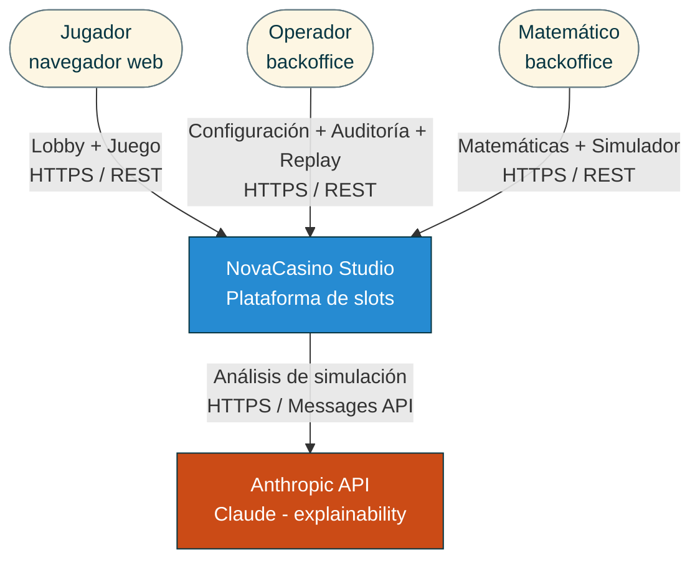
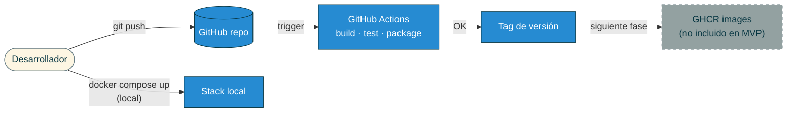
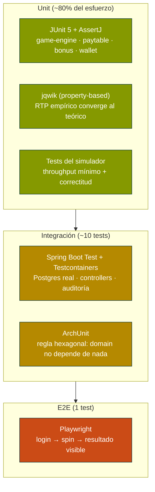

## Índice

0. [Ficha del proyecto](#0-ficha-del-proyecto)
1. [Descripción general del producto](#1-descripción-general-del-producto)
2. [Arquitectura del sistema](#2-arquitectura-del-sistema)
3. [Modelo de datos](#3-modelo-de-datos)
4. [Especificación de la API](#4-especificación-de-la-api)
5. [Historias de usuario](#5-historias-de-usuario)
6. [Tickets de trabajo](#6-tickets-de-trabajo)
7. [Pull requests](#7-pull-requests)

---

## 0. Ficha del proyecto

### **0.1. Tu nombre completo:**

Jordi Poch

### **0.2. Nombre del proyecto:**

**NovaCasino Studio**

### **0.3. Descripción breve del proyecto:**

NovaCasino Studio es una plataforma B2B de slots online compuesta por un cliente de juego para el jugador final (lobby + pantalla de juego), un backoffice operativo para el operador (configuración de juegos, gestión de jugadores y auditoría de partidas) y un backoffice matemático (edición de matemáticas y simulador masivo de hasta 10M de partidas en menos de 10 minutos). Está alineada con la regulación de la DGOJ (Dirección General de Ordenación del Juego, España) desde el primer día y se apoya en un motor de juego *data-driven* y en capacidades de IA (Claude) para asistir al equipo matemático en el análisis de resultados.

El alcance de esta primera versión cubre 3 video slots jugables (dos 5x3 con bonus completo y un 3x3 clásico), saldo virtual ("fun money") gestionado por el operador, registro auditable inmutable de cada giro y *replay* visual determinista de partidas. Quedan **fuera de esta versión** la integración con pasarelas de pago/cobro, los jackpots progresivos y la generación de informes oficiales RFJ para la DGOJ.

### **0.4. URL del proyecto:**

Pendiente de despliegue público. Esta primera fase contempla únicamente ejecución local mediante Docker Compose (ver sección [1.4](#14-instrucciones-de-instalación)). El despliegue en cloud se valorará en fases posteriores.

> Puede ser pública o privada, en cuyo caso deberás compartir los accesos de manera segura. Puedes enviarlos a [alvaro@lidr.co](mailto:alvaro@lidr.co) usando algún servicio como [onetimesecret](https://onetimesecret.com/).

### 0.5. URL o archivo comprimido del repositorio

Repositorio público de GitHub: `https://github.com/<owner>/AI4Devs-finalproject` (sustituir `<owner>` por el usuario/organización propietaria del fork).

> Puedes tenerlo alojado en público o en privado, en cuyo caso deberás compartir los accesos de manera segura. Puedes enviarlos a [alvaro@lidr.co](mailto:alvaro@lidr.co) usando algún servicio como [onetimesecret](https://onetimesecret.com/). También puedes compartir por correo un archivo zip con el contenido


---

## 1. Descripción general del producto

> Describe en detalle los siguientes aspectos del producto:

### **1.1. Objetivo:**

**Propósito.** NovaCasino Studio es una plataforma de slots online concebida como un *game studio* B2B: cubre toda la cadena de valor desde la creación matemática del juego hasta su consumo por el jugador final, con foco en el rigor matemático, la trazabilidad regulatoria y el time-to-market.

**Problema que resuelve.** Los estudios pequeños y medianos que diseñan juegos de slots se enfrentan a tres dolores recurrentes:

1. **Coste y lentitud del ciclo matemático**: simular millones de partidas para validar RTP, volatilidad y *hit frequency* requiere herramientas pesadas y poco interactivas. El equipo matemático pierde días iterando.
2. **Trazabilidad para regulación y soporte**: cuando un jugador reclama un giro, los operadores rara vez pueden reproducir la partida exacta. Las certificaciones (DGOJ, MGA, UKGC) exigen registros auditables y RNG demostrablemente justo.
3. **Acoplamiento entre matemática, motor y presentación**: cada juego nuevo se desarrolla casi desde cero, lo que multiplica el coste por título.

**Valor diferencial.** NovaCasino Studio aborda estos tres dolores con cuatro pilares:

- **Motor de juego *data-driven***. Un único *Slot Engine* en Java parametrizado por JSON. Añadir un juego nuevo es una operación de configuración, no de programación.
- **Simulador masivo de alto rendimiento**: 10 millones de partidas en menos de 10 minutos sobre el mismo motor de producción (no un modelo paralelo), garantizando que lo simulado es lo que se juega.
- **Auditoría inmutable + *replay* determinista**: cada giro se registra con su *seed* RNG, apuesta, balance pre/post y resultado. El operador puede reproducir visualmente la partida exacta para resolver conflictos en segundos.
- **AI-powered explainability**: el matemático pregunta en lenguaje natural sobre los resultados de una simulación ("¿por qué la volatilidad sube en el slot espacial?") y un asistente basado en Claude (Anthropic) interpreta los datos y responde.

**A quién sirve.** Tres perfiles principales, cada uno con su superficie:

| Perfil | Necesidad principal | Superficie en NovaCasino |
|---|---|---|
| **Jugador final** | Experiencia de juego entretenida, fluida y de confianza | Lobby web + pantalla de juego con audio inmersivo, i18n ES/EN, mensajes de juego responsable |
| **Operador** | Configurar juegos, gestionar jugadores y resolver incidencias | Backoffice operativo: configuración (monedas, apuestas), gestión de jugadores y saldo virtual, auditoría con *replay* |
| **Equipo matemático** | Diseñar y validar la matemática de cada juego | Backoffice matemático: editor de paytables/reels, simulador masivo, dashboards de métricas y asistente IA |

**Cumplimiento DGOJ desde el día 0.** Aunque esta versión no genera informes RFJ ni gestiona pagos reales, todas las decisiones arquitectónicas se han tomado para no bloquear una futura certificación: registro inmutable, *seeds* reproducibles, separación motor/RNG, verificación de mayoría de edad en login y sello DGOJ visible.

---

### **1.2. Características y funcionalidades principales:**

#### A. Cliente del jugador (web)

| # | Funcionalidad | Descripción |
|---|---|---|
| A1 | **Login con verificación de edad ≥18** | Registro/login simple por email + password con declaración explícita de mayoría de edad. Cumplimiento DGOJ. |
| A2 | **Lobby de juegos** | Muestra el catálogo con la carátula de cada juego (3 juegos en MVP). Click → pantalla del juego. |
| A3 | **Pantalla de juego (Slot Game)** | Único componente React `<SlotGame>` data-driven. Renderiza cualquier juego según JSON: rejilla, símbolos, líneas de pago, animaciones de giro y de premio. |
| A4 | **Apuesta configurable** | Selector de moneda y cuantía de apuesta dentro del rango definido por el operador para cada juego. |
| A5 | **Auto-spin con *safeguards*** | Permite N giros automáticos. Se detiene si el saldo cae por debajo de un umbral o tras un número máximo de giros, mostrando un mensaje de pausa (alineado con el espíritu DGOJ). |
| A6 | **Free Spins (5x3)** | Trigger por *Scatter* (≥3). Otorga N giros gratis con mecánica adicional (multiplicadores o reels especiales según cada juego). |
| A7 | **Wallet virtual persistente** | Saldo en *fun money* almacenado por jugador. Recargado por el operador desde su backoffice. Histórico de movimientos. |
| A8 | **Audio inmersivo** | Música ambiente por temática (egipcia, frutas clásico, espacial), SFX comunes (spin, win, big win, free spin trigger) y voz de locutor en eventos especiales. Mute toggle persistente. |
| A9 | **Internacionalización ES/EN** | Toda la UI (incluida la voz del locutor) disponible en castellano e inglés con cambio en caliente. |
| A10 | **Mensajes de juego responsable y sello DGOJ** | Banner permanente con el sello DGOJ, enlace a "juego responsable" y avisos contextuales. |

#### B. Backoffice operativo (operador)

| # | Funcionalidad | Descripción |
|---|---|---|
| B1 | **Gestión de jugadores** | Listado, búsqueda, alta/baja, recarga manual del saldo virtual. |
| B2 | **Configuración de juegos** | Para cada juego: monedas habilitadas, apuestas mínima/máxima, escalones de apuesta, estado activo/inactivo. |
| B3 | **Auditoría de partidas** | Listado paginado y filtrable de todos los giros: jugador, juego, *seed*, apuesta, balance pre/post, resultado, timestamp. |
| B4 | **Replay visual determinista** | A partir de cualquier giro auditado, el operador reproduce la animación exacta del giro en una pantalla idéntica a la del jugador. *Killer feature* para resolver disputas y demostrar transparencia ante la DGOJ. |
| B5 | **Dashboard de actividad** | Métricas básicas en tiempo real: jugadores activos, GGR (saldo apostado − saldo ganado), juegos más jugados. |

#### C. Backoffice matemático

| # | Funcionalidad | Descripción |
|---|---|---|
| C1 | **Editor de matemáticas** | Edición de la configuración JSON de cada juego: símbolos y sus pesos por reel, paytable (combinaciones y multiplicadores), líneas de pago, reglas de bonus (free spins, wilds, scatters). |
| C2 | **Simulador masivo** | Ejecuta hasta **10M de partidas en <10 min** sobre el mismo motor que producción. Configurable: nº de spins, apuesta fija, perfil de jugador. |
| C3 | **Dashboard de métricas de simulación** | RTP empírico (global, base game, free spins), *hit frequency*, volatilidad (desv. estándar), distribución de premios (histograma), max win, frecuencia de trigger de free spins, racha más larga sin premio. |
| C4 | **AI-powered explainability** | Caja de texto donde el matemático pregunta en lenguaje natural ("¿por qué la volatilidad de Espacial es 12.4 cuando esperábamos 10?"). El backend envía las métricas a Claude (Anthropic API) y devuelve una explicación interpretable. |
| C5 | **Validación previa al despliegue** | El sistema avisa si el RTP empírico se desvía más de un umbral del RTP teórico esperado o si hay otros indicadores anómalos. |

#### D. Plataforma y compliance (transversal)

| # | Funcionalidad | Descripción |
|---|---|---|
| D1 | **Motor de juego *data-driven*** | Único en Java, parametrizado por JSON. 3 juegos = 3 ficheros de configuración + 3 packs de assets. |
| D2 | **RNG certificable** | RNG criptográficamente fuerte (`SecureRandom`), aislado en módulo propio, con *seeds* reproducibles y documentación matemática para futura certificación. |
| D3 | **Registro auditable inmutable** | Tabla `game_round` con todos los datos del giro. Inserción *append-only*, sin update/delete por contrato y por *trigger* en BBDD. |
| D4 | **Roles y permisos** | `PLAYER`, `OPERATOR`, `MATH_ANALYST`. Cada rol accede solo a su superficie. JWT en headers. |
| D5 | **Despliegue local con Docker Compose** | Un comando arranca toda la stack. |

#### E. Alcance fuera de esta versión

- Pasarelas de pago/cobro (saldo virtual ≠ saldo real).
- Jackpots progresivos.
- Generación automática de informes RFJ para la DGOJ (la arquitectura los soporta a futuro).
- Accesibilidad WCAG 2.1 AA completa.
- Límites de pérdida y autoexclusión completos (preparados pero no implementados).
- Despliegue cloud público.

---

### **1.3. Diseño y experiencia de usuario:**

En esta primera fase no se entregan mockups gráficos ni vídeo (se generarán en la siguiente fase del proyecto, junto con los assets temáticos). A continuación se describen los **flujos de usuario principales** y se incluyen *wireframes* ASCII de las pantallas core para fijar la intención de diseño.

#### Flujo 1 — Jugador: del lobby al free spin

1. Jugador entra en `/`. Si no está autenticado, se le redirige a `/login` con declaración de edad ≥18.
2. Tras login, aterriza en el lobby con las carátulas de los 3 juegos y su saldo virtual visible.
3. Click en una carátula → pantalla de juego con la rejilla, controles de apuesta, botón *Spin* y botón *Auto-spin*.
4. Pulsa *Spin*: animación de giro, evaluación de líneas, animación de premio si lo hay, actualización de balance.
5. Si caen 3+ scatters: cinemática de "¡Free Spins!" (con voz de locutor) y entra en modo bonus.
6. Al salir del juego, el saldo y el historial quedan persistidos para la próxima sesión.

#### Flujo 2 — Operador: resolver una reclamación

1. Operador entra en `/operator` con su rol. Va a "Auditoría".
2. Filtra por jugador, juego y rango de fechas. Localiza el giro reclamado.
3. Pulsa "Replay". Se abre una pantalla idéntica a la del jugador y se ejecuta el giro exacto (mismo *seed*, mismas reels, mismo resultado).
4. Comparte el enlace de *replay* con el jugador como prueba.

#### Flujo 3 — Matemático: ajustar el RTP de un juego

1. Matemático entra en `/math`. Selecciona el juego "Espacial".
2. Edita el peso de un símbolo en la pestaña "Reels". Guarda.
3. Lanza una simulación de 10M de spins. Espera <10 min.
4. Revisa el dashboard: el RTP cae al 95.2 %, la volatilidad sube. Pregunta a la IA: "¿por qué sube la volatilidad?". La IA explica el cambio en la distribución de premios.
5. Itera ajustes hasta alcanzar el RTP/volatilidad objetivo.

#### Wireframes ASCII

```
LOBBY
┌────────────────────────────────────────────────────────────┐
│ NovaCasino Studio              [ES|EN]  Saldo: 1.000 €  ▼ │
├────────────────────────────────────────────────────────────┤
│                                                            │
│   ┌──────────┐    ┌──────────┐    ┌──────────┐             │
│   │ EGIPCIO  │    │ FRUTAS   │    │ ESPACIAL │             │
│   │  (5x3)   │    │  (3x3)   │    │  (5x3)   │             │
│   └──────────┘    └──────────┘    └──────────┘             │
│                                                            │
│  Sello DGOJ │ Juego responsable │ +18                      │
└────────────────────────────────────────────────────────────┘

PANTALLA DE JUEGO
┌────────────────────────────────────────────────────────────┐
│ ← Lobby           ESPACIAL          Saldo: 985 €  🔊       │
├────────────────────────────────────────────────────────────┤
│                                                            │
│  ┌───┬───┬───┬───┬───┐                                     │
│  │ ★ │ ☄ │ ☄ │ 🪐│ A │                                     │
│  ├───┼───┼───┼───┼───┤                                     │
│  │ K │ ★ │ A │ ☄ │ ★ │   GANANCIA: 7,50 €                  │
│  ├───┼───┼───┼───┼───┤                                     │
│  │ ☄ │ K │ 🪐│ A │ K │                                     │
│  └───┴───┴───┴───┴───┘                                     │
│                                                            │
│  Apuesta: [- 1,00 € +]   [SPIN]   [AUTO-SPIN]              │
└────────────────────────────────────────────────────────────┘

BACKOFFICE OPERADOR — AUDITORÍA + REPLAY
┌────────────────────────────────────────────────────────────┐
│ /operator                                  Operador: Ana ▼ │
├────────────────────────────────────────────────────────────┤
│  Filtros: Jugador [   ] Juego [▼] Fecha [   ]  [Buscar]    │
│                                                            │
│  Round │ Jugador │ Juego  │ Apuesta │ Premio │ [Replay]    │
│  ──────┼─────────┼────────┼─────────┼────────┼─────────    │
│  R-201 │ user42  │ Egip.  │ 1,00 €  │ 4,50 € │ [▶ Replay]  │
│  R-202 │ user07  │ Esp.   │ 0,50 €  │ 0,00 € │ [▶ Replay]  │
└────────────────────────────────────────────────────────────┘

BACKOFFICE MATEMÁTICO — SIMULADOR + IA
┌────────────────────────────────────────────────────────────┐
│ /math                                  Matemático: Luis ▼  │
├────────────────────────────────────────────────────────────┤
│  Juego: ESPACIAL ▼     [Editar matemática]                 │
│                                                            │
│  Spins: [10.000.000]    Apuesta: [1,00 €]   [SIMULAR]      │
│                                                            │
│  Resultados:                                               │
│   • RTP global:  95,21 %       • Volatilidad: 12,4         │
│   • Hit freq:    24,7 %        • Max win:    1.250x        │
│   • RTP base game: 76,8 %      • RTP free spins: 18,4 %    │
│                                                            │
│  Pregunta a la IA:                                         │
│   ┌──────────────────────────────────────────────┐         │
│   │ ¿Por qué la volatilidad sube respecto a la   │         │
│   │ versión anterior?                            │         │
│   └──────────────────────────────────────────────┘         │
│   [Preguntar]                                              │
└────────────────────────────────────────────────────────────┘
```

---

### **1.4. Instrucciones de instalación:**

> Las instrucciones definitivas se publicarán en la fase de implementación. A continuación se documenta el procedimiento previsto, alineado con la arquitectura aprobada en este PRD.

#### Requisitos previos

- Docker Desktop 4.x o Docker Engine + Docker Compose v2
- Git
- Una API key de Anthropic (variable `ANTHROPIC_API_KEY`) para la funcionalidad de *AI explainability* en el backoffice matemático. Sin ella, el resto de la plataforma funciona; solo se desactiva esa feature.

#### Pasos de instalación local

```bash
# 1. Clonar el repositorio
git clone https://github.com/<owner>/AI4Devs-finalproject.git
cd AI4Devs-finalproject

# 2. Copiar la plantilla de variables de entorno y editarla
cp .env.example .env
# Editar .env y poner ANTHROPIC_API_KEY=sk-ant-...

# 3. Levantar todos los servicios (backend + frontend + Postgres)
docker compose up --build

# 4. (Primera vez) Las migraciones Flyway y las semillas se ejecutan
#    automáticamente al arrancar el backend.
```

#### URLs locales

| Superficie | URL |
|---|---|
| Lobby del jugador | `http://localhost:5173/` |
| Login del jugador | `http://localhost:5173/login` |
| Backoffice operador | `http://localhost:5173/operator` |
| Backoffice matemático | `http://localhost:5173/math` |
| API REST | `http://localhost:8080/api` |
| OpenAPI / Swagger UI | `http://localhost:8080/swagger-ui.html` |
| Base de datos PostgreSQL | `localhost:5432` (`novacasino` / `novacasino`) |

#### Datos de semilla (auto-creados al primer arranque)

- 3 juegos preconfigurados: Egipcio (5x3), Frutas (3x3), Espacial (5x3).
- 1 usuario `OPERATOR` (`operator@nova.test` / `operator123`).
- 1 usuario `MATH_ANALYST` (`math@nova.test` / `math123`).
- 3 usuarios `PLAYER` (`player1@nova.test`, `player2@nova.test`, `player3@nova.test` / `player123`) cada uno con 1.000 € de saldo virtual.

#### Parar y resetear

```bash
docker compose down              # Para los servicios
docker compose down -v           # Para y borra los volúmenes (resetea la BBDD)
```

---

## 2. Arquitectura del Sistema

### **2.1. Diagrama de arquitectura:**

NovaCasino Studio sigue una **arquitectura hexagonal (ports & adapters) con DDD ligero**, empaquetada como **monolito modular Maven multi-módulo**. La elección responde directamente a las restricciones del proyecto: 30-40 h de implementación con un solo desarrollador asistido por IA, requisitos de certificación regulatoria (DGOJ), y la necesidad de aislar el motor matemático del framework para que sea auditable.

#### 2.1.1 Diagrama de contexto (C4 nivel 1)

Muestra los actores externos y los sistemas con los que NovaCasino Studio se relaciona.



#### 2.1.2 Diagrama de contenedores (C4 nivel 2)

Detalla los procesos desplegables que componen el sistema.


#### 2.1.3 Diagramas de componentes (C4 nivel 3) — Backend

Para mantener la legibilidad se divide el flujo del backend en tres diagramas, uno por actor del sistema. Cada uno muestra solo los componentes implicados en sus casos de uso. Los `subgraph` representan módulos Maven; las flechas continuas son dependencias en el sentido del código y las flechas discontinuas indican que un adapter implementa un puerto del dominio (regla hexagonal).

##### 2.1.3.1 Flujo del Jugador


##### 2.1.3.2 Flujo del Operador


##### 2.1.3.3 Flujo del Matemático


#### 2.1.4 Patrones aplicados y por qué

| Patrón | Dónde | Por qué |
|---|---|---|
| **Hexagonal / Ports & Adapters** | Estructura global | Aísla el motor matemático del framework: certificable y portable. La JVM puede embeberlo sin Spring para auditorías externas. |
| **DDD ligero** | Módulo `nova-domain` | Conceptos de gambling (Round, Wallet, Bet, Paytable) modelados como agregados con invariantes propias. Reduce bugs de negocio. |
| **Strategy** | `BonusFeature` (FreeSpins, Wild, Scatter) | Cada feature es intercambiable y composable; añadir un nuevo bonus es una clase nueva, no un `if`. |
| **Builder** | `GameConfigBuilder` | Construcción inmutable de configs a partir de JSON, validando invariantes (ej. paytable consistente con símbolos declarados). |
| **Command + Event** | Spin = Command; `RoundCompleted` = evento que dispara la persistencia auditable | Desacopla la lógica de juego del *side effect* de auditar. Facilita el simulador (mismo Command, sin el listener de auditoría). |
| **Repository** | Acceso a datos | Estándar DDD; en hexagonal es el "puerto" del dominio. |
| **Adapter** | Integraciones externas (Postgres, Anthropic) | Permite cambiar la BBDD o el LLM sin tocar dominio ni casos de uso. |
| **Map-Reduce con ForkJoinPool** | Simulador | Distribuye los 10M de spins entre cores y agrega métricas con `LongAdder` (lock-free). Necesario para 10M/<10 min. |

#### 2.1.5 Beneficios y sacrificios

**Beneficios**
- **Aislamiento del motor matemático**: certificable, fácil de testear, reusable por el simulador.
- **Productividad**: monolito = un único `mvn package`, un único `docker compose up`. Crítico con 30-40 h.
- **Refactor a microservicios trivial**: si el simulador sufre, basta con extraer `nova-simulator` a un proceso aparte. Las fronteras ya están establecidas.
- **Auditabilidad**: el registro append-only en `game_round` con trigger BBDD anti-UPDATE/DELETE permite demostrar a la DGOJ que el log es inmutable. La arquitectura está preparada para incorporar firma externa y *hash-chain* en fases posteriores sin tocar dominio.

**Sacrificios**
- **Escalado horizontal acoplado**: no se puede escalar el simulador sin escalar la API. Aceptable en MVP single-tenant.
- **Curva inicial mayor que un monolito layered**: hay que entender hexagonal para no acoplar. Mitigado por la estructura Maven (las fronteras son físicas, no convencionales).
- **PostgreSQL como SPOF en runtime**: aceptable para MVP local; en producción se mitigaría con réplica/HA en otra fase.

---

### **2.2. Descripción de componentes principales:**

#### 2.2.1 Backend — módulos Maven

| Módulo | Tecnología | Responsabilidad |
|---|---|---|
| **nova-domain** | Java 21 puro (sin Spring) | Núcleo de negocio: `Game`, `Round`, `Reels`, `Paytable`, `Symbol`, `Payline`, `BonusFeature`, `Wallet`, `Money`, `Bet`, `RngEngine` (puerto), `GameRound`. Cero dependencias externas más allá de la JDK. |
| **nova-application** | Java 21 + `jakarta.transaction` | Casos de uso (`SpinUseCase`, `ReplayRoundUseCase`, `RechargeWalletUseCase`, `RunSimulationUseCase`, `ExplainSimulationUseCase`…). Orquesta dominio + puertos. |
| **nova-infrastructure** | Spring Data JPA · Flyway · Anthropic SDK · BCrypt | Adaptadores: repositorios JPA, migraciones, cliente Anthropic, implementación `SecureRandom` del RNG. |
| **nova-simulator** | Java 21 + `ForkJoinPool` + `LongAdder` | Ejecuta `SpinUseCase` sin auditoría ni BBDD. Agrega métricas en memoria. Devuelve `SimulationResult`. |
| **nova-web-api** | Spring Boot 3 · Spring Security 6 · springdoc-openapi | Punto de entrada HTTP. Controllers por perfil (`/api/player/*`, `/api/operator/*`, `/api/math/*`). Filtro JWT, CORS, manejo de errores i18n. |
| **nova-common** | — | DTOs compartidos, utilidades, constantes. |

#### 2.2.2 Frontend — workspaces

| Workspace / superficie | Tecnología | Responsabilidad |
|---|---|---|
| **`apps/web` (SPA única, rutas)** | React 18 · TypeScript · Vite | App SPA con 3 superficies por ruta: `/` (jugador), `/operator/*`, `/math/*`. |
| **State global** | Zustand | Sesión, wallet, idioma, mute audio. |
| **Server state** | TanStack Query | Cache, retry, invalidación de llamadas a la API. |
| **i18n** | i18next + react-i18next | Bundles `es` y `en`, con namespaces por superficie. |
| **Audio** | Howler.js | Música ambiente por temática + SFX + voz locutor. |
| **Componentes de juego** | `<SlotGame config>` (data-driven) | Renderiza cualquier juego según el JSON descargado del backend. |
| **Routing y auth** | React Router 6 · interceptor Axios para JWT | Refresh transparente del token. |

#### 2.2.3 Base de datos

PostgreSQL 18 con extensión `pg_partman` (opcional, para particionado mensual de `game_round`). Esquema único `novacasino`. Migraciones gestionadas con Flyway. Configuraciones de juego almacenadas como `JSONB` con índices GIN para queries por símbolo o feature.

#### 2.2.4 Servicios externos

- **Anthropic API (Claude)**. Único servicio externo en runtime. Lo invoca `nova-infrastructure` desde el caso de uso `ExplainSimulationUseCase`. Si falta `ANTHROPIC_API_KEY`, la feature se desactiva con `@ConditionalOnProperty` y el resto de la plataforma funciona normalmente.

---

### **2.3. Descripción de alto nivel del proyecto y estructura de ficheros**

El repositorio sigue un *monorepo* con dos raíces lógicas: `backend/` (Maven multi-módulo) y `frontend/` (npm workspace).

```text
AI4Devs-finalproject/
├── docker-compose.yml             # Orquestación local: api + web + postgres
├── .env.example                   # Variables de entorno (ANTHROPIC_API_KEY, JWT_SECRET, DB_*)
├── readme.md                      # Este documento
├── conversation.md                # Log numerado de prompts del proyecto
├── prompts.md                     # Prompts más relevantes por sección del readme
│
├── backend/
│   ├── pom.xml                    # POM padre (Spring Boot 3, Java 21)
│   ├── nova-domain/               # Núcleo puro DDD — sin Spring, sin JPA
│   │   ├── src/main/java/com/novacasino/domain/
│   │   │   ├── game/              # Game, Reels, Paytable, Symbol, Payline
│   │   │   ├── bonus/             # BonusFeature (Strategy), FreeSpins, Wild, Scatter
│   │   │   ├── wallet/            # Wallet, Money, Bet
│   │   │   ├── audit/             # GameRound
│   │   │   └── rng/               # RngEngine (port)
│   │   └── src/test/java/         # Unit tests (Surefire)
│   ├── nova-application/          # Casos de uso
│   │   ├── src/main/java/com/novacasino/application/
│   │   │   ├── player/            # SpinUseCase, ListGamesUseCase
│   │   │   ├── operator/          # AuditQueryUseCase, ReplayRoundUseCase, RechargeWalletUseCase
│   │   │   └── math/              # EditConfigUseCase, RunSimulationUseCase, ExplainSimulationUseCase
│   │   └── src/test/java/         # Unit tests (Surefire)
│   ├── nova-infrastructure/       # Adaptadores
│   │   ├── src/main/java/com/novacasino/infrastructure/
│   │   │   ├── persistence/       # @Repository JPA, mappers, migrations
│   │   │   ├── rng/               # SecureRandomRngAdapter
│   │   │   └── anthropic/         # AnthropicExplainerAdapter (Claude)
│   │   ├── src/test/java/         # Unit tests (Surefire)
│   │   ├── src/it/java/           # Integration tests (Failsafe + Testcontainers)
│   │   └── src/it/resources/      # Fixtures, application-it.yml
│   ├── nova-simulator/            # Map-reduce simulator
│   │   ├── src/main/java/com/novacasino/simulator/
│   │   │   ├── SimulationRunner.java
│   │   │   └── MetricsAccumulator.java
│   │   └── src/test/java/         # Unit + property-based (jqwik)
│   ├── nova-web-api/              # Spring Boot app — punto de arranque
│   │   ├── src/main/
│   │   │   ├── java/com/novacasino/api/
│   │   │   │   ├── NovaCasinoApplication.java
│   │   │   │   ├── controller/    # PlayerController, OperatorController, MathController, AuthController
│   │   │   │   ├── security/      # JwtFilter, JwtService, SecurityConfig
│   │   │   │   └── config/        # OpenApiConfig, I18nConfig, CorsConfig
│   │   │   └── resources/
│   │   │       ├── application.yml
│   │   │       ├── db/migration/  # Flyway: V1__schema.sql, V2__immutable_audit_trigger.sql, V3__seed.sql
│   │   │       └── games/         # JSON de configuración de los 3 juegos (semilla)
│   │   ├── src/test/java/         # Unit tests de controllers (MockMvc + Surefire)
│   │   ├── src/it/java/           # E2E API tests (Failsafe + Testcontainers + Playwright)
│   │   └── src/it/resources/
│   ├── nova-common/
│   └── Dockerfile                 # Multi-stage: maven build + JRE 21 slim
│
└── frontend/
    ├── package.json
    ├── vite.config.ts
    ├── Dockerfile                 # Multi-stage: pnpm build + nginx alpine
    ├── public/
    │   └── assets/                # Assets temáticos (símbolos, fondos, audio)
    │       ├── egyptian/
    │       ├── fruits/
    │       └── space/
    └── src/
        ├── main.tsx
        ├── App.tsx                # Router + providers (i18n, query, auth)
        ├── shared/                # Componentes UI, hooks, axios client, audio service
        ├── i18n/                  # es.json, en.json
        ├── player/                # Lobby, SlotGame (data-driven), Wallet, Login
        ├── operator/              # Players, GameConfig, Audit, Replay
        └── math/                  # MathEditor, Simulator, MetricsDashboard, Explainer
```

**Convenciones clave**:

- **Regla de dependencia hexagonal**: `domain` no depende de nadie. `application` depende de `domain`. `infrastructure` y `web-api` dependen de `application` y `domain`. **Nunca** al revés. Esta regla se enforza con [ArchUnit](https://www.archunit.org/) en los tests.
- **Frontend por carpetas verticales** (no por tipo de fichero): cada superficie (`player/`, `operator/`, `math/`) contiene sus pages, components, hooks y stores juntos. Reduce navegación.
- **JSON de juegos como semilla**: las configuraciones se persisten en BBDD pero se versionan como ficheros en `nova-web-api/src/main/resources/games/` para rebuild reproducible.

---

### **2.4. Infraestructura y despliegue**

#### 2.4.1 Topología local con Docker Compose


**Servicios** (`docker-compose.yml`):

| Servicio | Imagen base | Puerto host | Notas |
|---|---|---|---|
| `web` | `nginx:1.27-alpine` (build multi-stage de Vite) | 5173 → 80 | Sirve estáticos y hace `proxy_pass` de `/api/` a `api:8080`. |
| `api` | `eclipse-temurin:21-jre-alpine` (multi-stage Maven) | 8080 → 8080 | Spring Boot. `depends_on: postgres healthcheck`. |
| `postgres` | `postgres:18-alpine` | 5432 → 5432 | Volumen `pgdata` para persistencia. Healthcheck `pg_isready`. |

#### 2.4.2 Proceso de despliegue



**Pipeline CI (GitHub Actions, fichero `.github/workflows/ci.yml`)**:

1. *Checkout* + setup JDK 21 + setup Node 20.
2. `mvn -B verify` — compila, corre tests unitarios e integration con Testcontainers, ArchUnit y property-based.
3. `pnpm install && pnpm test && pnpm build` en frontend.
4. *Cache* de dependencias Maven y pnpm para acelerar.
5. Publica reportes de cobertura (Jacoco) como artefactos.

**Despliegue cloud**: queda explícitamente fuera del MVP. La arquitectura está preparada para Render / Railway / Fly.io publicando las imágenes Docker, pero no se entrega en esta fase.

---

### **2.5. Seguridad**

Las prácticas se agrupan en cuatro bloques: autenticación, integridad de datos, defensa en profundidad y específicas de gambling.

#### 2.5.1 Autenticación y autorización

- **JWT Bearer tokens** firmados con HS256, secret en `JWT_SECRET` (variable de entorno, nunca en código).
- **Spring Security 6** con `SecurityFilterChain` declarativo. Endpoints protegidos por `@PreAuthorize("hasRole('OPERATOR')")` etc.
- **Roles**: `PLAYER`, `OPERATOR`, `MATH_ANALYST`. Cada controller solo acepta su rol.
- **Passwords**: hash con BCrypt (cost 12). Nunca se almacenan en claro ni se loguean.
- **Verificación de edad ≥18** obligatoria en registro (campo `birth_date` + check `EXTRACT(YEAR FROM AGE(birth_date)) >= 18`).
- **Refresh tokens** opcionales en MVP; access tokens con TTL 1h y renovación silenciosa por interceptor en frontend.

#### 2.5.2 Inmutabilidad de la auditoría

La tabla `game_round` es *append-only*. La inmutabilidad se garantiza a dos niveles, siendo el segundo el realmente vinculante:

1. **Por contrato**: ningún caso de uso del módulo `nova-application` expone una operación que modifique o borre rounds. Solo existe `InsertGameRoundCommand`.
2. **Por la base de datos**: trigger PL/pgSQL `BEFORE UPDATE OR DELETE ON game_round` que **lanza excepción siempre**. Cualquier UPDATE o DELETE — incluso ejecutado a mano por un DBA descuidado — falla con `RAISE EXCEPTION 'game_round is append-only'`. Migración Flyway: `V2__immutable_audit_trigger.sql`.

> **Nota sobre tamper-evidence (fuera de scope v1).** La arquitectura está preparada para incorporar en fases posteriores un *hash-chain* SHA-256 sobre `game_round` con firma externa de los hashes (clave privada fuera del servidor o replicación a un sistema append-only externo como Amazon QLDB). En un MVP single-node sin esa firma externa, el hash-chain por sí solo no añade seguridad real frente al trigger anti-UPDATE/DELETE — un atacante con acceso DBA podría deshabilitar el trigger y recalcular hashes en cascada porque el algoritmo es público y determinista. Por eso se difiere a la fase donde exista anchor de confianza externo.

#### 2.5.3 RNG criptográficamente fuerte

- `SecureRandom` (algoritmo `NativePRNGNonBlocking` en Linux) en el adapter `nova-infrastructure`.
- El puerto del dominio es `RngEngine` con dos métodos: `nextInt(int bound)` y `getSeed()`.
- Para auditoría/replay, cada round registra el `seed` usado; el motor es **completamente determinista** dada una `seed`.
- Aislado en módulo propio para facilitar futura sustitución por un RNG certificado externamente (ej. iTechLabs).

#### 2.5.4 Defensa en profundidad

| Práctica | Implementación |
|---|---|
| **CORS** | Lista blanca de orígenes en `CorsConfig`. |
| **CSRF** | Desactivado por ser API stateless con JWT (Spring Security recomendación). |
| **Rate limiting** | `Bucket4j` en filtros sobre `/api/auth/login` y `/api/player/*/spin` (anti-bot/anti-abuse). |
| **Validación de entrada** | `jakarta.validation` (`@Valid`, `@Min`, `@Max`) en DTOs. |
| **SQL injection** | Imposible vía JPA/PreparedStatement; cero string concatenation en queries. |
| **XSS** | React escapa por defecto; CSP `default-src 'self'` servido por nginx. |
| **Secret management** | `.env` ignorado por git, `.env.example` versionado. |
| **HTTPS** | Asumido en producción vía reverse proxy; en local HTTP. |
| **Logs** | Estructurados (JSON) con `logstash-logback-encoder`. **Nunca se loguean**: passwords, tokens ni `seed` en producción. |

#### 2.5.5 Específicas de gambling / DGOJ

- **Server-side game logic estricta**. El cliente solo envía `bet`, recibe `result`. La lógica de evaluación de paylines, bonus y RTP **solo** existe en `nova-domain`. Regla inviolable de la industria.
- **Trazabilidad total**: 100% de los giros quedan en `game_round` con `seed`, `bet`, `result`, `balance_pre`, `balance_post`, `timestamp`.
- **Verificación de edad** y sello DGOJ visible en todas las pantallas del jugador.
- **Mensajes de juego responsable** en login, lobby y al alcanzar umbrales de pérdida.
- **Auto-spin con safeguards**: el cliente para automáticamente al cruzar umbrales y muestra un mensaje de pausa.
- **Separación motor/RNG**: prerequisito para certificación; ya descrito en 2.5.3.

---

### **2.6. Tests**

Estrategia: **pirámide clásica** densa en la base, con énfasis en el motor matemático (donde está el riesgo regulatorio), y un único E2E en la cúspide.



**Ejemplos representativos:**

- **Unit del motor (JUnit + AssertJ)**: dado un `Game` con paytable conocido y un `seed` fijo, `SpinUseCase.execute(...)` devuelve el `Round` esperado símbolo a símbolo. Garantiza determinismo y reemplazabilidad de fix.
- **Property-based (jqwik)**: para 100 configuraciones aleatorias de juego con RTP teórico calculable, ejecutar 1M de spins debe converger al RTP teórico ±0.5%. Detecta regresiones matemáticas sutiles que un unit no atrapa.
- **Simulador**: `SimulationRunner.run(10_000_000)` debe completar en <10 min en un entorno reproducible (anotado `@Tag("perf")`, no se ejecuta en CI por defecto). Y los `MetricsAccumulator` agregados deben coincidir con la suma directa para datasets pequeños.
- **ArchUnit**: regla "ninguna clase de `nova-domain.*` importa `org.springframework.*` ni `jakarta.persistence.*`". Falla el build si alguien acopla por error.
- **Integration con Testcontainers** (en `src/it/java`): arranca un Postgres 18 real, aplica migraciones Flyway, ejecuta `POST /api/player/spin` con JWT y verifica que (a) la respuesta es correcta, (b) hay un nuevo `game_round` insertado con todos sus campos, (c) cualquier intento de UPDATE/DELETE sobre el row falla con la excepción del trigger.
- **E2E con Playwright**: un único *happy path* que arranca el `docker-compose`, abre el navegador, hace login con un usuario semilla, entra a un juego, hace spin y verifica que el balance cambia.

**Cobertura objetivo**:

| Módulo | Cobertura mínima |
|---|---|
| `nova-domain` | 90 % (es el código crítico) |
| `nova-application` | 80 % |
| `nova-simulator` | 80 % |
| `nova-infrastructure` | 60 % |
| `nova-web-api` | 60 % (controllers cubiertos por integration tests) |

**Convención de carpetas y plugins Maven:**

| Carpeta | Tipo de test | Plugin | Fase Maven | Naming |
|---|---|---|---|---|
| `src/test/java` | Unit tests (rápidos, sin I/O) | `maven-surefire-plugin` | `test` | `*Test.java` |
| `src/it/java` | Integration / E2E (Testcontainers, Playwright) | `maven-failsafe-plugin` | `integration-test`, `verify` | `*IT.java` |

- `src/it/java` y `src/it/resources` se registran como *test source roots* adicionales mediante `build-helper-maven-plugin` (`add-test-source` en la fase `generate-test-sources`), de modo que IDEs (IntelliJ, VS Code) y Maven los reconocen automáticamente.
- `mvn test` ejecuta solo los unit tests (rápido, ~30 s, parte de cada commit).
- `mvn verify` ejecuta primero unit y luego integration; es el comando que corre en CI y antes de cada *push*.
- Solo los módulos con tests de integración reales (`nova-infrastructure`, `nova-web-api`) declaran la carpeta `src/it`. El resto opera solo con `src/test`.

---

## 3. Modelo de Datos

### **3.1. Diagrama del modelo de datos:**

> Recomendamos usar mermaid para el modelo de datos, y utilizar todos los parámetros que permite la sintaxis para dar el máximo detalle, por ejemplo las claves primarias y foráneas.


### **3.2. Descripción de entidades principales:**

> Recuerda incluir el máximo detalle de cada entidad, como el nombre y tipo de cada atributo, descripción breve si procede, claves primarias y foráneas, relaciones y tipo de relación, restricciones (unique, not null…), etc.

---

## 4. Especificación de la API

> Si tu backend se comunica a través de API, describe los endpoints principales (máximo 3) en formato OpenAPI. Opcionalmente puedes añadir un ejemplo de petición y de respuesta para mayor claridad

---

## 5. Historias de Usuario

> Documenta 3 de las historias de usuario principales utilizadas durante el desarrollo, teniendo en cuenta las buenas prácticas de producto al respecto.

**Historia de Usuario 1**

**Historia de Usuario 2**

**Historia de Usuario 3**

---

## 6. Tickets de Trabajo

> Documenta 3 de los tickets de trabajo principales del desarrollo, uno de backend, uno de frontend, y uno de bases de datos. Da todo el detalle requerido para desarrollar la tarea de inicio a fin teniendo en cuenta las buenas prácticas al respecto. 

**Ticket 1**

**Ticket 2**

**Ticket 3**

---

## 7. Pull Requests

> Documenta 3 de las Pull Requests realizadas durante la ejecución del proyecto

**Pull Request 1**

**Pull Request 2**

**Pull Request 3**

