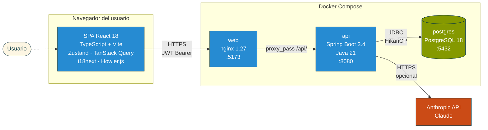
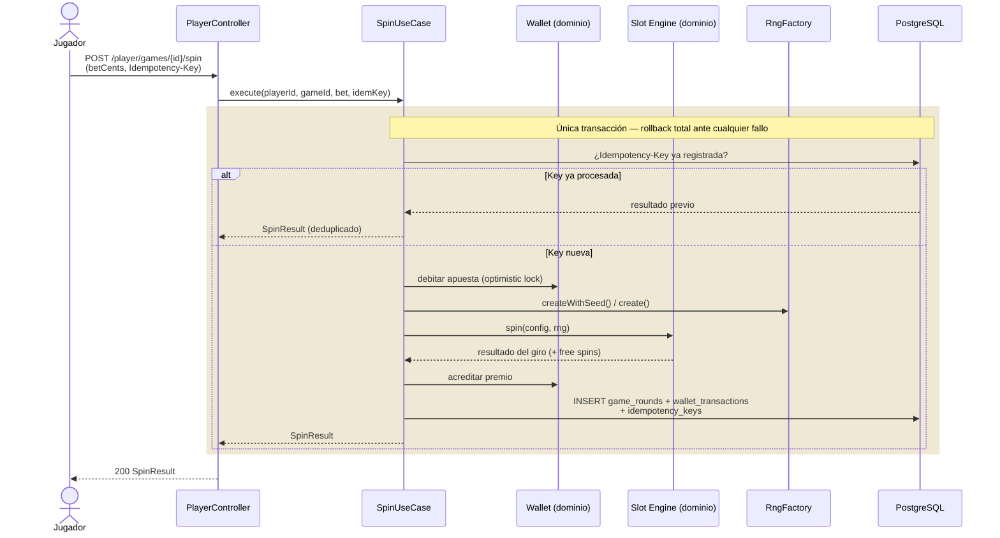
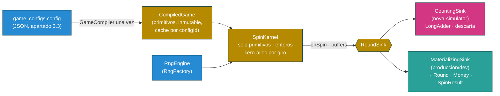
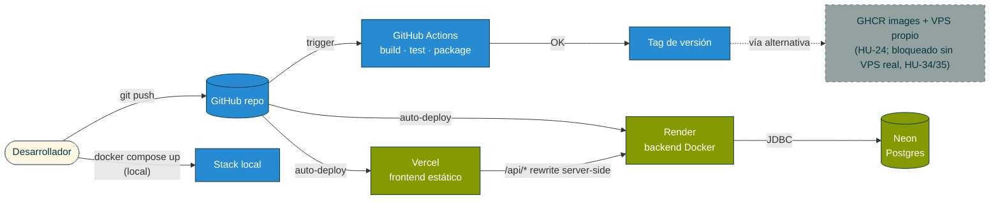
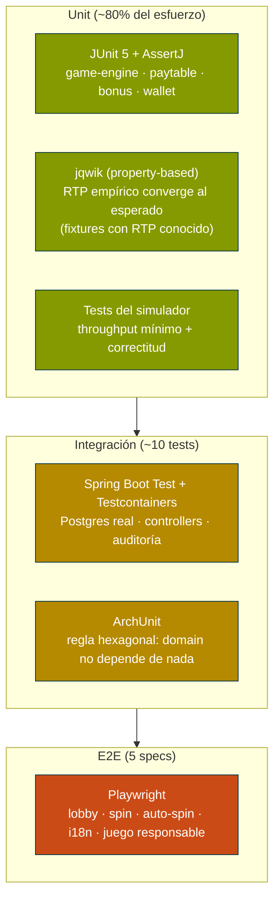
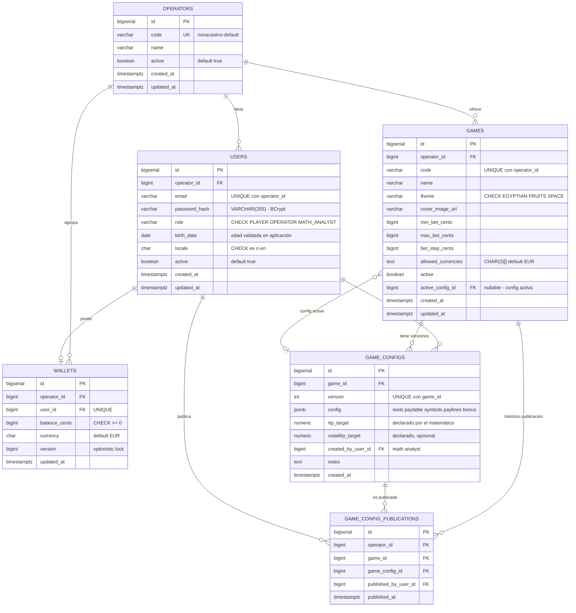
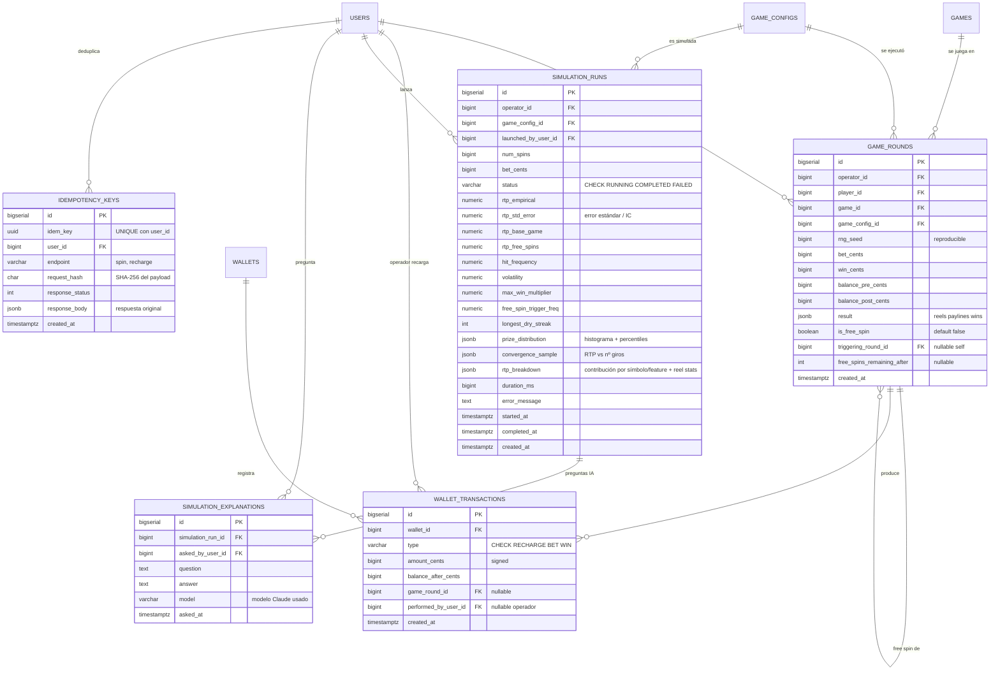

## Índice

0. [Ficha del proyecto](#0-ficha-del-proyecto)
1. [Descripción general del producto](#1-descripción-general-del-producto)
   - 1.1. [Objetivo](#11-objetivo)
   - 1.2. [Características y funcionalidades principales](#12-características-y-funcionalidades-principales)
   - 1.3. [Diseño y experiencia de usuario](#13-diseño-y-experiencia-de-usuario)
   - 1.4. [Instrucciones de instalación](#14-instrucciones-de-instalación)
   - 1.5. [Supuestos y decisiones diferidas](#15-supuestos-y-decisiones-diferidas)
2. [Arquitectura del sistema](#2-arquitectura-del-sistema)
   - 2.1. [Diagrama de arquitectura](#21-diagrama-de-arquitectura)
   - 2.2. [Descripción de componentes principales](#22-descripción-de-componentes-principales)
   - 2.3. [Estructura de alto nivel del proyecto](#23-descripción-de-alto-nivel-del-proyecto-y-estructura-de-ficheros)
   - 2.4. [Infraestructura y despliegue](#24-infraestructura-y-despliegue)
   - 2.5. [Seguridad](#25-seguridad)
   - 2.6. [Tests](#26-tests)
3. [Modelo de datos](#3-modelo-de-datos)
   - 3.1. [Diagrama del modelo de datos](#31-diagrama-del-modelo-de-datos)
   - 3.2. [Descripción de entidades principales](#32-descripción-de-entidades-principales)
   - 3.3. [Esquema del JSON de configuración de juego](#33-esquema-del-json-de-configuración-de-juego-game_configsconfig)
4. [Especificación de la API](#4-especificación-de-la-api)
   - 4.1. [Principios de diseño y convenciones](#41-principios-de-diseño-y-convenciones)
   - 4.2. [Catálogo de endpoints](#42-catálogo-de-endpoints)
   - 4.3. [Ficha de cada endpoint](#43-ficha-de-cada-endpoint)
   - 4.4. [Especificación OpenAPI y ejemplos](#44-especificación-openapi-31-y-ejemplos--endpoints-prioritarios)
5. [Especificaciones de frontend](#5-especificaciones-de-frontend)
6. [Historias de usuario](#6-historias-de-usuario)
7. [Tickets de trabajo](#7-tickets-de-trabajo)
8. [Pull requests](#8-pull-requests)

---

## 0. Ficha del proyecto

### **0.1. Tu nombre completo:**

Jordi Poch

### **0.2. Nombre del proyecto:**

**NovaCasino Studio**

### **0.3. Descripción breve del proyecto:**

NovaCasino Studio es una plataforma B2B de slots online compuesta por un cliente de juego para el jugador final (lobby + pantalla de juego), un backoffice operativo para el operador (configuración de juegos, gestión de jugadores y auditoría de partidas) y un backoffice matemático (edición de matemáticas y simulador masivo de hasta 10M de partidas en menos de 10 minutos). Está alineada con la regulación de la DGOJ (Dirección General de Ordenación del Juego, España) desde el primer día y se apoya en un motor de juego *data-driven* y en capacidades de IA (Claude) para asistir al equipo matemático en el análisis de resultados.

El alcance de esta primera versión cubre 3 video slots jugables (dos 5x3 con bonus completo y un 3x3 clásico), saldo virtual ("fun money") gestionado por el operador, registro auditable inmutable de cada giro y *replay* visual determinista de partidas. Quedan **fuera de esta versión** la integración con pasarelas de pago/cobro, los jackpots progresivos y la generación de informes oficiales RFJ para la DGOJ.

### **0.4. URL del proyecto:**

**Demo pública:** https://ai-4-devs-finalproject-omega.vercel.app (frontend en Vercel; backend en Render, `https://ai4devs-finalproject-l7n1.onrender.com`; base de datos en Neon). El backend corre en el plan gratuito de Render, que *duerme* tras 15 min sin tráfico — la primera carga tras un rato de inactividad puede tardar unos segundos más de lo normal mientras despierta el contenedor.

También puede ejecutarse en local con Docker Compose (ver sección [1.4](#14-instrucciones-de-instalación)); ambas vías comparten el mismo código. Detalle del despliegue en [`deploy/README.md`](deploy/README.md) y en [2.4](#24-infraestructura-y-despliegue).

> Puede ser pública o privada, en cuyo caso deberás compartir los accesos de manera segura. Puedes enviarlos a [alvaro@lidr.co](mailto:alvaro@lidr.co) usando algún servicio como [onetimesecret](https://onetimesecret.com/).

### 0.5. URL o archivo comprimido del repositorio

Repositorio público de GitHub: `https://github.com/jordipochvall/AI4Devs-finalproject`.

> Puedes tenerlo alojado en público o en privado, en cuyo caso deberás compartir los accesos de manera segura. Puedes enviarlos a [alvaro@lidr.co](mailto:alvaro@lidr.co) usando algún servicio como [onetimesecret](https://onetimesecret.com/). También puedes compartir por correo un archivo zip con el contenido


---

## 1. Descripción general del producto

### Glosario de términos

NovaCasino Studio pertenece al dominio del *gambling*; este glosario fija el significado de los términos usados a lo largo del documento, para lectores (desarrolladores, product managers o asistentes de IA) no familiarizados con el sector.

| Término | Definición |
|---|---|
| **Slot / video slot** | Máquina tragaperras digital: una rejilla de símbolos que giran; el jugador apuesta y gana según las combinaciones resultantes. |
| **Rejilla (*grid*)** | Disposición de celdas visibles, expresada `columnas x filas`. Los juegos del MVP son `5x3` (5 columnas, 3 filas) y `3x3`. |
| **Reel (rodillo) / *reel strip*** | Cada columna de la rejilla. La *reel strip* es la tira ordenada de símbolos de ese rodillo; el motor elige una posición aleatoria de la tira y muestra una ventana de tantos símbolos como filas. La composición de las tiras determina las probabilidades. |
| **Símbolo** | Cada icono que puede aparecer en una celda. Puede ser *regular*, *wild* o *scatter*. |
| **Payline (línea de pago)** | Patrón de celdas (una por columna) sobre el que se evalúan combinaciones ganadoras. Un juego tiene varias paylines. |
| **Paytable (tabla de pagos)** | Tabla que indica cuánto paga cada símbolo según cuántos aparecen alineados en una payline (multiplicador sobre la apuesta). |
| **Wild** | Símbolo comodín: sustituye a símbolos regulares para completar combinaciones. |
| **Scatter** | Símbolo especial que paga o dispara bonus por aparecer en cualquier posición (no necesita estar en una payline). En NovaCasino dispara los *free spins*. |
| **Free spins (giros gratis)** | Bonus de tiradas sin coste para el jugador, disparado por *scatters*. Puede incluir mecánicas extra (multiplicadores, reels especiales). |
| **Base game** | Modo de juego normal, en contraposición a la ronda de *free spins*. |
| **Spin / giro** | Una jugada individual: el jugador apuesta, los reels giran y se evalúa el resultado. |
| **RTP (*Return To Player*)** | Porcentaje de lo apostado que, a largo plazo, el juego devuelve en premios (p. ej. 96 %). |
| **Volatilidad** | Medida de la dispersión de los premios: alta volatilidad = premios grandes pero infrecuentes; baja = premios pequeños y frecuentes. |
| **Hit frequency** | Proporción de spins que resultan en algún premio. |
| **Multiplicador** | Factor que multiplica un premio (p. ej. x2 durante free spins). |
| **RNG (*Random Number Generator*)** | Generador de números aleatorios que decide los resultados. Su calidad es requisito regulatorio. |
| **Seed (semilla)** | Valor que inicializa el RNG. Registrar el seed de cada giro permite reproducirlo de forma determinista (*replay*). |
| **GGR (*Gross Gaming Revenue*)** | Ingreso bruto del operador: total apostado − total pagado en premios. |
| **DGOJ** | Dirección General de Ordenación del Juego — regulador del juego online en España. |
| **RFJ** | Registro/informe oficial de la actividad de juego que la DGOJ exige a los operadores. Fuera del alcance de esta versión. |

### **1.1. Objetivo:**

**Propósito.** NovaCasino Studio es una plataforma de slots online concebida como un *game studio* B2B: cubre toda la cadena de valor desde la creación matemática del juego hasta su consumo por el jugador final, con foco en el rigor matemático, la trazabilidad regulatoria y el time-to-market.

**Problema que resuelve.** Los estudios pequeños y medianos que diseñan juegos de slots se enfrentan a tres dolores recurrentes:

1. **Coste y lentitud del ciclo matemático**: simular millones de partidas para validar RTP, volatilidad y *hit frequency* requiere herramientas pesadas y poco interactivas. El equipo matemático pierde días iterando.
2. **Trazabilidad para regulación y soporte**: cuando un jugador reclama un giro, los operadores rara vez pueden reproducir la partida exacta. Las certificaciones (DGOJ, MGA, UKGC) exigen registros auditables y RNG demostrablemente justo.
3. **Acoplamiento entre matemática, motor y presentación**: cada juego nuevo se desarrolla casi desde cero, lo que multiplica el coste por título.

**Valor diferencial.** NovaCasino Studio aborda estos tres dolores con cuatro pilares:

- **Motor de juego *data-driven***. Un único *Slot Engine* en Java parametrizado por JSON. Añadir un juego nuevo es una operación de configuración, no de programación.
- **Simulador masivo de alto rendimiento**: 10 millones de partidas en menos de 10 minutos sobre el mismo motor de producción (no un modelo paralelo), garantizando que lo simulado es lo que se juega.
- **Auditoría inmutable + *replay* determinista**: cada giro se registra con su *seed* RNG, apuesta, balance pre/post y resultado. El operador puede reproducir visualmente la partida exacta para resolver conflictos en segundos.
- **AI-powered explainability**: el matemático pregunta en lenguaje natural sobre los resultados de una simulación ("¿por qué la volatilidad sube en el slot espacial?") y un asistente basado en Claude (Anthropic) interpreta los datos y responde.

**A quién sirve.** Tres perfiles principales, cada uno con su superficie:

| Perfil | Necesidad principal | Superficie en NovaCasino |
|---|---|---|
| **Jugador final** | Experiencia de juego entretenida, fluida y de confianza | Lobby web + pantalla de juego con audio inmersivo, i18n ES/EN, mensajes de juego responsable |
| **Operador** | Configurar juegos, gestionar jugadores y resolver incidencias | Backoffice operativo: configuración (monedas, apuestas), gestión de jugadores y saldo virtual, auditoría con *replay* |
| **Equipo matemático** | Diseñar y validar la matemática de cada juego | Backoffice matemático: editor de paytables/reels, simulador masivo, dashboards de métricas y asistente IA |

**Cumplimiento DGOJ desde el día 0.** Aunque esta versión no genera informes RFJ ni gestiona pagos reales, todas las decisiones arquitectónicas se han tomado para no bloquear una futura certificación: registro inmutable, *seeds* reproducibles, separación motor/RNG, verificación de mayoría de edad en el registro y sello DGOJ visible.

---

### **1.2. Características y funcionalidades principales:**

#### A. Cliente del jugador (web)

| # | Funcionalidad | Descripción |
|---|---|---|
| A1 | **Registro y login** | Registro por email + password aportando la fecha de nacimiento; la mayoría de edad (≥18) se valida **en el registro** (cumplimiento DGOJ). El login posterior es por email + password. |
| A2 | **Lobby de juegos** | Muestra el catálogo con la carátula de cada juego (3 juegos en MVP). Click → pantalla del juego. |
| A3 | **Pantalla de juego (Slot Game)** | Único componente React `<SlotGame>` data-driven. Renderiza cualquier juego según JSON: rejilla, símbolos, líneas de pago, animaciones de giro y de premio. |
| A4 | **Apuesta configurable** | Selector de moneda y cuantía de apuesta dentro del rango definido por el operador para cada juego. |
| A5 | **Auto-spin con *safeguards*** | Permite N giros automáticos. Se detiene si el saldo cae por debajo de un umbral o tras un número máximo de giros, mostrando un mensaje de pausa (alineado con el espíritu DGOJ). |
| A6 | **Free Spins (5x3)** | Trigger por *Scatter* (≥3). Otorga N giros gratis con mecánica adicional (multiplicadores o reels especiales según cada juego). La ronda completa de free spins se computa y persiste de forma **atómica** junto al spin que la dispara (ver nota en 3.2.8); el cliente la reproduce visualmente giro a giro. No hay estado de sesión intermedio: si el jugador refresca, la ronda ya está resuelta y en su historial. |
| A7 | **Wallet virtual persistente** | Saldo en *fun money* almacenado por jugador. Recargado por el operador desde su backoffice. Histórico de movimientos. |
| A8 | **Audio inmersivo** | Música ambiente por temática (egipcia, frutas clásico, espacial), SFX comunes (spin, win, big win, free spin trigger) y voz de locutor en eventos especiales. Mute toggle persistente. |
| A9 | **Internacionalización ES/EN** | Toda la UI (incluida la voz del locutor) disponible en castellano e inglés con cambio en caliente. |
| A10 | **Mensajes de juego responsable y sello DGOJ** | Banner permanente con el sello DGOJ, enlace a "juego responsable" y avisos contextuales. |

#### B. Backoffice operativo (operador)

| # | Funcionalidad | Descripción |
|---|---|---|
| B1 | **Gestión de jugadores** | Listado, búsqueda, alta/baja, recarga manual del saldo virtual. |
| B2 | **Configuración de juegos** | Para cada juego: monedas habilitadas, apuestas mínima/máxima, escalones de apuesta, estado activo/inactivo. |
| B3 | **Auditoría de partidas** | Listado paginado y filtrable de todos los giros: jugador, juego, *seed*, apuesta, balance pre/post, resultado, timestamp. |
| B4 | **Replay visual determinista** | A partir de cualquier giro auditado, el operador reproduce la animación exacta del giro —**renderizando el registro inmutable de la partida** (`game_rounds.result`)— en una pantalla idéntica a la del jugador. *Killer feature* para resolver disputas y demostrar transparencia ante la DGOJ. |
| B5 | **Dashboard de actividad** | Métricas básicas en tiempo real: jugadores activos, GGR (saldo apostado − saldo ganado), juegos más jugados. |

#### C. Backoffice matemático

| # | Funcionalidad | Descripción |
|---|---|---|
| C1 | **Editor de matemáticas** | Edición de la configuración JSON de cada juego: símbolos y sus pesos por reel, paytable (combinaciones y multiplicadores), líneas de pago, reglas de bonus (free spins, wilds, scatters). El matemático **declara** el RTP y la volatilidad **objetivo** (`rtp_target`, su intención de diseño / *PAR sheet*); la plataforma no los deriva (ver C5). |
| C2 | **Simulador masivo** | Ejecuta hasta **10M de partidas en <10 min** sobre el mismo motor que producción. Configurable: nº de spins (hasta 10M) y apuesta fija. |
| C3 | **Dashboard de métricas de simulación** | RTP empírico **con intervalo de confianza / error estándar** (cuánto fiarse de la cifra, clave en alta volatilidad) y **curva de convergencia** (RTP vs nº de giros). **Descomposición del RTP**: base game vs free spins y **contribución por símbolo / feature**. **Estadísticas mecánicas de las reel strips**: frecuencia de cada símbolo, P(disparar scatter) y nº esperado de free spins (incl. retrigger) — cifras que el matemático contrasta con su propio modelo. Además: *hit frequency*, volatilidad, distribución de premios (histograma) y cola (percentiles, max win), racha más larga sin premio. **La plataforma mide y descompone; el matemático decide.** |
| C4 | **AI-powered explainability** | Caja de texto donde el matemático pregunta en lenguaje natural ("¿por qué la volatilidad de Espacial es 12.4 cuando esperábamos 10?"). El backend envía las métricas a Claude (Anthropic API) y devuelve una explicación interpretable. |
| C5 | **Validación frente al objetivo declarado** | El sistema compara el RTP **empírico** de la simulación con el **`rtp_target` declarado por el matemático** y avisa si la desviación supera un umbral configurable (parámetro de aplicación, p. ej. ±0,5 %) **teniendo en cuenta el intervalo de confianza** (no marca como anómala una diferencia dentro del error de muestreo), o si hay otros indicadores fuera de rango. La plataforma **valida** el objetivo, no lo calcula. |

#### D. Plataforma y compliance (transversal)

| # | Funcionalidad | Descripción |
|---|---|---|
| D1 | **Motor de juego *data-driven*** | Único en Java, parametrizado por JSON. 3 juegos = 3 ficheros de configuración + 3 packs de assets. |
| D2 | **RNG certificable** | RNG criptográficamente fuerte (`SecureRandom`), aislado en módulo propio, con *seeds* reproducibles y documentación matemática para futura certificación. |
| D3 | **Registro auditable inmutable** | Tabla `game_rounds` con todos los datos del giro. Inserción *append-only*, sin update/delete por contrato y por *trigger* en BBDD. |
| D4 | **Roles y permisos** | `PLAYER`, `OPERATOR`, `MATH_ANALYST`. Cada rol accede solo a su superficie. JWT en headers. |
| D5 | **Despliegue local con Docker Compose** | Un comando arranca toda la stack. |

#### E. Alcance fuera de esta versión

- Pasarelas de pago/cobro (saldo virtual ≠ saldo real).
- Jackpots progresivos.
- Generación automática de informes RFJ para la DGOJ (la arquitectura los soporta a futuro).
- Accesibilidad WCAG 2.1 AA completa.
- Límites de pérdida y autoexclusión completos (preparados pero no implementados).
- Despliegue cloud público.

---

### **1.3. Diseño y experiencia de usuario:**

En esta primera fase no se entregan mockups gráficos ni vídeo (se generarán en la siguiente fase del proyecto, junto con los assets temáticos). A continuación se describen los **flujos de usuario principales** y se incluyen *wireframes* ASCII de las pantallas core para fijar la intención de diseño.

#### Flujo 1 — Jugador: del lobby al free spin

1. Jugador entra en `/`. Si no está autenticado, se le redirige a `/login`; si aún no tiene cuenta, se registra aportando su fecha de nacimiento, momento en que se valida la mayoría de edad (≥18).
2. Tras login, aterriza en el lobby con las carátulas de los 3 juegos y su saldo virtual visible.
3. Click en una carátula → pantalla de juego con la rejilla, controles de apuesta, botón *Spin* y botón *Auto-spin*.
4. Pulsa *Spin*: animación de giro, evaluación de líneas, animación de premio si lo hay, actualización de balance.
5. Si caen 3+ scatters: cinemática de "¡Free Spins!" (con voz de locutor) y entra en modo bonus.
6. Al salir del juego, el saldo y el historial quedan persistidos para la próxima sesión.

#### Flujo 2 — Operador: resolver una reclamación

1. Operador entra en `/operator` con su rol. Va a "Auditoría".
2. Filtra por jugador, juego y rango de fechas. Localiza el giro reclamado.
3. Pulsa "Replay". Se abre una pantalla idéntica a la del jugador y se ejecuta el giro exacto (mismo *seed*, mismas reels, mismo resultado).
4. Comparte el enlace de *replay* con el jugador como prueba.

#### Flujo 3 — Matemático: ajustar el RTP de un juego

1. Matemático entra en `/math`. Selecciona el juego "Espacial".
2. Edita el peso de un símbolo en la pestaña "Reels". Guarda.
3. Lanza una simulación de 10M de spins. Espera <10 min.
4. Revisa el dashboard: el RTP cae al 95.2 %, la volatilidad sube. Pregunta a la IA: "¿por qué sube la volatilidad?". La IA explica el cambio en la distribución de premios.
5. Itera ajustes hasta alcanzar el RTP/volatilidad objetivo.

#### Wireframes ASCII

```
LOBBY
┌────────────────────────────────────────────────────────────┐
│ NovaCasino Studio              [ES|EN]  Saldo: 1.000 €  ▼ │
├────────────────────────────────────────────────────────────┤
│                                                            │
│   ┌──────────┐    ┌──────────┐    ┌──────────┐             │
│   │ EGIPCIO  │    │ FRUTAS   │    │ ESPACIAL │             │
│   │  (5x3)   │    │  (3x3)   │    │  (5x3)   │             │
│   └──────────┘    └──────────┘    └──────────┘             │
│                                                            │
│  Sello DGOJ │ Juego responsable │ +18                      │
└────────────────────────────────────────────────────────────┘

PANTALLA DE JUEGO
┌────────────────────────────────────────────────────────────┐
│ ← Lobby           ESPACIAL          Saldo: 985 €  🔊       │
├────────────────────────────────────────────────────────────┤
│                                                            │
│  ┌───┬───┬───┬───┬───┐                                     │
│  │ ★ │ ☄ │ ☄ │ 🪐│ A │                                     │
│  ├───┼───┼───┼───┼───┤                                     │
│  │ K │ ★ │ A │ ☄ │ ★ │   GANANCIA: 7,50 €                  │
│  ├───┼───┼───┼───┼───┤                                     │
│  │ ☄ │ K │ 🪐│ A │ K │                                     │
│  └───┴───┴───┴───┴───┘                                     │
│                                                            │
│  Apuesta: [- 1,00 € +]   [SPIN]   [AUTO-SPIN]              │
└────────────────────────────────────────────────────────────┘

BACKOFFICE OPERADOR — AUDITORÍA + REPLAY
┌────────────────────────────────────────────────────────────┐
│ /operator                                  Operador: Ana ▼ │
├────────────────────────────────────────────────────────────┤
│  Filtros: Jugador [   ] Juego [▼] Fecha [   ]  [Buscar]    │
│                                                            │
│  Round │ Jugador │ Juego  │ Apuesta │ Premio │ [Replay]    │
│  ──────┼─────────┼────────┼─────────┼────────┼─────────    │
│  R-201 │ user42  │ Egip.  │ 1,00 €  │ 4,50 € │ [▶ Replay]  │
│  R-202 │ user07  │ Esp.   │ 0,50 €  │ 0,00 € │ [▶ Replay]  │
└────────────────────────────────────────────────────────────┘

BACKOFFICE MATEMÁTICO — SIMULADOR + IA
┌────────────────────────────────────────────────────────────┐
│ /math                                  Matemático: Luis ▼  │
├────────────────────────────────────────────────────────────┤
│  Juego: ESPACIAL ▼     [Editar matemática]                 │
│                                                            │
│  Spins: [10.000.000]    Apuesta: [1,00 €]   [SIMULAR]      │
│                                                            │
│  Resultados:                                               │
│   • RTP global:  95,21 %       • Volatilidad: 12,4         │
│   • Hit freq:    24,7 %        • Max win:    1.250x        │
│   • RTP base game: 76,8 %      • RTP free spins: 18,4 %    │
│                                                            │
│  Pregunta a la IA:                                         │
│   ┌──────────────────────────────────────────────┐         │
│   │ ¿Por qué la volatilidad sube respecto a la   │         │
│   │ versión anterior?                            │         │
│   └──────────────────────────────────────────────┘         │
│   [Preguntar]                                              │
└────────────────────────────────────────────────────────────┘
```

---

### **1.4. Instrucciones de instalación:**

A continuación se documenta el procedimiento para ejecutar la plataforma en local. Para probarla sin instalar nada, usa la demo pública de [0.4](#04-url-del-proyecto).

#### Requisitos previos

- Docker Desktop 4.x o Docker Engine + Docker Compose v2
- Git
- (Opcional) Una API key de Anthropic (`ANTHROPIC_API_KEY` + `ANTHROPIC_ENABLED=true`) para que la *AI explainability* del backoffice matemático responda vía Claude. Sin ella (o con `ANTHROPIC_ENABLED=false`, el valor por defecto) la funcionalidad sigue respondiendo: cae en un explicador local determinista (heurística sobre las métricas de la simulación) en vez de desactivarse.

#### Variables de entorno

Todas se declaran en `.env` (copiado de `.env.example`). El `docker-compose.yml` las inyecta en los contenedores correspondientes.

| Variable | Descripción | Obligatoria | Valor por defecto |
|---|---|---|---|
| `POSTGRES_DB` | Nombre de la base de datos. | Sí | `novacasino` |
| `POSTGRES_USER` | Usuario de PostgreSQL. | Sí | `novacasino` |
| `POSTGRES_PASSWORD` | Contraseña de PostgreSQL. | Sí | `novacasino` (cambiar fuera de local) |
| `JWT_SECRET` | Secreto HS256 para firmar los JWT. | Sí | — (generar uno; mín. 32 bytes) |
| `JWT_TTL_SECONDS` | Validez del access token, en segundos. | No | `3600` |
| `ANTHROPIC_ENABLED` | Activa el *explainer* real vía Claude. En `false` (por defecto), el backoffice matemático usa un explicador local determinista, sin coste ni key. | No | `false` |
| `ANTHROPIC_API_KEY` | API key de Anthropic; solo se usa si `ANTHROPIC_ENABLED=true`. | No | — (vacío) |
| `ANTHROPIC_MODEL` | Modelo de Claude usado por el *explainer*. | No | `claude-haiku-4-5` |
| `SEED_ADMIN_PASSWORD` / `SEED_OPERATOR_PASSWORD` / `SEED_MATH_PASSWORD` / `SEED_PLAYER_PASSWORD` | Contraseñas de las cuentas semilla, por si se quiere fijar un valor distinto al de desarrollo (recomendado en un despliegue público). | No | `admin123` / `operator123` / `math123` / `player123` |

#### Pasos de instalación local

```bash
# 1. Clonar el repositorio
git clone https://github.com/jordipochvall/AI4Devs-finalproject.git
cd AI4Devs-finalproject

# 2. Copiar la plantilla de variables de entorno y editarla
cp .env.example .env
# Editar .env y poner ANTHROPIC_API_KEY=sk-ant-...

# 3. Levantar todos los servicios (backend + frontend + Postgres)
docker compose up --build

# 4. (Primera vez) Las migraciones Flyway y las semillas se ejecutan
#    automáticamente al arrancar el backend.
```

#### URLs locales

| Superficie | URL |
|---|---|
| Lobby del jugador | `http://localhost:5173/` |
| Login del jugador | `http://localhost:5173/login` |
| Backoffice operador | `http://localhost:5173/operator` |
| Backoffice matemático | `http://localhost:5173/math` |
| API REST | `http://localhost:8080/api/v1` |
| OpenAPI / Swagger UI | `http://localhost:8080/swagger-ui.html` |
| Base de datos PostgreSQL | `localhost:5432` (`novacasino` / `novacasino`) |

#### Datos de semilla (auto-creados al primer arranque)

- 3 juegos preconfigurados: Egipcio (5x3), Frutas (3x3), Espacial (5x3).
- 1 usuario `OPERATOR` (`operator@nova.test` / `operator123`).
- 1 usuario `MATH_ANALYST` (`math@nova.test` / `math123`).
- 3 usuarios `PLAYER` (`player1@nova.test`, `player2@nova.test`, `player3@nova.test` / `player123`) cada uno con 1.000 € de saldo virtual.

#### Parar y resetear

```bash
docker compose down              # Para los servicios
docker compose down -v           # Para y borra los volúmenes (resetea la BBDD)
```

---

### **1.5. Supuestos y decisiones diferidas:**

Este apartado consolida en un único lugar los supuestos sobre los que se construye el MVP y las decisiones aplazadas a fases posteriores (mencionadas de forma dispersa en los puntos 2-4). Amplía la lista escueta de [1.2.E](#12-características-y-funcionalidades-principales).

#### Supuestos del MVP

| # | Supuesto | Implicación |
|---|---|---|
| S1 | **Operación single-tenant**: existe un único operador (`novacasino-default`). | El modelo es multi-tenant, pero no se prueba con varios operadores ni se resuelve el *tenant* por subdominio. |
| S2 | **Moneda única `EUR`**. | No hay conversión de divisa ni tabla de tipos de cambio. |
| S3 | **Volumen esperado: miles de spins/día**. | Justifica no particionar `game_rounds`, *rate limiting* en memoria y BBDD única sin réplica. |
| S4 | **El jugador se registra por sí mismo**; el operador le añade saldo virtual. No hay pagos reales. | El wallet es *fun money*; la recarga es una acción manual del operador. |
| S5 | **Los assets gráficos y de audio se generan con IA** o se toman de packs con licencia libre. | Su calidad/licencia no es un riesgo de ingeniería pero sí una dependencia de contenido. |

#### Decisiones diferidas (post-MVP)

> **✅ Estado.** Estas decisiones diferidas **ya están abordadas** por el backlog de evolución (`HU-13`…`HU-26`, [stories/stories-2.md](stories/stories-2.md)): **D1** (HU-13…HU-18), **D2** (HU-13), **D3/D12** (HU-20, integridad *tamper-evident*; la firma con *anchor* externo sigue como ampliación), **D4** (HU-23, BRIN + runbook de particionado), **D5** (HU-15), **D6** (HU-21), **D7** (HU-19), **D8** (HU-22), **D9** (demo pública real en Vercel + Render + Neon, ver [0.4](#04-url-del-proyecto) y [2.4](#24-infraestructura-y-despliegue); HU-24 aportó la *tooling* IaC/CI-CD para un VPS propio, que queda como vía alternativa bloqueada en HU-34/HU-35 sin VPS real), **D10** (HU-18), **D11** jackpots (HU-26; el dinero real con pasarela de pago permanece fuera de alcance por diseño de saldo virtual). El multi-tenancy operativo lo activa HU-25.

| # | Diferido | Motivo / disparador para abordarlo |
|---|---|---|
| D1 | Endpoints de soporte secundarios (ver marcas *post-MVP* en el [catálogo 4.2](#42-catálogo-de-endpoints)) | El MVP implementa los 5 endpoints ★ + el soporte mínimo; el resto se especifica pero no se construye. |
| D2 | Refresh tokens y renovación silenciosa de sesión | Comodidad de UX; el MVP re-autentica al expirar el token. |
| D3 | *Hash-chain* con firma externa para *tamper-evidence* | Requiere un *anchor* de confianza externo (clave fuera del servidor o BBDD append-only). |
| D4 | Particionado mensual de `game_rounds` | Se reintroduce cuando el volumen supere lo que una tabla única maneja con holgura. |
| D5 | Auditoría de cambios de configuración comercial de los juegos | El MVP audita la matemática (`game_config_publications`) pero no los cambios de apuestas/monedas. |
| D6 | Generación de informes oficiales RFJ para la DGOJ | La arquitectura los soporta; no se generan en esta versión. |
| D7 | Límites de pérdida y autoexclusión completos | Preparados a nivel de diseño; no implementados. |
| D8 | Accesibilidad WCAG 2.1 AA | Fuera del alcance v1. |
| D9 | Despliegue cloud público | ✅ Resuelto: demo pública en Vercel (frontend) + Render (backend) + Neon (BBDD), ver [0.4](#04-url-del-proyecto). La vía alternativa originalmente planeada (imágenes GHCR sobre un VPS propio, HU-24/34/35) sigue preparada pero bloqueada por no disponer de VPS/dominio real. |
| D10 | *Prompt caching* en la integración con Claude | Optimización de coste; se aborda si el uso de la feature de IA crece. |
| D11 | Pasarelas de pago/cobro y jackpots progresivos | Fuera del roadmap inmediato. |
| D12 | Versionado ejecutable del motor (`engine_version`, *registry* de versiones) y firma del `result` | **No necesario en MVP**: el replay es *guardar-y-renderizar* (2.5.3), así que el motor evoluciona sin mantener N versiones; el *golden-master* (2.6) ya avisa de rupturas de determinismo. Se abordaría solo si se requiriese recomputación retrocompatible certificada o firma de evidencia (enlaza con D3). |

---

## 2. Arquitectura del sistema

### **2.1. Diagrama de arquitectura:**

NovaCasino Studio sigue una **arquitectura hexagonal (ports & adapters) con DDD ligero**, empaquetada como **monolito modular Maven multi-módulo**. La elección responde directamente a las restricciones del proyecto: 30-40 h de implementación con un solo desarrollador asistido por IA, requisitos de certificación regulatoria (DGOJ), y la necesidad de aislar el motor matemático del framework para que sea auditable.

#### 2.1.1 Diagrama de contexto (C4 nivel 1)

Muestra los actores externos y los sistemas con los que NovaCasino Studio se relaciona.


#### 2.1.2 Diagrama de contenedores (C4 nivel 2)

Detalla los procesos desplegables que componen el sistema.



#### 2.1.3 Diagramas de componentes (C4 nivel 3) — Backend

Para mantener la legibilidad se divide el flujo del backend en tres diagramas, uno por actor del sistema. Cada uno muestra solo los componentes implicados en sus casos de uso. Los `subgraph` representan módulos Maven; las flechas continuas son dependencias en el sentido del código y las flechas discontinuas indican que un adapter implementa un puerto del dominio (regla hexagonal).

##### 2.1.3.1 Flujo del Jugador


##### 2.1.3.2 Flujo del Operador


##### 2.1.3.3 Flujo del Matemático


#### 2.1.4 Patrones aplicados y por qué

| Patrón | Dónde | Por qué |
|---|---|---|
| **Hexagonal / Ports & Adapters** | Estructura global | Aísla el motor matemático del framework: certificable y portable. La JVM puede embeberlo sin Spring para auditorías externas. |
| **DDD ligero** | Módulo `nova-domain` | Conceptos de gambling (Round, Wallet, Bet, Paytable) modelados como agregados con invariantes propias. Reduce bugs de negocio. |
| **Strategy** | `BonusFeature` (FreeSpins, Wild, Scatter) | Cada feature es intercambiable y composable; añadir un nuevo bonus es una clase nueva, no un `if`. |
| **Builder** | `GameConfigBuilder` | Construcción inmutable de configs a partir de JSON, validando invariantes (ej. paytable consistente con símbolos declarados). |
| **Command + Event** | Spin = Command; `RoundCompleted` = evento que dispara la persistencia auditable | Desacopla la lógica de juego del *side effect* de auditar. Facilita el simulador (mismo Command, sin el listener de auditoría). |
| **Repository** | Acceso a datos | Estándar DDD; en hexagonal es el "puerto" del dominio. |
| **Adapter** | Integraciones externas (Postgres, Anthropic) | Permite cambiar la BBDD o el LLM sin tocar dominio ni casos de uso. |
| **Map-Reduce con ForkJoinPool** | Simulador | Distribuye los 10M de spins entre cores y agrega métricas con `LongAdder` (lock-free). Necesario para 10M/<10 min. |
| **Núcleo data-oriented + Visitor (sink)** | `SpinKernel` + `RoundSink` | Un único kernel en primitivos (cero-alloc) resuelve el giro y empuja el resultado a un *sink*: `CountingSink` (simulador, descarta) o `MaterializingSink` (producción, mapea a dominio). Logra rendimiento sin sacrificar la fidelidad "lo simulado = lo jugado". Detalle en 2.1.7. |

#### 2.1.5 Beneficios y sacrificios

**Beneficios**
- **Aislamiento del motor matemático**: certificable, fácil de testear, reusable por el simulador.
- **Productividad**: monolito = un único `mvn package`, un único `docker compose up`. Crítico con 30-40 h.
- **Refactor a microservicios trivial**: si el simulador sufre, basta con extraer `nova-simulator` a un proceso aparte. Las fronteras ya están establecidas.
- **Auditabilidad**: el registro append-only en `game_rounds` con trigger BBDD anti-UPDATE/DELETE permite demostrar a la DGOJ que el log es inmutable. La arquitectura está preparada para incorporar firma externa y *hash-chain* en fases posteriores sin tocar dominio.

**Sacrificios**
- **Escalado horizontal acoplado**: no se puede escalar el simulador sin escalar la API. Aceptable en MVP single-tenant.
- **Curva inicial mayor que un monolito layered**: hay que entender hexagonal para no acoplar. Mitigado por la estructura Maven (las fronteras son físicas, no convencionales).
- **PostgreSQL como SPOF en runtime**: aceptable para MVP local; en producción se mitigaría con réplica/HA en otra fase.

#### 2.1.6 Flujo de un giro (diagrama de secuencia)

El `spin` es el flujo crítico de la plataforma. El siguiente diagrama muestra su orquestación a través de las capas, **la idempotencia** y la **transaccionalidad** (toda la operación ocurre dentro de una única transacción de BBDD: si cualquier paso falla, se revierte por completo).



#### 2.1.7 Motor de juego: núcleo *data-oriented* y doble materialización

El motor debe satisfacer dos exigencias en tensión: **rendimiento** (10M giros en <10 min en el simulador) y **fidelidad** (que lo simulado sea exactamente lo que juega el jugador). Un motor que asigna objetos de dominio ricos por giro no alcanza el objetivo por presión de GC; pero mantener dos motores distintos rompería la fidelidad. La solución es **un único núcleo de cálculo con dos capas de materialización**.

**Componentes (en `nova-domain`, Java puro):**

- **`SpinKernel`** — núcleo *data-oriented*, única fuente de verdad del resultado. Dado `(CompiledGame, RngEngine, RoundSink)` resuelve el giro y la cascada de free spins (incluido *retrigger*) usando **solo primitivos** (`int`/`long`), **aritmética entera** (sin `double`, para determinismo cross-platform) y **cero asignaciones por giro** (buffers reutilizables). No devuelve objetos: empuja cada giro al `RoundSink`.
- **`GameCompiler` → `CompiledGame`** — compila una vez el `config` JSON (apartado 3.3) a estructuras primitivas: símbolos a IDs `int` densos, reels `int[][]`, paytable `long[]`, paylines `int[][]`, reglas de bonus a primitivos. Es inmutable y se **cachea por `configId`** (los `game_configs` son inmutables, así que la caché es permanente). Lo comparten ambas vías.
- **`RoundSink`** (puerto, patrón *Visitor*) — `onSpin(window, winningLines, winCents, isFreeSpin, multiplier, …)` recibe buffers primitivos por cada giro y free spin. Dos implementaciones:
  - **`CountingSink`** (en `nova-simulator`) — agrega en `LongAdder`s y **descarta** (no copia ni retiene nada). Coste de materialización cero → el bucle de 10M no asigna.
  - **`MaterializingSink`** (en la ruta de producción/dev) — copia el resultado a los agregados de dominio (`Round`, `Money`, `SpinResult`). Asigna, pero **un giro cada vez** → irrelevante para el rendimiento.



**Fidelidad garantizada por construcción.** Ambas vías ejecutan **el mismo `SpinKernel`** con el mismo `RngEngine`; solo difieren en *qué materializan*, no en *cómo deciden*. Por eso "lo simulado = lo jugado" no depende de disciplina, sino de que existe un único punto de decisión.

**Reglas de determinismo (invariantes del kernel):**
1. **Aritmética entera** en todo el cálculo (céntimos y multiplicadores como `long`/`int`); el punto flotante solo aparece al calcular métricas agregadas (RTP, volatilidad) al final.
2. **Orden de consumo del RNG fijo** y documentado: **una llamada `nextInt(len)` por reel, en orden de columna `0 → cols-1`**, y la ventana son `grid.rows` símbolos consecutivos desde la parada con **wrap circular** (módulo `len`). Las features de bonus (cascada de free spins, retrigger) consumen el RNG **después** del giro base, en orden determinista. Dado un `seed`, la secuencia de `nextInt` es idéntica en cualquier máquina → habilita la **recomputación reproducible** (verificación/forense y tests *golden-master*; el replay en sí renderiza el registro, ver 2.5.3).
3. **Cero estado mutable compartido** en el bucle del simulador: `CompiledGame` es inmutable y de solo lectura; cada worker del `ForkJoinPool` tiene su `RngEngine`, sus buffers y su `CountingSink`; solo se comparten los `LongAdder` (lock-free).

Conceptualmente es un **"núcleo *data-oriented* + cáscara DDD"**: el dominio conserva sus agregados ricos para la ruta de producción, y el kernel es el corazón crítico expresado en primitivos.

---

### **2.2. Descripción de componentes principales:**

#### 2.2.1 Backend — módulos Maven

| Módulo | Tecnología | Responsabilidad |
|---|---|---|
| **nova-domain** | Java 21 puro (sin Spring) | Núcleo de negocio: agregados ricos (`Game`, `Round`, `Reels`, `Paytable`, `Symbol`, `Payline`, `BonusFeature`, `Wallet`, `Money`, `Bet`, `GameRound`) y el **núcleo de cálculo data-oriented** (`SpinKernel`, `GameCompiler`→`CompiledGame`, puertos `RngEngine` y `RoundSink`). Cero dependencias externas más allá de la JDK. Ver 2.1.7. |
| **nova-application** | Java 21 + `jakarta.transaction` | Casos de uso framework-agnósticos (POJOs con `@jakarta.transaction.Transactional`) que orquestan dominio + **puertos de salida** que ellos mismos definen: `PlayerCatalogUseCase`, `PlayerHistoryUseCase`, `ResponsibleGamingUseCase`, `MathConfigUseCase`, `SimulationUseCase`, `SimulationHistoryUseCase`, `ExplainUseCase`, `AuditUseCase`, `ReplayUseCase`, `OperatorGameUseCase`, `OperatorPlayerUseCase`, `OperatorDashboardUseCase`, `RfjReportUseCase`, `VerifyIntegrityUseCase`, `RefreshTokenUseCase`, `AdminUseCase`. Sin Spring, sin JPA, sin web (regla forzada por ArchUnit, ver 2.2.5). Los `@Bean` se ensamblan en `nova-web-api` (`UseCaseConfig`). |
| **nova-infrastructure** | Spring Data JPA · Flyway · Anthropic SDK · BCrypt | Adaptadores `@Component` que implementan los puertos de `nova-application` (`*JpaAdapter`), el **motor** Flyway, cliente Anthropic, implementación `SecureRandom` del RNG. (Los **scripts** de migración `V*.sql` viven en `nova-web-api/src/main/resources/db/migration` y se aplican al arrancar la app; ver [§7](#7-tickets-de-trabajo).) |
| **nova-simulator** | Java 21 + `ForkJoinPool` + `LongAdder` | Ejecuta el **mismo `SpinKernel`** sobre un `CompiledGame` (vía un `CountingSink` cero-alloc) — sin wallet, sin auditoría y sin BBDD. Cada worker tiene su `RngEngine` y sus buffers; agrega métricas con `LongAdder` (lock-free) y devuelve `SimulationResult`. Ver 2.1.7. |
| **nova-web-api** | Spring Boot 3.4 · Spring Security 6 · springdoc-openapi | Punto de entrada HTTP. Controllers por perfil (`/api/v1/player/*`, `/api/v1/operator/*`, `/api/v1/math/*`). Filtro JWT, CORS, manejo de errores i18n. |
| **nova-common** | Java 21 + `jackson-databind` | DTOs compartidos entre capas (respuestas de API: `SpinResultDto`, `ReplayDto`, `GameDetailDto`, `OperatorGameDto`, `DashboardDto`, `ConfigDetailDto`, `SimulationStatusDto`, `PageResponse`/`PageRequestDto`…), utilidades y constantes. Depende de `jackson-databind` porque algunos DTOs transportan JSON (`JsonNode`: config de juego, métricas). Sin lógica de negocio. |

> **Núcleo transaccional del spin (HU-1).** `SpinService`, `IdempotencyService`, `JackpotService` y `MaterializingSink` residen en `nova-web-api` (capa de composición), **no** en `nova-application`. Motivo: el reintento ante conflicto de bloqueo optimista captura `org.springframework.dao.OptimisticLockingFailureException` y la frontera transaccional idempotente (`IdempotencyService.execute`) la gestiona Spring; meter esa orquestación en `nova-application` violaría la regla ArchUnit (la capa de aplicación no depende de Spring). El cálculo puro del spin ya vive en `nova-domain` (`SpinKernel`, `GameCompiler`, `RngEngine`, sorteo determinista del jackpot), y el gate de juego responsable se invoca vía `ResponsibleGamingUseCase` (aplicación). El adaptador del lanzador de simulaciones (`SimulationLaunchAdapter`) y el de hashing (`PasswordHasherAdapter`) viven en `nova-web-api` por la misma razón: envuelven colaboradores de Spring (`@Async`, `PasswordEncoder`).

#### 2.2.2 Frontend — workspaces

| Workspace / superficie | Tecnología | Responsabilidad |
|---|---|---|
| **`frontend/` (SPA única, rutas)** | React 18 · TypeScript · Vite | App SPA con 3 superficies por ruta: `/` (jugador), `/operator/*`, `/math/*`. |
| **State global** | Zustand | Sesión, wallet, idioma, mute audio. |
| **Server state** | TanStack Query | Cache, retry, invalidación de llamadas a la API. |
| **i18n** | i18next + react-i18next | Bundles `es` y `en`, con namespaces por superficie. |
| **Audio** | Howler.js | Música ambiente por temática + SFX + voz locutor. |
| **Componentes de juego** | `<SlotGame config>` (data-driven) | Renderiza cualquier juego según el JSON descargado del backend. |
| **Routing y auth** | React Router 6 · interceptor Axios para JWT | Refresh transparente del token. |

#### 2.2.3 Base de datos

PostgreSQL 18, esquema único `novacasino`. Migraciones gestionadas con Flyway. Configuraciones de juego (`game_configs.config`) y resultados de giro (`game_rounds.result`) almacenados como `JSONB` con índices GIN para queries por símbolo o feature. El detalle del modelo está en el punto 3.

#### 2.2.4 Servicios externos

- **Anthropic API (Claude)**. Único servicio externo en runtime. Lo invoca `nova-infrastructure` desde el caso de uso `ExplainSimulationUseCase`. Si falta `ANTHROPIC_API_KEY`, la feature se desactiva con `@ConditionalOnProperty` y el resto de la plataforma funciona normalmente.

---

### **2.3. Descripción de alto nivel del proyecto y estructura de ficheros**

El repositorio sigue un *monorepo* con tres raíces: `backend/` (Maven multi-módulo), `frontend/` (SPA con Vite) y `e2e/` (suite de tests Playwright).

```text
AI4Devs-finalproject/
├── docker-compose.yml             # Orquestación local: api + web + postgres
├── .env.example                   # Variables de entorno (ANTHROPIC_API_KEY, JWT_SECRET, POSTGRES_*)
├── readme.md                      # Este documento
├── conversation.md                # Log numerado de prompts del proyecto
├── prompts.md                     # Prompts más relevantes por sección del readme
│
├── backend/
│   ├── pom.xml                    # POM padre (Spring Boot 3.4, Java 21)
│   ├── nova-domain/               # Núcleo puro DDD — sin Spring, sin JPA
│   │   ├── src/main/java/com/novacasino/domain/
│   │   │   ├── game/              # Game, Reels, Paytable, Symbol, Payline
│   │   │   ├── bonus/             # BonusFeature (Strategy), FreeSpins, Wild, Scatter
│   │   │   ├── wallet/            # Wallet, Money, Bet
│   │   │   ├── audit/             # GameRound
│   │   │   └── rng/               # RngEngine (port)
│   │   └── src/test/java/         # Unit tests (Surefire)
│   ├── nova-application/          # Casos de uso
│   │   ├── src/main/java/com/novacasino/application/
│   │   │   ├── player/            # SpinUseCase, ListGamesUseCase
│   │   │   ├── operator/          # AuditQueryUseCase, ReplayRoundUseCase, RechargeWalletUseCase
│   │   │   └── math/              # EditConfigUseCase, RunSimulationUseCase, ExplainSimulationUseCase
│   │   └── src/test/java/         # Unit tests (Surefire)
│   ├── nova-infrastructure/       # Adaptadores
│   │   ├── src/main/java/com/novacasino/infrastructure/
│   │   │   ├── persistence/       # @Repository JPA, mappers, migrations
│   │   │   ├── rng/               # SecureRandomRngAdapter
│   │   │   └── anthropic/         # AnthropicExplainerAdapter (Claude)
│   │   ├── src/test/java/         # Unit tests (Surefire)
│   │   ├── src/it/java/           # Integration tests (Failsafe + Testcontainers)
│   │   └── src/it/resources/      # Fixtures, application-it.yml
│   ├── nova-simulator/            # Map-reduce simulator
│   │   ├── src/main/java/com/novacasino/simulator/
│   │   │   ├── SimulationRunner.java
│   │   │   └── MetricsAccumulator.java
│   │   └── src/test/java/         # Unit + property-based (jqwik)
│   ├── nova-web-api/              # Spring Boot app — punto de arranque
│   │   ├── src/main/
│   │   │   ├── java/com/novacasino/api/
│   │   │   │   ├── NovaCasinoApplication.java
│   │   │   │   ├── auth/, player/, operator/, math/, admin/  # un paquete vertical por superficie (p. ej. player/PlayerController.java), no por tipo de fichero
│   │   │   │   ├── security/      # JwtAuthFilter, JwtService, RateLimitFilter, UserDetailsServiceImpl
│   │   │   │   └── config/        # SecurityConfig, EngineConfig, I18nConfig, UseCaseConfig
│   │   │   └── resources/
│   │   │       ├── application.yml
│   │   │       ├── db/migration/  # Flyway: V1 schema, V2 triggers, V3 seed (MVP) · V4–V10 evolución (refresh, auditoría comercial, juego responsable, integridad, rol ADMIN, jackpot, BRIN) · V11–V16 (nombres comerciales + recalibración de RTP semilla)
│   │   │       └── games/         # JSON de configuración de los 3 juegos (semilla)
│   │   ├── src/test/java/         # Unit tests de controllers (MockMvc + Surefire)
│   │   ├── src/it/java/           # Integration tests de API (Failsafe + Testcontainers)
│   │   └── src/it/resources/
│   ├── nova-common/
│   └── Dockerfile                 # Multi-stage: maven build + JRE 21 slim
│
├── frontend/
│   ├── package.json
│   ├── vite.config.ts
│   ├── Dockerfile                 # Multi-stage: pnpm build + nginx alpine
│   ├── public/
│   │   └── assets/                # Assets temáticos (símbolos, fondos, audio)
│   │       ├── egyptian/
│   │       ├── fruits/
│   │       └── space/
│   └── src/
│       ├── main.tsx
│       ├── App.tsx                # Router + providers (i18n, query, auth)
│       ├── shared/                # Componentes UI, hooks, axios client, audio service
│       ├── i18n/                  # es.json, en.json
│       ├── player/                # Lobby, SlotGame (data-driven), Wallet, Login
│       ├── operator/              # Players, GameConfig, Audit, Replay
│       └── math/                  # MathEditor, Simulator, MetricsDashboard, Explainer
│
└── e2e/                           # Tests E2E de navegador con Playwright (TypeScript)
    ├── package.json
    ├── playwright.config.ts
    └── tests/                     # Suite happy-path: login → spin → resultado
```

**Convenciones clave**:

- **Regla de dependencia hexagonal**: `domain` no depende de nadie. `application` depende de `domain` y `common`. `infrastructure` y `web-api` dependen de `application` y `domain`. **Nunca** al revés. `nova-common` (DTOs compartidos, utilidades y constantes sin lógica de negocio; única dependencia de terceros: `jackson-databind` para los DTOs que llevan `JsonNode`) puede ser usado por cualquier módulo. La regla se enforza con [ArchUnit](https://www.archunit.org/) en los tests: además de la regla sobre `nova-domain`, `ApplicationArchTest` (en `nova-application`) prohíbe que la capa de aplicación dependa de `com.novacasino.infrastructure..`, `com.novacasino.api..` ni `org.springframework..`.
- **Frontend por carpetas verticales** (no por tipo de fichero): cada superficie (`player/`, `operator/`, `math/`) contiene sus pages, components, hooks y stores juntos. Reduce navegación.
- **JSON de juegos como semilla**: las configuraciones se persisten en BBDD pero se versionan como ficheros en `nova-web-api/src/main/resources/games/` para rebuild reproducible.

---

### **2.4. Infraestructura y despliegue**

#### 2.4.1 Topología local con Docker Compose


**Servicios** (`docker-compose.yml`):

| Servicio | Imagen base | Puerto host | Notas |
|---|---|---|---|
| `web` | `nginx:1.27-alpine` (build multi-stage de Vite) | 5173 → 80 | Sirve estáticos y hace `proxy_pass` de `/api/` a `api:8080`. |
| `api` | `eclipse-temurin:21-jre-alpine` (multi-stage Maven) | 8080 → 8080 | Spring Boot. `depends_on: postgres healthcheck`. |
| `postgres` | `postgres:18-alpine` | 5432 → 5432 | Volumen `pgdata` para persistencia. Healthcheck `pg_isready`. |

#### 2.4.2 Proceso de despliegue



**Pipeline CI (GitHub Actions, fichero `.github/workflows/ci.yml`)** — tres *jobs*:

1. **`build-test`** — *Checkout*, setup JDK 21 y Node 20, *cache* de dependencias Maven y pnpm. Ejecuta `mvn -B verify` (unit con Surefire + integration con Failsafe/Testcontainers + ArchUnit + property-based) y `pnpm install && pnpm test && pnpm build` en el frontend. Publica los reportes de cobertura (Jacoco) como artefactos.
2. **`perf`** — *job* dedicado que ejecuta el test de rendimiento del simulador (10M de spins en <10 min). Se separa de `build-test` para no penalizar cada commit, pero forma parte del pipeline: una regresión de rendimiento rompe el build.
3. **`e2e`** — levanta el stack con `docker compose up` y ejecuta la suite Playwright de `e2e/` (*happy path*: login → spin → resultado visible).

**Despliegue cloud (demo pública real)**: frontend en **Vercel** (build estático de `frontend/`, con `vercel.json` haciendo de *reverse proxy* server-side de `/api/*` hacia el backend — así el navegador solo ve un origen y no hace falta CORS) y backend en **Render** (`backend/Dockerfile`, contenedor Docker persistente; se descartó el propio soporte Docker de Vercel porque ahí el backend correría como *Vercel Function*, que escala a cero y no encaja con las simulaciones en segundo plano de HU-37); base de datos en **Neon** (Postgres gestionado, connection string directo sin `-pooler` por compatibilidad con los *advisory locks* de Flyway). Ambos servicios se despliegan automáticamente desde GitHub. Detalle completo en [`deploy/README.md`](deploy/README.md). La vía alternativa originalmente planeada (imágenes GHCR sobre un VPS propio con TLS, HU-24/HU-34/HU-35) sigue preparada pero bloqueada por no disponer de VPS/dominio real.

---

### **2.5. Seguridad**

Las prácticas se agrupan en cuatro bloques: autenticación, integridad de datos, defensa en profundidad y específicas de gambling.

#### 2.5.1 Autenticación y autorización

- **JWT Bearer tokens** firmados con HS256, secret en `JWT_SECRET` (variable de entorno, nunca en código).
- **Spring Security 6** con `SecurityFilterChain` declarativo. Endpoints protegidos por `@PreAuthorize("hasRole('OPERATOR')")` etc.
- **Roles**: `PLAYER`, `OPERATOR`, `MATH_ANALYST`. Cada controller solo acepta su rol.
- **Passwords**: hash con BCrypt (cost 12). Nunca se almacenan en claro ni se loguean.
- **Verificación de edad ≥18** obligatoria en el registro: se valida en el caso de uso de registro (capa de aplicación) a partir de `birth_date`. **No** se usa un `CHECK` en BBDD porque una expresión dependiente de la fecha actual no es inmutable y se re-evaluaría de forma inconsistente en un `restore` (ver justificación en 3.2.2).
- **Access tokens** con TTL de 1 h. En el MVP, al expirar el token el usuario volvía a autenticarse; el endpoint `POST /auth/refresh` y la renovación silenciosa por interceptor en el cliente eran post-MVP. **Implementados en HU-13** (evolución, decisión D2): refresh tokens opacos (se persiste solo su hash SHA-256) con rotación de un solo uso y revocación en logout (migración `V4`).

#### 2.5.2 Inmutabilidad de la auditoría

Las tablas histórico-regulatorias (`game_rounds`, `wallet_transactions`, `game_configs`, `game_config_publications`) son *append-only*. La inmutabilidad se garantiza a dos niveles, siendo el segundo el realmente vinculante:

1. **Por contrato**: ningún caso de uso del módulo `nova-application` expone una operación que modifique o borre filas de esas tablas.
2. **Por la base de datos**: una función PL/pgSQL compartida `fn_forbid_update_delete()` y un trigger `BEFORE UPDATE OR DELETE` en cada una de esas tablas que **lanza excepción siempre**. Cualquier UPDATE o DELETE — incluso ejecutado a mano por un DBA descuidado — falla. Migración Flyway: `V2__immutability_triggers.sql`. El detalle se documenta en el punto 3.2.12.

> **Nota sobre tamper-evidence.** En la v1 la inmutabilidad se apoyaba solo en el trigger anti-UPDATE/DELETE. **HU-20** (evolución) añade el *hash-chain* SHA-256 sobre `game_rounds` (`prev_hash`/`row_hash`, encadenado por operador en un trigger `BEFORE INSERT`, migración `V7`) y el endpoint de verificación `GET /operator/audit/integrity`, que detecta e identifica la primera fila alterada. La **firma con clave externa de custodia / anclaje a un sistema de *timestamping* de confianza** (p. ej. Amazon QLDB) sigue como ampliación: en single-node sin ese *anchor* externo, un atacante con acceso DBA podría recalcular la cadena (el algoritmo es público); cierra el caso de confianza la firma externa, planificada como continuación de HU-20.

#### 2.5.3 RNG criptográficamente fuerte y replay determinista

El RNG combina **imprevisibilidad** (requisito de juego justo) y **reproducibilidad** (requisito de *replay* y auditoría), separando dos responsabilidades:

- **Generación del seed**: `SecureRandom` (algoritmo `NativePRNGNonBlocking` en Linux) produce, por cada giro, un `long` impredecible que se usa como *seed*. Es el único punto criptográficamente fuerte; vive en el adapter `nova-infrastructure`.
- **Secuencia del giro**: ese seed siembra un PRNG **determinista y reproducible** (`RandomGenerator` de la JDK, p. ej. `L64X128MixRandom`), que produce todos los números aleatorios del giro. Dado el mismo seed, la secuencia es idéntica en cualquier máquina. (Nota: `SecureRandom` no es reproducible por seed entre plataformas — de ahí la separación de responsabilidades.)

**Puertos del dominio (en `nova-domain`):**

- `RngEngine` — la secuencia: `int nextInt(int bound)` y `long getSeed()` (expone el seed para auditoría).
- `RngFactory` — la creación, con dos operaciones:
  - `RngEngine create()` — siembra un seed fresco vía `SecureRandom`; uso normal de juego.
  - `RngEngine createWithSeed(long seed)` — siembra con un seed conocido; habilita la **recomputación reproducible** de un giro a partir del `rng_seed` guardado en `game_rounds`. Es una herramienta de **verificación/forense** (y de los tests *golden-master*, ver 2.6), **no** el mecanismo de display del replay.

Cada giro registra su `seed`; con él, el motor es **completamente determinista**.

> **Replay = guardar-y-renderizar (no recalcular).** El *replay* del backoffice operador ([B4](#12-características-y-funcionalidades-principales)) **renderiza el `result` inmutable** ya almacenado en `game_rounds`, no recalcula el giro. Esto tiene una consecuencia de diseño deliberada: **el motor puede evolucionar (v2, v3…) sin mantener N versiones antiguas**, porque los replays históricos muestran el registro guardado, no lo que el motor recalcularía hoy. La recomputación desde `seed`+`config` queda como verificación opcional (en CI vía *golden-master*, o forense puntual), nunca como dependencia del replay. El valor probatorio descansa en la **inmutabilidad del registro** (`game_rounds` es append-only por trigger, ver 2.5.2). El RNG está aislado en su propio paquete para facilitar la futura sustitución por un RNG certificado externamente (ej. iTechLabs).

#### 2.5.4 Defensa en profundidad

| Práctica | Implementación |
|---|---|
| **CORS** | No hace falta: en la demo pública, `frontend/vercel.json` reescribe `/api/*` hacia el backend en Render en el servidor (mismo origen visto por el navegador); en local, `nginx.conf` hace el mismo `proxy_pass`. Al no haber nunca más de un origen visible para el navegador, la política de mismo origen basta y no existe una clase `CorsConfig`. |
| **CSRF** | Desactivado por ser API stateless con JWT (Spring Security recomendación). |
| **Rate limiting** | `RateLimitFilter` (Bucket4j, *token bucket* en memoria single-node) en la cadena de seguridad sobre `POST /api/v1/auth/login` (clave por IP, anti fuerza-bruta) y `POST /api/v1/player/games/*/spin` (clave por usuario autenticado, o IP si no lo está). Al agotar el cupo responde `429` (RFC 9457) con cabecera `Retry-After`. Cupos configurables en `app.rate-limit.*` (por defecto login 10/min, spin 60/min). |
| **Idempotencia** | Cada `POST .../spin` y `POST .../recharge` lleva una *idempotency key* (cabecera `Idempotency-Key`); la unicidad `(user_id, endpoint, idem_key)` la garantiza el índice de BBDD. El backend deduplica: un doble-submit o un reintento de red **devuelve la respuesta original tal cual** (un *snapshot* del momento en que se ejecutó), sin generar un segundo giro/recarga ni un segundo movimiento de saldo. Por contrato, las cifras embebidas en ese replay (p. ej. `balancePost`) son las del instante original y **no se refrescan**; el saldo en vivo se consulta aparte (`GET /player/wallet`). |
| **Validación de entrada** | `jakarta.validation` (`@Valid`, `@Min`, `@Max`) en DTOs. |
| **SQL injection** | Imposible vía JPA/PreparedStatement; cero string concatenation en queries. |
| **XSS** | React escapa por defecto; CSP `default-src 'self'` servido por nginx. |
| **Secret management** | `.env` ignorado por git, `.env.example` versionado. |
| **HTTPS** | Asumido en producción vía reverse proxy; en local HTTP. |
| **Logs** | Estructurados (JSON, `logging.structured.format=logstash`). Un `RequestLoggingFilter` (el más externo) correla cada petición con un `requestId` (propagado desde `X-Request-Id` o generado, y devuelto en la respuesta) y el `userId` autenticado vía **MDC**; emite una línea de acceso por petición (`DEBUG` si `<400`, `WARN` si `>=400`). Severidad por gravedad: eventos de negocio significativos a `INFO` (login, publicación de matemática, alta/baja de operador, jackpot, simulaciones, informe RFJ, juego responsable), detalle del *hot path* (spin/recarga) a `DEBUG`, fallos de seguridad/idempotencia/concurrencia a `WARN` (centralizados en el `GlobalExceptionHandler`, ya correlados por MDC) y la rotura de la cadena de integridad a `ERROR`. **Nunca se loguean**: passwords, tokens, `seed` ni **emails** (solo IDs: `userId`/`operatorId`). Niveles ajustables por entorno (`LOG_LEVEL_APP`, `LOG_LEVEL_PLAYER`, `LOG_LEVEL_ACCESS`). |

#### 2.5.5 Específicas de gambling / DGOJ

- **Server-side game logic estricta**. El cliente solo envía `bet`, recibe `result`. La lógica de evaluación de paylines, bonus y RTP **solo** existe en `nova-domain`. Regla inviolable de la industria.
- **Trazabilidad total**: 100% de los giros quedan en `game_rounds` con `seed`, `bet`, `result`, `balance_pre`, `balance_post`, `timestamp`.
- **Verificación de edad** y sello DGOJ visible en todas las pantallas del jugador.
- **Mensajes de juego responsable** en login, lobby y al alcanzar umbrales de pérdida.
- **Auto-spin con safeguards**: el cliente para automáticamente al cruzar umbrales y muestra un mensaje de pausa. En el MVP estas salvaguardas eran **solo de cliente**; la imposición *server-side* de límites de pérdida y autoexclusión se **implementó en HU-19** (evolución, D7): el servidor rechaza el giro al cruzar un límite o durante una autoexclusión vigente, sin descontar saldo ni registrar partida.
- **Separación motor/RNG**: prerequisito para certificación; ya descrito en 2.5.3.

---

### **2.6. Tests**

Estrategia: **pirámide clásica** densa en la base, con énfasis en el motor matemático (donde está el riesgo regulatorio), y un único E2E en la cúspide.



**Ejemplos representativos:**

- **Unit del motor (JUnit + AssertJ)**: dado un `Game` con paytable conocido y un `seed` fijo, `SpinUseCase.execute(...)` devuelve el `Round` esperado símbolo a símbolo. Garantiza determinismo y reemplazabilidad de fix.
- **Property-based (jqwik)**: para 100 **configuraciones de prueba con RTP conocido por construcción** (fixtures sintéticos simples, no juegos reales), ejecutar 1M de spins debe converger a ese RTP dentro del intervalo de confianza. Detecta regresiones matemáticas sutiles que un unit no atrapa. (Nota: esto verifica el *motor*; el RTP objetivo de los juegos reales lo declara el matemático, no se calcula.)
- **Golden-master del motor**: un **corpus congelado** de fixtures `(seed, config) → result` que el `SpinKernel` debe reproducir **bit a bit**; si el motor deriva, **falla el build**. Es el *tripwire* que da **conciencia consciente** de cuándo se rompe el determinismo/comportamiento del motor: ante un fallo, el equipo decide explícitamente entre *(a)* revertir (ruptura accidental), o *(b)* asumir el cambio re-baselinando el corpus (cambio intencionado) — preferiblemente modelando los cambios de matemática *deseados* como **nueva versión de `config`** y no alterando cómo el motor interpreta. No genera retrocompatibilidad: la fidelidad de los replays históricos la garantiza el registro inmutable (guardar-y-renderizar, ver 2.5.3), no el recálculo.
- **Simulador — rendimiento**: `SimulationRunner.run(10_000_000)` debe completar en <10 min. El objetivo descansa en el **`SpinKernel` cero-alloc** (ver 2.1.7): un test de *allocation* (p. ej. con JMH o contadores de la JVM) verifica que el bucle del simulador **no asigna por giro** —una regresión que reintroduzca asignaciones lo haría fallar—. Al ser un requisito funcional del producto, **se ejecuta en CI** en el *job* `perf` dedicado (separado del `mvn verify` de cada commit). Además, los `MetricsAccumulator` agregados deben coincidir con la suma directa para datasets pequeños (test unitario rápido).
- **Fidelidad simulador↔producción**: para una misma semilla y `CompiledGame`, el resultado que produce el `SpinKernel` es idéntico por ambas vías (`CountingSink` y `MaterializingSink`); un test compara los agregados de una corrida pequeña con la materialización giro a giro.
- **ArchUnit**: dos reglas. (1) en `nova-domain`, "ninguna clase de `nova-domain.*` importa `org.springframework.*` ni `jakarta.persistence.*`"; (2) en `nova-application` (`ApplicationArchTest`), "ninguna clase de `com.novacasino.application..` depende de `com.novacasino.infrastructure..`, `com.novacasino.api..` ni `org.springframework..`". Falla el build si alguien acopla por error.
- **Integration con Testcontainers** (en `src/it/java`): arranca un Postgres 18 real, aplica migraciones Flyway, ejecuta `POST /api/v1/player/spin` con JWT y verifica que (a) la respuesta es correcta, (b) hay una nueva fila en `game_rounds` con todos sus campos, (c) cualquier intento de UPDATE/DELETE sobre el row falla con la excepción del trigger.
- **E2E con Playwright** (en `e2e/`): 5 specs que arrancan el `docker-compose` y abren el navegador — `lobby.spec.ts` (login con usuario semilla → lobby), `spin.spec.ts` (giro y cambio de balance), `autospin.spec.ts` (auto-spin y sus salvaguardas), `i18n.spec.ts` (conmutación ES/EN) y `compliance.spec.ts` (mensajes de juego responsable y sello DGOJ).

**Cobertura objetivo**:

| Módulo | Cobertura mínima |
|---|---|
| `nova-domain` | 90 % (es el código crítico) |
| `nova-application` | 80 % |
| `nova-simulator` | 80 % |
| `nova-infrastructure` | 60 % |
| `nova-web-api` | 60 % (controllers cubiertos por integration tests) |

**Convención de carpetas:**

| Carpeta | Tipo de test | Herramienta | Ejecución | Naming |
|---|---|---|---|---|
| `src/test/java` | Unit (rápidos, sin I/O) | `maven-surefire-plugin` | `mvn test` (fase `test`) | `*Test.java` |
| `src/it/java` | Integration (Testcontainers) | `maven-failsafe-plugin` | `mvn verify` (fase `integration-test`) | `*IT.java` |
| `e2e/tests` | E2E de navegador | Playwright CLI (Node/TS) | *job* `e2e` de CI | `*.spec.ts` |

- `src/it/java` y `src/it/resources` se registran como *test source roots* adicionales mediante `build-helper-maven-plugin` (`add-test-source` en la fase `generate-test-sources`), de modo que IDEs (IntelliJ, VS Code) y Maven los reconocen automáticamente.
- `mvn test` ejecuta solo los unit tests (rápido, ~30 s, parte de cada commit); `mvn verify` ejecuta además los de integración.
- Solo los módulos con tests de integración reales (`nova-infrastructure`, `nova-web-api`) declaran la carpeta `src/it`. El resto opera solo con `src/test`.
- El **E2E no es un test Maven**: vive en el proyecto `e2e/` (Playwright en TypeScript) y se ejecuta en su propio *job* de CI, que levanta el `docker-compose` completo. Se mantiene fuera de `src/it` porque arrancar toda la *stack* no encaja en el ciclo de vida de Maven/Failsafe.

---

## 3. Modelo de datos

El modelo de datos persiste en **PostgreSQL 18** (esquema único `novacasino`) y se materializa con migraciones Flyway. Sigue ocho decisiones transversales que aplican a todas las tablas:

| # | Decisión | Justificación |
|---|---|---|
| 1 | **`BIGSERIAL` en todas las claves primarias** | Secuencial, 8 bytes, óptimo para índices B-tree y joins. Estándar PostgreSQL para un monolito single-tenant. |
| 2 | **Multi-tenant desde el día 0** | Tabla `operators` y FK `operator_id` en todas las entidades transaccionales (`users`, `games`, `wallets`, `game_rounds`, `game_config_publications`, `simulation_runs`). Permite añadir un segundo operador en fases futuras sin migración masiva. |
| 3 | **Dinero como `BIGINT` en céntimos** | Cero ambigüedad de redondeo. Imprescindible en gambling regulado. La columna `currency` (`CHAR(3)`, ISO-4217) acompaña al importe; en el MVP solo se soporta `EUR`, pero el modelo no asume una única divisa. |
| 4 | **`JSONB` con índices GIN para configuraciones y resultados** | `game_configs.config` y `game_rounds.result` son intrínsecamente flexibles según el tipo de juego (5x3 vs 3x3, con o sin free spins). `JSONB` evita una explosión de tablas hijas; los GIN indexan por símbolo o feature. |
| 5 | **Inmutabilidad por trigger en las tablas histórico-regulatorias** | `game_rounds`, `wallet_transactions`, `game_configs` y `game_config_publications` llevan un trigger `BEFORE UPDATE OR DELETE` (función compartida `fn_forbid_update_delete`) que lanza excepción. Garantiza que la auditoría de juego, el ledger contable y el histórico matemático son inalterables — requisito DGOJ. |
| 6 | **Optimistic locking en `wallets`** | Columna `version` (`BIGINT`) incrementada en cada UPDATE (JPA `@Version`). Impide *race conditions* de saldo entre el flujo de spin y la recarga del operador. |
| 7 | **Estados de dominio como `VARCHAR` + `CHECK IN (...)`** | En lugar de tipos `ENUM` nativos de PostgreSQL: añadir o cambiar un valor es trivial (no requiere `ALTER TYPE`), y JPA los mapea directamente con `@Enumerated(EnumType.STRING)` sin librerías auxiliares. |
| 8 | **Naming**: `snake_case`, **inglés**, **plural** para tablas | Convención estándar PostgreSQL/JPA. Reduce fricción con Spring Data y evita *reserved words*. |

> **Sobre el particionado de `game_rounds`.** Una versión preliminar de este modelo contemplaba particionar `game_rounds` por `RANGE(created_at)` mensual. Se ha **descartado para el MVP**: el volumen previsto (miles de spins/día) no lo justifica, y la PK compuesta `(id, created_at)` que el particionado obliga complica las claves foráneas que apuntan a la tabla (`wallet_transactions.game_round_id` y el self-FK `triggering_round_id` tendrían que propagar `created_at`). `game_rounds` usa **PK simple `id`**. El particionado queda documentado como evolución futura: cuando el volumen lo requiera, se reintroducirá revisando entonces esas FK (FK lógicas validadas en aplicación, o columnas acompañantes).

> **Resolución del tenant en login (multi-tenant).** El par `(operator_id, email)` es único, por lo que un mismo email podría existir en dos operadores. El login resuelve el `operator_id` **antes** de autenticar, a partir del subdominio o de un selector de operador; en el MVP single-tenant siempre resuelve al operador semilla `novacasino-default`.

### **3.1. Diagrama del modelo de datos:**

Para mantener la legibilidad, se divide el modelo en dos diagramas: el **núcleo de configuración y cuentas** (operadores, usuarios, wallets, juegos, configs matemáticas y su histórico de publicación) y la **superficie operacional** (rounds auditables, transacciones de wallet, simulaciones, explicaciones IA y claves de idempotencia).

#### 3.1.1 Núcleo: operadores, cuentas, catálogo de juegos y matemática



#### 3.1.2 Superficie operacional: partidas, transacciones y simulaciones



### **3.2. Descripción de entidades principales:**

A continuación se describen las once entidades del modelo. Por cada una se documenta el propósito, el detalle de columnas (tipo, restricción, valor por defecto), las relaciones con otras entidades y los índices o triggers asociados.

> **Índices de claves foráneas.** PostgreSQL **no** crea índices automáticamente sobre las columnas FK (solo sobre PK y `UNIQUE`). Para evitar *seq scans* en joins y *locks* de tabla al borrar la fila padre, **toda columna FK lleva un índice explícito**, salvo cuando ya es prefijo de un índice compuesto o de una constraint `UNIQUE` existente. Se indica en cada entidad.

#### 3.2.1 `operators`

Tabla raíz del *multi-tenancy*. En el MVP existía un único registro semilla (`code = 'novacasino-default'`) y todas las entidades transaccionales referencian su `operator_id`. **HU-25** activa operativamente el modelo multi-tenant: el rol `ADMIN` da de alta y gestiona varios operadores (`/admin/operators`), el login resuelve al usuario **por email a nivel de plataforma**, y desactivar un operador bloquea a sus usuarios.

| Columna | Tipo | Restricciones | Notas |
|---|---|---|---|
| `id` | `BIGSERIAL` | PK | |
| `code` | `VARCHAR(50)` | NOT NULL · UNIQUE | Identificador externo legible. |
| `name` | `VARCHAR(100)` | NOT NULL | |
| `active` | `BOOLEAN` | NOT NULL · DEFAULT `TRUE` | Soft-disable. |
| `created_at` | `TIMESTAMPTZ` | NOT NULL · DEFAULT `NOW()` | |
| `updated_at` | `TIMESTAMPTZ` | NOT NULL · DEFAULT `NOW()` | Trigger `set_updated_at` BEFORE UPDATE. |

**Relaciones:** 1 → N con `users`, `games`, `wallets`, `game_rounds`, `game_config_publications`, `simulation_runs`.

#### 3.2.2 `users`

Cuenta de cualquier rol (jugador, operador, matemático). El rol determina la superficie a la que el usuario tiene acceso.

| Columna | Tipo | Restricciones | Notas |
|---|---|---|---|
| `id` | `BIGSERIAL` | PK | |
| `operator_id` | `BIGINT` | NOT NULL · FK `operators(id)` | |
| `email` | `VARCHAR(255)` | NOT NULL | |
| `password_hash` | `VARCHAR(255)` | NOT NULL | BCrypt cost 12 (ocupa 60 chars; el ancho deja margen para futuros algoritmos como Argon2). |
| `role` | `VARCHAR(20)` | NOT NULL · CHECK `IN ('PLAYER','OPERATOR','MATH_ANALYST')` | Determina la superficie accesible. |
| `birth_date` | `DATE` | NOT NULL | Fecha de nacimiento. La verificación de mayoría de edad (≥18, DGOJ) se realiza en el caso de uso de registro — **no** con un `CHECK`, porque una expresión dependiente de la fecha actual no es inmutable y se re-evaluaría de forma inconsistente en un `restore`. |
| `locale` | `CHAR(2)` | NOT NULL · DEFAULT `'es'` · CHECK `IN ('es','en')` | i18n del usuario. |
| `active` | `BOOLEAN` | NOT NULL · DEFAULT `TRUE` | |
| `created_at` | `TIMESTAMPTZ` | NOT NULL · DEFAULT `NOW()` | |
| `updated_at` | `TIMESTAMPTZ` | NOT NULL · DEFAULT `NOW()` | |

**Constraints:**
- `UNIQUE (operator_id, email)` — un email es único dentro de un operador (ver nota sobre resolución de tenant en login al inicio del punto 3).

**Índices:** `idx_users_operator_role` sobre `(operator_id, role)` para listados del backoffice — cubre además el índice de la FK `operator_id` por prefijo.

**Relaciones:** 1 → 0..1 con `wallets` (los roles `OPERATOR` y `MATH_ANALYST` no tienen wallet); 1 → N con `game_rounds` (player), `wallet_transactions` (`performed_by_user_id`), `game_configs` (`created_by_user_id`), `game_config_publications` (`published_by_user_id`), `simulation_runs` (`launched_by_user_id`), `simulation_explanations` (`asked_by_user_id`), `idempotency_keys` (`user_id`).

#### 3.2.3 `wallets`

Cartera virtual de cada jugador. Un único registro por usuario con saldo en céntimos. Los usuarios `OPERATOR` y `MATH_ANALYST` no tienen `wallet`. El `wallet` se crea **en el registro del jugador** (`POST /auth/register`), en la misma transacción y con `balance_cents = 0`; el operador lo recarga después (HU-6). Así un jugador recién registrado siempre tiene `wallet` (con saldo 0) y el primer giro no depende de una recarga previa.

| Columna | Tipo | Restricciones | Notas |
|---|---|---|---|
| `id` | `BIGSERIAL` | PK | |
| `operator_id` | `BIGINT` | NOT NULL · FK `operators(id)` | Redundante con `users.operator_id` por rendimiento. |
| `user_id` | `BIGINT` | NOT NULL · UNIQUE · FK `users(id)` | |
| `balance_cents` | `BIGINT` | NOT NULL · DEFAULT `0` · CHECK `>= 0` | |
| `currency` | `CHAR(3)` | NOT NULL · DEFAULT `'EUR'` | ISO-4217. |
| `version` | `BIGINT` | NOT NULL · DEFAULT `0` | *Optimistic locking* JPA `@Version`. |
| `updated_at` | `TIMESTAMPTZ` | NOT NULL · DEFAULT `NOW()` | |

**Relaciones:** 1 → N con `wallet_transactions`.

#### 3.2.4 `wallet_transactions`

Diario contable (*ledger*) de movimientos del wallet. Es **append-only e inmutable**: la aplicación nunca expone operaciones de UPDATE/DELETE y, además, un trigger lo garantiza a nivel BBDD (un `INSERT` que sufre `ROLLBACK` por una transacción abortada no es un `DELETE`, así que el trigger no interfiere con el manejo transaccional de errores).

| Columna | Tipo | Restricciones | Notas |
|---|---|---|---|
| `id` | `BIGSERIAL` | PK | |
| `wallet_id` | `BIGINT` | NOT NULL · FK `wallets(id)` | |
| `type` | `VARCHAR(20)` | NOT NULL · CHECK `IN ('RECHARGE','BET','WIN')` | |
| `amount_cents` | `BIGINT` | NOT NULL | Signed: positivo en `RECHARGE`/`WIN`, negativo en `BET`. |
| `balance_after_cents` | `BIGINT` | NOT NULL · CHECK `>= 0` | Snapshot tras la transacción. |
| `game_round_id` | `BIGINT` | NULL · FK `game_rounds(id)` | Solo en `BET`/`WIN`. |
| `performed_by_user_id` | `BIGINT` | NULL · FK `users(id)` | Solo en `RECHARGE`: el operador que recargó. |
| `created_at` | `TIMESTAMPTZ` | NOT NULL · DEFAULT `NOW()` | |

**Constraints:**
- CHECK `(type = 'RECHARGE') = (performed_by_user_id IS NOT NULL)` — toda recarga lleva operador.
- CHECK `(type IN ('BET','WIN')) = (game_round_id IS NOT NULL)` — todo movimiento de juego lleva round.
- `UNIQUE (game_round_id, type)` — impide insertar dos `BET` o dos `WIN` para el mismo round por un bug de aplicación. Los `RECHARGE` (con `game_round_id` nulo) no colisionan, porque `NULL` no se considera igual a `NULL` en una constraint `UNIQUE`.

**Triggers:**
- `trg_wallet_transactions_no_update_delete` — `BEFORE UPDATE OR DELETE`, función compartida `fn_forbid_update_delete`. Inmutabilidad del ledger.

**Índices:**
- `idx_wallet_tx_wallet_created` sobre `(wallet_id, created_at DESC)` — extracto del jugador.
- `idx_wallet_tx_performed_by` sobre `(performed_by_user_id)` — índice de la FK.
- La FK `game_round_id` queda cubierta por el prefijo de la constraint `UNIQUE (game_round_id, type)`.

#### 3.2.5 `games`

Catálogo de juegos del operador. Define los parámetros **comerciales** (apuestas, monedas, activo/inactivo) que el operador edita desde su backoffice. La parte **matemática** vive en `game_configs`.

| Columna | Tipo | Restricciones | Notas |
|---|---|---|---|
| `id` | `BIGSERIAL` | PK | |
| `operator_id` | `BIGINT` | NOT NULL · FK `operators(id)` | |
| `code` | `VARCHAR(50)` | NOT NULL | Identificador estable (`egyptian-5x3`, `fruits-3x3`, `space-5x3`). |
| `name` | `VARCHAR(100)` | NOT NULL | Nombre comercial mostrado al jugador. |
| `theme` | `VARCHAR(20)` | NOT NULL · CHECK `IN ('EGYPTIAN','FRUITS','SPACE')` | Determina los assets temáticos. |
| `cover_image_url` | `VARCHAR(255)` | NOT NULL | Carátula del lobby. |
| `min_bet_cents` | `BIGINT` | NOT NULL · CHECK `> 0` | |
| `max_bet_cents` | `BIGINT` | NOT NULL · CHECK `>= min_bet_cents` | |
| `bet_step_cents` | `BIGINT` | NOT NULL · CHECK `> 0` | Incremento del selector de apuesta. |
| `allowed_currencies` | `CHAR(3)[]` | NOT NULL · DEFAULT `ARRAY['EUR']` | |
| `active` | `BOOLEAN` | NOT NULL · DEFAULT `TRUE` | |
| `active_config_id` | `BIGINT` | NULL · FK `game_configs(id)` | Versión matemática actualmente servida. |
| `created_at` | `TIMESTAMPTZ` | NOT NULL · DEFAULT `NOW()` | |
| `updated_at` | `TIMESTAMPTZ` | NOT NULL · DEFAULT `NOW()` | |

**Constraints:**
- `UNIQUE (operator_id, code)` — cubre además el índice de la FK `operator_id` por prefijo.
- El ciclo `games ↔ game_configs` **no necesita** FK `DEFERRABLE`: como `active_config_id` es NULL-able, el alta se hace en tres pasos dentro de una transacción ordinaria — `INSERT games` con `active_config_id = NULL`, `INSERT game_configs`, y `UPDATE games SET active_config_id`.
- Los importes `*_bet_cents` son la apuesta **total** del giro (no por línea). Por la regla de apuesta por línea (3.3.3), `min_bet_cents` y `bet_step_cents` deben ser **múltiplos del nº de paylines** de la `config` activa, de modo que `betCents / paylines.length` sea exacto.

**Índices:** `idx_games_active_config` sobre `(active_config_id)` — índice de la FK.

> **Auditoría de cambios comerciales.** Las modificaciones de la configuración comercial de un juego (apuestas, monedas, `active`) vía `PUT /operator/games/{id}` no se auditaban en el MVP. **Implementada en HU-15** (evolución, decisión D5): cada cambio se registra *append-only* con *antes/después*, autor y fecha en `game_commercial_audits` (migración `V5`). La matemática sigue trazada en `game_config_publications`.

#### 3.2.6 `game_configs`

Versión inmutable de la matemática de un juego. Cada vez que un matemático guarda cambios en el editor se inserta una nueva fila; nunca se modifican filas existentes (las filas pasadas son históricas). El campo `games.active_config_id` apunta a la versión actualmente servida; el histórico de qué versión estuvo publicada y cuándo vive en `game_config_publications`.

| Columna | Tipo | Restricciones | Notas |
|---|---|---|---|
| `id` | `BIGSERIAL` | PK | |
| `game_id` | `BIGINT` | NOT NULL · FK `games(id)` | |
| `version` | `INT` | NOT NULL · CHECK `>= 1` | Auto-incrementada por el `EditConfigUseCase`. |
| `config` | `JSONB` | NOT NULL | Schema validado en aplicación: `{grid, symbols, reels, paylines, paytable, bonus}` (ver apartado 3.3). |
| `rtp_target` | `NUMERIC(7,4)` | NOT NULL · CHECK `BETWEEN 0 AND 1` | **RTP objetivo declarado por el matemático** (su intención de diseño / *PAR sheet*). La plataforma **no** lo calcula; lo valida contra el RTP empírico de la simulación (ver C5). |
| `volatility_target` | `NUMERIC(8,2)` | NULL | Volatilidad objetivo declarada (opcional). |
| `created_by_user_id` | `BIGINT` | NOT NULL · FK `users(id)` | Matemático que la creó. |
| `notes` | `TEXT` | NULL | Comentario del matemático. |
| `created_at` | `TIMESTAMPTZ` | NOT NULL · DEFAULT `NOW()` | |

**Constraints:**
- `UNIQUE (game_id, version)` — no se reescribe una versión existente; cubre además el índice de la FK `game_id` por prefijo.

**Triggers:**
- `trg_game_configs_no_update_delete` — `BEFORE UPDATE OR DELETE`, función compartida `fn_forbid_update_delete`. Una versión matemática, una vez creada, es inalterable: todo cambio genera una versión nueva.

**Índices:**
- Índice GIN `idx_game_configs_config_gin` sobre `config` para queries del tipo "configs que usan el símbolo X".
- `idx_game_configs_created_by` sobre `(created_by_user_id)` — índice de la FK.

#### 3.2.7 `game_config_publications`

Histórico de publicaciones de matemática: cada vez que se cambia `games.active_config_id` (se "pone en producción" una versión), se registra aquí quién y cuándo. Responde a la pregunta regulatoria "¿qué RTP estuvo activa en tal fecha y quién la publicó?".

| Columna | Tipo | Restricciones | Notas |
|---|---|---|---|
| `id` | `BIGSERIAL` | PK | |
| `operator_id` | `BIGINT` | NOT NULL · FK `operators(id)` | |
| `game_id` | `BIGINT` | NOT NULL · FK `games(id)` | |
| `game_config_id` | `BIGINT` | NOT NULL · FK `game_configs(id)` | Versión publicada. |
| `published_by_user_id` | `BIGINT` | NOT NULL · FK `users(id)` | Operador o matemático que la activó. |
| `published_at` | `TIMESTAMPTZ` | NOT NULL · DEFAULT `NOW()` | |

**Triggers:**
- `trg_game_config_publications_no_update_delete` — `BEFORE UPDATE OR DELETE`, función compartida `fn_forbid_update_delete`. Histórico append-only.

**Índices:**
- `idx_gcp_game_published` sobre `(game_id, published_at DESC)` — línea temporal de publicaciones de un juego; cubre la FK `game_id`.
- `idx_gcp_operator` sobre `(operator_id)`, `idx_gcp_config` sobre `(game_config_id)`, `idx_gcp_published_by` sobre `(published_by_user_id)` — índices de las FK restantes.

#### 3.2.8 `game_rounds`

Tabla auditable que registra **cada giro**, incluyendo los free spins. Es la pieza central del cumplimiento DGOJ y del *replay determinista* del backoffice operador.

| Columna | Tipo | Restricciones | Notas |
|---|---|---|---|
| `id` | `BIGSERIAL` | PK | Clave primaria simple (ver nota sobre particionado al inicio del punto 3). |
| `operator_id` | `BIGINT` | NOT NULL · FK `operators(id)` | |
| `player_id` | `BIGINT` | NOT NULL · FK `users(id)` | |
| `game_id` | `BIGINT` | NOT NULL · FK `games(id)` | |
| `game_config_id` | `BIGINT` | NOT NULL · FK `game_configs(id)` | Versión exacta usada → permite *replay* aunque la matemática del juego se haya actualizado después. |
| `rng_seed` | `BIGINT` | NOT NULL | Seed del `SecureRandom` usado en este giro. Imprescindible para *replay*. |
| `bet_cents` | `BIGINT` | NOT NULL · CHECK `>= 0` | `0` en free spins. |
| `win_cents` | `BIGINT` | NOT NULL · CHECK `>= 0` | |
| `balance_pre_cents` | `BIGINT` | NOT NULL · CHECK `>= 0` | Snapshot del wallet antes del spin. |
| `balance_post_cents` | `BIGINT` | NOT NULL · CHECK `>= 0` | Snapshot tras BET y WIN. |
| `result` | `JSONB` | NOT NULL | Ventana de símbolos resultante y premios: `{view: [[…]], winningPaylines: [...], scatterCount: n, multiplier: m}` (camelCase, coherente con el `config` del apartado 3.3). |
| `is_free_spin` | `BOOLEAN` | NOT NULL · DEFAULT `FALSE` | |
| `triggering_round_id` | `BIGINT` | NULL · FK `game_rounds(id)` | Self-FK al spin que disparó la sesión de free spins. `NULL` si `is_free_spin = FALSE`. |
| `free_spins_remaining_after` | `INT` | NULL · CHECK `>= 0` | Solo informativo cuando `is_free_spin = TRUE`. |
| `created_at` | `TIMESTAMPTZ` | NOT NULL · DEFAULT `NOW()` | |

**Triggers:**
- `trg_game_rounds_no_update_delete` — `BEFORE UPDATE OR DELETE`, función compartida `fn_forbid_update_delete`. Garantía de inmutabilidad regulatoria.

**Índices:**
- `idx_game_rounds_player_created` sobre `(player_id, created_at DESC)` — historial del jugador y filtros del operador; cubre la FK `player_id`.
- `idx_game_rounds_game_created` sobre `(game_id, created_at DESC)` — auditorías por juego; cubre la FK `game_id`.
- `idx_game_rounds_operator_created` sobre `(operator_id, created_at DESC)` — cubre la FK `operator_id`.
- `idx_game_rounds_config` sobre `(game_config_id)` — índice de la FK.
- `idx_game_rounds_triggering` sobre `(triggering_round_id) WHERE triggering_round_id IS NOT NULL` — agrupa las sesiones de free spins; índice parcial de la self-FK.

**Atomicidad del spin.** Un giro completo —débito de la apuesta en `wallets`, ejecución del motor, crédito del premio, e inserción de las filas en `game_rounds`, `wallet_transactions` e `idempotency_keys`— se ejecuta dentro de **una única transacción de base de datos**. Si cualquier paso falla, la transacción entera revierte: nunca queda un giro a medias (apuesta descontada sin `game_round`, o `game_round` sin su `wallet_transactions`). El diagrama de secuencia [2.1.6](#216-flujo-de-un-giro-diagrama-de-secuencia) lo ilustra.

**Free spins y atomicidad.** Un spin que dispara free spins genera **varias filas en esa misma transacción**: la fila del spin disparador (`is_free_spin = FALSE`) y una fila por cada free spin otorgado (`is_free_spin = TRUE`, `bet_cents = 0`, `triggering_round_id` apuntando al disparador). Toda la ronda se computa y persiste atómicamente — **no existe un estado de "sesión de free spins a medias"** que mantener entre peticiones. El cliente recibe la secuencia completa en la respuesta del spin y la reproduce visualmente giro a giro; si el jugador refresca el navegador, la ronda ya está resuelta y en su historial.

**`win_cents` por fila vs total de la ronda.** El `win_cents` de cada fila es el premio **de ese giro** (el de la fila disparadora es su premio de base game; cada free spin tiene el suyo). El premio **total de la ronda** que devuelve la API (`SpinResult.winCents`, [§4.4.3](#443-giro--post-playergamesgameidspin-)) es la **suma** de la fila disparadora y sus free spins, y el `balance_post_cents` de la **última** fila de la ronda es el saldo final. Conviene tenerlo presente al calcular el **GGR** (no sumar dos veces).

**`result` (JSONB) vs columnas.** `result` guarda solo la parte **visual/mecánica** del giro (`view`, `winningPaylines`, `scatterCount`, `multiplier`); los importes (`bet/win/balance`) viven en **columnas** dedicadas. Tanto el `SpinResult` de la API como el *replay* **fusionan** columnas + `result`; por eso `result` no incluye el importe.

#### 3.2.9 `simulation_runs`

Histórico de simulaciones lanzadas por el equipo matemático. **No** se registra cada uno de los 10M de spins simulados (eso queda en memoria del `MetricsAccumulator` y se descarta al terminar): solo el resultado agregado.

| Columna | Tipo | Restricciones | Notas |
|---|---|---|---|
| `id` | `BIGSERIAL` | PK | |
| `operator_id` | `BIGINT` | NOT NULL · FK `operators(id)` | |
| `game_config_id` | `BIGINT` | NOT NULL · FK `game_configs(id)` | Versión simulada. |
| `launched_by_user_id` | `BIGINT` | NOT NULL · FK `users(id)` | Matemático. |
| `num_spins` | `BIGINT` | NOT NULL · CHECK `> 0` | Configurable hasta 10M. |
| `bet_cents` | `BIGINT` | NOT NULL · CHECK `> 0` | Apuesta fija de la simulación. |
| `status` | `VARCHAR(20)` | NOT NULL · DEFAULT `'RUNNING'` · CHECK `IN ('RUNNING','COMPLETED','FAILED')` | |
| `rtp_empirical` | `NUMERIC(7,4)` | NULL | RTP medido en la simulación. Hasta finalizar, NULL. |
| `rtp_std_error` | `NUMERIC(7,6)` | NULL | Error estándar del RTP empírico (≈ `stdev(win/bet)/√N`). Permite mostrar el **intervalo de confianza** y decidir si la muestra basta — esencial en alta volatilidad. |
| `rtp_base_game` | `NUMERIC(7,4)` | NULL | Contribución del base game al RTP. |
| `rtp_free_spins` | `NUMERIC(7,4)` | NULL | Contribución de los free spins al RTP. |
| `hit_frequency` | `NUMERIC(7,4)` | NULL | Proporción de spins con premio. |
| `volatility` | `NUMERIC(8,2)` | NULL | Desviación estándar normalizada. |
| `max_win_multiplier` | `NUMERIC(10,2)` | NULL | |
| `free_spin_trigger_freq` | `NUMERIC(7,4)` | NULL | Frecuencia empírica de disparo de free spins. |
| `longest_dry_streak` | `INT` | NULL | Mayor racha sin premio observada. |
| `prize_distribution` | `JSONB` | NULL | Histograma `{bucket_multiplier: count}` + percentiles de cola. |
| `convergence_sample` | `JSONB` | NULL | Muestreo de la **curva de convergencia**: `[{spins, rtp}]` a intervalos crecientes, para ver si el RTP se estabiliza. |
| `rtp_breakdown` | `JSONB` | NULL | **Descomposición del RTP** (contribución por símbolo y por feature) y **estadísticas mecánicas de las reel strips**: frecuencia de cada símbolo, P(disparar scatter), nº esperado de free spins (incl. retrigger). Cifras que el matemático contrasta con su propio modelo. |
| `duration_ms` | `BIGINT` | NULL | |
| `error_message` | `TEXT` | NULL | Solo si `status = 'FAILED'`. |
| `started_at` | `TIMESTAMPTZ` | NOT NULL · DEFAULT `NOW()` | |
| `completed_at` | `TIMESTAMPTZ` | NULL | |
| `created_at` | `TIMESTAMPTZ` | NOT NULL · DEFAULT `NOW()` | |

**Índices:**
- `idx_simrun_config_started` sobre `(game_config_id, started_at DESC)` — comparar simulaciones de la misma versión; cubre la FK `game_config_id`.
- `idx_simrun_operator` sobre `(operator_id)`, `idx_simrun_launched_by` sobre `(launched_by_user_id)` — índices de las FK restantes.

**Runs huérfanas.** La simulación corre como tarea en memoria del proceso `api` (`ForkJoinPool`), sin reanudación. Si la API se reinicia con una run en `RUNNING`, al arrancar se marcan como `FAILED` (con `error_message` explicativo) las que lleven más de un *timeout* configurable sin completar, para que no queden colgadas indefinidamente; el matemático la relanza.

#### 3.2.10 `simulation_explanations`

Histórico de preguntas en lenguaje natural que el matemático hace a Claude sobre una simulación, y sus respuestas. Sustituye al antiguo `ai_explanation_log` (un `JSONB` embebido cuyo crecimiento provocaría *row bloat* en `simulation_runs`): como tabla hija, cada Q&A es una fila independiente, paginable e indexable.

| Columna | Tipo | Restricciones | Notas |
|---|---|---|---|
| `id` | `BIGSERIAL` | PK | |
| `simulation_run_id` | `BIGINT` | NOT NULL · FK `simulation_runs(id)` | |
| `asked_by_user_id` | `BIGINT` | NOT NULL · FK `users(id)` | Matemático que preguntó. |
| `question` | `TEXT` | NOT NULL | Pregunta en lenguaje natural. |
| `answer` | `TEXT` | NOT NULL | Respuesta devuelta por Claude. |
| `model` | `VARCHAR(50)` | NOT NULL | Modelo usado (p. ej. `claude-haiku-4-5`) — trazabilidad. |
| `asked_at` | `TIMESTAMPTZ` | NOT NULL · DEFAULT `NOW()` | |

**Índices:**
- `idx_sim_expl_run` sobre `(simulation_run_id, asked_at)` — hilo de preguntas de una simulación; cubre la FK `simulation_run_id`.
- `idx_sim_expl_asked_by` sobre `(asked_by_user_id)` — índice de la FK.

#### 3.2.11 `idempotency_keys`

Soporte de la **idempotencia** de las operaciones con efecto económico (`spin` y `recharge`; ver [2.5.4](#254-defensa-en-profundidad) y [4.1](#41-principios-de-diseño-y-convenciones)). Cada petición que llega con cabecera `Idempotency-Key` se registra aquí junto con su resultado; si la misma clave vuelve a llegar (doble-submit, reintento de red), el backend devuelve la respuesta original sin re-ejecutar la operación.

| Columna | Tipo | Restricciones | Notas |
|---|---|---|---|
| `id` | `BIGSERIAL` | PK | |
| `idem_key` | `UUID` | NOT NULL | Valor de la cabecera `Idempotency-Key` enviada por el cliente. |
| `user_id` | `BIGINT` | NOT NULL · FK `users(id)` | Usuario que originó la petición. |
| `endpoint` | `VARCHAR(40)` | NOT NULL | Operación deduplicada (`'spin'`, `'recharge'`). |
| `request_hash` | `CHAR(64)` | NOT NULL | SHA-256 del cuerpo de la petición. Si una misma `idem_key` llega con un `request_hash` distinto, el backend responde `409` (uso indebido de la clave). |
| `response_status` | `INT` | NOT NULL | Código HTTP de la respuesta original. |
| `response_body` | `JSONB` | NOT NULL | Respuesta original serializada; se reenvía tal cual ante un reintento. |
| `created_at` | `TIMESTAMPTZ` | NOT NULL · DEFAULT `NOW()` | |

**Constraints:**
- `UNIQUE (user_id, endpoint, idem_key)` — una clave es única por usuario **y operación**, de modo que un mismo UUID en `spin` y `recharge` no colisiona; cubre además el índice de la FK `user_id` por prefijo.

**Retención:** las filas son efímeras. Un *job* programado purga las anteriores a una ventana de retención (p. ej. 48 h), suficiente para cubrir reintentos razonables. **No** es una tabla histórico-regulatoria, por lo que no lleva trigger de inmutabilidad.

**Relaciones:** N → 1 con `users`.

#### 3.2.12 Dominios de estado y triggers de inmutabilidad

**Dominios de estado.** En lugar de tipos `ENUM` nativos de PostgreSQL, los campos de estado son `VARCHAR` con una constraint `CHECK ... IN (...)`. Añadir o renombrar un valor es una migración Flyway que recrea el `CHECK`, sin el coste y la rigidez de `ALTER TYPE`. JPA los mapea con `@Enumerated(EnumType.STRING)` sin librerías auxiliares.

| Columna | Valores permitidos |
|---|---|
| `users.role` | `'PLAYER'`, `'OPERATOR'`, `'MATH_ANALYST'` |
| `games.theme` | `'EGYPTIAN'`, `'FRUITS'`, `'SPACE'` |
| `wallet_transactions.type` | `'RECHARGE'`, `'BET'`, `'WIN'` |
| `simulation_runs.status` | `'RUNNING'`, `'COMPLETED'`, `'FAILED'` |

**Triggers de inmutabilidad.** Una única función PL/pgSQL `fn_forbid_update_delete()` lanza `RAISE EXCEPTION` ante cualquier `UPDATE` o `DELETE`. La invocan triggers `BEFORE UPDATE OR DELETE` sobre las tablas histórico-regulatorias: en el MVP `game_rounds`, `wallet_transactions`, `game_configs` y `game_config_publications` (migración `V2`); la evolución añade `game_commercial_audits` (`V5`) y `jackpot_grants` (`V9`) reutilizando la misma función.

> **Migraciones de la evolución (post-MVP).** Sobre `V1`–`V3` (MVP), el backlog de evolución añade: **`V4`** `refresh_tokens` (HU-13) · **`V5`** `game_commercial_audits` (HU-15) · **`V6`** `player_limits` + `self_exclusions` (HU-19) · **`V7`** cadena de integridad en `game_rounds` (`prev_hash`/`row_hash` + trigger `BEFORE INSERT`, HU-20) · **`V8`** rol `ADMIN` en el `CHECK` de `users.role` (HU-25) · **`V9`** `jackpot_pools` + `jackpot_grants` (HU-26) · **`V10`** índice BRIN sobre `game_rounds.created_at` (HU-23). El bloque 3 (cierre de huecos) añade **`V11`** nombres comerciales de los juegos y **`V12`**–**`V16`** la recalibración del RTP de las configs semilla (HU-31: el motor era correcto, las configs semilla no estaban calibradas al target declarado). Todas son aditivas.

### **3.3. Esquema del JSON de configuración de juego (`game_configs.config`)**

La columna `game_configs.config` (`JSONB`) contiene **toda la matemática y la estructura de un juego**. Es la pieza central del motor *data-driven*: el `Slot Engine` no tiene lógica específica de ningún juego, sino que interpreta este objeto. Añadir un juego nuevo = crear un `config` nuevo. Este apartado especifica su esquema.

#### 3.3.1 Estructura

| Campo | Tipo | Descripción |
|---|---|---|
| `grid` | objeto | Dimensiones de la rejilla: `{ "cols": int, "rows": int }`. MVP: `5x3` o `3x3`. |
| `symbols` | array de objetos | Catálogo de símbolos del juego. Cada uno: `{ "id": string, "kind": "REGULAR"\|"WILD"\|"SCATTER" }`. El `id` es único dentro del juego. |
| `reels` | array de arrays | Una *reel strip* por columna (`grid.cols` arrays). Cada *strip* es la lista ordenada de `id` de símbolos de ese rodillo. El motor elige una **posición de parada** aleatoria por reel (`nextInt(len)`) y muestra `grid.rows` símbolos consecutivos **de forma circular** (la ventana da la vuelta al inicio de la tira si la parada cae al final; ver orden de consumo del RNG en 2.1.7). **La composición de las strips determina las probabilidades y, por tanto, el RTP.** |
| `paylines` | array de arrays | Cada payline es un array de `grid.cols` enteros; el entero en la posición *i* es el índice de fila (`0..grid.rows-1`) que la línea ocupa en la columna *i*. |
| `paytable` | array de objetos | Pago por símbolo regular: `{ "symbol": id, "payouts": { "<n>": multiplicador } }`, donde `<n>` es el nº de símbolos consecutivos (desde la primera columna) y el multiplicador se aplica sobre la **apuesta por línea** (`lineBet`; ver regla en 3.3.3). |
| `scatterPays` | objeto **(opcional)** | Premio de los símbolos `SCATTER`: `{ "<scatterId>": { "<n>": multiplicador } }`, donde `<n>` es el nº **total** de ese símbolo en la rejilla (cualquier posición, *anywhere*) y el multiplicador se aplica sobre la **apuesta total** (`betCents`). Es **independiente** de `bonus.freeSpins`: un recuento de scatter puede pagar premio sin disparar free spins, y a la inversa. Si se omite, los scatter no otorgan premio en monedas. |
| `bonus` | objeto | Reglas de bonus. `bonus.wild` (opcional): `{ "substitutes": ["REGULAR"] }` — qué *kinds* sustituye el wild. `bonus.freeSpins` (opcional, ausente en el 3x3 clásico): `{ "triggerSymbol": id, "minTriggerCount": int, "award": { "<scatterCount>": nºFreeSpins }, "multiplier": number, "retrigger": boolean }`. El `multiplier` se aplica a **todos** los premios obtenidos durante los free spins (línea y `scatterPays`). `retrigger: true` vuelve a otorgar `award` si caen ≥`minTriggerCount` scatters durante la ronda, **sin tope** (ilimitado); el motor y el simulador deben tolerar cascadas arbitrariamente largas. |

#### 3.3.2 Ejemplo (juego 5x3 "Egipcio", abreviado)

```json
{
  "grid": { "cols": 5, "rows": 3 },
  "symbols": [
    { "id": "WILD",    "kind": "WILD" },
    { "id": "SCATTER", "kind": "SCATTER" },
    { "id": "ANUBIS",  "kind": "REGULAR" },
    { "id": "SCARAB",  "kind": "REGULAR" },
    { "id": "A",       "kind": "REGULAR" }
  ],
  "reels": [
    ["ANUBIS","A","SCARAB","WILD","A","SCATTER","SCARAB","A"],
    ["A","SCARAB","ANUBIS","A","WILD","SCARAB","A","SCATTER"],
    ["SCARAB","A","ANUBIS","SCATTER","A","WILD","SCARAB","A"],
    ["A","ANUBIS","SCARAB","A","WILD","A","SCATTER","SCARAB"],
    ["SCARAB","A","SCATTER","ANUBIS","A","SCARAB","WILD","A"]
  ],
  "paylines": [
    [1,1,1,1,1],
    [0,0,0,0,0],
    [2,2,2,2,2],
    [0,1,2,1,0],
    [2,1,0,1,2]
  ],
  "paytable": [
    { "symbol": "ANUBIS", "payouts": { "3": 10, "4": 50, "5": 250 } },
    { "symbol": "SCARAB", "payouts": { "3": 5,  "4": 20, "5": 100 } },
    { "symbol": "A",      "payouts": { "3": 2,  "4": 10, "5": 40  } }
  ],
  "scatterPays": {
    "SCATTER": { "2": 1, "3": 5, "4": 20, "5": 100 }
  },
  "bonus": {
    "wild": { "substitutes": ["REGULAR"] },
    "freeSpins": {
      "triggerSymbol": "SCATTER",
      "minTriggerCount": 3,
      "award": { "3": 8, "4": 12, "5": 20 },
      "multiplier": 2,
      "retrigger": true
    }
  }
}
```

En el ejemplo, `scatterPays` paga ya con **2** scatters (`"2": 1`) mientras que los free spins requieren **3** (`minTriggerCount: 3`): así 2 scatters otorgan premio pero **no** disparan free spins, ilustrando que ambos mecanismos son independientes. El juego 3x3 clásico ("Frutas") usa el mismo esquema con `grid` `3x3`, sin `scatterPays`, sin `bonus.freeSpins` y, típicamente, sin `bonus.wild`.

> **Del `config` al motor.** Este JSON es la *fuente* declarativa. En runtime, el `GameCompiler` lo traduce una vez a un `CompiledGame` de estructuras primitivas (símbolos a IDs `int`, reels `int[][]`, paytable `long[]`…), cacheado por `configId` por ser inmutable. La matemática del giro se evalúa siempre sobre esos primitivos en el `SpinKernel` (ver 2.1.7), nunca interpretando el JSON por giro.

#### 3.3.3 Validación

El `EditConfigUseCase` valida el `config` contra un **JSON Schema** y, además, las siguientes invariantes de negocio antes de persistir una nueva versión:

- Todo `id` referenciado en `reels`, `paylines` (vía filas) y `paytable` existe en `symbols`.
- Hay exactamente `grid.cols` *reel strips* y cada payline tiene exactamente `grid.cols` índices, todos en el rango `0..grid.rows-1`.
- **Apuesta por línea.** En el MVP **todas las paylines están activas**; la apuesta por línea es `lineBet = betCents / paylines.length` (la `betCents` del giro es la apuesta **total**, no por línea). El motor exige `betCents % paylines.length == 0`, y por coherencia `games.min_bet_cents` y `games.bet_step_cents` deben ser **múltiplos del nº de paylines** de la `config` activa, para que `lineBet` sea exacto. El premio de línea de un símbolo REGULAR es `multiplicador × lineBet`.
- `paytable` solo contiene símbolos `REGULAR` (premio por línea, sobre `lineBet`). Los premios de `SCATTER`, si existen, van en `scatterPays` (premio *anywhere* por recuento total, sobre `betCents`) y solo referencian símbolos de *kind* `SCATTER`; son **independientes** de `bonus.freeSpins` (cuyo `triggerSymbol` también es de *kind* `SCATTER`). Los `WILD` no tienen entrada en `paytable` ni en `scatterPays`: solo sustituyen.
- **Evaluación de línea (`WILD`).** Cada payline se evalúa de **izquierda a derecha desde la columna 0**; el `WILD` sustituye a cualquier `REGULAR` para **maximizar** el premio. Cada línea paga **una sola vez** el combo de **mayor multiplicador** posible (no se suman varios símbolos en una misma línea). Una línea compuesta **solo de `WILD`** paga como el `REGULAR` de mayor valor de la `paytable`.
- **Cobertura de pagos sin huecos.** A partir de las `reels`, la validación calcula el **nº máximo de apariciones** posible de cada símbolo en la ventana visible y exige que `paytable` (recuento consecutivo, hasta `grid.cols`), `scatterPays` y `bonus.freeSpins.award` (recuento total) declaren un valor para **todos los recuentos alcanzables desde su mínimo, sin huecos**. Así ningún recuento que el motor pueda producir queda sin pago/decisión definida.
- El RTP/volatilidad **objetivo** no se derivan del `config`: los **declara el matemático** (`rtp_target`, `volatility_target`) como intención de diseño. La plataforma los valida contra el RTP empírico de la simulación (ver C5), pero **no** los calcula — el cálculo teórico exacto de juegos con free spins y retrigger es responsabilidad y criterio del matemático.

---

## 4. Especificación de la API

El backend `nova-web-api` expone una **API REST** consumida por la SPA. Este apartado documenta sus principios de diseño (4.1), el catálogo completo de endpoints (4.2), la ficha detallada de cada uno (4.3) y la especificación OpenAPI 3.1 con ejemplos de los endpoints prioritarios (4.4).

### **4.1. Principios de diseño y convenciones**

| Aspecto | Decisión |
|---|---|
| **Estilo** | REST sobre HTTP/JSON. Recursos en plural, verbos HTTP semánticos, sin verbos en la ruta. |
| **Base URL y versionado** | `/api/v1`. La versión va en la ruta para poder evolucionar a `/api/v2` sin romper clientes. |
| **Documentación viva** | Contrato **OpenAPI 3.1** generado con `springdoc-openapi`; Swagger UI servido en `/swagger-ui.html`. La especificación de este apartado es el contrato de referencia. |
| **Autenticación** | JWT Bearer en cabecera `Authorization: Bearer <token>`. Todos los endpoints lo requieren salvo `/auth/register` y `/auth/login`. |
| **Autorización** | Por rol (`PLAYER`, `OPERATOR`, `MATH_ANALYST`). Cada grupo de rutas (`/player`, `/operator`, `/math`) exige su rol; un token de otro rol recibe `403`. |
| **Errores** | RFC 9457 *Problem Details* (`application/problem+json`): `type`, `title`, `status`, `detail`, `instance` y, en validaciones, un array `errors`. Mensajes i18n (ES/EN) según `Accept-Language`. |
| **Paginación** | Query params `page` (0-based) y `size`. Respuesta envuelta: `{ content: [...], page, size, totalElements, totalPages }`. |
| **Filtrado y orden** | Query params específicos por endpoint; orden con `sort=campo,asc\|desc`. |
| **Idempotencia** | Las operaciones con efecto económico (`spin`, `recharge`) exigen cabecera `Idempotency-Key` (UUID). El backend deduplica: reintentos devuelven el resultado original. |
| **Operaciones largas** | Lanzar una simulación responde `202 Accepted` con el recurso en estado `RUNNING`; el cliente hace *polling* sobre `GET .../simulations/{id}`. No se usan WebSockets (decisión de arquitectura: REST puro). |
| **Microservice-readiness** | Las rutas se agrupan por superficie (`/auth`, `/player`, `/operator`, `/math`); cada grupo es un candidato natural a microservicio si se rompe el monolito, sin reescribir contratos. |

**Códigos HTTP usados:**

| Código | Uso |
|---|---|
| `200 OK` | Lectura o escritura síncrona correcta. |
| `201 Created` | Recurso creado (registro, nueva versión de matemática). |
| `202 Accepted` | Operación asíncrona aceptada (lanzar simulación). |
| `204 No Content` | Escritura correcta sin cuerpo de respuesta. |
| `400 Bad Request` | Cuerpo o parámetros mal formados / validación de formato. |
| `401 Unauthorized` | Falta token o es inválido/expirado. |
| `403 Forbidden` | Token válido pero rol sin permiso. |
| `404 Not Found` | Recurso inexistente. |
| `409 Conflict` | `Idempotency-Key` reutilizada con distinto payload; modificación concurrente del saldo (*optimistic lock* tras reintentos); o conflicto de estado (p. ej. publicar una versión ya publicada). |
| `422 Unprocessable Entity` | Regla de negocio incumplida: apuesta fuera de rango, saldo insuficiente, `config` matemáticamente inválida. |
| `429 Too Many Requests` | Límite de *rate limiting* superado. |
| `500 Internal Server Error` | Error no controlado. |

### **4.2. Catálogo de endpoints**

El MVP implementa **16 endpoints**: los 5 prioritarios (★) más el soporte mínimo imprescindible para que los tres flujos (jugador, operador, matemático) funcionen de principio a fin. Los 11 *post-MVP* quedaron especificados en el contrato del MVP pero no construidos en aquella versión (ver [1.5](#15-supuestos-y-decisiones-diferidas), D1); un bloque de endpoints **Fase 2** (nuevos, no contemplados en el contrato del MVP) lo introduce el backlog de evolución ([stories/stories-2.md](stories/stories-2.md)).

> **✅ Estado de evolución (post-MVP).** Los **11 endpoints *post-MVP*** y los **6 endpoints *Fase 2*** del catálogo están **implementados y verificados** por el backlog de evolución (`HU-13`…`HU-26`): backend **89 tests unitarios + 107 de integración** y frontend **109 tests** en verde. La columna *Fase* se conserva como **origen en el contrato** (no como estado de construcción): `MVP` = en el contrato y construido en la v1; `post-MVP` = en el contrato y construido en la evolución; `Fase 2` = endpoint **nuevo** de la evolución. Detalle en [stories/stories-2.md](stories/stories-2.md) y [tickets/tickets-2.md](tickets/tickets-2.md).

La columna *Fase* indica el **origen** de cada endpoint:

- **★ MVP** — endpoint prioritario; núcleo de valor, con especificación OpenAPI y ejemplos en 4.4.
- **MVP** — endpoint de soporte imprescindible; se implementa en esta versión.
- **post-MVP** — especificado en el contrato del MVP; **implementado** en el backlog de evolución (`HU-13`…`HU-18`).
- **Fase 2** — endpoint **nuevo** del backlog de evolución (no existía en el contrato del MVP); **implementado** (`HU-19`…`HU-21`, `HU-25`).

**Auth — `/api/v1/auth`**

| Fase | Método | Ruta | Descripción | Acceso |
|---|---|---|---|---|
| ★ MVP | `POST` | `/auth/register` | Registro de jugador; valida mayoría de edad (≥18). | Público |
| ★ MVP | `POST` | `/auth/login` | Autenticación; emite el JWT. | Público |
| post-MVP | `POST` | `/auth/refresh` | Renueva el access token a partir de uno válido. | Autenticado |
| post-MVP | `POST` | `/auth/logout` | Revoca el refresh token de la sesión (HU-13). | Autenticado |

**Player — `/api/v1/player`** (rol `PLAYER`)

| Fase | Método | Ruta | Descripción |
|---|---|---|---|
| MVP | `GET` | `/player/games` | Catálogo del lobby: juegos activos con carátula. |
| MVP | `GET` | `/player/games/{gameId}` | Detalle del juego + su `config` (`grid`, `symbols`, `reels`, `paylines`, `paytable`, `bonus`) para renderizar el `<SlotGame>`. |
| ★ MVP | `POST` | `/player/games/{gameId}/spin` | Ejecuta un giro; resuelve la ronda completa (incl. free spins). |
| MVP | `GET` | `/player/wallet` | Saldo virtual actual del jugador. |
| post-MVP | `GET` | `/player/wallet/transactions` | Movimientos del wallet (paginado). |
| post-MVP | `GET` | `/player/rounds` | Historial de partidas propias (paginado). |
| Fase 2 | `POST` | `/player/limits` | Fijar límites de juego responsable (pérdida/depósito/tiempo), impuestos en servidor (HU-19). |
| Fase 2 | `POST` | `/player/self-exclusion` | Autoexclusión temporal del jugador, impuesta en servidor (HU-19). |

**Operator — `/api/v1/operator`** (rol `OPERATOR`)

| Fase | Método | Ruta | Descripción |
|---|---|---|---|
| MVP | `GET` | `/operator/players` | Listar/buscar jugadores (paginado, filtro por email). |
| MVP | `POST` | `/operator/players/{playerId}/wallet/recharge` | Recargar saldo virtual de un jugador. |
| post-MVP | `GET` | `/operator/games` | Listar juegos con su configuración comercial. |
| post-MVP | `PUT` | `/operator/games/{gameId}` | Actualizar configuración comercial (apuestas, monedas, activo). |
| MVP | `GET` | `/operator/rounds` | Auditoría: listar/filtrar partidas (paginado). |
| post-MVP | `GET` | `/operator/rounds/{roundId}` | Detalle de una partida auditada (modal de detalle en la UI de auditoría, HU-27). |
| ★ MVP | `GET` | `/operator/rounds/{roundId}/replay` | Datos completos para el *replay* visual determinista. |
| post-MVP | `GET` | `/operator/dashboard` | Métricas de actividad: jugadores activos, GGR, juegos más jugados. |
| Fase 2 | `GET` | `/operator/audit/integrity` | Verificar la integridad *tamper-evident* de la auditoría (cadena de hashes) (HU-20). |
| Fase 2 | `POST` | `/operator/reports/rfj` | Generar el informe regulatorio DGOJ (RFJ) de un periodo (HU-21). |

**Math — `/api/v1/math`** (rol `MATH_ANALYST`)

| Fase | Método | Ruta | Descripción |
|---|---|---|---|
| MVP | `GET` | `/math/games` | Juegos disponibles para el equipo matemático. |
| post-MVP | `GET` | `/math/games/{gameId}/configs` | Versiones de matemática de un juego (lista, más reciente primero). |
| MVP | `GET` | `/math/configs/{configId}` | Detalle de una versión de `config`. |
| MVP | `POST` | `/math/games/{gameId}/configs` | Crear una nueva versión de matemática (editor). |
| post-MVP | `POST` | `/math/games/{gameId}/publish` | Publicar (activar) una versión de `config`. |
| ★ MVP | `POST` | `/math/configs/{configId}/simulations` | Lanzar una simulación masiva (asíncrona). |
| MVP | `GET` | `/math/simulations/{simulationId}` | Estado y resultado de una simulación (*polling*). |
| post-MVP | `GET` | `/math/simulations` | Historial de simulaciones (paginado). |
| MVP | `POST` | `/math/simulations/{simulationId}/explain` | Preguntar a Claude sobre los resultados (IA explainability). |
| post-MVP | `GET` | `/math/simulations/{simulationId}/explanations` | Historial de preguntas y respuestas IA. |

> **Activación de matemática.** La **publicación** (`POST /math/games/{gameId}/publish`, que mueve `games.active_config_id`) era **post-MVP**: en el MVP el matemático creaba y simulaba versiones pero el jugador siempre jugaba la `config` semilla. **Implementada en HU-17** (evolución): publicar una versión la activa y los nuevos giros del jugador usan esa `config`, con registro inmutable en `game_config_publications`.

**Admin — `/api/v1/admin`** (rol `ADMIN`)

| Fase | Método | Ruta | Descripción |
|---|---|---|---|
| Fase 2 | `GET` | `/admin/operators` | Listar operadores de la plataforma (multi-tenant) (HU-25). |
| Fase 2 | `POST` | `/admin/operators` | Alta de un operador y su usuario operador inicial (HU-25). |
| Fase 2 | `PUT` | `/admin/operators/{operatorId}` | Activar/desactivar un operador; desactivar bloquea a sus usuarios (HU-25). |

> **Fases del catálogo.** La columna *Fase* indica el **origen** de cada endpoint, no su estado (todo el catálogo está implementado, ver el callout al inicio de [§4.2](#42-catálogo-de-endpoints)). `★ MVP`/`MVP` se construyeron en la v1; `post-MVP` son endpoints **especificados en el contrato del MVP** e implementados en la evolución por `HU-13`…`HU-18` ([stories/stories-2.md](stories/stories-2.md)); `Fase 2` son endpoints **nuevos** del backlog —no existían en el contrato del MVP— para las decisiones diferidas D3/D6/D7 y la operativa multi-tenant: límites/autoexclusión (HU-19), integridad de auditoría (HU-20), informes DGOJ (HU-21) y gestión de operadores (HU-25). El rol `ADMIN` amplió el dominio `users.role` en la migración `V8` ([§3.2.12](#3-modelo-de-datos)).

### **4.3. Ficha de cada endpoint**

Cada endpoint con su petición (parámetros de ruta, *query*, cabeceras y cuerpo) y las respuestas relevantes. ★ = endpoint prioritario (especificación OpenAPI y ejemplos en 4.4). La fase **MVP / post-MVP** de cada endpoint figura en el catálogo [4.2](#42-catálogo-de-endpoints).

En las columnas *Petición* y *Respuestas*, cada elemento ocupa su propia línea con el formato `clave — valor`.

#### 4.3.1 Auth — `/api/v1/auth`

| Endpoint | Descripción | Petición | Respuestas |
|---|---|---|---|
| `POST /auth/register` ★ | Registra un jugador e inicia sesión. | Body — `email`<br>Body — `password`<br>Body — `birthDate`<br>Body — `locale` | `201` — Usuario creado + JWT<br>`409` — Email ya registrado<br>`422` — Edad inferior a 18 |
| `POST /auth/login` ★ | Autentica a cualquier rol. | Body — `email`<br>Body — `password` | `200` — JWT + datos de usuario<br>`401` — Credenciales inválidas |
| `POST /auth/refresh` | Renueva el access token (rotación de un solo uso). | Body — `refreshToken` | `200` — Nuevo JWT + nuevo refresh token<br>`401` — Token no renovable |
| `POST /auth/logout` | Revoca el refresh token de la sesión (HU-13). | Body — `refreshToken` | `204` — Sesión cerrada |

#### 4.3.2 Player — `/api/v1/player` (rol `PLAYER`)

| Endpoint | Descripción | Petición | Respuestas |
|---|---|---|---|
| `GET /player/games` | Catálogo del lobby. | — | `200` — Juegos activos |
| `GET /player/games/{gameId}` | Detalle y `config` del juego (apartado 3.3). | Path — `gameId` | `200` — Juego + config<br>`404` — Inexistente o inactivo |
| `POST /player/games/{gameId}/spin` ★ | Ejecuta un giro y resuelve la ronda completa. | Path — `gameId`<br>Header — `Idempotency-Key` (UUID)<br>Body — `betCents`<br>Body — `currency` | `200` — Resultado del giro<br>`409` — Idempotency-Key duplicada<br>`422` — Apuesta o saldo inválidos<br>`404` — Juego no encontrado |
| `GET /player/wallet` | Saldo virtual actual. | — | `200` — `balanceCents`, `currency` |
| `GET /player/wallet/transactions` | Movimientos del wallet (paginado). | Query — `page`, `size` | `200` — Página de transacciones |
| `GET /player/rounds` | Historial de partidas propias (paginado). | Query — `page`, `size` | `200` — Página de partidas |
| `POST /player/limits` | Fija un límite de juego responsable, impuesto en servidor (HU-19). | Body — `limitType`<br>Body — `period`<br>Body — `amountCents` | `200` — Límite vigente (con relajación pendiente si aplica) |
| `POST /player/self-exclusion` | Registra una autoexclusión temporal (HU-19). | Body — `days` | `200` — Periodo de autoexclusión |

#### 4.3.3 Operator — `/api/v1/operator` (rol `OPERATOR`)

| Endpoint | Descripción | Petición | Respuestas |
|---|---|---|---|
| `GET /operator/players` | Listar y buscar jugadores (paginado). | Query — `page`, `size`<br>Query — `email` *(opcional)* | `200` — Página de jugadores con saldo |
| `POST /operator/players/{playerId}/wallet/recharge` | Recarga el saldo virtual de un jugador. | Path — `playerId`<br>Header — `Idempotency-Key`<br>Body — `amountCents`<br>Body — `currency` | `200` — Nuevo saldo<br>`404` — Jugador no encontrado<br>`422` — Importe ≤ 0 |
| `GET /operator/games` | Juegos con su configuración comercial. | — | `200` — Lista de juegos |
| `PUT /operator/games/{gameId}` | Actualiza la configuración comercial. | Path — `gameId`<br>Body — `minBetCents`, `maxBetCents`<br>Body — `betStepCents`<br>Body — `allowedCurrencies`<br>Body — `active` | `200` — Juego actualizado<br>`422` — Rango de apuestas inconsistente |
| `GET /operator/rounds` | Auditoría de partidas (paginado). | Query — `page`, `size`<br>Query — `playerId`, `gameId` *(opcional)*<br>Query — `from`, `to` *(opcional)* | `200` — Página de partidas |
| `GET /operator/rounds/{roundId}` | Detalle de una partida (importes + rejilla + líneas, sin el replay completo); consumido por el **modal de detalle** de la auditoría (HU-27). | Path — `roundId` | `200` — Partida completa<br>`404` — Inexistente |
| `GET /operator/rounds/{roundId}/replay` ★ | Datos para el *replay* determinista. | Path — `roundId` | `200` — Seed + result + config + free spins<br>`404` — Inexistente |
| `GET /operator/dashboard` | Métricas de actividad. | Query — `from`, `to` *(opcional)* | `200` — `activePlayers`, `ggrCents`, `topGames` |
| `GET /operator/audit/integrity` | Verifica la cadena de hashes *tamper-evident* (HU-20). | Query — `from`, `to` *(opcional)* | `200` — Informe de integridad (consistente + primera fila alterada) |
| `POST /operator/reports/rfj` | Genera el informe regulatorio DGOJ (RFJ) de un mes (HU-21). | Body — `year`<br>Body — `month` | `200` — Informe RFJ<br>`422` — Integridad del periodo comprometida |

#### 4.3.4 Math — `/api/v1/math` (rol `MATH_ANALYST`)

| Endpoint | Descripción | Petición | Respuestas |
|---|---|---|---|
| `GET /math/games` | Juegos disponibles para el matemático. | — | `200` — Juegos con su `config` activa |
| `GET /math/games/{gameId}/configs` | Versiones de matemática de un juego (más reciente primero). | Path — `gameId` | `200` — Lista de versiones (activa marcada)<br>`404` — Juego ajeno al operador |
| `GET /math/configs/{configId}` | Detalle de una versión de `config`. | Path — `configId` | `200` — Config + RTP/volatilidad **objetivo declarados**<br>`404` — Inexistente |
| `POST /math/games/{gameId}/configs` | Crea una versión nueva de matemática. | Path — `gameId`<br>Body — `config` (apartado 3.3)<br>Body — `rtpTarget`, `volatilityTarget` (objetivo declarado)<br>Body — `notes` | `201` — Versión creada (con el `rtpTarget`/`volatilityTarget` declarados)<br>`422` — `config` inválida (detalle en `errors`) |
| `POST /math/games/{gameId}/publish` | Publica (activa) una versión de `config`. | Path — `gameId`<br>Body — `configId` | `200` — Versión activada<br>`409` — Versión ya activa<br>`422` — `configId` ajeno al juego |
| `POST /math/configs/{configId}/simulations` ★ | Lanza una simulación masiva (asíncrona). | Path — `configId`<br>Body — `numSpins` (≤ 10M)<br>Body — `betCents` | `202` — Simulación `RUNNING`<br>`422` — `numSpins` fuera de rango |
| `GET /math/simulations/{simulationId}` | Estado y resultado de una simulación (*polling*). | Path — `simulationId` | `200` — Estado + métricas si `COMPLETED`<br>`404` — Inexistente |
| `GET /math/simulations` | Historial de simulaciones (paginado). | Query — `page`, `size`<br>Query — `configId`, `gameId` *(opcional)* | `200` — Página de simulaciones |
| `POST /math/simulations/{simulationId}/explain` | Pregunta a Claude sobre los resultados. | Path — `simulationId`<br>Body — `question` | `200` — `answer`, `model`, `askedAt`<br>`404` — Simulación inexistente<br>`422` — Simulación no `COMPLETED`<br>`503` — IA no disponible |
| `GET /math/simulations/{simulationId}/explanations` | Hilo de preguntas y respuestas IA de una simulación. | Path — `simulationId` | `200` — Hilo de Q&A (orden cronológico)<br>`404` — Simulación inexistente |

#### 4.3.5 Admin — `/api/v1/admin` (rol `ADMIN`)

| Endpoint | Descripción | Petición | Respuestas |
|---|---|---|---|
| `GET /admin/operators` | Lista los operadores de la plataforma (HU-25). | — | `200` — Lista de operadores |
| `POST /admin/operators` | Alta de un operador y su usuario operador inicial (HU-25). | Body — `code`<br>Body — `name`<br>Body — `operatorEmail`<br>Body — `operatorPassword` | `201` — Operador creado<br>`409` — Código u email ya existentes |
| `PUT /admin/operators/{operatorId}` | Activa/desactiva un operador; desactivar bloquea a sus usuarios (HU-25). | Path — `operatorId`<br>Body — `active` | `200` — Operador actualizado<br>`404` — Operador inexistente |

### **4.4. Especificación OpenAPI 3.1 y ejemplos — endpoints prioritarios**

Especificación OpenAPI 3.1 de los cinco endpoints prioritarios. Cada apartado (4.4.1–4.4.5) reúne el **contrato** de la operación y un **ejemplo** de petición y respuesta. Los esquemas reutilizados se definen una sola vez en *Componentes compartidos*. El contrato completo de todos los endpoints del catálogo (4.2) lo autogenera `springdoc`.

#### Componentes compartidos

Cabecera del documento OpenAPI y esquemas reutilizados por las operaciones siguientes.

```yaml
openapi: 3.1.0
info:
  title: NovaCasino Studio API
  version: "1.0.0"
servers:
  - url: /api/v1
components:
  securitySchemes:
    bearerAuth: { type: http, scheme: bearer, bearerFormat: JWT }
  schemas:
    Problem:           # RFC 9457
      type: object
      properties:
        type:    { type: string }
        title:   { type: string }
        status:  { type: integer }
        detail:  { type: string }
        instance:{ type: string }
        errors:
          type: array
          items:
            type: object
            properties:
              field:   { type: string }
              message: { type: string }
    AuthResponse:
      type: object
      properties:
        token:     { type: string, description: "JWT de acceso" }
        tokenType: { type: string, example: "Bearer" }
        expiresIn: { type: integer, description: "segundos" }
        user:
          type: object
          properties:
            id:     { type: integer, format: int64 }
            email:  { type: string }
            role:   { type: string, enum: [PLAYER, OPERATOR, MATH_ANALYST] }
            locale: { type: string, enum: [es, en] }
    SpinResult:
      type: object
      properties:
        roundId:          { type: integer, format: int64 }
        betCents:         { type: integer, format: int64, description: "Apuesta total del giro." }
        lineBetCents:     { type: integer, format: int64, description: "Apuesta por línea = betCents / nº de líneas activas (ver 3.3.3)." }
        winCents:         { type: integer, format: int64, description: "Premio TOTAL de la ronda: incluye los free spins disparados. Cada free spin se desglosa en freeSpins.rounds[]." }
        balancePreCents:  { type: integer, format: int64, description: "Saldo antes de la apuesta." }
        balancePostCents: { type: integer, format: int64, description: "Saldo tras aplicar la apuesta y TODOS los premios de la ronda (incl. free spins). Reconcilia: balancePostCents = balancePreCents - betCents + winCents." }
        view:
          type: array
          description: "Símbolos visibles tras el giro, una sublista por columna."
          items: { type: array, items: { type: string } }
        winningPaylines:
          type: array
          items:
            type: object
            properties:
              paylineIndex: { type: integer }
              symbol:       { type: string }
              count:        { type: integer }
              winCents:     { type: integer, format: int64 }
        scatterCount: { type: integer }
        freeSpins:
          type: object
          properties:
            triggered: { type: boolean }
            awarded:   { type: integer }
            rounds:
              type: array
              description: "Free spins resueltos de forma atómica con el giro disparador."
              items: { $ref: "#/components/schemas/SpinResult" }
```

#### 4.4.1 Registro de jugador — `POST /auth/register` ★

> El registro valida la mayoría de edad (≥18) y, en la **misma transacción**, crea el `wallet` del jugador con `balance_cents = 0` (ver 3.2.3). El jugador queda con sesión iniciada (*auto-login*) y wallet listo para que el operador lo recargue (HU-6).

**Contrato**

```yaml
paths:
  /auth/register:
    post:
      operationId: registerPlayer
      summary: "Registro de jugador"
      security: []
      requestBody:
        required: true
        content:
          application/json:
            schema:
              type: object
              required: [email, password, birthDate]
              properties:
                email:     { type: string, format: email }
                password:  { type: string, minLength: 8, format: password }
                birthDate: { type: string, format: date }
                locale:    { type: string, enum: [es, en], default: es }
      responses:
        "201": { description: "Jugador creado (auto-login)",
                 content: { application/json: { schema: { $ref: "#/components/schemas/AuthResponse" } } } }
        "409": { description: "Email ya registrado",
                 content: { application/problem+json: { schema: { $ref: "#/components/schemas/Problem" } } } }
        "422": { description: "Edad inferior a 18 años",
                 content: { application/problem+json: { schema: { $ref: "#/components/schemas/Problem" } } } }
```

**Ejemplo**

```json
// Request
{ "email": "ana@example.com", "password": "Sup3rSecret!", "birthDate": "1992-04-18", "locale": "es" }

// Response 201
{
  "token": "eyJhbGciOiJIUzI1NiIsInR5cCI6IkpXVCJ9...",
  "tokenType": "Bearer",
  "expiresIn": 3600,
  "user": { "id": 42, "email": "ana@example.com", "role": "PLAYER", "locale": "es" }
}
```

#### 4.4.2 Login — `POST /auth/login` ★

**Contrato**

```yaml
paths:
  /auth/login:
    post:
      operationId: login
      summary: "Autenticación"
      security: []
      requestBody:
        required: true
        content:
          application/json:
            schema:
              type: object
              required: [email, password]
              properties:
                email:    { type: string, format: email }
                password: { type: string, format: password }
      responses:
        "200": { description: "Autenticado",
                 content: { application/json: { schema: { $ref: "#/components/schemas/AuthResponse" } } } }
        "401": { description: "Credenciales inválidas",
                 content: { application/problem+json: { schema: { $ref: "#/components/schemas/Problem" } } } }
```

**Ejemplo**

```json
// Request
{ "email": "math@nova.test", "password": "math123" }

// Response 200
{
  "token": "eyJhbGciOiJIUzI1NiIsInR5cCI6IkpXVCJ9...",
  "tokenType": "Bearer",
  "expiresIn": 3600,
  "user": { "id": 2, "email": "math@nova.test", "role": "MATH_ANALYST", "locale": "es" }
}
```

#### 4.4.3 Giro — `POST /player/games/{gameId}/spin` ★

> `betCents` es la apuesta **total** del giro, repartida a partes iguales entre todas las líneas activas: `lineBet = betCents / nºlíneas` (ver 3.3.3). Debe ser múltiplo del nº de líneas de la `config` activa.
>
> **Concurrencia.** Dos giros simultáneos del mismo jugador (dos pestañas, auto-spin + manual) compiten por el `version` del `wallet` (*optimistic lock*, [§3.2 dec. 6](#3-modelo-de-datos)). El caso de uso **reintenta** la transacción unas pocas veces ante `OptimisticLockException`; si el conflicto persiste, responde **`409`** (modificación concurrente del saldo) con su `detail` propio (distinto del `409` de `Idempotency-Key`).

**Contrato**

```yaml
paths:
  /player/games/{gameId}/spin:
    post:
      operationId: spin
      summary: "Ejecuta un giro"
      security: [{ bearerAuth: [] }]
      parameters:
        - name: gameId
          in: path
          required: true
          schema: { type: integer, format: int64 }
        - name: Idempotency-Key
          in: header
          required: true
          schema: { type: string, format: uuid }
      requestBody:
        required: true
        content:
          application/json:
            schema:
              type: object
              required: [betCents, currency]
              properties:
                betCents: { type: integer, format: int64, minimum: 1 }
                currency: { type: string, example: "EUR" }
      responses:
        "200": { description: "Giro resuelto",
                 content: { application/json: { schema: { $ref: "#/components/schemas/SpinResult" } } } }
        "409": { description: "Idempotency-Key repetida con distinto payload",
                 content: { application/problem+json: { schema: { $ref: "#/components/schemas/Problem" } } } }
        "422": { description: "Apuesta fuera de rango, no múltiplo del nº de líneas, o saldo insuficiente",
                 content: { application/problem+json: { schema: { $ref: "#/components/schemas/Problem" } } } }
```

**Ejemplo** — header `Idempotency-Key: 7c9e6679-7425-40de-944b-e07fc1f90ae7`

```json
// Request — POST /api/v1/player/games/3/spin
{ "betCents": 100, "currency": "EUR" }

// Response 200 (giro con premio en línea, sin free spins)
{
  "roundId": 90412,
  "betCents": 100,
  "lineBetCents": 25,
  "winCents": 750,
  "balancePreCents": 98500,
  "balancePostCents": 99150,
  "view": [
    ["STAR", "COMET", "COMET"],
    ["K", "STAR", "K"],
    ["COMET", "A", "PLANET"],
    ["PLANET", "COMET", "A"],
    ["A", "STAR", "K"]
  ],
  "winningPaylines": [
    { "paylineIndex": 0, "symbol": "COMET", "count": 3, "winCents": 750 }
  ],
  "scatterCount": 1,
  "freeSpins": { "triggered": false, "awarded": 0, "rounds": [] }
}
```

#### 4.4.4 Lanzar simulación — `POST /math/configs/{configId}/simulations` ★

> `betCents` es la apuesta **total** por giro simulado y, como en el juego real, debe ser **múltiplo del nº de paylines** de la `config` (ver 3.3.3); en caso contrario → `422`.

**Contrato**

```yaml
paths:
  /math/configs/{configId}/simulations:
    post:
      operationId: launchSimulation
      summary: "Lanza una simulación masiva (asíncrona)"
      security: [{ bearerAuth: [] }]
      parameters:
        - name: configId
          in: path
          required: true
          schema: { type: integer, format: int64 }
      requestBody:
        required: true
        content:
          application/json:
            schema:
              type: object
              required: [numSpins, betCents]
              properties:
                numSpins: { type: integer, format: int64, minimum: 1, maximum: 10000000 }
                betCents: { type: integer, format: int64, minimum: 1 }
      responses:
        "202":
          description: "Simulación aceptada; consultar estado por polling"
          content:
            application/json:
              schema:
                type: object
                properties:
                  simulationId: { type: integer, format: int64 }
                  status:       { type: string, enum: [RUNNING] }
                  startedAt:    { type: string, format: date-time }
                  pollUrl:      { type: string }
        "422": { description: "numSpins fuera de rango",
                 content: { application/problem+json: { schema: { $ref: "#/components/schemas/Problem" } } } }
```

**Ejemplo**

```json
// Request — POST /api/v1/math/configs/15/simulations
{ "numSpins": 10000000, "betCents": 100 }

// Response 202
{
  "simulationId": 308,
  "status": "RUNNING",
  "startedAt": "2026-05-04T09:12:33Z",
  "pollUrl": "/api/v1/math/simulations/308"
}
```

#### 4.4.5 Replay de partida — `GET /operator/rounds/{roundId}/replay` ★

> **Rondas con free spins.** Si `roundId` es un **giro disparador**, el endpoint **reconstruye** `result.freeSpins.rounds[]` a partir de las filas hijas de `game_rounds` (las que tienen `triggering_round_id = roundId`, [§3.2.8](#328-game_rounds)), de modo que el operador reproduce la ronda completa. Si `roundId` es una **fila hija** (`is_free_spin = TRUE`), se renderiza ese free spin **aislado** (`freeSpins.triggered = false`).

**Contrato**

```yaml
paths:
  /operator/rounds/{roundId}/replay:
    get:
      operationId: getRoundReplay
      summary: "Datos del registro inmutable para renderizar el replay"
      security: [{ bearerAuth: [] }]
      parameters:
        - name: roundId
          in: path
          required: true
          schema: { type: integer, format: int64 }
      responses:
        "200":
          description: "Registro inmutable del giro. El cliente renderiza `result` tal cual."
          content:
            application/json:
              schema:
                type: object
                properties:
                  roundId:      { type: integer, format: int64 }
                  gameId:       { type: integer, format: int64 }
                  gameConfigId: { type: integer, format: int64 }
                  rngSeed:      { type: integer, format: int64, description: "metadato forense; no se usa para el render" }
                  result:       { $ref: "#/components/schemas/SpinResult", description: "autoritativo: lo que se renderiza" }
                  config:       { type: object, description: "config del apartado 3.3, versión exacta usada (contexto/verificación)" }
        "404": { description: "Partida inexistente",
                 content: { application/problem+json: { schema: { $ref: "#/components/schemas/Problem" } } } }
```

**Ejemplo** — el `result` almacenado es **autoritativo** y es lo que el cliente renderiza (mismo `<SlotGame>` en modo replay). `rngSeed` y `config` se devuelven como **metadato de verificación/forense**, no para recalcular el giro.

```json
// Response 200 — GET /api/v1/operator/rounds/90412/replay
{
  "roundId": 90412,
  "gameId": 3,
  "gameConfigId": 15,
  "rngSeed": -488113844992001023,
  "result": {
    "roundId": 90412,
    "betCents": 100,
    "lineBetCents": 25,
    "winCents": 750,
    "balancePreCents": 98500,
    "balancePostCents": 99150,
    "view": [
      ["STAR", "COMET", "COMET"],
      ["K", "STAR", "K"],
      ["COMET", "A", "PLANET"],
      ["PLANET", "COMET", "A"],
      ["A", "STAR", "K"]
    ],
    "winningPaylines": [
      { "paylineIndex": 0, "symbol": "COMET", "count": 3, "winCents": 750 }
    ],
    "scatterCount": 1,
    "freeSpins": { "triggered": false, "awarded": 0, "rounds": [] }
  },
  "config": { "grid": { "cols": 5, "rows": 3 }, "symbols": [], "reels": [], "paylines": [], "paytable": [], "bonus": {} }
}
```

> El objeto `config` se devuelve completo (estructura del apartado 3.3, abreviada en el ejemplo).

---

## 5. Especificaciones de frontend

Esta sección documenta el **sistema de diseño** del cliente web (React 18 + TypeScript + Vite) y las convenciones de interfaz. Nace de una auditoría de usabilidad (bloque 3, historias **HU-28 … HU-30**) que detectó tipografía incoherente, colores hardcodeados, componentes duplicados, una pantalla de juego que reflujaba los controles y sin identidad temática. La solución es una capa de diseño única en `frontend/src/shared/theme/`.

### 5.1. Stack y estructura

- **React 18 + TypeScript + Vite**; enrutado con React Router; datos con TanStack Query; i18n con i18next (es/en).
- **Base de diseño** en `frontend/src/shared/theme/`, importada una sola vez en `main.tsx` (orden: `fonts → tokens → base → components`) y seguida de `shared/a11y/a11y.css`:
  - `fonts.css` — `@font-face` de las fuentes **auto‑alojadas**.
  - `tokens.css` — variables CSS (`:root`) de color, tipografía, espaciado y **skins por tema**.
  - `base.css` — reset (`box-sizing`), tipografía de `body`/encabezados y utilidades.
  - `components.css` — componentes canónicos (`.btn-primary/.btn-secondary/.btn-link`, `.field`, `.dialog`, `.card`, `.server-error`).

### 5.2. Tipografía (fuentes auto‑alojadas)

- **Cinzel** (serif display) para títulos/encabezados —coherente con el grabado dorado de las carátulas— e **Inter** (sans) para el cuerpo. Ambas OFL, subset latino, servidas en `/fonts/*.woff2` **same‑origin** (la CSP `default-src 'self'` de nginx impide usar Google Fonts por CDN), con `font-display: swap` y `preload` de las variantes principales.
- Variables: `--font-display`, `--font-body`. `body` fija `--font-body`; `h1–h3` usan `--font-display`. Cifras monetarias con `.num` (`font-variant-numeric: tabular-nums`).

### 5.3. Tokens de diseño

- **Color:** `--bg`, `--surface`, `--surface-2`, `--border`, `--border-strong`; texto `--text`/`--text-muted`/`--text-faint` (contraste ≥ WCAG AA sobre `--bg`); marca `--gold`/`--gold-strong`/`--gold-deep`/`--gold-ink`, `--accent`, `--win`, `--danger`, `--focus`.
- **Forma/espaciado:** `--r-sm|md|lg`, `--sp-1..4`, sombras `--shadow-1|2`.
- Todo el CSS de la app consume estos tokens (los literales previos se migraron), de modo que un cambio de token se propaga a todas las superficies.

### 5.4. Tematización por juego

Cada juego aplica un **skin** vía `data-theme="egyptian|fruits|space"` en `.game-page` (a partir de `game.theme`). Los bloques `[data-theme]` de `tokens.css` definen:

- `--theme-a`/`--theme-b`: degradado de fondo.
- `--theme-cover`: la carátula del juego, usada como **telón difuminado** (`::before` con `blur`), combinada con el degradado.
- `--theme-frame`: tinte del marco de los rodillos; `--theme-win`: color del brillo de las líneas premiadas.

### 5.5. Responsive y layout sin scroll

- La pantalla de juego se ajusta a `100dvh` sin scroll: los rodillos se dimensionan por el **espacio disponible** (celdas cuadradas; el ancho de la rejilla se acota por alto con `min()` y las variables `--cols`/`--rows`).
- **Breakpoints:** en pantallas **anchas/horizontales** (`min-width: 900px` y `min-aspect-ratio: 1/1` — portátil y móvil landscape) el juego pasa a **dos columnas**: rodillos + **panel lateral** (apuesta, Spin, auto y estado). En vertical/estrecho se **apila** con barra de acción inferior. El banner de juego responsable adopta una variante compacta en landscape bajo.

### 5.6. Animación de los rodillos

- El componente `SlotGame` renderiza la rejilla por **columnas (reels)**: cada rodillo es una ventana `overflow:hidden` con una tira de símbolos. Al pulsar Spin, una capa superpuesta gira verticalmente con **desenfoque de movimiento** y **para de forma escalonada** columna a columna (ease‑out), asentando el resultado y resaltando las líneas ganadoras.
- Los mensajes transitorios (tirada gratis, premio, error) viven en una **región de altura reservada**, y el botón **Spin** queda **centrado y fijo** (barra de acción con rejilla de 3 columnas) para que no "salte".

### 5.7. Accesibilidad

- Foco visible (`:focus-visible` con `--focus`), nombres accesibles en todos los controles, rejilla con `role="grid"`/`gridcell` y `aria-busy`, y regiones vivas (`role="status"`/`alert`) para premios y errores.
- Con `prefers-reduced-motion` se neutralizan las animaciones (giro y pulsos) y el resultado se muestra al instante.

---

## 6. Historias de usuario

Se documentan las **tres historias de usuario principales** del MVP (`HU-1`, `HU-2`, `HU-3`), una por perfil, cada una asociada a uno de los tres endpoints prioritarios (★): el jugador **gira** (`spin`), el matemático **valida con el simulador** (`simulations`) y el operador **reproduce una partida** (`replay`). Cada historia se redacta con narrativa estándar, criterios de aceptación en formato **BDD (Gherkin)** y una verificación explícita de los criterios **INVEST**.

> El **backlog completo de historias del MVP** (`HU-1` a `HU-12`, que cubre la totalidad de los endpoints y features del MVP) reside en la carpeta [`stories/`](stories/), un fichero por historia nombrado con su código (`HU-N.md`). Los códigos `HU-N` son la nomenclatura común a las historias, a los tickets de trabajo de la carpeta [`tickets/`](tickets/) y a este documento.

**Unidades de estimación.** Las **historias** se estiman con **tallas** (esfuerzo relativo de la historia completa), y los **tickets** en que se descomponen usan **Story Points** en escala Fibonacci (1, 2, 3, 5, 8, 13). Equivalencia orientativa de las tallas:

| Talla | Significado | Orden de SP de los tickets que la componen |
|---|---|---|
| **S** (Small) | Alcance reducido, poca incertidumbre | ~1-5 SP en total |
| **M** (Medium) | Alcance medio | ~5-10 SP en total |
| **L** (Large) | Historia grande; candidata a dividirse si no cabe en un sprint | ~10+ SP en total |

### Historia de Usuario HU-1 — El jugador realiza un giro

> **Como** jugador registrado,
> **quiero** girar un slot apostando saldo virtual,
> **para** entretenerme y tener la posibilidad de ganar premios.

**Contexto y valor.** Es la interacción central del producto y el flujo más recorrido (lobby → juego → giro). Sostiene la propuesta de valor para el perfil jugador.

**Prioridad:** Must Have · **Estimación:** L · **Endpoint:** `POST /player/games/{gameId}/spin` ★

**Criterios de aceptación (BDD):**

```gherkin
# language: es
Característica: Giro en un juego de slot

  Antecedentes:
    Dado un jugador autenticado con 1.000,00 € de saldo virtual
    Y el juego "Espacial" (5x3) activo, con apuesta entre 0,20 € y 10,00 €

  Escenario: Giro sin premio
    Dado que selecciono una apuesta de 1,00 €
    Cuando ejecuto un giro cuyo resultado no tiene combinaciones ganadoras
    Entonces mi saldo pasa a 999,00 €
    Y se muestra la rejilla resultante
    Y la partida queda registrada en mi historial

  Escenario: Giro con premio en línea de pago
    Dado que selecciono una apuesta de 1,00 €
    Cuando ejecuto un giro que alinea 3 símbolos "COMET" en una payline
    Entonces se acredita el premio correspondiente en mi saldo
    Y la línea ganadora se resalta en la rejilla

  Escenario: Activación de la ronda de free spins
    Dado que juego el slot 5x3 "Espacial"
    Cuando un giro produce 3 o más símbolos "SCATTER"
    Entonces se otorga una ronda de giros gratis
    Y la ronda completa se resuelve y se reproduce giro a giro

  Escenario: Apuesta superior al saldo disponible
    Dado que mi saldo es de 0,50 €
    Cuando intento ejecutar un giro con una apuesta de 1,00 €
    Entonces el giro se rechaza con el mensaje "saldo insuficiente"
    Y mi saldo permanece en 0,50 €

  Escenario: Doble envío del mismo giro (idempotencia)
    Dado que envío un giro con una cabecera Idempotency-Key
    Cuando la misma petición se reenvía por un reintento de red
    Entonces se devuelve el resultado del primer giro
    Y no se ejecuta un segundo giro ni se descuenta saldo de nuevo
```

**Verificación INVEST:**

| Criterio | Cumplimiento |
|---|---|
| **I**ndependiente | Se construye y prueba sin depender de HU-2 ni HU-3; solo requiere los juegos semilla. |
| **N**egociable | El alcance de animaciones y audio es ajustable sin alterar el objetivo de la historia. |
| **V**aliosa | Es la propuesta de valor central para el jugador; sin ella no hay producto. |
| **E**stimable | Alcance acotado a un único flujo de petición/respuesta; el equipo puede tallarla. |
| **S**mall | Es de las mayores del backlog; si excede un sprint se divide en "giro base" y "ronda de free spins". |
| **T**estable | Cada criterio es un escenario Gherkin ejecutable como test de integración y E2E. |

**Fuera de alcance:** auto-spin con *safeguards* (historia independiente), pagos reales.

---

### Historia de Usuario HU-2 — El matemático valida un juego con el simulador

> **Como** analista matemático,
> **quiero** lanzar una simulación masiva de una versión de juego y consultar sus métricas,
> **para** validar que su RTP y volatilidad cumplen el objetivo antes de publicarla.

**Contexto y valor.** Es el diferencial B2B de la plataforma: validar la matemática sobre el **mismo motor de producción**, con la garantía de que lo simulado es lo que se juega.

**Prioridad:** Must Have · **Estimación:** L · **Endpoint:** `POST /math/configs/{configId}/simulations` ★

**Criterios de aceptación (BDD):**

```gherkin
# language: es
Característica: Simulación masiva de un juego

  Antecedentes:
    Dado un analista matemático autenticado
    Y una versión de configuración del juego "Espacial" con un RTP objetivo declarado de 96,00 %

  Escenario: Lanzar una simulación
    Cuando lanzo una simulación de 10.000.000 de giros con apuesta fija
    Entonces la simulación se acepta y queda en estado "RUNNING"
    Y recibo un identificador para consultar su progreso

  Escenario: La simulación cumple el objetivo de rendimiento
    Dado que he lanzado una simulación de 10.000.000 de giros
    Cuando la simulación termina
    Entonces ha tardado menos de 10 minutos
    Y su estado es "COMPLETED"

  Escenario: Consultar las métricas del resultado
    Dado que una simulación ha terminado
    Cuando consulto su resultado
    Entonces obtengo el RTP empírico con su intervalo de confianza, la curva de convergencia,
      la volatilidad, la hit frequency, la distribución de premios,
      el RTP de base game y de free spins y la descomposición por símbolo/feature

  Escenario: Validación frente al objetivo declarado
    Dado una configuración con RTP objetivo declarado de 96,00 %
    Cuando se simulan 10.000.000 de giros
    Y la diferencia entre el RTP empírico y el objetivo supera el umbral, fuera del intervalo de confianza
    Entonces el sistema marca la versión como desviada del objetivo

  Escenario: Número de giros fuera de rango
    Cuando intento lanzar una simulación de más de 10.000.000 de giros
    Entonces la petición se rechaza con un error de validación
```

**Verificación INVEST:**

| Criterio | Cumplimiento |
|---|---|
| **I**ndependiente | No depende de HU-1 ni HU-3; reutiliza el motor de dominio sin BBDD ni wallet. |
| **N**egociable | El conjunto exacto de métricas mostradas es negociable; el objetivo (validar RTP/volatilidad) no. |
| **V**aliosa | Habilita el ciclo de diseño matemático, núcleo del posicionamiento *game studio*. |
| **E**stimable | El motor ya está definido; el simulador es un envoltorio *map-reduce* acotado. |
| **S**mall | Cabe en un sprint; el dashboard de métricas avanzado puede separarse si crece. |
| **T**estable | El objetivo de 10M/<10 min y la convergencia del RTP son verificables automáticamente (job `perf`). |

**Fuera de alcance:** la *AI explainability* (pregunta a Claude) y la publicación a producción son historias independientes.

---

### Historia de Usuario HU-3 — El operador resuelve una reclamación con el replay

> **Como** operador,
> **quiero** localizar y reproducir visualmente una partida concreta de un jugador,
> **para** resolver una reclamación demostrando el resultado exacto del giro.

**Contexto y valor.** Es el diferencial de soporte y *compliance*: convierte una disputa "su palabra contra la nuestra" en una prueba reproducible, apoyada en el registro auditable y el RNG determinista.

**Prioridad:** Must Have · **Estimación:** M · **Endpoint:** `GET /operator/rounds/{roundId}/replay` ★

**Criterios de aceptación (BDD):**

```gherkin
# language: es
Característica: Auditoría y replay de una partida

  Antecedentes:
    Dado un operador autenticado
    Y un jugador "user42" con partidas registradas

  Escenario: Localizar la partida reclamada
    Cuando filtro la auditoría por el jugador "user42" y un rango de fechas
    Entonces obtengo la lista de sus partidas con apuesta, premio y fecha

  Escenario: Reproducir el giro de forma determinista
    Dado que he localizado la partida reclamada
    Cuando solicito su replay
    Entonces se reproduce la animación exacta del giro
    Y los símbolos, las líneas ganadoras y el premio coinciden con los registrados

  Escenario: El replay es reproducible
    Dado una misma partida auditada
    Cuando reproduzco su replay varias veces
    Entonces el resultado es idéntico en todas las reproducciones

  Escenario: Partida inexistente
    Cuando solicito el replay de un identificador de partida que no existe
    Entonces se devuelve un error "no encontrado"
```

**Verificación INVEST:**

| Criterio | Cumplimiento |
|---|---|
| **I**ndependiente | No depende de HU-1 ni HU-2; opera sobre partidas ya registradas (datos semilla o de QA). |
| **N**egociable | La riqueza visual del *replay* es negociable; la fidelidad determinista no. |
| **V**aliosa | Reduce el coste y el tiempo de resolución de disputas y respalda la transparencia ante la DGOJ. |
| **E**stimable | El replay **renderiza el `result` inmutable** ya guardado (no recalcula); alcance claro. |
| **S**mall | La auditoría con filtros y el *replay* caben juntos en un sprint. |
| **T**estable | El determinismo se verifica reproduciendo el mismo `roundId` y comparando resultados. |

**Fuera de alcance:** compartir el *replay* con el jugador mediante un enlace público (mejora posterior).

---

## 7. Tickets de trabajo

Se documentan **3 tickets principales** —uno de backend, uno de frontend y uno de base de datos—, los tres pertenecientes a **HU-1** (el flujo del giro), que es la historia que concentra el núcleo del producto. El **backlog completo** (40 tickets en 12 historias) vive en [`tickets/`](tickets/) con su índice y árboles de dependencias en [`tickets/tickets.md`](tickets/tickets.md); aquí se reproduce el detalle íntegro de los tres seleccionados.

**Criterio de selección:** (1) cubrir las tres capas que pide el entregable (backend / frontend / BBDD); (2) **centralidad** — sostienen los pilares del producto: motor *data-driven*, cliente *data-driven* y modelo de datos auditable; (3) **riqueza como muestra** — criterios de aceptación sustanciales y decisiones técnicas no triviales (determinismo, cero-alloc, idempotencia/transaccionalidad, inmutabilidad); (4) **riesgo/esfuerzo representativo** (los de mayor SP de la historia central).

> Convenciones: código `HU-N-EQUIPO-NN` · estimación en **Story Points** Fibonacci · *Dependencias directas* con reducción transitiva (las indirectas se alcanzan a través de ellas).

### Ticket 1 — Backend · `HU-1-BE-01` · Motor de juego data-driven

Fichero canónico: [`tickets/HU-1/HU-1-BE-01-...`](tickets/HU-1/HU-1-BE-01-motor-de-juego-data-driven.md).

- **Descripción.** Implementar el **motor de juego** en `nova-domain` (Java 21 puro, sin Spring/JPA) con el diseño de **núcleo data-oriented + doble materialización** (readme [§2.1.7](#217-motor-de-juego-núcleo-data-oriented-y-doble-materialización)). Es el corazón compartido por la ruta de producción (`HU-1-BE-02`) y por el simulador (`HU-2-BE-01`); su rendimiento y determinismo son críticos. Piezas: **`GameCompiler` → `CompiledGame`** (compila el `config` JSON del [§3.3](#33-esquema-del-json-de-configuración-de-juego-game_configsconfig) a estructuras primitivas, cacheado por `configId`); **`SpinKernel`** (resuelve giro + cascada de free spins con *retrigger* usando solo primitivos, aritmética entera y **cero asignaciones por giro**, empujando cada giro a un `RoundSink`); puerto **`RoundSink`** (patrón *Visitor*).
- **Criterios de aceptación.**
  - AC1: con un `config` válido, `GameCompiler` produce un `CompiledGame` con símbolos como IDs `int` y reels/paylines/paytable en arrays primitivos.
  - AC2: `SpinKernel` emite al `RoundSink` la ventana de símbolos, las paylines ganadoras, el premio (`long` céntimos = `Σ_líneas mult×lineBet + Σ_scatter mult×betCents`, con `lineBet = betCents/paylines.length`; ver [§3.3.3](#333-validación)), el nº de scatters y el multiplicador.
  - AC3 (**determinismo**): mismo `seed` + `CompiledGame` ⇒ misma secuencia de giros, bit a bit.
  - AC4 (**cero-alloc**): un test de *allocation* confirma que `SpinKernel.spin(...)` no asigna en *steady state*.
  - AC5 (**aritmética entera**): el cálculo de premios usa `long`/`int`; sin `double` en el camino de decisión.
  - AC6: `WILD` sustituye a los `REGULAR` declarados (nunca a `SCATTER`); con ≥ `minTriggerCount` scatters se emite la ronda completa de free spins (`bet=0`, multiplicador, *retrigger*). El premio de scatter opcional (`scatterPays`) es **independiente** del disparo de free spins.
  - AC6b (evaluación, [§3.3.3](#333-validación)): cada payline paga el **mejor combo** (el `WILD` maximiza; línea de solo `WILD` paga el `REGULAR` top); rodillos **circulares** (*wrap*) con una `nextInt(len)` por reel en orden de columna; `retrigger` **ilimitado** y `multiplier` a todos los premios de la ronda.
  - AC7: `CompiledGame` cacheado por `configId` y reutilizado por producción y simulador.
  - AC8 (**golden-master**): corpus congelado `(seed, config) → result` que falla el build ante *drift* del motor.
  - AC9: cero dependencias de Spring/JPA en `nova-domain` (ArchUnit).
- **Prioridad:** Must Have · **Estimación:** 8 SP · **Equipo:** Backend.
- **Etiquetas:** `backend`, `nova-domain`, `motor`, `data-oriented`, `performance`, `determinismo`, `gambling`.
- **Dependencias directas:** `HU-1-DEV-01` (externa, esqueleto Maven/infra).
- **Notas.** Ticket de **mayor riesgo técnico** del proyecto (habilita 10M/<10 min y el replay). El motor **no** calcula el RTP teórico de los juegos reales: ese objetivo (`rtp_target`) lo declara el matemático (ver C5 y HU-7).

### Ticket 2 — Frontend · `HU-1-FE-01` · Componente `<SlotGame>` y spin

Fichero canónico: [`tickets/HU-1/HU-1-FE-01-...`](tickets/HU-1/HU-1-FE-01-componente-slotgame-y-spin.md).

- **Descripción.** Implementar el componente React **`<SlotGame config={...} />`** que renderiza **cualquier juego** interpretando su `config` ([§3.3](#33-esquema-del-json-de-configuración-de-juego-game_configsconfig)): rejilla `grid.cols × grid.rows`, símbolos desde `frontend/public/assets/<theme>/`, animación de giro, resaltado de paylines y cinemática de free spins. Incluye botón **Spin** y selector de apuesta; la invocación lleva cabecera `Idempotency-Key` (UUID en cliente) y el saldo se actualiza tras cada giro. El `config` lo obtiene del endpoint de detalle (`HU-5-BE-01`); el componente se reutiliza en la pantalla de Replay (`HU-3-FE-02`) mediante un *prop* `mode`.
- **Criterios de aceptación.**
  - AC1: dado un `config` 5x3, renderiza la rejilla con los símbolos de `view` en sus posiciones.
  - AC2: al pulsar **Spin**, invoca `POST /player/games/{id}/spin` con `betCents`, `currency` e `Idempotency-Key`; anima el giro, resalta `winningPaylines` y actualiza el saldo.
  - AC3: si `freeSpins.triggered`, reproduce la cinemática y anima cada `rounds[i]` secuencialmente.
  - AC4: ante `422` "saldo insuficiente", muestra un mensaje sin alterar la rejilla.
  - AC5: el componente es agnóstico al juego (solo cambian `config` y assets).
  - AC6: expone un *prop* `mode="replay"` (sin botón de spin) para reutilización por HU-3.
- **Prioridad:** Must Have · **Estimación:** 8 SP · **Equipo:** Frontend.
- **Etiquetas:** `frontend`, `react`, `motor-ui`, `data-driven`, `reuso-componente`.
- **Dependencias directas:** `HU-1-BE-02` (intra, endpoint del spin) · `HU-5-BE-01` (externa, endpoint de detalle/`config`) · `HU-4-FE-01` (externa, sesión autenticada). *No* depende del lobby (`HU-5-FE-01`): el enlace lobby→juego es enrutado.
- **Notas.** El audio lo añade `HU-10-FE-01` y el auto-spin `HU-9-FE-01`; este ticket entrega el giro manual.

### Ticket 3 — Base de datos · `HU-1-DB-01` · Esquema y migraciones Flyway

Fichero canónico: [`tickets/HU-1/HU-1-DB-01-...`](tickets/HU-1/HU-1-DB-01-esquema-y-migraciones.md).

- **Descripción.** Crear el **esquema completo** de PostgreSQL 18 y sus migraciones Flyway (modelo en el [§3](#3-modelo-de-datos)). Es la **fundación de datos** que presupone todo ticket de persistencia. Migraciones en `nova-web-api/src/main/resources/db/migration/`: **`V1__schema.sql`** (las 11 tablas con tipos, `CHECK`, PK `BIGSERIAL`, FK **con índice**, `UNIQUE` y el **GIN** sobre `game_configs.config`); **`V2__immutability_triggers.sql`** (función `fn_forbid_update_delete` + 4 triggers sobre las tablas histórico-regulatorias); **`V3__seed.sql`** (operador semilla, 3 juegos con su `config` y `rtp_target`, usuarios y saldos).
- **Criterios de aceptación.**
  - AC1: con volumen vacío, `docker compose up` aplica `V1`/`V2`/`V3` sin error y crea el esquema `novacasino` con las 11 tablas.
  - AC2: se cumplen las *constraints* (dinero `BIGINT`, estados `CHECK IN`, `balance_cents >= 0`, `UNIQUE` declarados).
  - AC3: toda columna FK tiene índice (o queda cubierta por prefijo de índice/constraint); existe el GIN sobre `game_configs.config`.
  - AC4: cualquier `UPDATE`/`DELETE` sobre `game_rounds`, `wallet_transactions`, `game_configs` o `game_config_publications` **falla** por `fn_forbid_update_delete`.
  - AC5: el seed crea los 3 juegos y los usuarios con sus saldos; los logins semilla funcionan.
  - AC6 (**idempotencia Flyway**): re-arrancar no re-aplica ni duplica; una `V4` nueva aplica solo lo nuevo.
- **Prioridad:** Must Have · **Estimación:** 5 SP · **Equipo:** DB.
- **Etiquetas:** `bbdd`, `postgresql`, `flyway`, `ddl`, `triggers`, `inmutabilidad`, `seed`.
- **Dependencias directas:** `HU-1-DEV-01` (externa, contenedor Postgres y arranque que dispara Flyway).
- **Notas.** Extraído de `HU-1-DEV-01` para tener un ticket de BBDD explícito. El particionado de `game_rounds` queda fuera de v1 (PK simple).

---

## 8. Pull requests

> Documenta 3 de las Pull Requests realizadas durante la ejecución del proyecto

**Pull Request 1**

- **Rama:** `feature-entrega1-JPV` → `main`
- **Título:** Entrega 1 — Descripción del producto, arquitectura, modelo de datos, especificación de la API e historias de usuario
- **Resumen.** Primera entrega del TFM: documentación completa de diseño antes de escribir código de aplicación. Define qué se va a construir (producto, arquitectura, datos, contrato de API) y cómo se descompone en historias de usuario, sentando la base sobre la que se apoyan las entregas 2 (implementación) y 3 (endurecimiento y despliegue).
- **Cambios incluidos** (6 commits sobre `readme.md` y `prompts.md`):
  - **1. Descripción general del producto** — objetivo, funcionalidades principales, diseño/UX e instrucciones de instalación (§1).
  - **2. Arquitectura** — diagrama de arquitectura, componentes principales, estructura de alto nivel del repo, infraestructura/despliegue, seguridad y estrategia de tests (§2).
  - **3. Modelo de datos + 4. Especificación de la API** — diagrama entidad-relación, descripción de las entidades principales, esquema JSON de `game_configs.config`, principios/convenciones REST y catálogo de endpoints (§3, §4).
  - **Auditoría de los puntos previos** — pasada de coherencia entre §1–§4 antes de continuar con las historias de usuario.
  - **5. Historias de usuario** — desglose del backlog inicial en HU con criterios de aceptación (§5).
  - **Prompts** — registro en `prompts.md` de los prompts usados para generar cada sección anterior.
- **Archivos modificados:** `readme.md` (+2181/-83), `prompts.md` (+479).
- **Cómo se validó.** Entrega puramente documental (todavía no existía código de aplicación); la verificación fue una revisión de coherencia manual entre secciones (p. ej. que el vocabulario de §3.3 — *reels/paylines/paytable* — se reutilizara en §4, ver commit "Auditoria puntos previos") en vez de un plan de pruebas automatizado.

**Pull Request 2**

- **Rama:** `feature-entrega2-JPV` → `main`
- **Título:** Entrega 2 — Implementación del MVP (HU-1…HU-12): motor de juego, backend, frontend y tests E2E
- **Resumen.** Segunda entrega: convierte el diseño de la Entrega 1 en una aplicación funcional completa. Implementa las **12 historias del MVP** (`stories/stories.md`) siguiendo el **orden topológico** de su grafo de dependencias documentado en `implementation.md` (fundaciones → HU-11 → HU-4 → HU-5 → HU-6 → HU-7 → HU-12 → HU-1 → HU-2 → HU-3 → HU-9 → HU-10 → HU-8), completando cada historia entera (**BE → FE → QA**) antes de pasar a la siguiente: **40 tickets · 129 SP**.
- **Cambios incluidos** (5 commits): `MVP` (grueso de la implementación) · `Historias HU-06 y HU-07` · `Historias 11, 4 y 5` · `Refinamiento de stories y tickets` · `All stories and tickets`.
- **Alcance funcional.** Motor de tragaperras data-driven (reels/paylines/paytable) con spin idempotente, lobby y saldo del jugador, registro/login con roles, gestión y recarga de jugadores, i18n ES/EN, auto-spin con salvaguardas, panel de matemático con simulador Monte Carlo y "ask the AI" (HU-8).
- **Archivos modificados:** 317 ficheros, +23.329/-63 líneas — `backend/` (168, los 6 módulos Maven: `nova-common`, `nova-domain`, `nova-application`, `nova-infrastructure`, `nova-simulator`, `nova-web-api`), `frontend/` (83, React + Vite), `e2e/` (8, Playwright: `autospin`, `compliance`, `i18n`, `lobby`, `spin`), `tickets/`/`stories/` (54), `docker-compose.yml`, `.env.example`, `implementation.md` (nuevo, orden de implementación).
- **Cómo se validó.** Suite de tests unitarios e de integración del backend + tests de frontend + suite Playwright E2E (los 5 flujos citados arriba) en verde antes de dar la entrega por completa.

**Pull Request 3**

- **Rama:** `feature-entrega3-JPV` → `main`
- **Título:** Entrega 3 — Backlog post-MVP (HU-13…HU-32), refactor hexagonal estricto y demo pública desplegada (HU-33…HU-40)
- **Resumen.** Tercera y última entrega: 30 commits que llevan el MVP de la Entrega 2 hasta un producto endurecido y **desplegado en una demo pública real**, en tres bloques sucesivos de backlog más un refactor de arquitectura transversal.
- **Cambios incluidos por bloque:**
  - **Bloque 2 — post-MVP** (`stories-2.md`, `HU-13`…`HU-26`, **47 tickets · 136 SP**): los 11 endpoints especificados en el §4.2 del readme pero no construidos en el MVP, más las decisiones diferidas D2–D12 (§1.5) — entre otras, refresh tokens, auditoría comercial, juego responsable, cadena de integridad tamper-evident, rol `ADMIN` multi-operador y jackpot. 6 migraciones Flyway nuevas (`V4`…`V10`).
  - **Bloque 3 — cierre de huecos** (`stories-3.md`, `HU-27`…`HU-32`, **16 tickets · 35 SP**): nacido de tres auditorías propias (doc↔frontend, usabilidad/diseño, calidad) — un endpoint sin consumidor de UI, mejoras de diseño/UX del juego, un bug de RTP fuera de rango en las configs semilla y dejar "ask the AI" operativo con un modo offline sin API key.
  - **Refactor hexagonal estricto**: migración de ~19 casos de uso a `nova-application` con puertos + adaptadores (`@Component` en infraestructura/web) + `@Bean` en `UseCaseConfig`, con `ApplicationArchTest` (ArchUnit) impidiendo que `nova-application` dependa de Spring/infraestructura/web.
  - **Bloque 4 — demo pública** (`stories-4.md`, `HU-33`…`HU-40`, **16 tickets · 26 SP**): auditoría de preparación para el despliegue, re-triada explícitamente para el objetivo real (demo educativa en un VPS/PaaS, no producción regulada) — healthcheck público, CI/CD versionado, secreto JWT validado al arrancar, concurrencia de simulaciones acotada, contraseñas semilla por entorno, `ErrorBoundary` global y CSP endurecida.
  - **Despliegue real de la demo** (esta fase, sin HU propia): `frontend/vercel.json` (proxy de Vercel al backend, sin CORS), `backend/Dockerfile` ajustado (`-XX:MaxRAMPercentage`), y puesta en marcha efectiva en **Vercel + Render + Neon**, documentada en `deploy/README.md` y verificada en vivo (login, spin y simulación end-to-end contra la URL pública).
- **Archivos modificados:** 530 ficheros, +22.903/-2.184 líneas — `backend/` (260), `frontend/` (142), `tickets/`+`stories/` (115), `.github/` (workflows CI/CD), `deploy/`, `scripts/`, `conversation.md` (registro completo de la fase, con prompts numerados).
- **Cómo se validó.** Por bloque: suites unitarias + de integración (Testcontainers/Postgres) en verde en cada fase; revisión manual en vivo de los 35 endpoints reales con los 4 roles; y, para el despliegue final, verificación end-to-end contra la demo pública real (`/actuator/health`, login y flujo de juego a través de Vercel → Render → Neon).

