# Índice de historias de usuario (post-MVP) — NovaCasino Studio

Backlog de evolución **más allá del MVP**: **14 historias** (`HU-13` … `HU-26`), una por fichero `HU-N.md` en esta carpeta, en continuidad con el MVP de [`stories.md`](stories.md) (`HU-1` … `HU-12`). Los códigos `HU-N` mantienen la misma nomenclatura común a historias, tickets y `readme.md`.

> Estas historias materializan los **11 endpoints especificados pero no construidos** del catálogo del [`readme.md`](../readme.md) §4.2 (marcados *post-MVP*), los **endpoints nuevos de Fase 2** que el bloque introduce y las **decisiones diferidas** D2–D12 de [§1.5](../readme.md#15-supuestos-y-decisiones-diferidas). El MVP (HU-1…HU-12) es prerrequisito de todo este bloque.

> **Desglose en tickets:** [`../tickets/tickets-2.md`](../tickets/tickets-2.md) (47 tickets).

> **Estado: backlog post-MVP COMPLETO (14/14 historias implementadas).** Todo el bloque está construido y verificado: **backend 89 tests unitarios + 107 de integración** (Testcontainers/Postgres) y **frontend 109 tests** en verde, con `tsc` limpio. Migraciones Flyway añadidas: **V4** (refresh tokens), **V5** (auditoría comercial), **V6** (juego responsable), **V7** (cadena de integridad), **V8** (rol `ADMIN`), **V9** (jackpot), **V10** (índice BRIN). Detalle por fase en [`../conversation.md`](../conversation.md) (Prompts 80–86).

## Unidades de estimación

Igual que en el MVP: las **historias** se estiman con **tallas** (S/M/L) y los **tickets** con **Story Points** Fibonacci.

| Talla | Significado | SP orientativos del conjunto de tickets |
|---|---|---|
| **S** | Alcance reducido, poca incertidumbre | ~1-5 SP |
| **M** | Alcance medio | ~5-10 SP |
| **L** | Historia grande; candidata a dividirse | ~10+ SP |

## Historias

| Código | Título | Perfil | Prioridad | Talla | Endpoint(s) principal(es) | Decisión diferida | Estado |
|---|---|---|---|---|---|---|---|
| [HU-13](HU-13.md) | Sesión persistente con refresh tokens | Transversal | Should | S | `POST /auth/refresh` | D2 | ✅ Implementada |
| [HU-14](HU-14.md) | El jugador consulta su historial de movimientos y partidas | Jugador | Should | S | `GET /player/wallet/transactions` · `GET /player/rounds` | D1 | ✅ Implementada |
| [HU-15](HU-15.md) | El operador gestiona la configuración comercial de los juegos | Operador | Should | M | `GET /operator/games` · `PUT /operator/games/{id}` | D1, D5 | ✅ Implementada |
| [HU-16](HU-16.md) | El operador consulta el dashboard de actividad | Operador | Should | M | `GET /operator/dashboard` · `GET /operator/rounds/{id}` | D1 | ✅ Implementada |
| [HU-17](HU-17.md) | El matemático publica y versiona la matemática activa | Matemático | Should | M | `GET /math/games/{id}/configs` · `POST /math/games/{id}/publish` | D1 | ✅ Implementada |
| [HU-18](HU-18.md) | El matemático revisa el historial de simulaciones e IA | Matemático | Could | S | `GET /math/simulations` · `GET /math/simulations/{id}/explanations` | D1, D10 | ✅ Implementada |
| [HU-19](HU-19.md) | Límites de pérdida y autoexclusión impuestos en servidor | Transversal | Should | L | `POST /player/limits` · `POST /player/self-exclusion` *(nuevos)* | D7 | ✅ Implementada |
| [HU-20](HU-20.md) | Integridad *tamper-evident* de la auditoría | Transversal | Could | M | `GET /operator/audit/integrity` *(nuevo)* | D3, D12 | ✅ Implementada |
| [HU-21](HU-21.md) | Generación de informes regulatorios DGOJ (RFJ) | Operador | Could | M | `POST /operator/reports/rfj` *(nuevo)* | D6 | ✅ Implementada |
| [HU-22](HU-22.md) | Accesibilidad WCAG 2.1 AA | Transversal | Should | M | *(transversal, sin endpoint)* | D8 | ✅ Implementada |
| [HU-23](HU-23.md) | Escalado de la auditoría: particionado y retención | Transversal | Could | M | *(datos/infra, sin endpoint)* | D4 | ✅ Implementada (BRIN + runbook) |
| [HU-24](HU-24.md) | Despliegue cloud con entrega continua | Transversal | Should | L | *(infra/CD, sin endpoint)* | D9 | ✅ Implementada |
| [HU-25](HU-25.md) | Gestión multi-operador (super-admin) | Admin | Could | M | `GET/POST /admin/operators` *(nuevos)* | — (multi-tenancy) | ✅ Implementada |
| [HU-26](HU-26.md) | Jackpots progresivos | Jugador | Could | L | *(motor; sin endpoint nuevo)* | D11 (parcial) | ✅ Implementada |

> **Notas de alcance al cerrar la implementación.** HU-23 entrega la parte no destructiva (índice BRIN sobre `game_rounds.created_at`) y el **runbook** de conversión a tabla particionada/retención ([`../docs/partitioning-and-retention.md`](../docs/partitioning-and-retention.md)); la conversión *in-place* es una migración operativa por su impacto en FKs y triggers. HU-26 mantiene el `SpinKernel` *zero-alloc* intacto (la concesión determinista vive en la orquestación del giro); la contribución del jackpot al RTP **en el simulador** queda como integración analítica de seguimiento.

## Cobertura

- **HU-13…HU-18** completan los **11 endpoints *post-MVP*** del catálogo del [`readme.md`](../readme.md) §4.2 (auth/refresh, historial de jugador, gestión comercial de juegos, dashboard y detalle de partida del operador, versionado/publicación de matemática, historial de simulaciones e IA).
- **HU-19…HU-24** materializan las decisiones diferidas de *compliance* e infraestructura (D7 límites/autoexclusión, D3/D12 *tamper-evidence*, D6 informes DGOJ, D8 accesibilidad, D4 particionado, D9 cloud/CD).
- **HU-25** activa operativamente el modelo **multi-tenant** del esquema (varios operadores) introduciendo el rol `ADMIN`.
- **HU-26** amplía el motor con jackpots progresivos (parte de D11).

**Explícitamente fuera de alcance** (no se convierten en historia): **pasarelas de pago/cobro con dinero real** (D11) — la plataforma es de **saldo virtual** por diseño (§3.2.3) y su introducción exigiría licencias y cumplimiento PSD2/AML ajenos al producto. El *hash-chain* con *anchor* externo (D3) se aborda parcialmente en HU-20 a nivel de integridad verificable; la firma con clave externa de custodia queda como ampliación de esa misma historia.

## Árbol de dependencias entre historias

Una arista `A → B` significa "**A depende de B**" (B debe existir antes). Se muestran solo las **dependencias directas**. Todo el bloque post-MVP presupone el MVP completo; aquí se dibujan las aristas más significativas hacia las historias del MVP de las que cada una depende directamente.

```mermaid
flowchart TD
    HU13["HU-13 · Refresh tokens"]
    HU14["HU-14 · Historial jugador"]
    HU15["HU-15 · Config comercial"]
    HU16["HU-16 · Dashboard operador"]
    HU17["HU-17 · Publicar matemática"]
    HU18["HU-18 · Historial sim/IA"]
    HU19["HU-19 · Límites/autoexclusión"]
    HU20["HU-20 · Integridad auditoría"]
    HU21["HU-21 · Informes DGOJ"]
    HU22["HU-22 · Accesibilidad"]
    HU23["HU-23 · Particionado auditoría"]
    HU24["HU-24 · Despliegue cloud"]
    HU25["HU-25 · Multi-operador"]
    HU26["HU-26 · Jackpots"]

    HU1["HU-1 · Giro (MVP)"]
    HU2["HU-2 · Simulador (MVP)"]
    HU3["HU-3 · Replay + auditoría (MVP)"]
    HU4["HU-4 · Auth (MVP)"]
    HU6["HU-6 · Recarga (MVP)"]
    HU7["HU-7 · Editor matemática (MVP)"]
    HU8["HU-8 · IA explainability (MVP)"]
    HU12["HU-12 · Juego responsable (MVP)"]

    HU13 --> HU4
    HU14 --> HU1
    HU14 --> HU6
    HU15 --> HU6
    HU16 --> HU3
    HU17 --> HU7
    HU18 --> HU2
    HU18 --> HU8
    HU19 --> HU1
    HU19 --> HU12
    HU20 --> HU3
    HU21 --> HU20
    HU22 --> HU1
    HU23 --> HU1
    HU24 --> HU1
    HU25 --> HU4
    HU26 --> HU1

    classDef mvp fill:#586e75,stroke:#073642,color:#fff
    class HU1,HU2,HU3,HU4,HU6,HU7,HU8,HU12 mvp
```

**Aristas directas (referencia textual):**

| Historia | Depende de |
|---|---|
| HU-13 | HU-4 |
| HU-14 | HU-1, HU-6 |
| HU-15 | HU-6 |
| HU-16 | HU-3 |
| HU-17 | HU-7 |
| HU-18 | HU-2, HU-8 |
| HU-19 | HU-1, HU-12 |
| HU-20 | HU-3 |
| HU-21 | HU-20 |
| HU-22 | HU-1 *(transversal sobre todas las superficies FE)* |
| HU-23 | HU-1 |
| HU-24 | HU-1 *(sobre la fundación CI/Docker, `HU-1-DEV-01`)* |
| HU-25 | HU-4 |
| HU-26 | HU-1 |

**Orden de construcción sugerido.** Dado que todas presuponen el MVP, dentro del bloque post-MVP un orden razonable por valor y riesgo es: **HU-13 → HU-17 → HU-15 → HU-14 → HU-16 → HU-18 → HU-19 → HU-20 → HU-21 → HU-25 → HU-26 → HU-22 → HU-23 → HU-24**. HU-17 va pronto porque desbloquea servir versiones nuevas de matemática al jugador (la activación quedó explícitamente diferida en el MVP, §4.2).
