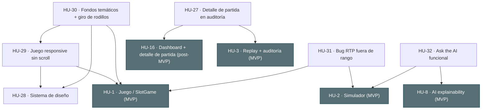

# Índice de historias de usuario (bloque 3 · cierre de huecos) — NovaCasino Studio

Tercer bloque del backlog, en continuidad con el MVP de [`stories.md`](stories.md) (`HU-1` … `HU-12`) y el post-MVP de [`stories-2.md`](stories-2.md) (`HU-13` … `HU-26`). Recoge **mejoras y cierres de huecos detectados durante la revisión** del producto ya construido. Los códigos `HU-N` mantienen la nomenclatura común a historias, tickets y `readme.md`.

> Este bloque nace de tres revisiones del producto ya construido:
> - Una **auditoría doc↔frontend**: al cruzar el catálogo de endpoints del [`readme.md`](../readme.md) §4 con las llamadas reales del frontend se detectó que **`GET /operator/rounds/{roundId}`** era el **único endpoint sin consumidor de UI** → **HU-27** lo cierra.
> - Una **auditoría de usabilidad y diseño** de la interfaz → **HU-28 … HU-30** (sistema de diseño, juego responsive sin scroll, fondos temáticos y giro de rodillos natural), especificadas en [`readme.md` §5](../readme.md#5-especificaciones-de-frontend).
> - Una **revisión de calidad** de features ya construidas → **HU-31** (bug: RTP empírico fuera de rango en los juegos semilla) y **HU-32** (dejar operativo el "ask the AI", con modo offline sin key).

> **Desglose en tickets:** [`../tickets/tickets-3.md`](../tickets/tickets-3.md).

> **Estado: 6/6 implementadas.** HU-27..30 (frontend), **HU-31** (bug RTP: configs recalibradas + guard) y **HU-32** ("ask the AI" funcional con modo offline sin key) implementadas. Detalle en [`../conversation.md`](../conversation.md).

## Unidades de estimación

Igual que en los bloques previos: las **historias** se estiman con **tallas** (S/M/L) y los **tickets** con **Story Points** Fibonacci.

| Talla | Significado | SP orientativos del conjunto de tickets |
|---|---|---|
| **S** | Alcance reducido, poca incertidumbre | ~1-5 SP |
| **M** | Alcance medio | ~5-10 SP |
| **L** | Historia grande; candidata a dividirse | ~10+ SP |

## Historias

| Código | Título | Perfil | Prioridad | Talla | Endpoint(s) principal(es) | Origen | Estado |
|---|---|---|---|---|---|---|---|
| [HU-27](HU-27.md) | El operador consulta el detalle de una partida desde la auditoría | Operador | Could | S | `GET /operator/rounds/{roundId}` *(reutilizado de HU-16)* | Auditoría doc↔FE | ✅ Implementada |
| [HU-28](HU-28.md) | Sistema de diseño y tipografía coherentes en toda la app | Transversal | Should | M | — *(frontend)* | Auditoría UX/UI | ✅ Implementada |
| [HU-29](HU-29.md) | La pantalla de juego se adapta al viewport sin scroll | Jugador | Should | S/M | — *(frontend)* | Auditoría UX/UI | ✅ Implementada |
| [HU-30](HU-30.md) | Fondos temáticos por juego y giro de rodillos natural | Jugador | Could | M | — *(frontend)* | Auditoría UX/UI | ✅ Implementada |
| [HU-31](HU-31.md) | Bug: RTP empírico fuera de rango en los juegos semilla | Matemático | Should | S/M | — *(math/seed)* | Revisión de calidad | ✅ Implementada |
| [HU-32](HU-32.md) | "Ask the AI" funcional (con modo offline sin API key) | Matemático | Should | M | `POST /math/simulations/{id}/explain` | Revisión de calidad | ✅ Implementada |

## Cobertura

- **HU-27** da uso de UI al endpoint de **detalle de partida** (`GET /operator/rounds/{roundId}`), que ya existía desde [HU-16](HU-16.md) pero no tenía pantalla que lo consumiera. Añade un **modal de detalle ligero** (importes + rejilla de símbolos + líneas ganadoras) en la auditoría del operador, dejando el *replay* visual completo de [HU-3](HU-3.md) intacto.
- **HU-28** introduce el **sistema de diseño** (tokens + fuentes auto‑alojadas + componentes) y lo aplica a **toda** la app, unificando tipografía y colores. Base de las dos siguientes.
- **HU-29** hace la **pantalla de juego responsive sin scroll** (dos columnas en ancho/landscape) y **fija el botón Spin**.
- **HU-30** añade **fondos temáticos por juego** y sustituye el parpadeo por un **giro de rodillos** vertical con parada escalonada.
- **HU-31** corrige un **bug**: el RTP empírico de los juegos semilla salía ~3000% por configs sin calibrar (el motor es correcto). Recalibra las 3 configs al target + guard de regresión.
- **HU-32** deja **operativo el "ask the AI"**: modo offline determinista (funciona sin API key) y activación real de Claude cuando hay key.

**Explícitamente fuera de alcance:** cambios de backend (ninguna de las cuatro historias añade backend) y la reproducción animada del operador (sigue siendo el *replay*). HU-28..30 son puramente de frontend.

## Árbol de dependencias entre historias

Una arista `A → B` significa "**A depende de B**" (B debe existir antes). Todo el bloque presupone el MVP y el post-MVP completos; aquí se dibujan las dependencias **directas** más significativas.

**Aristas directas (referencia textual):**

| Historia | Depende de |
|---|---|
| HU-27 | HU-16 (endpoint de detalle), HU-3 (lista de auditoría) |
| HU-28 | — (transversal; base de HU-29 y HU-30) |
| HU-29 | HU-28 (tokens), HU-1 (pantalla de juego) |
| HU-30 | HU-28 (tokens), HU-29 (layout), HU-1 (`SlotGame`) |
| HU-31 | HU-1 (motor/seeder), HU-2 (simulador para verificar el RTP) |
| HU-32 | HU-8 (adaptador IA/endpoint/`ExplainBox`), HU-2 (simulación) |

**Orden de construcción.** HU-27 es independiente. Bloque de UX: **HU-28 → HU-29 → HU-30** (frontend + QA). Bloque de calidad: **HU-31** (math/seed + QA) y **HU-32** (backend/IA + DevOps + QA) son independientes entre sí.
