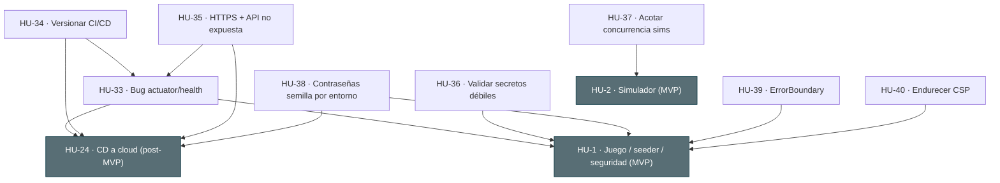

# Índice de historias de usuario (bloque 4 · demo público en VPS) — NovaCasino Studio

Cuarto bloque del backlog, en continuidad con el MVP de [`stories.md`](stories.md) (`HU-1` … `HU-12`), el post-MVP de [`stories-2.md`](stories-2.md) (`HU-13` … `HU-26`) y el cierre de huecos de [`stories-3.md`](stories-3.md) (`HU-27` … `HU-32`). Los códigos `HU-N` mantienen la nomenclatura común a historias, tickets y `readme.md`.

> Este bloque nace de una **auditoría de preparación para el despliegue**, pedida expresamente por el equipo ("actúa como auditor de software experto en QA y detecta problemas para la salida a producción"). La auditoría inicial se hizo con la vara de un entorno de producción real (regulado, multi-nodo); al replantear el objetivo real —**levantar un demo público en un VPS, no una producción real**—, el alcance se ha **re-triado**: sólo entran al bloque 4 los hallazgos que son bloqueantes o de bajo esfuerzo/alto valor para *ese* objetivo concreto.
>
> **Hallazgos descartados explícitamente de este bloque** (documentados aquí para no perder la traza, no generan HU):
> - **Swagger/OpenAPI público** (`/swagger-ui/**` sin autenticación): aceptado como riesgo para un demo educativo sin datos ni dinero reales; incluso es útil para que un evaluador explore la API.
> - **JWT en `localStorage`** en vez de cookie `httpOnly`: ya es un trade-off asumido del proyecto; HU-40 mitiga parcialmente su impacto (CSP), no se replantea la arquitectura de sesión.
> - **Rate limiter en memoria y reconciler "mata-todo-RUNNING" pensados para un solo nodo**: no aplican — el demo corre en un único VPS, no hay despliegue multi-nodo previsto.
> - **Consolidar las migraciones V12-V16 de RTP semilla** y **exponer métricas/observabilidad (Prometheus)**: pulido de bajo valor para un demo puntual; quedan como nota de backlog, no como HU.

> **Desglose en tickets:** [`../tickets/tickets-4.md`](../tickets/tickets-4.md).

> **Estado: 6/8 implementadas.** HU-33, HU-36, HU-37, HU-38, HU-39 y HU-40 implementadas y verificadas. **HU-34 parcial** (`.github/workflows` versionado; falta el `Environment` de GitHub, bloqueado porque todavía no hay VPS/dominio real). **HU-35 bloqueada por el mismo motivo** (TLS necesita un dominio real). Detalle en [`../conversation.md`](../conversation.md).

## Unidades de estimación

Igual que en los bloques previos: las **historias** se estiman con **tallas** (S/M/L) y los **tickets** con **Story Points** Fibonacci.

| Talla | Significado | SP orientativos del conjunto de tickets |
|---|---|---|
| **S** | Alcance reducido, poca incertidumbre | ~1-5 SP |
| **M** | Alcance medio | ~5-10 SP |
| **L** | Historia grande; candidata a dividirse | ~10+ SP |

## Historias

| Código | Título | Perfil | Prioridad | Talla | Origen | Estado |
|---|---|---|---|---|---|---|
| [HU-33](HU-33.md) | Bug: `/actuator/health` exige autenticación y rompe el propio despliegue | Plataforma/DevOps | Must | S | Auditoría de despliegue | ✅ Implementada |
| [HU-34](HU-34.md) | Versionar y activar el pipeline de CI/CD para poder desplegar al VPS | Plataforma/DevOps | Should | S | Auditoría de despliegue | 🟡 Parcial (falta VPS) |
| [HU-35](HU-35.md) | El demo público sólo se sirve por HTTPS y la API no queda expuesta directamente | Plataforma/DevOps | Must | S/M | Auditoría de despliegue | ⏳ Bloqueada (falta VPS) |
| [HU-36](HU-36.md) | La API rechaza arrancar con secretos de despliegue débiles o de ejemplo | Plataforma/DevOps | Should | S | Auditoría de despliegue | ✅ Implementada |
| [HU-37](HU-37.md) | Acotar la concurrencia de simulaciones para proteger el VPS del demo | Matemático/Plataforma | Should | S/M | Auditoría de despliegue | ✅ Implementada |
| [HU-38](HU-38.md) | Las contraseñas de las cuentas semilla del demo se configuran por entorno | Plataforma/DevOps | Should | S | Auditoría de despliegue | ✅ Implementada |
| [HU-39](HU-39.md) | Un error de render no deja la pantalla en blanco | Transversal | Could | S | Auditoría de despliegue | ✅ Implementada |
| [HU-40](HU-40.md) | Endurecer la Content-Security-Policy del frontend | Transversal | Could | S | Auditoría de despliegue | ✅ Implementada |

## Cobertura

- **HU-33** corrige un **bug que impide que el propio despliegue documentado arranque**: el *healthcheck* de `deploy/docker-compose.prod.yml` y `scripts/smoke-test.sh` asumen `/actuator/health` accesible sin token, pero al implementarla se descubrió una causa más profunda de lo esperado — **`spring-boot-starter-actuator` ni siquiera era una dependencia del proyecto** (el *endpoint* no existía), además de que `SecurityConfig` lo habría bloqueado igualmente. Es el bloqueante nº 1 y no depende de nada más del bloque. **✅ Implementada** y verificada en vivo (`GET /actuator/health` → `200 {"status":"UP"}` sin token; el resto de rutas, incluido `/actuator/env`, sigue en `401`).
- **HU-34** pone en marcha lo que **HU-24** ya diseñó pero nunca llegó a versionarse: `.github/workflows/` está en disco pero no en git, así que no hay CI/CD real hasta comprometerlo y configurar el entorno de destino (VPS).
- **HU-35** cierra la exposición de red innecesaria para un demo **público**: TLS delante de `web` y dejar de publicar el puerto 8080 de `api` directamente al host.
- **HU-36** evita un error de despliegue silencioso: que el `JWT_SECRET` de ejemplo (`admin`) o cualquier valor débil llegue a firmar sesiones en el VPS público. **✅ Implementada**: `JwtService` falla al arrancar con secretos < 32 bytes (verificado con un `docker run` puntual: `IllegalStateException` y el contenedor no llega a exponer el puerto); el `.env`/`.env.example` locales ya usan un placeholder/secreto no triviales.
- **HU-37** protege los recursos limitados de un VPS de demo frente a un uso normal pero simultáneo (varias simulaciones de millones de giros a la vez). **✅ Implementada**: `ThreadPoolTaskExecutor` acotado y nombrado (`simulationTaskExecutor`) + rechazo de negocio (`TooManySimulationsException` → 429) si hay demasiadas `RUNNING`. Un primer intento nombró el bean igual que el `@Component SimulationExecutor` autodetectado por Spring, lo que impedía arrancar el contenedor (`BeanDefinitionOverrideException`) — detectado al reconstruir el contenedor de desarrollo, no por los tests unitarios; corregido renombrando el bean.
- **HU-38** mantiene las cuentas semilla (útiles para que un evaluador entre sin pedir alta) pero saca sus contraseñas del código fuente a variables de entorno propias del VPS. **✅ Implementada**: `SeedDataLoader` recibe las contraseñas por constructor (`SEED_*_PASSWORD`, con *bridge* en `application.yml`); guardado explícito contra el caso "variable definida pero vacía" (no cae silenciosamente en una contraseña vacía). `scripts/smoke-test.sh` también actualizado.
- **HU-39** y **HU-40** son mejoras de bajo esfuerzo y alto valor de cara a quien pruebe el demo por primera vez: no ver una pantalla en blanco ante un error, y una CSP más completa como mitigación barata mientras el token viva en `localStorage`. **✅ Implementadas**: `ErrorBoundary` global (verificado con test + suite completa 32/32 ficheros en verde) y CSP endurecida (verificada en vivo contra el contenedor `web` reconstruido; de paso se corrigió que el favicon `data:` llevaba tiempo bloqueado silenciosamente por la CSP al no tener `img-src` explícito).

**Explícitamente fuera de alcance de este bloque:** todo lo listado en la nota de cabecera (Swagger público, sesión en `localStorage`, supuestos multi-nodo, consolidación de migraciones, observabilidad) — son válidos para una producción real regulada, pero no bloquean ni aportan valor inmediato a un demo en un único VPS.

## Árbol de dependencias entre historias

Una arista `A → B` significa "**A depende de B**" (B debe existir antes). Todo el bloque presupone el MVP, el post-MVP y el bloque 3 completos; aquí se dibujan las dependencias **directas** más significativas.

**Aristas directas (referencia textual):**

| Historia | Depende de |
|---|---|
| HU-33 | HU-24 (IaC/CD que asume el healthcheck), HU-1 (seguridad base) |
| HU-34 | HU-24 (diseño del pipeline), HU-33 (el pipeline debe poder arrancar de verdad) |
| HU-35 | HU-33 (el stack debe estar sano antes de exponerlo), HU-24 (IaC base) |
| HU-36 | HU-1 (JWT/seguridad base) |
| HU-37 | HU-2 (simulador, ejecutado de forma asíncrona) |
| HU-38 | HU-1 (`SeedDataLoader`), HU-24 (inyección de secretos por entorno) |
| HU-39 | HU-1 (base de frontend) |
| HU-40 | HU-1 (base de frontend) |

**Orden de construcción.** Bloqueante y primero: **HU-33** (sin ella nada del resto se puede desplegar de verdad). Después, en paralelo: **HU-34 → HU-35** (versionar CI/CD y luego exponer con TLS) por un lado, y **HU-36, HU-37, HU-38** (hardening independientes entre sí) por otro. **HU-39** y **HU-40** son independientes y pueden hacerse en cualquier momento (bajo esfuerzo, sin dependencias entre ellas).
