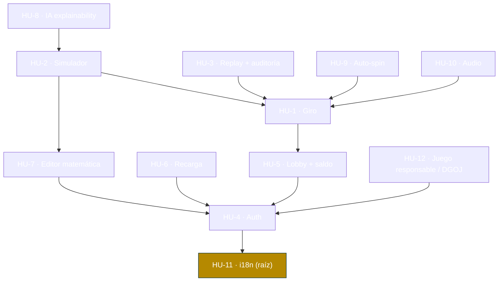

# Índice de historias de usuario — NovaCasino Studio

Backlog completo del MVP: **12 historias** (`HU-1` … `HU-12`), una por fichero `HU-N.md` en esta carpeta. Los códigos `HU-N` son la nomenclatura común a las historias, a los tickets de trabajo de [`../tickets/`](../tickets/) y al [`readme.md`](../readme.md) §5.

> El `readme.md` §5 documenta en detalle solo las **3 historias-faro** (`HU-1`, `HU-2`, `HU-3`), una por perfil y por endpoint prioritario (★). El resto del backlog vive aquí.

## Unidades de estimación

Las **historias** se estiman con **tallas** (esfuerzo relativo de la historia completa); los **tickets** en que se descomponen usan **Story Points** Fibonacci (1, 2, 3, 5, 8, 13).

| Talla | Significado | SP orientativos del conjunto de tickets |
|---|---|---|
| **S** | Alcance reducido, poca incertidumbre | ~1-5 SP |
| **M** | Alcance medio | ~5-10 SP |
| **L** | Historia grande; candidata a dividirse | ~10+ SP |

## Historias

| Código | Título | Perfil | Prioridad | Talla | Endpoint(s) principal(es) | Fase |
|---|---|---|---|---|---|---|
| [HU-1](HU-1.md) | El jugador realiza un giro | Jugador | Must | L | `POST /player/games/{id}/spin` ★ | MVP |
| [HU-2](HU-2.md) | El matemático valida un juego con el simulador | Matemático | Must | L | `POST /math/configs/{id}/simulations` ★ · `GET /math/simulations/{id}` | MVP |
| [HU-3](HU-3.md) | El operador resuelve una reclamación con el replay | Operador | Must | M | `GET /operator/rounds/{id}/replay` ★ · `GET /operator/rounds` | MVP |
| [HU-4](HU-4.md) | Registro y autenticación de usuarios | Transversal | Must | M | `POST /auth/register` ★ · `POST /auth/login` ★ | MVP |
| [HU-5](HU-5.md) | El jugador accede al lobby y consulta su saldo | Jugador | Must | S | `GET /player/games` · `/games/{id}` · `/wallet` | MVP |
| [HU-6](HU-6.md) | El operador gestiona jugadores y recarga su saldo | Operador | Must | S | `GET /operator/players` · `POST .../wallet/recharge` | MVP |
| [HU-7](HU-7.md) | El matemático edita y versiona la matemática de un juego | Matemático | Must | M | `GET /math/games` · `/configs/{id}` · `POST /math/games/{id}/configs` | MVP |
| [HU-8](HU-8.md) | El matemático interpreta resultados con IA | Matemático | Should | M | `POST /math/simulations/{id}/explain` | MVP |
| [HU-9](HU-9.md) | El jugador usa auto-spin con safeguards de juego responsable | Jugador | Should | S | *(reutiliza `POST .../spin`, sin endpoint nuevo)* | MVP |
| [HU-10](HU-10.md) | El jugador disfruta de audio inmersivo | Jugador | Should | M | *(capa de presentación, sin endpoint)* | MVP |
| [HU-11](HU-11.md) | El usuario utiliza la plataforma en su idioma (ES/EN) | Transversal | Must | S | *(transversal; `Accept-Language` en la API)* | MVP |
| [HU-12](HU-12.md) | El jugador percibe mensajes de juego responsable y el sello DGOJ | Jugador | Must | S | *(capa de presentación, sin endpoint)* | MVP |

## Cobertura

- **HU-1…HU-8** cubren los **16 endpoints MVP** del catálogo del [`readme.md`](../readme.md) §4.2.
- **HU-9…HU-12** cubren las **features transversales** del bloque A (auto-spin, audio, i18n, juego responsable/DGOJ) que no están ligadas a un endpoint.

Los tickets de trabajo de cada historia están en [`../tickets/HU-N/`](../tickets/); ver el índice [`../tickets/tickets.md`](../tickets/tickets.md).

## Árbol de dependencias entre historias

Una arista `A → B` significa "**A depende de B**" (B debe existir antes). Se muestran solo las **dependencias directas** (reducción transitiva): las indirectas se alcanzan recorriendo el grafo. Cada historia repite su dependencia directa en su propio fichero.

> **Fundación (no dibujada como arista):** la infraestructura y CI (ticket transversal `HU-1-DEV-01`: Docker Compose, migraciones, pipeline) se asume como base de todo. No se modela como dependencia *entre historias* para evitar ciclos (si no, auth e i18n dependerían de HU-1, y HU-1 de ellas). Su dependencia real sí aparece en el **árbol de tickets** ([../tickets/tickets.md](../tickets/tickets.md)).

**Aristas directas (referencia textual):**

| Historia | Depende de |
|---|---|
| HU-11 | — (raíz) |
| HU-4 | HU-11 |
| HU-5, HU-6, HU-7, HU-12 | HU-4 |
| HU-1 | HU-5 |
| HU-2 | HU-1, HU-7 |
| HU-3, HU-9, HU-10 | HU-1 |
| HU-8 | HU-2 |

**Orden de construcción sugerido** (un *topological sort*): HU-11 → HU-4 → {HU-5, HU-6, HU-7, HU-12} → HU-1 → {HU-2, HU-3, HU-9, HU-10} → HU-8.
