# Índice de tickets de trabajo (post-MVP) — NovaCasino Studio

Backlog de implementación de la **evolución más allá del MVP**: **47 tickets** repartidos en las 14 historias (`HU-13` … `HU-26`), en continuidad con el MVP de [`tickets.md`](tickets.md). La historia de origen de cada grupo está en [`../stories/stories-2.md`](../stories/stories-2.md).

**Convenciones:** código `HU-N-EQUIPO-NN` · equipos **BE** (Backend), **FE** (Frontend), **QA**, **DEV** (DevOps/Plataforma), **DB** · estimación en **Story Points** Fibonacci (1, 2, 3, 5, 8, 13).

> **Estado: IMPLEMENTADO (14/14 historias).** Este índice y los **ficheros individuales** de cada ticket (`HU-N/HU-N-EQUIPO-NN-…md`) están **construidos y verificados**: backend **89 tests unitarios + 107 de integración** y frontend **109 tests** en verde (`tsc` limpio). Migraciones Flyway añadidas: **V4–V10** (refresh, auditoría comercial, juego responsable, cadena de integridad, rol `ADMIN`, jackpot, BRIN). Excepciones de alcance: **HU-23** entrega BRIN + runbook (la conversión a tabla particionada es una migración operativa, ver [`../docs/partitioning-and-retention.md`](../docs/partitioning-and-retention.md)); **HU-24** se entrega como artefactos de CD/IaC (`.github/workflows/cd.yml`, `deploy/`, `scripts/smoke-test.sh`). Trazabilidad por fase en [`../conversation.md`](../conversation.md) (Prompts 80–86).

## HU-13 — Sesión persistente con refresh tokens (6 SP)

| Código | Título | Equipo | SP |
|---|---|---|---|
| [HU-13-BE-01](HU-13/HU-13-BE-01-refresh-tokens.md) | Refresh tokens: endpoint `/auth/refresh`, rotación y revocación | Backend | 3 |
| [HU-13-FE-01](HU-13/HU-13-FE-01-renovacion-silenciosa.md) | Interceptor de renovación silenciosa | Frontend | 2 |
| [HU-13-QA-01](HU-13/HU-13-QA-01-tests-refresh.md) | Tests de refresh y revocación | QA | 1 |

## HU-14 — El jugador consulta su historial (7 SP)

| Código | Título | Equipo | SP |
|---|---|---|---|
| [HU-14-BE-01](HU-14/HU-14-BE-01-endpoints-historial-jugador.md) | Endpoints de historial (movimientos + partidas) paginados | Backend | 3 |
| [HU-14-FE-01](HU-14/HU-14-FE-01-pantallas-historial.md) | Pantallas de historial del jugador | Frontend | 2 |
| [HU-14-QA-01](HU-14/HU-14-QA-01-tests-historial.md) | Tests de historial y aislamiento por jugador | QA | 2 |

## HU-15 — Configuración comercial de los juegos (10 SP)

| Código | Título | Equipo | SP |
|---|---|---|---|
| [HU-15-BE-01](HU-15/HU-15-BE-01-endpoints-config-comercial.md) | Endpoints de configuración comercial (`GET`/`PUT`) + validaciones | Backend | 3 |
| [HU-15-BE-02](HU-15/HU-15-BE-02-auditoria-cambios-comerciales.md) | Auditoría de cambios comerciales | Backend | 2 |
| [HU-15-FE-01](HU-15/HU-15-FE-01-backoffice-config-comercial.md) | Backoffice operador: edición comercial | Frontend | 3 |
| [HU-15-QA-01](HU-15/HU-15-QA-01-tests-config-comercial.md) | Tests de configuración comercial y auditoría | QA | 2 |

## HU-16 — Dashboard de actividad del operador (10 SP)

| Código | Título | Equipo | SP |
|---|---|---|---|
| [HU-16-BE-01](HU-16/HU-16-BE-01-endpoint-dashboard-y-detalle.md) | Endpoint de dashboard (agregados GGR/activos/top) + detalle de partida | Backend | 5 |
| [HU-16-FE-01](HU-16/HU-16-FE-01-dashboard-operador.md) | Dashboard de actividad del operador | Frontend | 3 |
| [HU-16-QA-01](HU-16/HU-16-QA-01-tests-dashboard.md) | Tests de métricas agregadas y aislamiento | QA | 2 |

## HU-17 — Publicación y versionado de matemática (8 SP)

| Código | Título | Equipo | SP |
|---|---|---|---|
| [HU-17-BE-01](HU-17/HU-17-BE-01-endpoints-versiones-y-publicacion.md) | Endpoints de versiones y publicación (activación de `config`) | Backend | 3 |
| [HU-17-FE-01](HU-17/HU-17-FE-01-ui-versiones-y-publicacion.md) | UI de versiones y publicación en el editor | Frontend | 3 |
| [HU-17-QA-01](HU-17/HU-17-QA-01-tests-publicacion.md) | Tests de publicación y activación | QA | 2 |

## HU-18 — Historial de simulaciones e IA (6 SP)

| Código | Título | Equipo | SP |
|---|---|---|---|
| [HU-18-BE-01](HU-18/HU-18-BE-01-endpoints-historial-sim-e-ia.md) | Endpoints de historial de simulaciones y de IA (+ *prompt caching*) | Backend | 3 |
| [HU-18-FE-01](HU-18/HU-18-FE-01-ui-historial-sim-e-ia.md) | UI de historial de simulaciones e hilos de IA | Frontend | 2 |
| [HU-18-QA-01](HU-18/HU-18-QA-01-tests-historial-sim.md) | Tests de historial | QA | 1 |

## HU-19 — Límites de pérdida y autoexclusión (13 SP)

| Código | Título | Equipo | SP |
|---|---|---|---|
| [HU-19-DB-01](HU-19/HU-19-DB-01-esquema-limites-autoexclusion.md) | Esquema de límites y autoexclusión (migración) | DB | 2 |
| [HU-19-BE-01](HU-19/HU-19-BE-01-endpoints-y-verificacion-limites.md) | Endpoints de límites/autoexclusión + verificación *server-side* en el spin | Backend | 5 |
| [HU-19-FE-01](HU-19/HU-19-FE-01-ui-limites-autoexclusion.md) | UI de configuración de límites y autoexclusión | Frontend | 3 |
| [HU-19-QA-01](HU-19/HU-19-QA-01-tests-imposicion-server-side.md) | Tests de imposición *server-side* | QA | 3 |

## HU-20 — Integridad *tamper-evident* de la auditoría (10 SP)

| Código | Título | Equipo | SP |
|---|---|---|---|
| [HU-20-DB-01](HU-20/HU-20-DB-01-hash-encadenado-game-rounds.md) | Columna de hash encadenado en `game_rounds` (migración) | DB | 1 |
| [HU-20-BE-01](HU-20/HU-20-BE-01-cadena-integridad-y-verificacion.md) | Cadena de integridad en la inserción + endpoint de verificación | Backend | 5 |
| [HU-20-FE-01](HU-20/HU-20-FE-01-indicador-integridad.md) | Indicador de integridad en la auditoría del operador | Frontend | 2 |
| [HU-20-QA-01](HU-20/HU-20-QA-01-tests-integridad.md) | Tests de integridad y detección de manipulación | QA | 2 |

## HU-21 — Informes regulatorios DGOJ (RFJ) (9 SP)

| Código | Título | Equipo | SP |
|---|---|---|---|
| [HU-21-BE-01](HU-21/HU-21-BE-01-generacion-informe-rfj.md) | Generación del informe RFJ + *gating* por integridad | Backend | 5 |
| [HU-21-FE-01](HU-21/HU-21-FE-01-ui-informes.md) | UI de generación/descarga de informes | Frontend | 2 |
| [HU-21-QA-01](HU-21/HU-21-QA-01-tests-informes.md) | Tests de informes y bloqueo ante integridad rota | QA | 2 |

## HU-22 — Accesibilidad WCAG 2.1 AA (8 SP)

| Código | Título | Equipo | SP |
|---|---|---|---|
| [HU-22-FE-01](HU-22/HU-22-FE-01-remediacion-accesibilidad.md) | Remediación de accesibilidad por superficie (teclado, ARIA, contraste, *reduced-motion*) | Frontend | 5 |
| [HU-22-QA-01](HU-22/HU-22-QA-01-auditoria-accesibilidad.md) | Auditoría automática (axe) + pruebas de teclado/lector | QA | 2 |
| [HU-22-DEV-01](HU-22/HU-22-DEV-01-accesibilidad-en-ci.md) | Integración de la auditoría de accesibilidad en CI | DevOps | 1 |

## HU-23 — Particionado y retención de la auditoría (10 SP)

| Código | Título | Equipo | SP |
|---|---|---|---|
| [HU-23-DB-01](HU-23/HU-23-DB-01-particionado-game-rounds.md) | Particionado temporal de `game_rounds` + migración del histórico | DB | 5 |
| [HU-23-BE-01](HU-23/HU-23-BE-01-consultas-particiones-y-archivado.md) | Ajuste de consultas a particiones + archivado en frío | Backend | 3 |
| [HU-23-QA-01](HU-23/HU-23-QA-01-tests-particionado.md) | Tests de poda de particiones e integridad tras migrar | QA | 2 |

## HU-24 — Despliegue cloud con entrega continua (13 SP)

| Código | Título | Equipo | SP |
|---|---|---|---|
| [HU-24-DEV-01](HU-24/HU-24-DEV-01-iac-y-secretos.md) | IaC del entorno cloud + gestión de secretos | DevOps | 5 |
| [HU-24-DEV-02](HU-24/HU-24-DEV-02-pipeline-cd.md) | Pipeline de CD (staging → producción con aprobación/rollback) | DevOps | 5 |
| [HU-24-QA-01](HU-24/HU-24-QA-01-smoke-tests-y-rollback.md) | *Smoke tests* post-deploy y ensayo de rollback | QA | 3 |

## HU-25 — Gestión multi-operador (super-admin) (10 SP)

| Código | Título | Equipo | SP |
|---|---|---|---|
| [HU-25-DB-01](HU-25/HU-25-DB-01-rol-admin.md) | Rol `ADMIN` en el dominio `users.role` (migración) | DB | 1 |
| [HU-25-BE-01](HU-25/HU-25-BE-01-endpoints-admin-operators.md) | Endpoints `/admin/operators` + rol `ADMIN` + aislamiento por tenant | Backend | 5 |
| [HU-25-FE-01](HU-25/HU-25-FE-01-administracion-operadores.md) | Superficie de administración de operadores | Frontend | 2 |
| [HU-25-QA-01](HU-25/HU-25-QA-01-tests-aislamiento-multioperador.md) | Tests de aislamiento entre operadores | QA | 2 |

## HU-26 — Jackpots progresivos (16 SP)

| Código | Título | Equipo | SP |
|---|---|---|---|
| [HU-26-DB-01](HU-26/HU-26-DB-01-esquema-pool-jackpot.md) | Esquema del *pool* de jackpot (migración) | DB | 2 |
| [HU-26-BE-01](HU-26/HU-26-BE-01-jackpot-en-spinkernel.md) | Jackpot en el `SpinKernel` (contribución + concesión determinista) + soporte simulador/replay | Backend | 8 |
| [HU-26-FE-01](HU-26/HU-26-FE-01-ui-jackpot.md) | UI del jackpot (*pool* en vivo, celebración) | Frontend | 3 |
| [HU-26-QA-01](HU-26/HU-26-QA-01-tests-jackpot.md) | Tests de determinismo y convergencia del jackpot | QA | 3 |

## Resumen

**Total: 47 tickets · 136 SP.**

| Por historia | SP | | Por equipo | Tickets | SP |
|---|---|---|---|---|---|
| HU-13 | 6 | | Backend (BE) | 13 | 53 |
| HU-14 | 7 | | Frontend (FE) | 12 | 32 |
| HU-15 | 10 | | QA | 14 | 29 |
| HU-16 | 10 | | DB | 5 | 11 |
| HU-17 | 8 | | DevOps (DEV) | 3 | 11 |
| HU-18 | 6 | | **Total** | **47** | **136** |
| HU-19 | 13 | | | | |
| HU-20 | 10 | | | | |
| HU-21 | 9 | | | | |
| HU-22 | 8 | | | | |
| HU-23 | 10 | | | | |
| HU-24 | 13 | | | | |
| HU-25 | 10 | | | | |
| HU-26 | 16 | | | | |

> **Nota sobre el trabajo de base de datos.** El bloque post-MVP suma **5 migraciones Flyway** sobre el esquema del MVP (`HU-1-DB-01`), todas **aditivas y sin pérdida**: límites/autoexclusión (`HU-19-DB-01`), hash encadenado de `game_rounds` (`HU-20-DB-01`), particionado de `game_rounds` (`HU-23-DB-01`), ampliación del dominio `users.role` con `ADMIN` (`HU-25-DB-01`) y *pool* de jackpot (`HU-26-DB-01`). `HU-23-DB-01` es la de mayor riesgo (migra el histórico al esquema particionado) y debe coordinarse con `HU-20` para no romper la cadena de integridad.

---

## Árboles de dependencias por historia

Un sub-diagrama por historia. Aristas `A → B` = "**A depende de B**" (directas, reducción transitiva). Los nodos **externos** (tickets del MVP, de otra historia) se marcan con borde discontinuo: deben existir antes pero se desarrollan en su propia historia. Las dependencias entre historias están en [`../stories/stories-2.md`](../stories/stories-2.md).

> Todo el bloque presupone el MVP completo (`tickets.md`); los nodos externos referencian los tickets del MVP de los que cada historia depende directamente.

### HU-13 — Refresh tokens
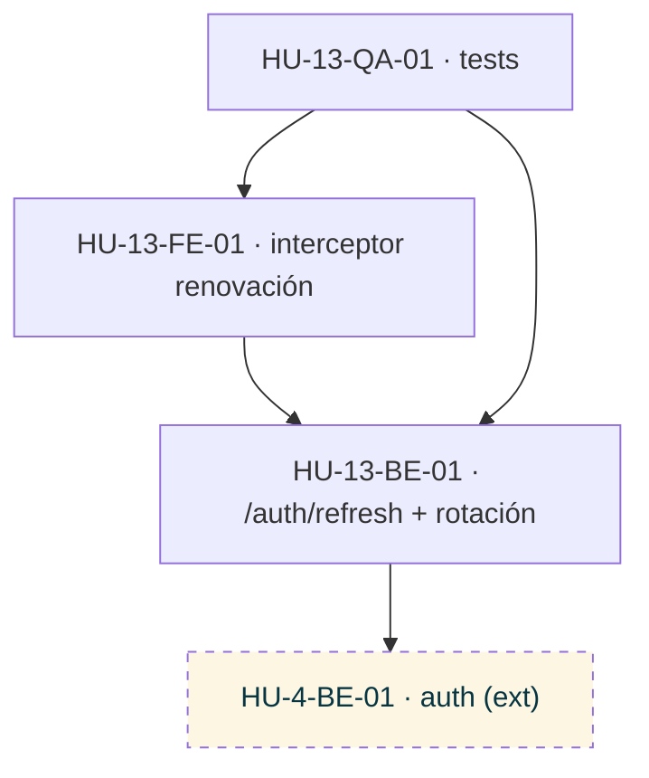

### HU-14 — Historial del jugador
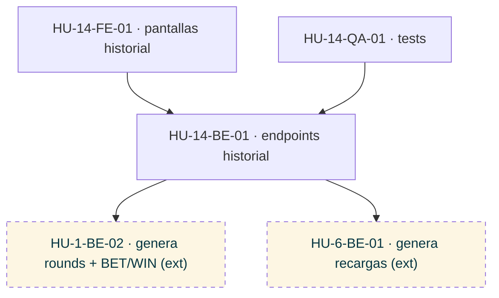

### HU-15 — Configuración comercial de los juegos
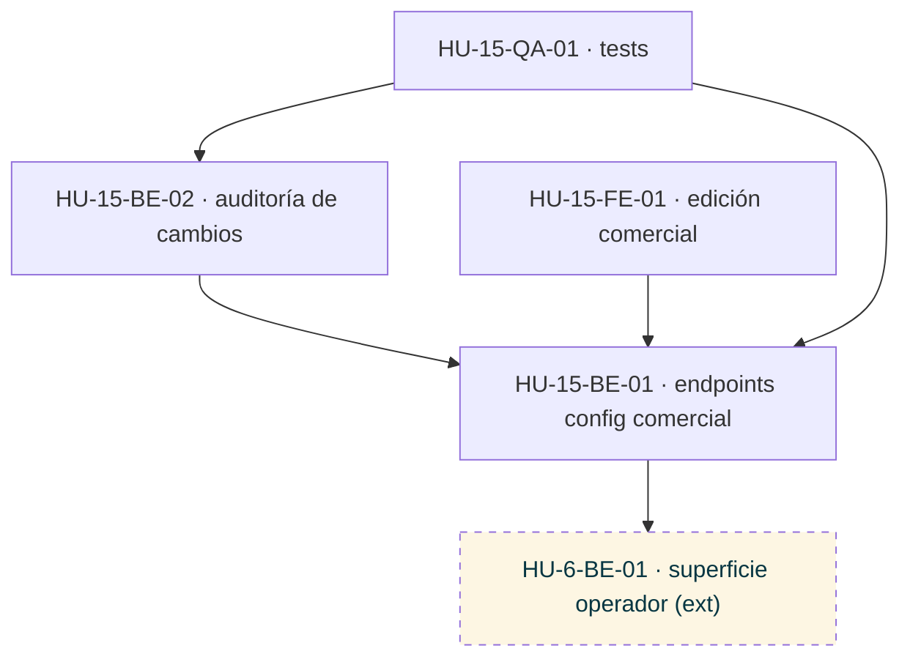

### HU-16 — Dashboard del operador
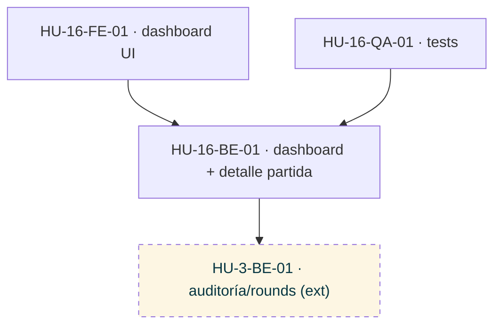

### HU-17 — Publicación y versionado de matemática
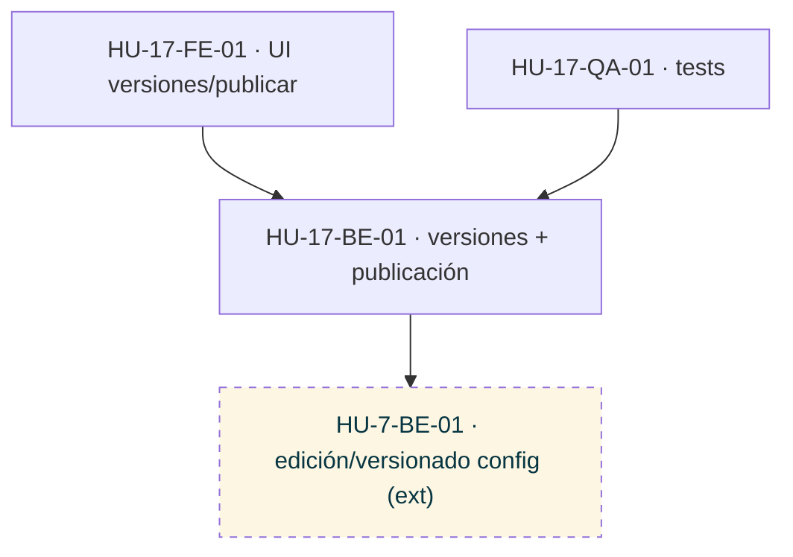

### HU-18 — Historial de simulaciones e IA
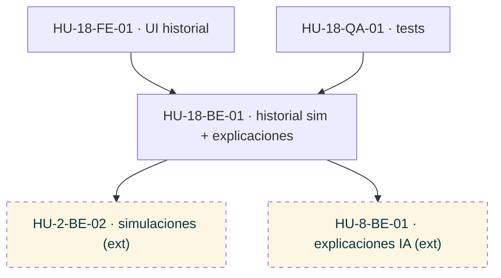

### HU-19 — Límites y autoexclusión
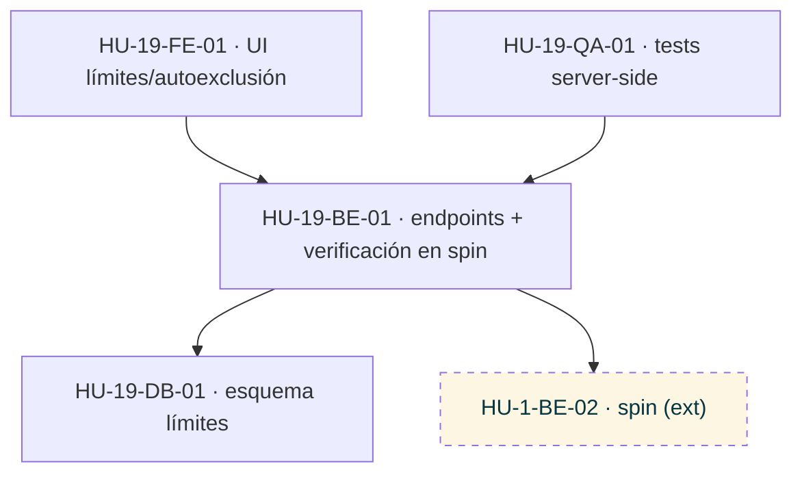

### HU-20 — Integridad de la auditoría
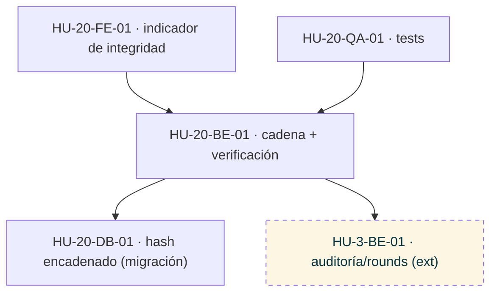

### HU-21 — Informes DGOJ (RFJ)
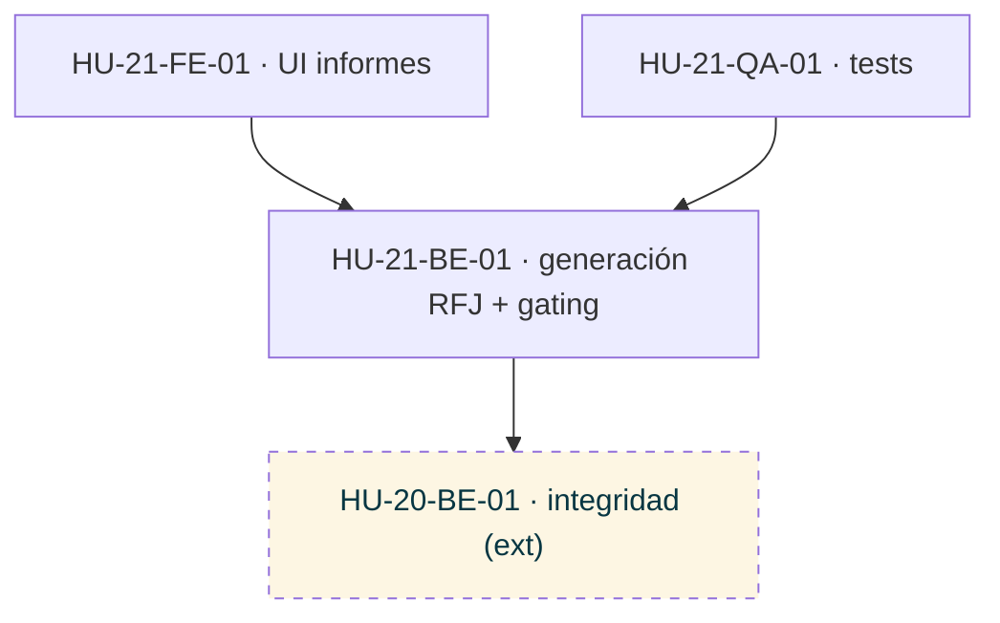

### HU-22 — Accesibilidad WCAG 2.1 AA
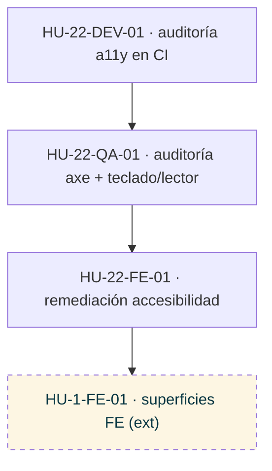

### HU-23 — Particionado y retención de la auditoría
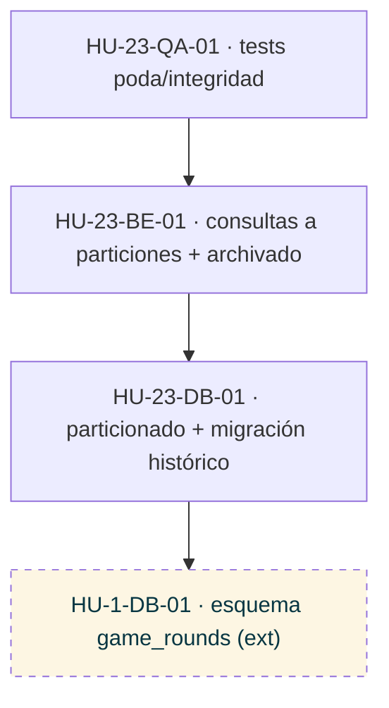

### HU-24 — Despliegue cloud con CD
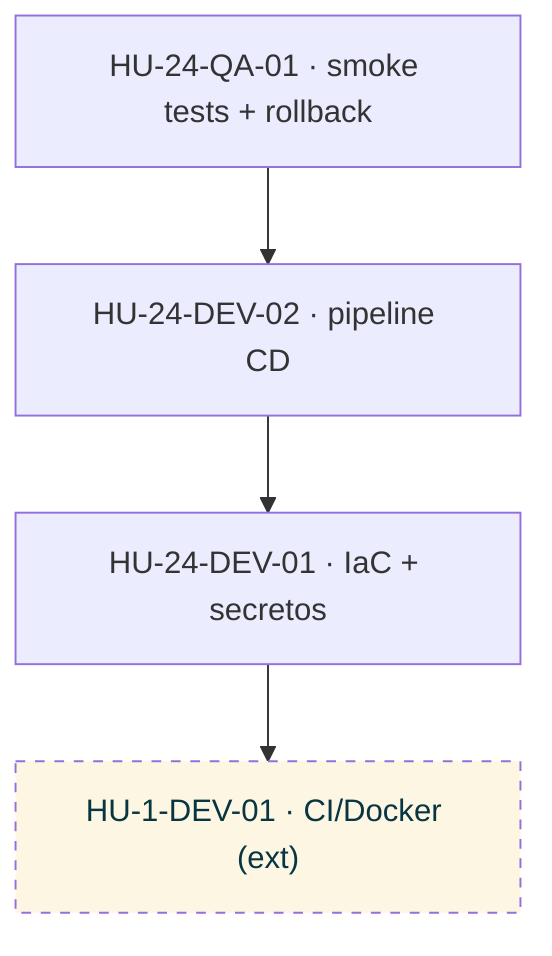

### HU-25 — Gestión multi-operador
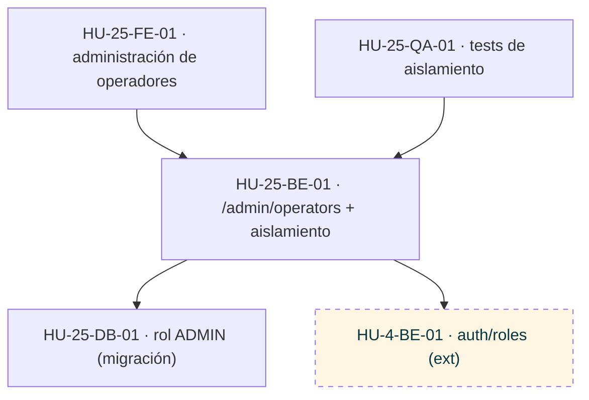

### HU-26 — Jackpots progresivos
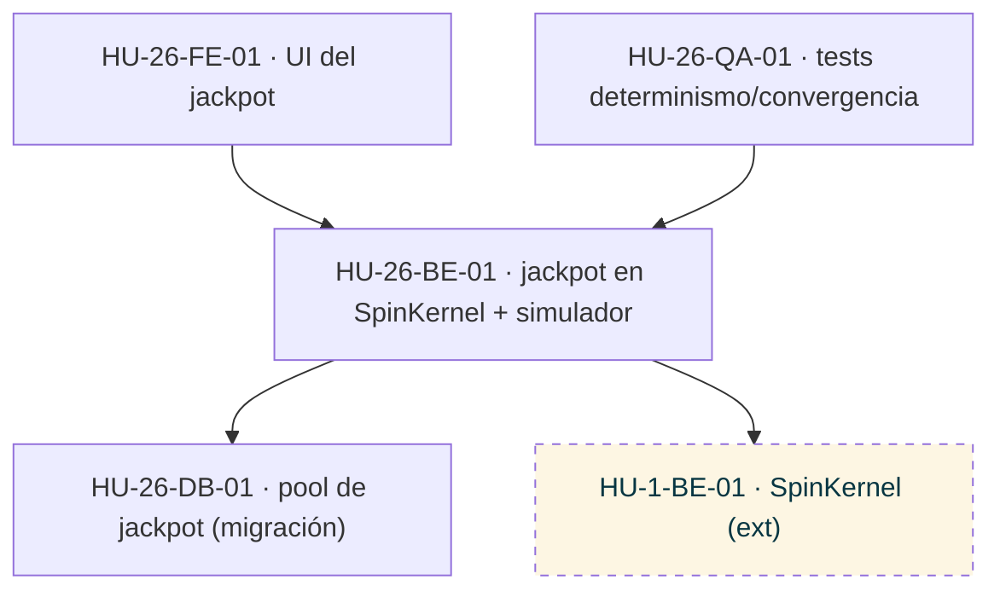
