# Índice de tickets de trabajo — NovaCasino Studio

Backlog de implementación del MVP: **39 tickets** repartidos en las 12 historias (`HU-1` … `HU-12`). Cada ticket es un fichero `HU-N-EQUIPO-NN-…md` en su carpeta `HU-N/`. La historia de origen de cada grupo está en [`../stories/`](../stories/) (índice: [`../stories/stories.md`](../stories/stories.md)).

**Convenciones:** código `HU-N-EQUIPO-NN` · equipos **BE** (Backend), **FE** (Frontend), **QA**, **DEV** (DevOps/Plataforma) · estimación en **Story Points** Fibonacci (1, 2, 3, 5, 8, 13).

> **Más allá del MVP:** el desglose en tickets del backlog de evolución (`HU-13` … `HU-26`, 47 tickets) está en [`tickets-2.md`](tickets-2.md), correspondiente a las historias de [`../stories/stories-2.md`](../stories/stories-2.md).

## HU-1 — El jugador realiza un giro (33 SP)

| Código | Título | Equipo | SP |
|---|---|---|---|
| [HU-1-BE-01](HU-1/HU-1-BE-01-motor-de-juego-data-driven.md) | Motor de juego data-driven | Backend | 8 |
| [HU-1-BE-02](HU-1/HU-1-BE-02-spinusecase-idempotencia-endpoint.md) | SpinUseCase, idempotencia y endpoint `/spin` | Backend | 5 |
| [HU-1-DB-01](HU-1/HU-1-DB-01-esquema-y-migraciones.md) | Esquema y migraciones Flyway | DB | 5 |
| [HU-1-FE-01](HU-1/HU-1-FE-01-componente-slotgame-y-spin.md) | Componente `<SlotGame>` y spin | Frontend | 8 |
| [HU-1-QA-01](HU-1/HU-1-QA-01-tests-flujo-de-juego.md) | Suite de tests del flujo de juego | QA | 5 |
| [HU-1-DEV-01](HU-1/HU-1-DEV-01-docker-compose-y-pipeline-ci.md) | Docker Compose y pipeline CI | DevOps | 2 |

## HU-2 — El matemático valida un juego con el simulador (18 SP)

| Código | Título | Equipo | SP |
|---|---|---|---|
| [HU-2-BE-01](HU-2/HU-2-BE-01-modulo-nova-simulator.md) | Módulo `nova-simulator` | Backend | 5 |
| [HU-2-BE-02](HU-2/HU-2-BE-02-api-simulaciones-asincrona.md) | API de simulaciones asíncrona | Backend | 3 |
| [HU-2-FE-01](HU-2/HU-2-FE-01-backoffice-matematico-y-dashboard.md) | Backoffice matemático y dashboard | Frontend | 5 |
| [HU-2-QA-01](HU-2/HU-2-QA-01-tests-del-simulador-y-convergencia-rtp.md) | Tests del simulador y convergencia del RTP | QA | 3 |
| [HU-2-DEV-01](HU-2/HU-2-DEV-01-job-perf-en-ci.md) | Job `perf` en CI | DevOps | 2 |

## HU-3 — El operador resuelve una reclamación con el replay (15 SP)

| Código | Título | Equipo | SP |
|---|---|---|---|
| [HU-3-BE-01](HU-3/HU-3-BE-01-api-auditoria-con-filtros.md) | API de auditoría con filtros | Backend | 3 |
| [HU-3-BE-02](HU-3/HU-3-BE-02-endpoint-replay-determinista.md) | Endpoint de *replay* determinista | Backend | 3 |
| [HU-3-FE-01](HU-3/HU-3-FE-01-backoffice-operador-auditoria.md) | Backoffice operador: auditoría | Frontend | 3 |
| [HU-3-FE-02](HU-3/HU-3-FE-02-pantalla-de-replay.md) | Pantalla de Replay | Frontend | 3 |
| [HU-3-QA-01](HU-3/HU-3-QA-01-tests-auditoria-y-replay.md) | Tests de auditoría y replay | QA | 3 |

## HU-4 — Registro y autenticación (10 SP)

| Código | Título | Equipo | SP |
|---|---|---|---|
| [HU-4-BE-01](HU-4/HU-4-BE-01-autenticacion-y-autorizacion.md) | Autenticación y autorización | Backend | 5 |
| [HU-4-FE-01](HU-4/HU-4-FE-01-pantallas-registro-y-login.md) | Pantallas de registro y login | Frontend | 3 |
| [HU-4-QA-01](HU-4/HU-4-QA-01-tests-de-autenticacion.md) | Tests de autenticación y autorización | QA | 2 |

## HU-5 — Lobby y saldo del jugador (6 SP)

| Código | Título | Equipo | SP |
|---|---|---|---|
| [HU-5-BE-01](HU-5/HU-5-BE-01-endpoints-catalogo-y-wallet.md) | Endpoints de catálogo y wallet | Backend | 2 |
| [HU-5-FE-01](HU-5/HU-5-FE-01-lobby-y-saldo.md) | Lobby y saldo | Frontend | 2 |
| [HU-5-QA-01](HU-5/HU-5-QA-01-tests-lobby-y-saldo.md) | Tests de lobby y saldo | QA | 2 |

## HU-6 — Gestión y recarga de jugadores (8 SP)

| Código | Título | Equipo | SP |
|---|---|---|---|
| [HU-6-BE-01](HU-6/HU-6-BE-01-endpoints-jugadores-y-recarga.md) | Endpoints de jugadores y recarga idempotente | Backend | 3 |
| [HU-6-FE-01](HU-6/HU-6-FE-01-backoffice-operador-recarga.md) | Backoffice operador: búsqueda y recarga | Frontend | 3 |
| [HU-6-QA-01](HU-6/HU-6-QA-01-tests-recarga.md) | Tests de gestión y recarga | QA | 2 |

## HU-7 — Edición y versionado de matemática (10 SP)

| Código | Título | Equipo | SP |
|---|---|---|---|
| [HU-7-BE-01](HU-7/HU-7-BE-01-endpoints-edicion-y-versionado-config.md) | Endpoints de edición y versionado de `config` | Backend | 5 |
| [HU-7-FE-01](HU-7/HU-7-FE-01-editor-de-matematica.md) | Editor de matemática | Frontend | 3 |
| [HU-7-QA-01](HU-7/HU-7-QA-01-tests-versionado-e-invariantes.md) | Tests de versionado e invariantes | QA | 2 |

## HU-8 — Explicación con IA (9 SP)

| Código | Título | Equipo | SP |
|---|---|---|---|
| [HU-8-BE-01](HU-8/HU-8-BE-01-adaptador-anthropic-y-endpoint-explain.md) | Adaptador Anthropic y endpoint `explain` | Backend | 5 |
| [HU-8-FE-01](HU-8/HU-8-FE-01-caja-pregunta-ia.md) | Caja de pregunta a la IA | Frontend | 2 |
| [HU-8-QA-01](HU-8/HU-8-QA-01-tests-explainability.md) | Tests de AI explainability | QA | 2 |

## HU-9 — Auto-spin con safeguards (5 SP)

| Código | Título | Equipo | SP |
|---|---|---|---|
| [HU-9-FE-01](HU-9/HU-9-FE-01-auto-spin-con-safeguards.md) | Auto-spin con safeguards | Frontend | 3 |
| [HU-9-QA-01](HU-9/HU-9-QA-01-tests-auto-spin.md) | Tests de auto-spin | QA | 2 |

## HU-10 — Audio inmersivo (4 SP)

| Código | Título | Equipo | SP |
|---|---|---|---|
| [HU-10-FE-01](HU-10/HU-10-FE-01-capa-de-audio.md) | Capa de audio inmersivo | Frontend | 3 |
| [HU-10-QA-01](HU-10/HU-10-QA-01-tests-audio.md) | Tests de la capa de audio | QA | 1 |

## HU-11 — Internacionalización ES/EN (7 SP)

| Código | Título | Equipo | SP |
|---|---|---|---|
| [HU-11-FE-01](HU-11/HU-11-FE-01-i18next-bundles-y-conmutacion.md) | i18next: bundles y conmutación de idioma | Frontend | 3 |
| [HU-11-BE-01](HU-11/HU-11-BE-01-mensajes-i18n-en-la-api.md) | Mensajes i18n en la API | Backend | 2 |
| [HU-11-QA-01](HU-11/HU-11-QA-01-tests-i18n.md) | Tests de internacionalización | QA | 2 |

## HU-12 — Juego responsable y sello DGOJ (4 SP)

| Código | Título | Equipo | SP |
|---|---|---|---|
| [HU-12-FE-01](HU-12/HU-12-FE-01-sello-dgoj-y-juego-responsable.md) | Sello DGOJ y mensajes de juego responsable | Frontend | 3 |
| [HU-12-QA-01](HU-12/HU-12-QA-01-tests-compliance-ui.md) | Tests de la capa de cumplimiento | QA | 1 |

## Resumen

**Total: 40 tickets · 129 SP.**

| Por historia | SP | | Por equipo | Tickets | SP |
|---|---|---|---|---|---|
| HU-1 | 33 | | Backend (BE) | 12 | 49 |
| HU-2 | 18 | | Frontend (FE) | 13 | 44 |
| HU-3 | 15 | | QA | 12 | 27 |
| HU-4 | 10 | | DB | 1 | 5 |
| HU-5 | 6 | | DevOps (DEV) | 2 | 4 |
| HU-6 | 8 | | **Total** | **40** | **129** |
| HU-7 | 10 | | | | |
| HU-8 | 9 | | | | |
| HU-9 | 5 | | | | |
| HU-10 | 4 | | | | |
| HU-11 | 7 | | | | |
| HU-12 | 4 | | | | |

> **Nota sobre el trabajo de base de datos:** el ticket de BBDD es **`HU-1-DB-01` — Esquema y migraciones Flyway** (`V1` esquema/índices, `V2` triggers de inmutabilidad, `V3` seed), **fundación de datos** que presupone todo ticket de persistencia. La infra que lo ejecuta (contenedor Postgres + arranque) es de `HU-1-DEV-01`; la persistencia transaccional se construye en `HU-1-BE-02`, y el versionado/índices específicos del editor en `HU-7-BE-01`. Los demás tickets de persistencia (`HU-5-BE-01`, `HU-6-BE-01`, `HU-2-BE-02`, `HU-3-BE-01/02`, `HU-8-BE-01`) **asumen** el esquema como fundación, igual que la infra.

---

## Árboles de dependencias por historia

Un sub-diagrama por historia. Aristas `A → B` = "**A depende de B**" (directas, reducción transitiva). Los nodos **externos** (tickets de otra HU) se marcan con borde discontinuo; representan entradas que deben existir antes pero se desarrollan en su propia historia. Las dependencias entre historias están en [`../stories/stories.md`](../stories/stories.md).

> El ticket fundacional **`HU-1-DEV-01`** (infra/CI) es raíz de casi todo el backend; aparece como entrada externa en otras historias.

### HU-1 — El jugador realiza un giro
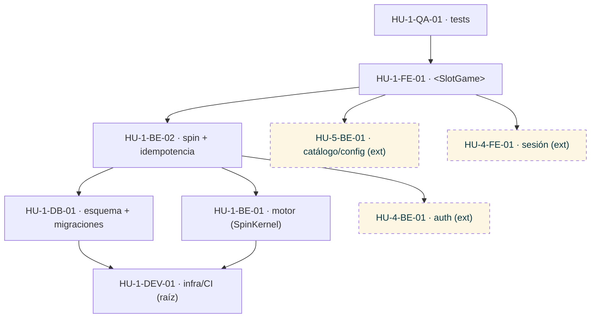

### HU-4 — Registro y autenticación
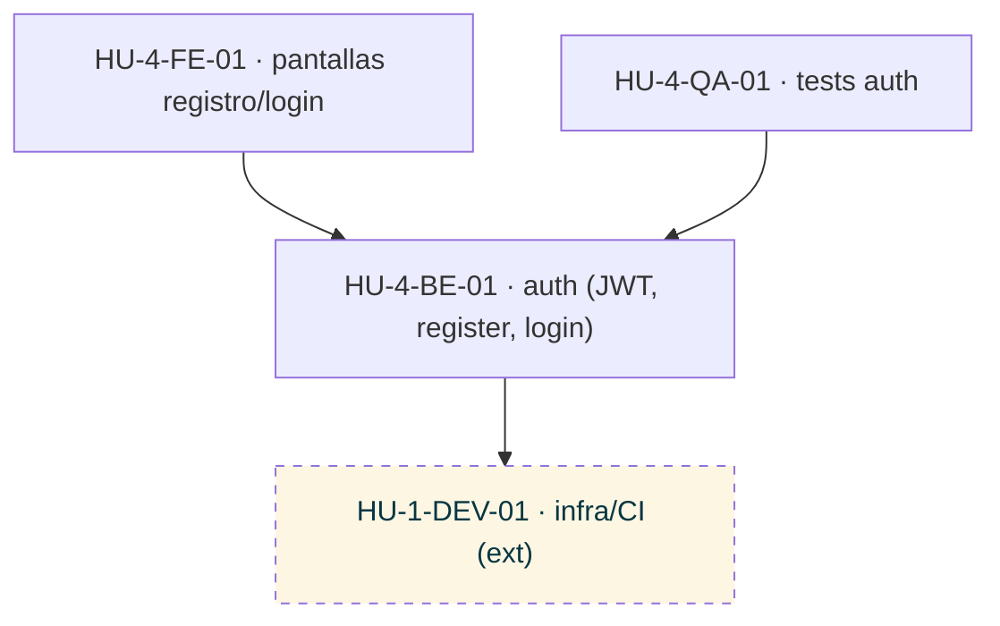

### HU-5 — Lobby y saldo
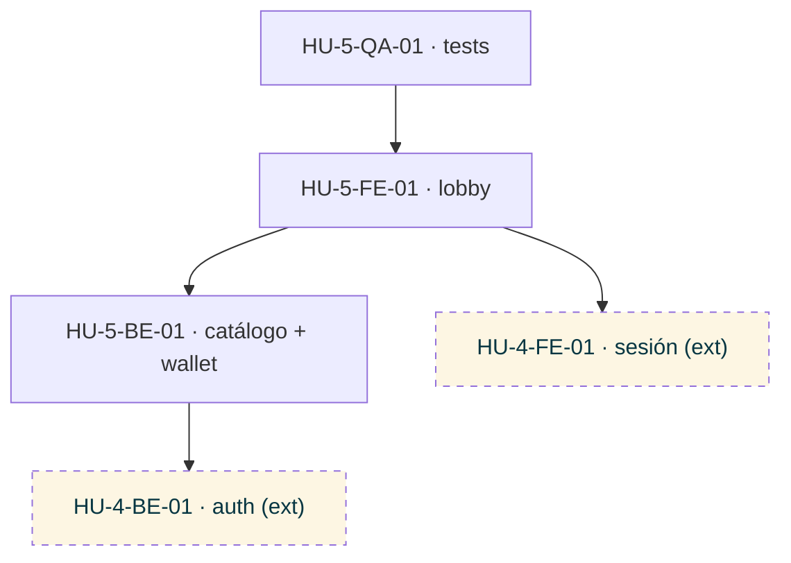

### HU-6 — Gestión y recarga de jugadores
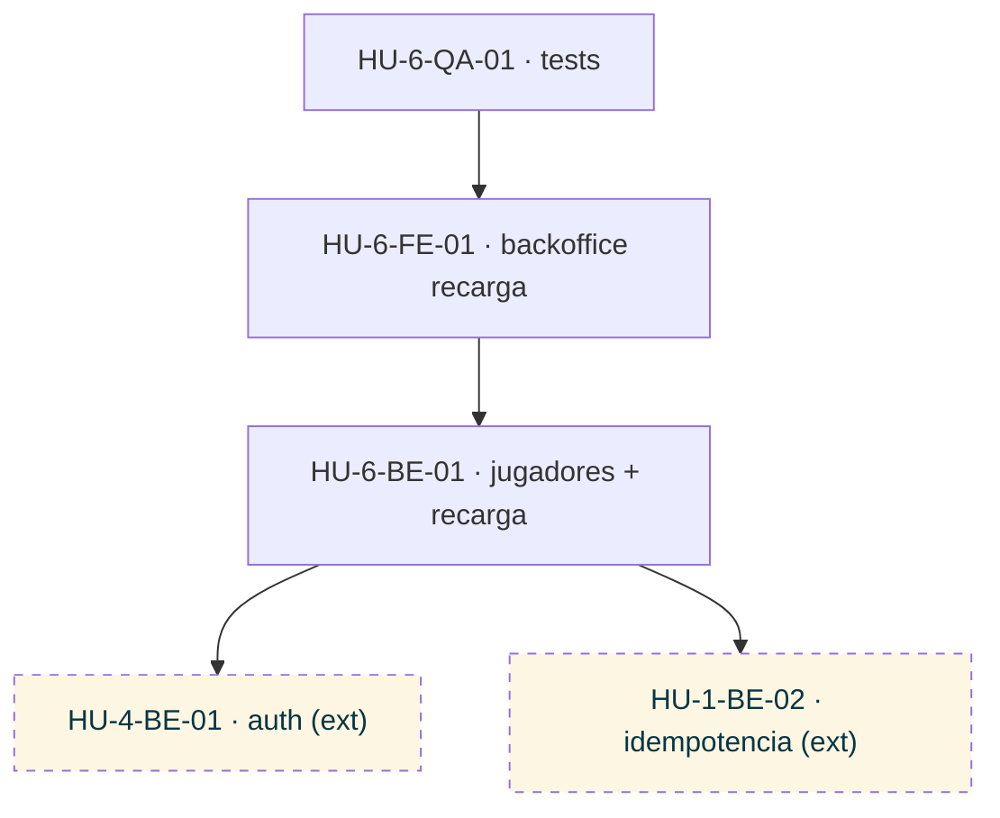

### HU-7 — Edición y versionado de matemática
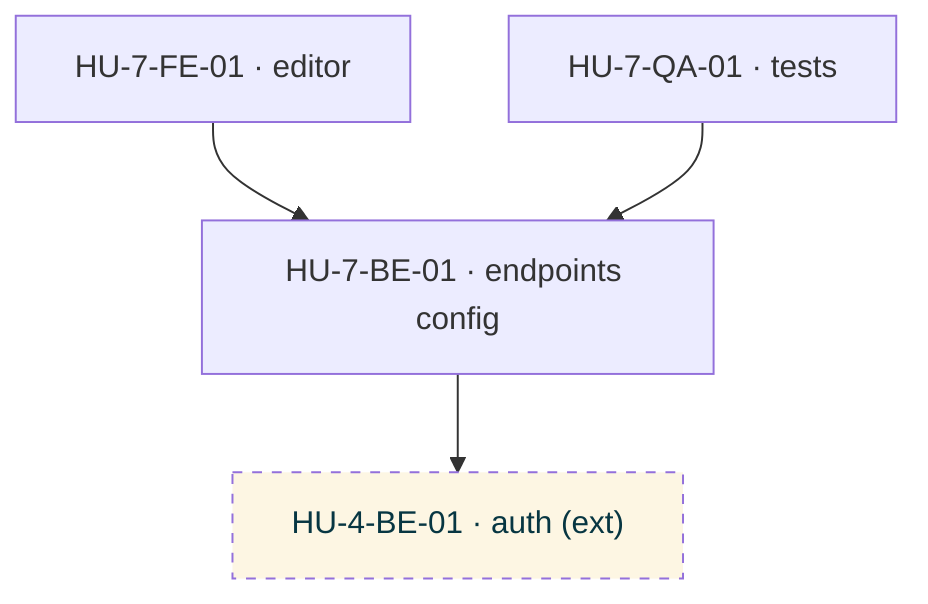

### HU-2 — Simulador
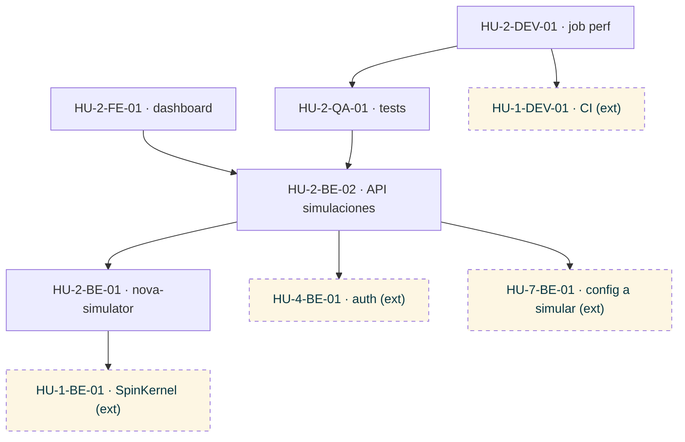

### HU-3 — Replay + auditoría
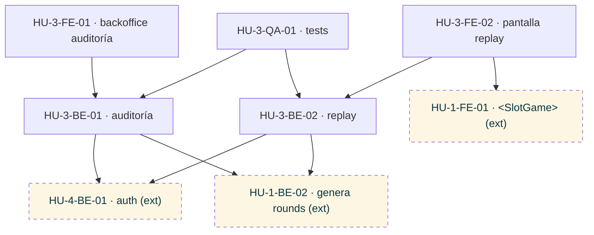

### HU-8 — IA explainability
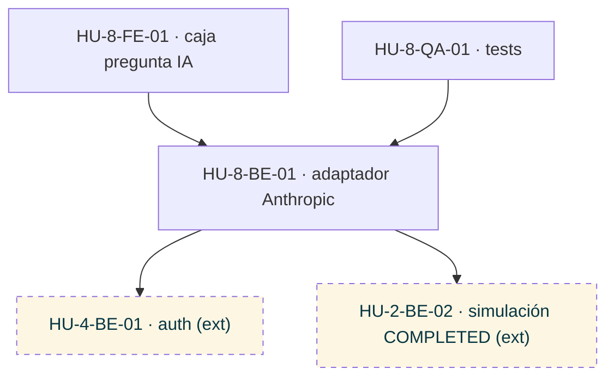

### HU-9 — Auto-spin
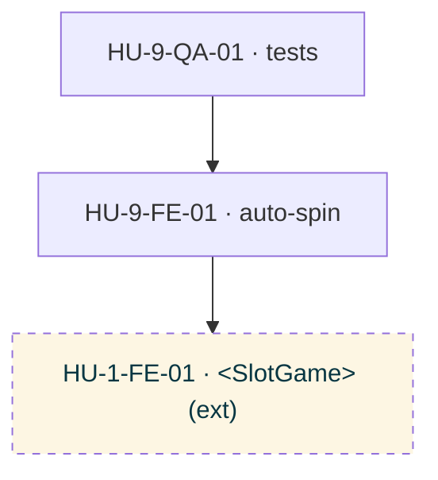

### HU-10 — Audio inmersivo
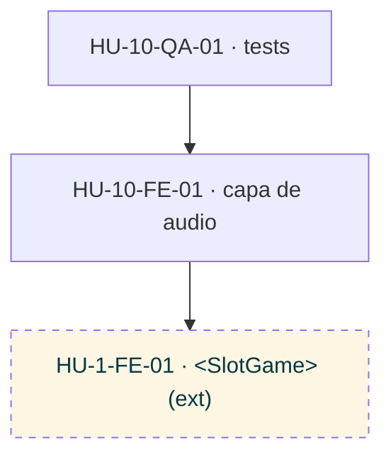

### HU-11 — Internacionalización ES/EN
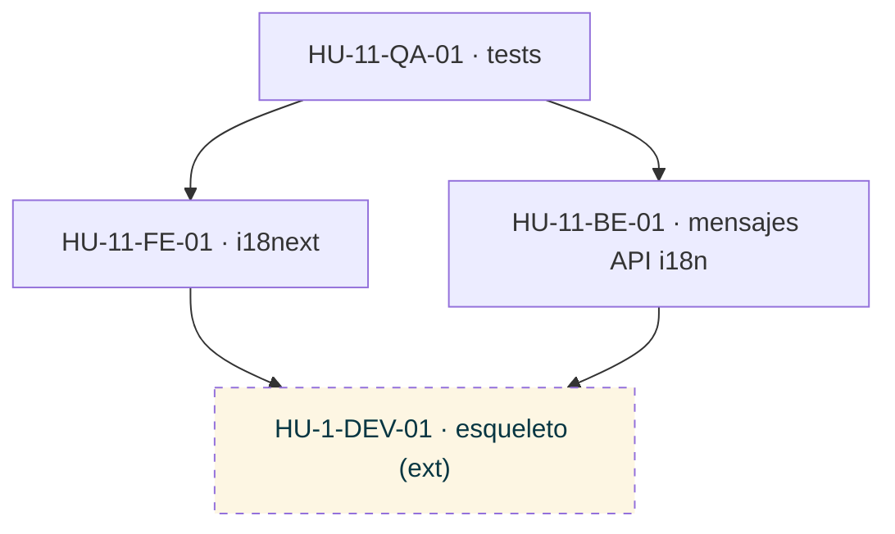

### HU-12 — Juego responsable y sello DGOJ
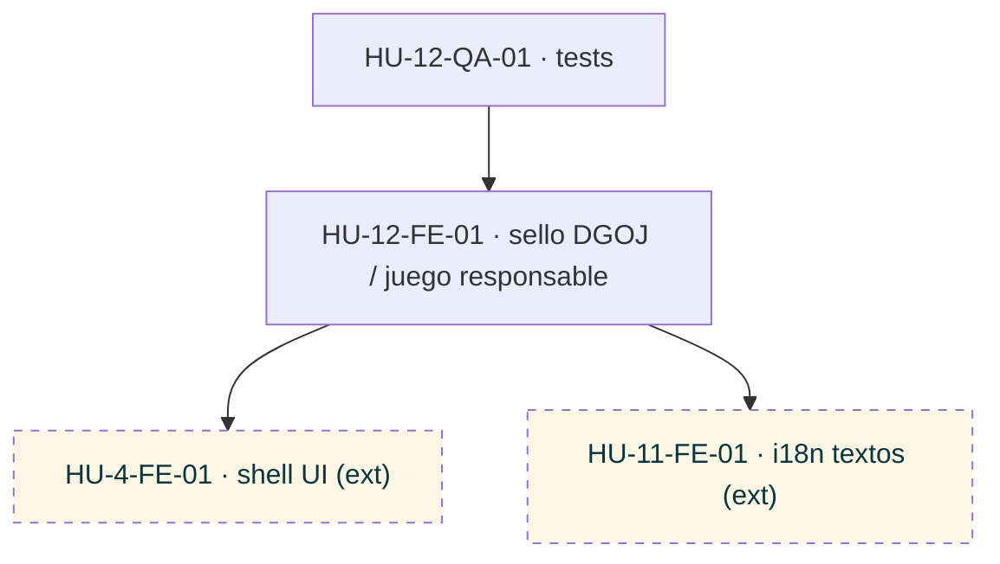
